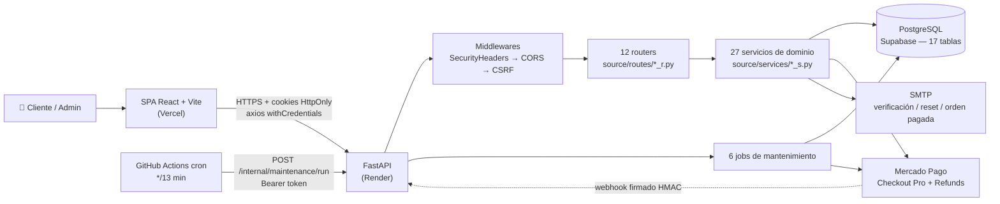

# 01 — Resumen Ejecutivo

← [Índice](README.md) | Siguiente: [02 Arquitectura](02_Arquitectura.md) →

---

## 1. Qué es PatitasBigotes

PatitasBigotes es una **aplicación full-stack de e-commerce y gestión operativa para una tienda de mascotas**.
Cubre el ciclo completo de venta minorista: catálogo público, carrito, checkout con y sin cuenta, cobro por
Mercado Pago / transferencia / efectivo, gestión de órdenes y un panel de administración para operar la tienda
tanto online como presencialmente. Además incorpora un módulo de **turnos de peluquería canina**.

El propio `README.md` de la raíz lo define como *"demo técnica para evaluación y también como base funcional para
pruebas reales en entorno local"* (`README.md:3`).

### El problema que resuelve

Una tienda física de mascotas que además vende online necesita que **el stock, los precios y las órdenes sean una
sola verdad**, sin importar si la venta se originó en la web o en el mostrador. El sistema resuelve concretamente:

| Problema del negocio | Cómo lo resuelve el sistema |
|---|---|
| Sobreventa de stock durante el checkout | Reservas de stock con TTL (`StockReservation`, 42 h) que descuentan disponibilidad *antes* del pago |
| El cliente cierra el navegador a mitad del pago | `public_status_token` permite recuperar y reintentar el pago sin login |
| Mercado Pago confirma tarde o el webhook falla | Cola de `WebhookEvent` con reintentos exponenciales + job de reconciliación que pregunta al proveedor |
| El cliente paga después de que la orden se canceló | `PaymentIncident` de tipo `late_paid_duplicate` + flujo de reembolso asistido para el admin |
| Doble clic en "Comprar" genera dos órdenes | `IdempotencyRecord` con clave por scope + hash del payload |
| Venta presencial en el mostrador | Endpoint `POST /admin/sales` que crea orden y cobro en un solo paso |
| Precios que cambian mientras hay una orden abierta | *Pricing freeze*: al pasar a `submitted` la orden congela precios y descuentos |
| Fuerza bruta sobre el login | Throttling por email + IP persistido en `AuthLoginThrottle` |

---

## 2. Stack tecnológico

### Backend

| Capa | Tecnología | Versión | Archivo de referencia |
|---|---|---|---|
| Framework HTTP | FastAPI | 0.135.2 | `backend/main.py` |
| Servidor ASGI | Uvicorn | 0.42.0 | `render.yaml:19` |
| ORM | SQLAlchemy | 2.0.48 | `backend/source/db/models.py` |
| Driver DB | psycopg (binary) | 3.3.3 | `backend/requirements.txt` |
| Migraciones | Alembic | 1.18.4 | `backend/alembic/` |
| Validación | Pydantic | 2.12.5 | `backend/source/schemas/` |
| JWT | python-jose[cryptography] | 3.5.0 | `backend/source/services/auth_security_s.py` |
| Hashing de password | passlib (pbkdf2_sha256) | 1.7.4 | `backend/source/services/auth_security_s.py:15` |
| Pasarela de pago | mercadopago SDK | 2.3.0 | `backend/source/services/mercadopago_client.py` |
| Email | `smtplib` (stdlib) | — | `backend/source/services/email_s.py` |
| Lint | Ruff | 0.15.22 | `backend/ruff.toml` |
| Tests | pytest + `unittest.TestCase` | 9.0.2 | `backend/tests/` |
| Runtime | Python | 3.12 | `.github/workflows/ci.yml:15` |

### Frontend

| Capa | Tecnología | Versión | Archivo de referencia |
|---|---|---|---|
| Librería UI | React | 18.3.1 | `frontend/package.json` |
| Lenguaje | TypeScript | 5.7.3 | `frontend/tsconfig.json` |
| Bundler / dev server | Vite | 7.3.6 | `frontend/vite.config.ts` |
| Routing | react-router-dom | 6.30.1 | `frontend/src/App.tsx` |
| Cliente HTTP | axios | 1.16.0 | `frontend/src/services/http.ts` |
| Estado servidor | **Ninguna librería** — hooks propios | — | `frontend/src/lib/useAsyncResource.ts` |
| Estado global | React Context (solo auth) | — | `frontend/src/features/auth/context/AuthContextProvider.tsx` |
| Tests | Vitest + Testing Library | 4.1.10 | `frontend/vitest.config.ts` |
| Contrato de tipos | openapi-typescript | 7.13.0 | `frontend/src/types/api.generated.ts` |
| Runtime | Node | ≥ 20 | `frontend/.nvmrc` |

> ⚠️ **No hay React Query, Redux ni Zustand.** El fetching y el estado de servidor se resuelven con un hook propio
> `useAsyncResource` y `useState` locales en los hooks de feature. Esto es una decisión deliberada de mínima
> dependencia (ver [05_Frontend.md](05_Frontend.md#estado-servidor)) pero tiene costos: no hay caché
> compartida, deduplicación de requests ni invalidación declarativa.

### Infraestructura

| Componente | Servicio | Archivo |
|---|---|---|
| Frontend | Vercel (o Cloudflare Pages) — build estático | `frontend/vercel.json` |
| Backend | Render — web service, plan `free` | `render.yaml` |
| Base de datos | Supabase (PostgreSQL gestionado) | `render.yaml:6-7` |
| CI | GitHub Actions (3 jobs) | `.github/workflows/ci.yml` |
| Cron de mantenimiento | GitHub Actions (`*/13 * * * *`) | `.github/workflows/maintenance.yml` |
| Backups | GitHub Actions + `pg_dump` diario | `.github/workflows/db-backup.yml` |
| Jobs en local | Windows Task Scheduler vía PowerShell | `backend/scripts/jobs.ps1` |
| Docker | Solo para el sweeper de idempotencia (referencia) | `backend/Dockerfile.sweeper` |
| Kubernetes | Manifiestos de referencia, **no usados** | `backend/k8s_idempotency_sweeper_*.yaml` |

---

## 3. Arquitectura general en una frase

> Un **monolito modular en capas**: FastAPI expone routers finos que delegan en un conjunto de *servicios de dominio*
> funcionales (no clases), los cuales operan sobre modelos SQLAlchemy dentro de una transacción gestionada por
> dependencia; un SPA de React consume esa API por cookies HttpOnly, y un conjunto de *jobs* idempotentes cierra
> los flujos asíncronos (webhooks, reconciliación, expiración de reservas).

Detalle completo en [02_Arquitectura.md](02_Arquitectura.md).

---

## 4. Principales módulos y sus responsabilidades

### Backend — `backend/source/`

| Módulo | Archivos | Responsabilidad | Documento |
|---|---|---|---|
| `db/` | 3 | Configuración de entorno, engine, sesión y **todos** los modelos ORM | [08](08_BaseDatos.md) |
| `routes/` | 12 | Adaptadores HTTP: validan, delegan, mapean errores. **Sin lógica de negocio** | [07](07_API.md) |
| `services/` | 27 | Toda la lógica de negocio. Funciones puras o con `Session` inyectada | [04](04_Backend.md) |
| `schemas/` | 9 | DTOs de entrada Pydantic con `extra="forbid"` | [07](07_API.md#dtos) |
| `dependencies/` | 4 | Auth por cookie, middleware CSRF, headers de seguridad, firma de webhook MP | [11](11_Seguridad.md) |
| `jobs/` | 6 | Procesos batch idempotentes, ejecutables como loop o `--once` | [17](17_ProductionReadiness.md) |
| `errors.py` / `exceptions.py` | 2 | Excepciones de dominio y su traducción única a HTTP | [07](07_API.md#mapeo-de-errores) |
| `seed_demo.py` | 1 | Datos de demostración, bloqueado fuera de `local`/`demo` | [15](15_Configuracion.md) |

**Los servicios de dominio, agrupados por *bounded context*:**

| Contexto | Servicios | Núcleo de lo que hace |
|---|---|---|
| **Catálogo** | `products_s` | Productos, variantes, categorías, vistas de storefront con precios con descuento |
| **Precios** | `discount_s`, `money_s` | Selección del mejor descuento, aritmética monetaria en centavos con `Decimal` |
| **Órdenes** | `orders_s` | Máquina de estados de orden, draft/carrito, ventas admin, snapshot público |
| **Inventario** | `stock_reservations_s` | Reservar / consumir / liberar / expirar stock con reactivación |
| **Pagos** | `payment_s`, `payment_admin_queries_s`, `payment_errors` | Ciclo de vida del pago, reintentos, confirmación manual |
| **Proveedor de pago** | `mercadopago_client`, `mercadopago_normalization_s` | SDK con reintentos, normalización de estados, construcción de preferencias |
| **Webhooks** | `webhook_events_s` | Idempotencia de eventos, backoff, dead letter, replay |
| **Reembolsos** | `refund_s` | Incidencias de pago tardío/duplicado y refunds vía proveedor |
| **Identidad** | `auth_s`, `auth_security_s`, `auth_tokens_s`, `auth_cookies_s`, `users_s` | Login, refresh rotativo, tokens de un solo uso, perfiles, admins |
| **Anti-abuso** | `auth_rate_limit_s`, `anti_abuse_s` | Throttle de login y límites de operaciones públicas |
| **Notificaciones** | `notifications_s`, `domain_events_s`, `post_commit_actions_s`, `email_s` | Eventos de dominio → notificaciones in-app y emails post-commit |
| **Operación** | `maintenance_s` | Orquestador de los 6 jobs para el modelo de ping externo |
| **Turnos** | `turns_s` | Turnos de peluquería con validación de franja horaria |

### Frontend — `frontend/src/`

Organizado por **features verticales**, no por tipo de archivo:

| Feature | Contenido | Documento |
|---|---|---|
| `features/storefront/` | Catálogo, detalle de producto, categorías | [05](05_Frontend.md) |
| `features/checkout/` | Carrito, checkout guest/autenticado, retorno de pago | [05](05_Frontend.md) |
| `features/auth/` | Login, registro, verificación de email, reset de password, `AuthProvider` | [05](05_Frontend.md) |
| `features/profile/` | Mis órdenes, mis pagos, edición de perfil | [05](05_Frontend.md) |
| `features/turns/` | Solicitud de turno de peluquería | [05](05_Frontend.md) |
| `features/admin/` | Panel completo: 8 componentes de sección + 7 hooks | [06](06_PanelAdmin.md) |
| `features/contact/` | Datos de contacto estáticos | [05](05_Frontend.md) |
| `services/` | 12 clientes HTTP + clasificador de errores + idempotencia | [05](05_Frontend.md#capa-de-servicios) |
| `lib/` | `cart-storage`, `useAsyncResource`, `useClickOutside`, `useModalA11y` | [05](05_Frontend.md#lib) |
| `guards/` | `ProtectedRoute`, `AdminRoute` | [05](05_Frontend.md#guards) |

---

## 5. Números clave del repositorio

| Métrica | Valor |
|---|---|
| Archivos versionados | 284 |
| Líneas de código (py + ts + tsx + css + html) | ~38.200 |
| Python (incluye tests) | ~22.700 |
| TypeScript / TSX (excluye `api.generated.ts`) | ~6.600 |
| `api.generated.ts` (autogenerado) | 3.992 |
| Tablas en base de datos | 17 |
| Endpoints HTTP | 77 (76 en routers + `GET /health`) |
| Servicios de dominio | 27 archivos |
| Jobs de mantenimiento | 6 |
| Tests backend | 305 |
| Tests frontend | 51 |
| Migraciones Alembic | 3 |
| Workflows de GitHub Actions | 3 |

---

## 6. Decisiones de diseño destacadas

Estas son las decisiones que más condicionan el código y que conviene entender antes de tocar nada:

1. **Dinero en enteros (centavos), nunca `float`.** Todo importe es `Integer` en la DB y se opera con `Decimal` y
   `ROUND_HALF_UP` en `money_s.py`. La única conversión a decimal ocurre al hablar con Mercado Pago
   (`mercadopago_client.py:289`, `mercadopago_normalization_s.py:243`).

2. **Servicios como funciones, no clases.** No hay repositorios ni Unit of Work explícitos: los servicios reciben
   `db: Session` y usan el ORM directamente. La transacción la gobierna la dependencia `get_db_transactional`.
   Ver [20_DiccionarioObjetos.md](20_DiccionarioObjetos.md).

3. **Cookies HttpOnly en lugar de `Authorization: Bearer`.** El access token y el refresh token viajan como cookies
   (`pb_at`, `pb_rt`) y el frontend nunca los ve. Eso obliga a defensa CSRF propia por `Origin`/`Referer`
   (`csrf_d.py`). Ver [11_Seguridad.md](11_Seguridad.md).

4. **Rotación de refresh + `token_version`.** Cada refresh incrementa `users.token_version`, lo que invalida
   inmediatamente todos los access tokens previos (`auth_s.py:156`, verificado en `auth_d.py:51`).

5. **La reserva de stock precede al pago.** Pasar a `submitted` reserva stock; pagar lo consume; cancelar lo libera;
   expirar puede *reactivar* una vez o cancelar la orden. Ver [09_ReglasNegocio.md](09_ReglasNegocio.md#stock).

6. **Idempotencia en dos niveles.** A nivel HTTP con `IdempotencyRecord` (header `Idempotency-Key`) y a nivel de
   entidad con `payments.idempotency_key UNIQUE`. Ver [09_ReglasNegocio.md](09_ReglasNegocio.md#idempotencia).

7. **Emails fuera de la transacción.** `post_commit_actions_s` encola el envío en `db.info` y solo lo dispara tras el
   commit, para que un fallo de SMTP no revierta un pago. Excelente decisión, poco común.

8. **El contrato OpenAPI es el que genera los tipos del frontend.** CI exporta `openapi.json`, regenera
   `api.generated.ts` y **falla si el archivo commiteado difiere** (`ci.yml:54`).

9. **El ping externo *es* el scheduler.** En producción no hay cron in-process; GitHub Actions golpea
   `/internal/maintenance/run` cada 13 minutos, lo que además mantiene despierto el free tier de Render.

10. **`APP_ENV` como interruptor de seguridad para el seed.** `seed_demo` se niega a correr si el entorno no es
    `local` o `demo` (`seed_demo.py:12`).

---

## 7. Lo que *no* tiene el sistema

Importante para calibrar expectativas — todo esto está verificado por ausencia:

- ❌ No hay caché (ni Redis ni in-memory) — ver [12_Performance.md](12_Performance.md).
- ❌ No hay paginación en las listas de admin (usan `limit` con tope, sin `offset`).
- ❌ No hay upload de archivos: las imágenes son URLs externas (`img_url`).
- ❌ No hay tracing distribuido ni métricas exportadas (solo logs estructurados por texto).
- ❌ No hay soft delete: `DELETE /products/{id}` es borrado físico.
- ❌ No hay multi-moneda real: todo está forzado a `ARS` (`payment_s.py:482`).
- ❌ No hay tabla de auditoría (`AuditLog`) ni event store persistente: los "domain events" son despacho síncrono
  en proceso (ver [20_DiccionarioObjetos.md](20_DiccionarioObjetos.md#domainevent)).
- ❌ El envío de emails "no está implementado al 100%" según el propio README (`README.md:41`).

---

← [Índice](README.md) | Siguiente: [02 Arquitectura](02_Arquitectura.md) →
