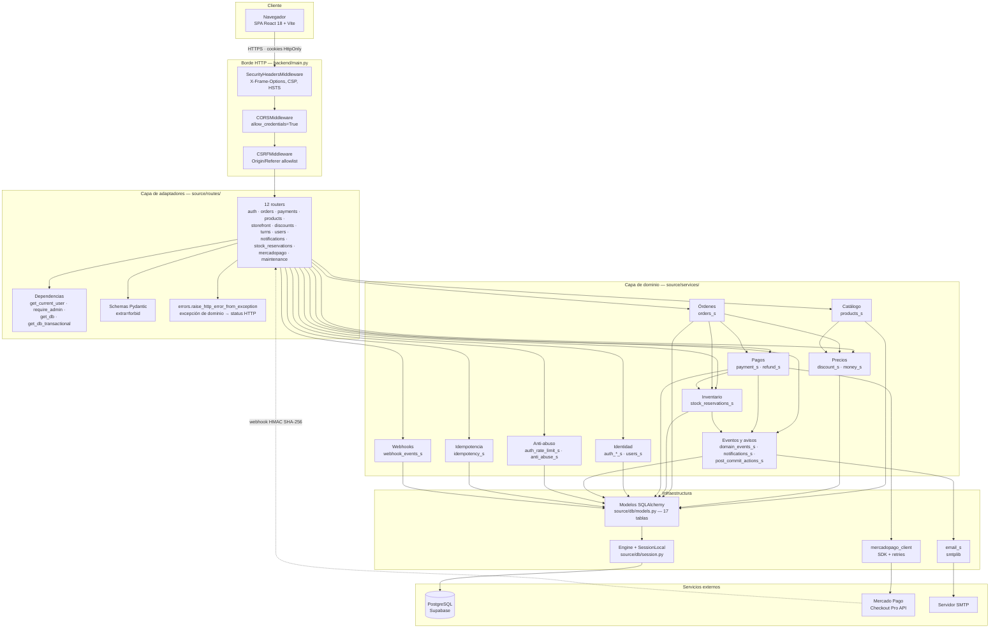
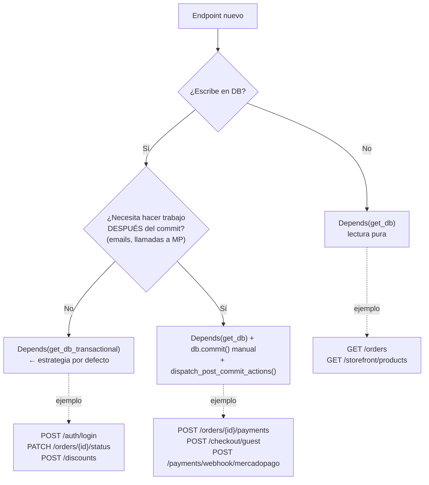
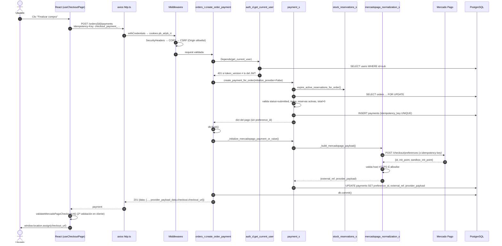
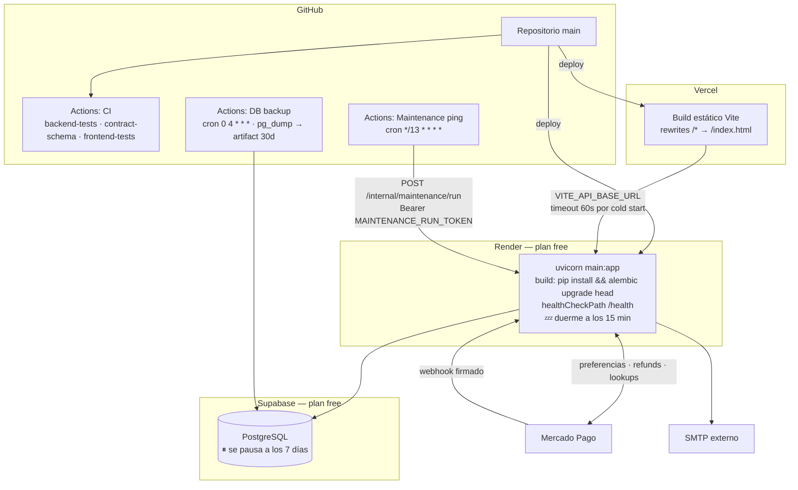
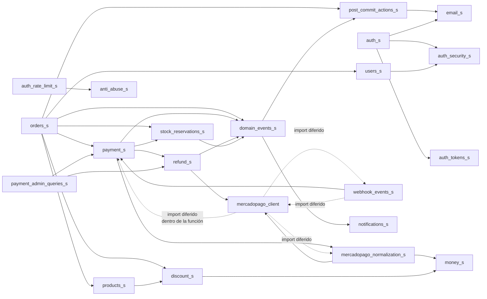
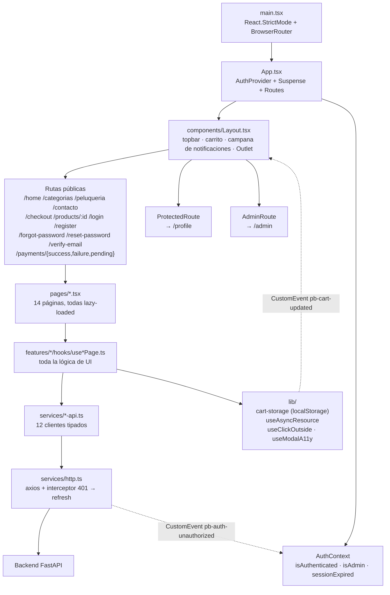
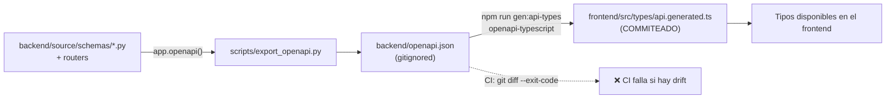

# 02 — Arquitectura

← [01 Resumen](01_Resumen.md) | [Índice](README.md) | Siguiente: [03 Árbol del Proyecto](03_ArbolProyecto.md) →

---

## 1. Estilo arquitectónico

PatitasBigotes es un **monolito modular en capas**, con separación estricta entre adaptadores HTTP y lógica de
dominio, pero **sin** arquitectura hexagonal formal: los servicios importan los modelos SQLAlchemy directamente, sin
puertos ni repositorios intermedios.

| Patrón | ¿Presente? | Evidencia |
|---|---|---|
| Layered architecture (Routes → Services → Models) | ✅ Sí, consistente | Ningún archivo en `routes/` contiene lógica de negocio |
| Service layer | ✅ Sí, pero **funcional** (funciones, no clases) | `source/services/*.py` — ninguna clase de servicio |
| Repository pattern | ❌ No | Los servicios llaman `db.query(Model)` directamente |
| Unit of Work | 🟡 Implícito | `get_db_transactional` (`db/session.py:29`) hace de UoW por request |
| Hexagonal / Ports & Adapters | ❌ No | `mercadopago_client` es la única frontera de infra aislada |
| DDD táctico | 🟡 Parcial | Hay lenguaje ubicuo y agregados conceptuales, sin entidades ricas |
| MVC | ❌ No aplica | Es una API, no hay vistas de servidor |
| Event-driven | 🟡 Simulado | `domain_events_s` es un dispatcher **síncrono in-process**, no un bus |
| Feature-sliced frontend | ✅ Sí | `frontend/src/features/<dominio>/{hooks,services,components,types,utils}` |

> ⚠️ La ausencia de repositorios significa que **no se puede testear un servicio sin base de datos**. Los tests
> resuelven esto con SQLite en memoria (ver [16_Testing.md](16_Testing.md)), lo que funciona pero acopla los tests
> al comportamiento de SQLite (por ejemplo, `with_for_update()` es un no-op ahí).

---

## 2. Vista de capas



### Responsabilidad de cada capa

| Capa | Debe | No debe |
|---|---|---|
| **Middlewares** | Cabeceras de seguridad, CORS, defensa CSRF | Conocer entidades de negocio |
| **Routers** | Validar entrada (Pydantic), resolver dependencias, delegar, traducir excepciones, gestionar el commit en los casos "manuales" | Contener reglas de negocio, hacer queries |
| **Servicios** | Todas las reglas de negocio, invariantes, transiciones de estado, orquestación | Conocer FastAPI, `Request`, `Response` o códigos HTTP¹ |
| **Modelos** | Estructura, constraints, índices, relaciones | Lógica de negocio (son modelos anémicos por diseño) |
| **Jobs** | Un `run_once()` idempotente + un `run_forever()` opcional | Depender de una request HTTP |

> ¹ ⚠️ **Violación conocida:** `users_s.py` y `auth_s.py` lanzan `HTTPException` directamente
> (`users_s.py:46`, `users_s.py:78`, `auth_s.py:306`). Es la única fuga de la capa HTTP hacia el dominio.
> Detallada en [13_CalidadCodigo.md](13_CalidadCodigo.md#acoplamiento).

---

## 3. Gestión de transacciones

Es el punto más sutil de la arquitectura y hay que entenderlo antes de escribir un endpoint nuevo.

Existen **dos dependencias de sesión** (`backend/source/db/session.py`):

```python
def get_db():                      # lectura: nunca commitea
    db = SessionLocal()
    try: yield db
    finally: db.close()

def get_db_transactional():        # escritura: commit al salir, rollback ante excepción
    db = SessionLocal()
    try:
        yield db
        db.commit()
    except Exception:
        db.rollback(); raise
    finally:
        db.close()
```

Y **tres estrategias** conviviendo en los routers:



**Casos especiales que rompen la regla (documentados en el propio código):**

| Endpoint | Sesión | Por qué |
|---|---|---|
| `GET /public/orders/by-payment-token` | `get_db_transactional` | Un GET que **escribe**: expira reservas vencidas antes de armar el snapshot (`orders_r.py:499-501`) |
| `GET /orders/{id}/reservations` | `get_db_transactional` | Idem: expira reservas antes de listarlas (`orders_r.py:730-732`) |
| `refund_s.create_mercadopago_refund` | commit propio en el `except` | Persiste el estado `failed` antes de re-lanzar, para que el rollback del caller no lo pierda (`refund_s.py:352-355`) |

> ⚠️ **Trampa para quien agregue endpoints:** si usás `get_db_transactional` y necesitás enviar un email,
> el email se dispararía **dentro** de la transacción. Usá siempre el patrón `post_commit_actions_s`
> (ver [20_DiccionarioObjetos.md](20_DiccionarioObjetos.md#postcommitaction)).

---

## 4. Flujo completo de una request

Ejemplo: cliente autenticado crea el pago de una orden.



Los flujos de login, registro, checkout guest, webhook, reembolso y turnos están en
[10_Flujos.md](10_Flujos.md).

---

## 5. Arquitectura de despliegue



### Por qué el diseño está condicionado por el free tier

Esta es la razón de varias decisiones que de otro modo parecerían raras:

| Restricción del free tier | Consecuencia en el diseño | Evidencia |
|---|---|---|
| Render duerme tras ~15 min sin tráfico | Timeout de axios en 60 s, no 10 s | `http.ts:4-7` |
| Render duerme → no hay scheduler in-process fiable | Los jobs se disparan por ping externo cada 13 min | `maintenance_s.py:1-20` |
| Render free = **una sola instancia** | El lock de mantenimiento es un `threading.Lock` de proceso, no distribuido | `maintenance_s.py:39` ⚠️ |
| Supabase se pausa tras 7 días de inactividad | El mismo ping de 13 min mantiene viva la base | `maintenance.yml:16-18` |
| Supabase free no tiene backups | `pg_dump` diario a artifact de GitHub (retención 30 días) | `db-backup.yml` |
| Vercel/Cloudflare no tienen Python | `api.generated.ts` se commitea; CI valida que no derive | `.gitignore:24-27`, `ci.yml:51-54` |
| Frontend y backend en dominios distintos | Cookies `SameSite=None; Secure` obligatorias en prod | `db/config.py:116-126` |

---

## 6. Dependencias entre módulos (resumen)

Mapa completo, incluida la detección de ciclos, en [21_MapaDependencias.md](21_MapaDependencias.md).



**Ciclos detectados (todos resueltos con imports diferidos y comentados en el código):**

| Ciclo | Cómo se rompe | Evidencia |
|---|---|---|
| `payment_s` ↔ `mercadopago_normalization_s` ↔ `mercadopago_client` | `mercadopago_client` importa `payment_s` **dentro** de `process_mercadopago_event_payload` | `mercadopago_client.py:334-340` |
| `webhook_events_s` ↔ `mercadopago_client` | Ambos sentidos usan import local dentro de la función | `webhook_events_s.py:308`, `mercadopago_client.py:389` |
| `payment_s` ↔ `refund_s` | `refund_s` no importa `payment_s`; `payment_admin_queries_s` importa a ambos | Sin ciclo real |
| Helper `_normalize_optional_str` duplicado | Duplicación deliberada para no crear ciclo, con comentario explicativo | `mercadopago_normalization_s.py:44-46` |

---

## 7. Arquitectura del frontend



**Patrón dominante: *hook de página*.** Cada página es un componente de presentación casi puro; toda la lógica
(estado, fetching, validación, mensajes de error) vive en un hook `useXxxPage`. Esto hace los tests de frontend
posibles sin renderizar árboles completos — los 51 tests testean hooks, no componentes.

**Comunicación desacoplada por `CustomEvent` del navegador:**

| Evento | Emisor | Consumidor | Propósito |
|---|---|---|---|
| `pb-auth-unauthorized` | `services/http.ts:36` | `AuthContextProvider.tsx:54` | Un 401 irrecuperable limpia la sesión en toda la app |
| `pb-cart-updated` | `lib/cart-storage.ts:15` | `Layout.tsx:33` | El contador del carrito se actualiza sin prop drilling |

---

## 8. Contrato Frontend ↔ Backend



> ⚠️ **Punto débil del contrato:** casi todos los endpoints devuelven `{"data": ...}` sin `response_model`
> declarado, por lo que en OpenAPI aparecen como objetos genéricos. La única excepción es
> `GET /public/orders/by-payment-token`, que sí declara
> `response_model=dict[str, PublicOrderSnapshotResponse]` (`orders_r.py:496`).
> Como consecuencia, `api.generated.ts` aporta poca seguridad de tipos sobre las respuestas y el frontend
> mantiene sus **propios** tipos duplicados en `frontend/src/types.ts`.
> Ver [18_Roadmap.md](18_Roadmap.md#R-06).

---

← [01 Resumen](01_Resumen.md) | [Índice](README.md) | Siguiente: [03 Árbol del Proyecto](03_ArbolProyecto.md) →
