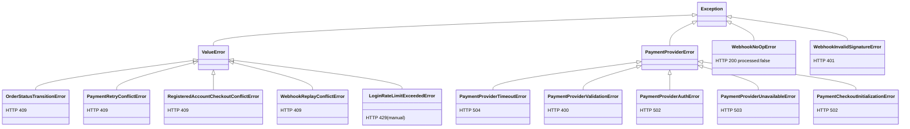

# 04 — Backend: archivo por archivo y función por función

← [03 Árbol](03_ArbolProyecto.md) | [Índice](README.md) | Siguiente: [05 Frontend](05_Frontend.md) →

---

## Cómo está organizado este documento

- **§1** — Ficha de **cada** archivo del backend (Nivel 4): responsabilidad, por qué existe, quién lo usa,
  qué importa y exporta, flujo, complejidad y mejoras.
- **§2** — Detalle **función por función** (Nivel 5) de los módulos críticos de negocio: `payment_s`, `orders_s`,
  `stock_reservations_s`, `discount_s`, `money_s`, `idempotency_s`, `webhook_events_s`, `refund_s`,
  `auth_s`/`auth_security_s`/`auth_tokens_s`.
- **§3** — Clases (Nivel 6): las 17 clases-modelo, las 2 clases de middleware, las 10 clases de excepción y los
  `TypedDict`/`dataclass`.

**Índice de complejidad usado:** estimación de complejidad ciclomática por función —
🟢 baja (1–5) · 🟡 media (6–10) · 🟠 alta (11–20) · 🔴 muy alta (>20).

---

# §1 — Ficha por archivo

## 1.1 Punto de entrada

### `backend/main.py` — 57 líneas

| Campo | Detalle |
|---|---|
| **Responsabilidad** | Construir la instancia `FastAPI`, registrar middlewares y routers, exponer `/health`. |
| **Por qué existe** | Único punto de composición de la aplicación; es lo que `uvicorn main:app` carga. |
| **Quién lo usa** | `uvicorn` (Render, `start-backend.ps1`), `tests/http/_base.py`, `scripts/export_openapi.py`. |
| **Importa** | `FastAPI`, `CORSMiddleware`, `get_cors_allow_origins`, los 2 middlewares propios, los 12 routers. |
| **Exporta** | `app`, `health_check`. |
| **Flujo interno** | 1) crea `app` con título "Sales API" v0.1.0 → 2) lee orígenes CORS → 3) registra `SecurityHeaders`, `CORS`, `CSRF` (en ese orden de `add_middleware`, lo que los ejecuta en orden inverso) → 4) registra los 12 routers → 5) define `/health`. |
| **Complejidad** | 🟢 Trivial. |
| **Mejoras** | ⚠️ No hay `lifespan` para verificar conectividad a DB al arrancar. ⚠️ `/health` no chequea la base: Render puede reportar el servicio sano con la DB caída. ⚠️ No hay `exception_handler` global registrado; el manejo depende de que cada router llame a `raise_http_error_from_exception`. ⚠️ `/docs` y `/openapi.json` quedan **públicos en producción**. |

---

## 1.2 Capa de datos — `source/db/`

### `source/db/config.py` — 185 líneas

| Campo | Detalle |
|---|---|
| **Responsabilidad** | Leer, normalizar y **validar** las 25 variables de entorno del backend. |
| **Por qué existe** | Centralizar la configuración con *fail-fast*: si falta un secreto obligatorio, el proceso muere con un mensaje claro en vez de fallar de forma difusa en runtime. |
| **Quién lo usa** | `db/session.py`, `main.py`, `alembic/env.py`, todos los servicios que necesitan config, los middlewares. |
| **Importa** | `os`, `pathlib.Path`, `urllib.parse.urlparse`, `dotenv.load_dotenv`. |
| **Exporta** | 25 funciones `get_*()`. |
| **Flujo interno** | Al importarse ejecuta `load_dotenv(backend/.env)` (`config.py:9-10`). Cada getter lee de `os.getenv`, hace `.strip()`, aplica default o lanza `RuntimeError`. |
| **Complejidad** | 🟢 Cada función es trivial; la excepción es `get_auth_cookie_samesite` 🟡. |

**Getters con validación estricta (lanzan `RuntimeError`):**
`get_database_url`, `get_maintenance_run_token`, `get_mercadopago_access_token`, `get_mercadopago_env`
(solo `sandbox`/`production`), `get_mercadopago_timeout_seconds` (>0),
`get_mercadopago_webhook_secret`, `get_mercadopago_webhook_max_age_seconds` (>0),
`get_auth_cookie_samesite` (`lax`/`strict`/`none`), `get_smtp_host`, `get_smtp_port` (>0), `get_mail_from`.

**Lógica destacada — `get_auth_cookie_samesite` (`config.py:116-126`):**
```python
if value == "none" and not get_auth_cookie_secure():
    raise RuntimeError("AUTH_COOKIE_SAMESITE=none requires AUTH_COOKIE_SECURE=true")
```
> 🔒 El comentario del código lo explica bien: los navegadores descartan silenciosamente una cookie
> `SameSite=None` sin `Secure`, lo que produciría un login que "funciona" pero nunca persiste la sesión.
> Fallar al arrancar es preferible.

**`get_auth_cookie_secure` (`config.py:129-137`):** si la env está vacía, **infiere** el valor del esquema de
`APP_BASE_URL` (`https` → `True`). Buen default seguro.

| Mejoras | Detalle |
|---|---|
| ⚠️ | No usa `pydantic-settings`, disponible transitivamente vía Pydantic. Con él se ganaría tipado, defaults declarativos y validación en un solo objeto. |
| ⚠️ | `load_dotenv` se ejecuta como efecto secundario del import; en producción el `.env` no existe y depende del orden de imports. |
| ⚠️ | La validación es **perezosa**: `get_mercadopago_access_token()` solo falla la primera vez que se necesita, quizá en medio de un checkout de un cliente real. |

### `source/db/session.py` — 38 líneas

| Campo | Detalle |
|---|---|
| **Responsabilidad** | Crear el engine, la `sessionmaker` y las dos dependencias de sesión. |
| **Por qué existe** | Es el punto único de acceso a la base y el que define la política transaccional. |
| **Quién lo usa** | Todos los routers, todos los jobs, `products_s` (que abre sesión propia), `seed_demo`. |
| **Exporta** | `engine`, `SessionLocal`, `get_db`, `get_db_transactional`, `DATABASE_URL`. |
| **Complejidad** | 🟢. |

**Funciones:**

| Función | Retorno | Qué hace | Riesgos |
|---|---|---|---|
| `get_db()` | `Generator[Session]` | Abre sesión, cede, cierra en `finally`. **Nunca commitea.** | ⚠️ Si un servicio hace `flush()` y el router olvida `commit()`, los cambios se pierden en silencio. |
| `get_db_transactional()` | `Generator[Session]` | Abre, cede, `commit()` al salir; `rollback()` + re-raise ante excepción; `close()` en `finally`. | ⚠️ El commit ocurre **después** de que FastAPI serializó la respuesta. Si el commit falla, el cliente puede haber recibido ya un 200. |

| Mejoras | Detalle |
|---|---|
| 🔴 | **No hay configuración de pool.** `create_engine(DATABASE_URL)` usa `QueuePool` con `pool_size=5, max_overflow=10`. Sin `pool_pre_ping=True`, las conexiones que Supabase cierra por inactividad producen `OperationalError` en el primer uso tras un idle. Ver [12_Performance.md](12_Performance.md#pool). |
| ⚠️ | Sin `pool_recycle`, muy recomendable con un Postgres gestionado. |
| ⚠️ | `DATABASE_URL` se evalúa al importar el módulo → importar `session.py` sin `DATABASE_URL` revienta. Por eso los tests y `export_openapi.py` hacen `os.environ.setdefault("DATABASE_URL", "sqlite://")` antes de importar. |

### `source/db/models.py` — 741 líneas
Documentado íntegramente en [08_BaseDatos.md](08_BaseDatos.md). Resumen de ficha:

| Campo | Detalle |
|---|---|
| **Responsabilidad** | Definir las 17 tablas: columnas, constraints, índices y relaciones. |
| **Quién lo usa** | Todos los servicios, `alembic/env.py`, los tests. |
| **Exporta** | `Base`, `utc_now`, `generate_public_status_token`, 17 clases modelo. |
| **Complejidad** | 🟢 Declarativo. |
| **Mejoras** | ⚠️ Sintaxis SQLAlchemy 1.x (`Column`) en vez de 2.0 (`Mapped[]`/`mapped_column`) → sin tipado estático de atributos. ⚠️ Estados como `String` libre en lugar de `Enum`. ⚠️ `provider_payload` como `String`/`Text` en vez de `JSONB`. |

---

## 1.3 Middlewares y dependencias — `source/dependencies/`

### `source/dependencies/auth_d.py` — 89 líneas

| Campo | Detalle |
|---|---|
| **Responsabilidad** | Autenticar por cookie y autorizar por rol. |
| **Por qué existe** | Evita repetir la validación de token en cada endpoint; es el único lugar donde se decide "quién sos". |
| **Quién lo usa** | 9 de los 12 routers. |
| **Exporta** | `get_current_user`, `get_current_user_id`, `require_admin`. |

**`get_current_user(request, db) -> dict`** 🟡
1. Lee la cookie de access (`get_access_token_from_request`) → **401** `Missing access token cookie` si falta.
2. `decode_access_token` → **401** `Invalid or expired token` ante `ValueError`.
3. Exige claim `sub` → **401**.
4. Exige claim `tv` y que sea entero → **401**.
5. `SELECT users WHERE id = sub`.
6. **Compara `user.token_version` con el claim `tv`** → **401** si difieren.
7. Devuelve el payload del JWT (no el modelo `User`).

> 🔒 El paso 6 es la pieza clave de la invalidación global de sesiones. Cuesta **una query por request**
> (⚡ ver [12_Performance.md](12_Performance.md#auth)) pero permite revocar sesiones sin lista negra.

**`get_current_user_id(current_user) -> int`** 🟢 — Convierte `sub` a `int`; **401** `Invalid token subject`.
⚠️ No es una dependencia de FastAPI: se llama manualmente dentro de cada handler.

**`require_admin(current_user, db) -> dict`** 🟢
Depende de `get_current_user`, **relee** el usuario de la base y comprueba `is_admin` → **403**
`Admin permissions required`. Además **muta** `current_user["is_admin"]` con el valor real de la DB.

> ⚠️ Efecto lateral relevante: los endpoints que usan `get_current_user` (no `require_admin`) leen
> `current_user.get("is_admin")` del **claim del JWT**, que puede estar desactualizado. Afecta a
> `PATCH /orders/{id}/status`, `GET /orders/{id}/reservations` y los 4 de notificaciones.
> Detalle en [11_Seguridad.md](11_Seguridad.md#is_admin-del-claim).

### `source/dependencies/csrf_d.py` — 50 líneas

| Campo | Detalle |
|---|---|
| **Responsabilidad** | Bloquear peticiones mutantes cuyo `Origin`/`Referer` no esté en la allowlist. |
| **Por qué existe** | Con cookies `SameSite=Lax` o `None`, hace falta defensa CSRF explícita. No se usa el patrón double-submit token. |
| **Exporta** | `CSRFMiddleware`, `UNSAFE_METHODS`, `EXEMPT_PATHS`, `_normalize_origin`. |

**Flujo (`dispatch`)** 🟢: si el método es seguro (`GET`, `HEAD`, `OPTIONS`) pasa · si la ruta está exenta pasa ·
si `Origin` normalizado ∈ allowlist pasa · si no, prueba con `Referer` · si no, **403**
`csrf origin check failed`.

`_normalize_origin` reduce cualquier URL a `esquema://host[:puerto]` sin barra final, para poder comparar un
`Referer` completo contra un origen.

**Rutas exentas** (`csrf_d.py:12-17`): `/payments/webhook/mercadopago` (server-to-server, sin `Origin`, se
autentica por HMAC) y `/internal/maintenance/run` (cron externo, bearer token). Ambas justificadas en comentarios.

| Mejoras | Detalle |
|---|---|
| ⚠️ | Si **ni** `Origin` **ni** `Referer` están presentes → 403. Es lo correcto, pero rompe clientes no-navegador. Documentar. |
| 🟢 | Cubierto por `tests/test_csrf_middleware.py` (5 tests). |

### `source/dependencies/security_headers_d.py` — 27 líneas

Añade `X-Frame-Options: DENY`, `X-Content-Type-Options: nosniff`,
`Referrer-Policy: strict-origin-when-cross-origin`, CSP `default-src 'self'; frame-ancestors 'none'` y —
solo si las cookies son `Secure` — `Strict-Transport-Security: max-age=63072000; includeSubDomains`.
Usa `setdefault`, así que un handler puede sobrescribirlos.

⚠️ Excluye la CSP de `/docs`, `/redoc` y `/openapi.json` porque Swagger carga assets de CDN (comentado en
`security_headers_d.py:9`). Consecuencia: la documentación interactiva queda **sin CSP y accesible en producción**.

### `source/dependencies/mercadopago_d.py` — 68 líneas

| Campo | Detalle |
|---|---|
| **Responsabilidad** | Validar la firma HMAC de los webhooks de Mercado Pago. |
| **Exporta** | `_extract_mercadopago_data_id`, `_parse_mercadopago_signature_header`, `is_mercadopago_signature_valid`. |
| **Complejidad** | `is_mercadopago_signature_valid` 🟡. |

**`is_mercadopago_signature_valid(data_id, request_id, signature_header) -> bool`**
1. Exige `request_id`, `ts` y `v1` no vacíos.
2. `ts` debe ser entero.
3. **Ventana temporal:** rechaza `ts < now − max_age` (300 s) y `ts > now + 60` (tolerancia de reloj). 🔒 Anti-replay.
4. Manifiesto: `f"id:{data_id};request-id:{request_id};ts:{ts};"`.
5. `hmac.new(secret, manifest, sha256).hexdigest()`.
6. `hmac.compare_digest` → 🔒 comparación en tiempo constante.

⚠️ **No es una dependencia de FastAPI** pese a vivir en `dependencies/`: se invoca desde
`mercadopago_client.resolver_evento_webhook_mercadopago`. Encaja mejor en `services/`.

---

## 1.4 Routers — `source/routes/`

Todos comparten la misma estructura: `router = APIRouter()`, handlers con `Depends`, `try/except` que delega en
`raise_http_error_from_exception`, y respuesta `{"data": ...}`. El detalle de cada endpoint (request, response,
errores, validaciones) está en [07_API.md](07_API.md). Aquí solo la ficha del archivo.

| Archivo | LOC | Endpoints | Auth predominante | Sesión | Complejidad | Notas |
|---|---:|---:|---|---|---|---|
| `orders_r.py` | 746 | 17 | mixta | mixta | 🔴 | El más complejo. `create_guest_checkout_order` sola tiene ~157 líneas con 4 caminos de idempotencia |
| `auth_r.py` | 396 | 11 | pública/🔑 | `get_db_transactional` | 🟡 | Único router que hace `db.commit()` dentro de un `except` para persistir contadores de rate limit |
| `products_r.py` | 363 | 17 | 👑 todos | mixta | 🟢 | CRUD muy repetitivo; candidato a factorizar |
| `payments_r.py` | 157 | 7 | 🔑/👑/🎫 | mixta | 🟢 | Solo delega |
| `mercadopago_r.py` | 98 | 2 | ✍️/👑 | `get_db` + commit manual | 🟡 | Traduce las 3 excepciones de webhook a 401/200/503 |
| `storefront_r.py` | 97 | 3 | 🌐 | `get_db` | 🟢 | Único router 100% público |
| `notifications_r.py` | 90 | 4 | 🔑 | mixta | 🟢 | — |
| `users_r.py` | 87 | 4 | 👑 | mixta | 🟢 | — |
| `discounts_r.py` | 74 | 4 | 👑 | mixta | 🟢 | ⚠️ `get_discounts` devuelve dentro del `try`, patrón distinto al resto |
| `turns_r.py` | 65 | 3 | 🔑/👑 | mixta | 🟢 | — |
| `maintenance_r.py` | 41 | 1 | 🤖 | ninguna | 🟢 | No toca la sesión: cada job abre la suya |
| `stock_reservations_r.py` | 25 | 1 | 👑 | `get_db_transactional` | 🟢 | El más simple |

### Ficha ampliada: `orders_r.py`

| Campo | Detalle |
|---|---|
| **Responsabilidad** | Exponer el ciclo completo de compra: carrito, checkout guest, transición de estado, pagos, reintentos, ventas de admin, snapshot público. |
| **Por qué existe** | Concentra los flujos que combinan orden + pago + reserva, que son inseparables transaccionalmente. |
| **Importa** | 4 servicios de órdenes/pagos, `idempotency_s` completo, `anti_abuse_s`, `post_commit_actions_s`, `payment_errors`. |
| **Helpers privados** | `_client_ip_from_request`, `_sanitize_response_payload`, `_initialize_mercadopago_payment_or_raise`, `_build_guest_checkout_recovery_payload`. |
| **Complejidad** | 🔴 `create_guest_checkout_order` es la función más compleja del repositorio. |
| **Mejoras** | 🔴 La lógica de idempotencia (adquirir, replay, recuperar, marcar fallido) debería vivir en un **decorador o dependencia reutilizable**, no repetida inline en dos endpoints. ⚠️ `_sanitize_response_payload` solo se aplica en `/admin/sales`, no en `/checkout/guest`. ⚠️ Hay tres estilos distintos de manejo de transacción en el mismo archivo. |

---

## 1.5 Servicios — `source/services/`

### `payment_s.py` — ~660 líneas {#payment_spy}

| Campo | Detalle |
|---|---|
| **Responsabilidad** | Creación de pagos, reintentos, confirmación manual y consultas. El **kernel** compartido (serialización, transiciones, idempotencia, punto de entrada del dinero) vive ahora en `payment_core_s`; toda la **integración con MercadoPago** en `payment_provider_s`. |
| **Por qué existe** | Es el corazón transaccional del sistema. Su docstring documenta que se extrajo de un archivo de ~1900 líneas, repartiendo responsabilidades en `mercadopago_normalization_s`, `webhook_events_s` y `payment_admin_queries_s`; el refactor de servicios por vista lo dividió además en `payment_core_s` y `payment_provider_s`. |
| **Quién lo usa** | `orders_r`, `payments_r`, `orders_s`, `mercadopago_client`. |
| **Importa** | `Order`, `Payment`, `StockReservation`, `generate_public_status_token`, `PaymentRetryConflictError`, `payment_core_s`, `payment_provider_s`, `mercadopago_normalization_s`, `stock_reservations_s`. |
| **Exporta** | Las funciones públicas de creación/reintento/confirmación/consulta + constantes de mensajes de reintento. Re-exporta `PAYMENT_PROVIDER_SETUP_FAILED` e `initialize_mercadopago_checkout_for_payment` desde `payment_provider_s` por compatibilidad. |
| **Complejidad** | 🔴 Alta. Ver §2.1. |
| **Mejoras** | 🟡 El corte por vista bajó de 1135 a ~660 líneas. ✅ La duplicación entre `create_retry_payment_for_order` y `create_retry_payment_for_payment_token` está resuelta: ambos comparten el guard chain. ✅ Los helpers de serialización dejaron de importarse con guion bajo: son API pública de `payment_core_s`. |

### `payment_core_s.py` — ~230 líneas {#payment_core_spy}

| Campo | Detalle |
|---|---|
| **Responsabilidad** | Kernel de pago: el conjunto mínimo compartido por todos los caminos de pago — serialización (`payment_to_dict`, `serialize_provider_payload`, `deserialize_provider_payload`), transiciones (`assert_valid_payment_transition`, `apply_order_paid_transition` — el **punto de entrada del dinero**), idempotencia (`resolve_payment_by_idempotency_key`, `find_active_pending_payment`) y el candado de métodos deshabilitados (`assert_payment_method_enabled`). Las instrucciones de transferencia salieron a `bank_transfer_s` por ser específicas de un método. |
| **Quién lo usa** | `payment_s`, `payment_provider_s`, `payment_admin_queries_s`, `webhook_events_s`. |
| **Importa** | `Order`, `Payment`, `domain_events_s`, `stock_reservations_s`. No importa `payment_s` (acíclico). |
| **Complejidad** | 🟢 230 líneas, bajo el umbral de alarma de ~350. |

### `payment_provider_s.py` — ~310 líneas {#payment_provider_spy}

| Campo | Detalle |
|---|---|
| **Responsabilidad** | Todo lo que habla con MercadoPago: inicialización de checkout, marcado de fallo de setup, `find_payment_for_mercadopago_event`, `apply_mercadopago_normalized_state`, `list_reconcilable_pending_mercadopago_payments`. Dueño de la constante `PAYMENT_PROVIDER_SETUP_FAILED`. |
| **Quién lo usa** | `payment_s`, `orders_r`, `reconcile_pending_payments_job`, `mercadopago_client`. |
| **Importa** | `payment_core_s`, `mercadopago_normalization_s`, `refund_s`, `stock_reservations_s`. No importa `payment_s` (acíclico). |
| **Complejidad** | 🟠 Contiene `apply_mercadopago_normalized_state`. Ver §2.1. |

### `orders_s.py` — ~770 líneas {#orders_spy}

| Campo | Detalle |
|---|---|
| **Responsabilidad** | Máquina de estados de la orden, gestión del draft (carrito), creación de órdenes submitted (guest y admin). El **snapshot público anónimo** salió a `orders_public_s`. |
| **Quién lo usa** | `orders_r`, `orders_public_s` (importa `_variant_label` y `_utc_now`). |
| **Importa** | `discount_s`, `payment_s`, `products_s`, `stock_reservations_s`, `domain_events_s`, `post_commit_actions_s`, `users_s`. Ya no importa `mercadopago_normalization_s`: la allowlist de hosts se fue con el snapshot público. |
| **Constantes clave** | `orders_s::ALLOWED_ORDER_STATUS`, `orders_s::ORDER_TERMINAL_STATUSES`, `orders_s::ORDER_ALLOWED_TRANSITIONS`. |
| **Complejidad** | 🟠. Ver §2.2. |
| **Mejoras** | ⚠️ Es el servicio con más dependencias salientes. |

### `orders_public_s.py` — ~200 líneas {#orders_public_spy}

| Campo | Detalle |
|---|---|
| **Responsabilidad** | Snapshot público de orden: la proyección anónima accesible por token de pago (`get_public_order_snapshot_by_payment_token` + `_extract_public_checkout_url`, `_deserialize_public_checkout_payload`). Toda la superficie anónima de órdenes, aislada de los caminos autenticados. |
| **Quién lo usa** | `orders_r`. |
| **Importa** | `orders_s` (`_variant_label`, `_utc_now`), `mercadopago_normalization_s` (allowlist de hosts), `stock_reservations_s`. Import acíclico: público → core, nunca al revés. |
| **Complejidad** | 🟠 `get_public_order_snapshot_by_payment_token` mezcla lectura, expiración de reservas y cálculo de flags de UI. |

### `products_s.py` — ~615 líneas

| Campo | Detalle |
|---|---|
| **Responsabilidad** | CRUD de producto/variante/categoría + stock + queries admin (catálogo administrado). Las **vistas de storefront** con precios calculados salieron a `products_storefront_s`. |
| **Quién lo usa** | `products_r`, `orders_s`, `products_storefront_s` (importa `list_categories`), `seed_demo`. |
| **Patrón propio** | Consume los context managers de sesión `read_session_scope`/`write_session_scope`, que el refactor movió a `db/session.py` (antes vivían acá con guion bajo). El de lectura **abre una sesión propia si `db is None`**; el de escritura exige sesión. |
| **Complejidad** | 🟠. |

> ⚠️ **`db.session.read_session_scope` es un olor de diseño.** Permite `db=None` para que los servicios se puedan llamar
> "sueltos", pero eso significa que una lectura puede ocurrir **fuera de la transacción del request**, viendo un
> estado distinto. Ninguna llamada actual lo usa así (todas pasan `db`), pero la puerta está abierta.

| Mejoras | Detalle |
|---|---|
| ⚠️ | Serializadores solapados repartidos por vista: `_product_to_dict`, `_variant_to_dict` (administrado) y `products_storefront_s::_product_to_storefront_dict`, `_variant_to_storefront_dict`, `_variant_to_storefront_option` (vitrina). El corte por vista dejó la divergencia de precio visible. |
| ⚠️ | `update_product(active=...)` propaga a **todas** las variantes, perdiendo el estado individual de cada una. |
| ⚠️ | `add_stock(product_id, qty)` suma todo a la **primera** variante activa (`products_s::add_stock`) — comportamiento arbitrario. |

### `products_storefront_s.py` — ~340 líneas {#products_storefront_spy}

| Campo | Detalle |
|---|---|
| **Responsabilidad** | Vista storefront del catálogo: vitrina pública con precios **con descuento aplicado**, serialización y lógica de opciones de variante (`list_storefront_products`, `get_storefront_product_by_id`, `list_storefront_categories`). Divergencia legítima respecto del catálogo administrado, que **no** cotiza. |
| **Quién lo usa** | `storefront_r`. |
| **Importa** | `products_s` (`list_categories`), `discount_s`, `db/session`. Import acíclico: vitrina → administrado, nunca al revés. |
| **Complejidad** | 🟠 `list_storefront_products` y `get_storefront_product_by_id`. |
| ⚠️ | `decrement_stock(product_id, qty)` reparte el descuento entre variantes en orden arbitrario. Solo se usa desde tests. |
| ⚠️ | `create_product` **acepta pero ignora** el campo `active` del DTO. |

### `discount_s.py` — 446 líneas

| Campo | Detalle |
|---|---|
| **Responsabilidad** | CRUD de descuentos y el **motor de precios**: qué descuento aplica, cuál es el mejor, y cómo repreciar una orden. |
| **Quién lo usa** | `orders_s`, `products_s`, `discounts_r`, `seed_demo`. |
| **Exporta** | `DiscountDTO` (TypedDict), 12 funciones. |
| **Complejidad** | 🟡; `_validate_discount_payload` 🟠. Ver §2.4. |
| **Mejoras** | ✅ 2026-07-21: eliminadas `set_discount_product_list`, `add_products_to_discount`, `remove_products_from_discount` (mutaban el dict en memoria sin persistir) y `freeze_order_pricing` (nadie la llamaba; `orders_s` setea los campos a mano). |

### `money_s.py` — 86 líneas {#money_spy}

| Campo | Detalle |
|---|---|
| **Responsabilidad** | Aritmética monetaria segura sobre enteros en centavos. |
| **Por qué existe** | Evitar errores de redondeo con `float`. Es la base de toda la corrección financiera del sistema. |
| **Quién lo usa** | `discount_s`, `mercadopago_normalization_s`. |
| **Complejidad** | 🟢. Ver §2.5. |
| **Mejoras** | ⚠️ Nombre en español (`calcular_amount`) mezclado con inglés. ⚠️ `decimal_to_cents` hace `int(rounded * 100)` — funciona porque `rounded` ya está cuantizado a 2 decimales, pero `int()` trunca; un `Decimal` no cuantizado daría resultados incorrectos. |

### `stock_reservations_s.py` — 393 líneas

| Campo | Detalle |
|---|---|
| **Responsabilidad** | Reservar, consumir, liberar y expirar stock; y la política de reactivación. |
| **Quién lo usa** | `orders_s`, `payment_s`, `stock_reservations_r`, `expire_stock_reservations_job`. |
| **Complejidad** | 🟠 `_expire_active_reservations_internal` es la función más densa. Ver §2.3. |
| **Mejoras** | 🔴 `_expire_active_reservations_internal` reasigna la variable de bucle `order_id`, que también es parámetro de la función (`stock_reservations_s.py:149`) — funciona pero es una trampa de mantenimiento. ⚠️ La cancelación de la orden por expiración **no** pasa por `orders_s.change_order_status`, así que salta la validación de transiciones. |

### `webhook_events_s.py` — 386 líneas

| Campo | Detalle |
|---|---|
| **Responsabilidad** | Bookkeeping de eventos de webhook **agnóstico de proveedor**: adquirir con idempotencia, marcar procesado/fallido, backoff, dead letter, métricas y replay. |
| **Quién lo usa** | `mercadopago_client`, `mercadopago_r`, `reprocess_failed_webhooks_job`. |
| **Complejidad** | 🟠 `replay_webhook_event_by_key`. Ver §2.7. |
| **Mejoras** | ⚠️ Se declara "agnóstico" pero `replay_webhook_event_by_key` rechaza cualquier provider ≠ `mercadopago` (`webhook_events_s.py:273`) e importa el cliente de MP. La abstracción está a medio camino. ✅ Ya no importa privados: consume `serialize_provider_payload`/`deserialize_provider_payload` como API pública de `payment_core_s`. |

### `refund_s.py` — 378 líneas

| Campo | Detalle |
|---|---|
| **Responsabilidad** | Incidencias de pago (`late_paid_duplicate`) y reembolsos vía proveedor. |
| **Quién lo usa** | `payment_s` (crea incidencias), `payments_r`, `payment_admin_queries_s`. |
| **Complejidad** | 🟠 `create_mercadopago_refund`. Ver §2.8. |
| **Mejoras** | ⚠️ `create_mercadopago_refund` hace `db.commit()` **dentro de un `except`**, rompiendo el contrato de `get_db_transactional`. Está justificado y comentado, pero es frágil. ⚠️ `_extract_provider_payment_id` depende de la forma exacta del JSON del proveedor; si MP cambia el shape, el refund falla con `missing mercadopago provider payment id`. |

### `mercadopago_client.py` — 439 líneas

| Campo | Detalle |
|---|---|
| **Responsabilidad** | Única frontera con el SDK de Mercado Pago: crear preferencias, consultar pagos, buscar por `external_reference`, crear refunds, y resolver el webhook entrante. |
| **Por qué existe** | Aislar el SDK, sus errores y su política de reintentos del resto del dominio. |
| **Quién lo usa** | `mercadopago_normalization_s`, `refund_s`, `mercadopago_r`, `reconcile_pending_payments_job`, `reprocess_failed_webhooks_job`, `webhook_events_s`. |
| **Patrón** | Import defensivo del SDK (`mercadopago_client.py:24-32`): si no está instalado, `_get_sdk()` lanza `PaymentProviderUnavailableError` con instrucciones. |
| **Reintentos** | `MAX_RETRY_ATTEMPTS=3`, `RETRY_BASE_DELAY_SECONDS=0.2`, backoff lineal (`delay × intento`). Reintenta ante timeout, excepción genérica, `status >= 500` y respuesta con shape inválido. |
| **Mapeo de status** | `_handle_response_status`: 400/402/404/409/422 → `PaymentProviderValidationError`; 401/403 → `PaymentProviderAuthError`; ≥400 → `PaymentProviderError`. |
| **Complejidad** | 🟠 Las cuatro funciones de API repiten el mismo bucle de ~45 líneas. |
| **Mejoras** | 🟠 **Duplicación masiva:** `create_checkout_preference`, `get_payment_by_id`, `find_latest_payment_by_external_reference` y `create_refund` comparten la misma estructura de reintentos. Factorizable a un `_call_with_retries(fn, operation)`. ⚠️ `time.sleep()` **bloquea el worker** — en un endpoint síncrono de FastAPI, 3 intentos con timeout de 10 s pueden bloquear ~30 s. ⚠️ El backoff es lineal, no exponencial, y sin jitter. |

### `mercadopago_normalization_s.py` — 301 líneas

| Campo | Detalle |
|---|---|
| **Responsabilidad** | Traducir entre el lenguaje de Mercado Pago y el del dominio, en ambos sentidos. |
| **Exporta** | `MERCADOPAGO_PROVIDER_TO_INTERNAL_STATUS`, `MERCADOPAGO_ALLOWED_CHECKOUT_HOSTS`, `normalize_mp_payment_state`, `normalize_and_validate_mercadopago_checkout_url`, `_build_mercadopago_payload`. |
| **Mapeo de estados** | `approved`/`accredited` → `paid` · `pending`/`in_process`/`in_mediation`/`authorized` → `pending` · `rejected`/`cancelled`/`canceled` → `cancelled` · `expired` → `expired`. Un estado desconocido lanza `ValueError` → el webhook falla y se reintenta 🔒 (mejor que asumir un estado). |
| **Complejidad** | 🟡. |
| **Mejoras** | ⚠️ `_build_mercadopago_payload` tiene prefijo `_` pero la importan `payment_s` y otros. ⚠️ `unit_price = int(amount) / 100` produce un `float` — para importes grandes podría perder precisión (a partir de ~2^53 centavos; irrelevante en la práctica pero incoherente con el resto del sistema). |

### `auth_security_s.py` — 195 líneas

| Campo | Detalle |
|---|---|
| **Responsabilidad** | Primitivas criptográficas: hash de password, política, firma y validación de JWT, hash del refresh. |
| **Quién lo usa** | `auth_s`, `users_s`, `auth_d`, tests. |
| **Complejidad** | 🟢/🟡. Ver §2.9. |
| **Mejoras** | 🟠 **`pbkdf2_sha256` con las rondas por defecto de passlib** (29.000). Argon2id o bcrypt serían preferibles hoy. ⚠️ `obtener_config_jwt()` lee las env **en cada llamada** — y se llama varias veces por request. ⚠️ Nombres mezclados: `firmar_jwt`, `obtener_config_jwt`, `parsear_sub_a_user_id`, `construir_claims_*` junto a `create_access_token`, `hash_password`. |

### `auth_s.py` — 330 líneas

| Campo | Detalle |
|---|---|
| **Responsabilidad** | Casos de uso de identidad: autenticar, emitir par de tokens, refrescar, cerrar sesión, cambiar password, actualizar perfil. |
| **Complejidad** | 🟡. Ver §2.9. |
| **Mejoras** | ⚠️ Importa `HTTPException` de FastAPI y la lanza en `update_user_profile` (`auth_s.py:306`) — fuga de capa. ⚠️ `VERIFY_EMAIL_TTL_HOURS` y `PASSWORD_RESET_TTL_MINUTES` están aquí, pero los tokens los gestiona `auth_tokens_s`. |

### `auth_tokens_s.py` — 181 líneas

Tokens de un solo uso para `email_verify` y `password_reset`. Guarda **solo el hash** SHA-256; el token crudo solo
viaja por email. Crear uno nuevo invalida los activos del mismo `(user, action)`.
`consume_one_time_token` usa `with_for_update()` sobre el token **y** sobre el usuario.
🔒 Diseño correcto. ⚠️ SHA-256 simple sin *pepper*; aceptable dado que el token tiene 256 bits de entropía y TTL corto.

### `auth_cookies_s.py` — 78 líneas

Escribe y borra las cookies con los flags derivados de la config. `clear_auth_cookies` usa `max_age=0, expires=0`
con **los mismos** `path`/`domain`/`samesite`/`secure` del `set` — imprescindible para que el navegador realmente
las elimine. 🟢

### `auth_rate_limit_s.py` — 128 líneas

Throttle de login: 6 fallos en ventana de 15 min → bloqueo 20 min, por scope `email` **y** `ip`.
⚠️ `enforce_login_rate_limit` usa `_get_row` (sin `FOR UPDATE`) mientras que `register_login_failure` usa
`get_or_create_locked_row` (con bloqueo). Bajo concurrencia alta el contador podría subestimarse; es un
compromiso deliberado para no bloquear en el camino feliz.

### `anti_abuse_s.py` — 282 líneas

| Campo | Detalle |
|---|---|
| **Responsabilidad** | Límites para operaciones públicas: signup, checkout guest, reset de password, reenvío de verificación. |
| **Patrón** | 4 funciones públicas que delegan en `_enforce_public_email_ip_limits` con scopes distintos. Buen DRY. |
| **Triple defensa** | por IP (20/5 min), por email en ventana (6/10 min) y por intervalo mínimo entre requests del mismo email (20 s). |
| **Honeypot** | `enforce_public_guest_checkout_limits` rechaza si el campo `website` viene con contenido. |
| **Mejoras** | ⚠️ Reutiliza la columna `failed_count` como contador de requests — semánticamente engañoso. ⚠️ `_enforce_min_interval` usa `updated_at`, que también modifica `_enforce_window_limit`, acoplando ambos mecanismos sobre la misma columna en filas distintas. |

### `idempotency_s.py` — 186 líneas

| Campo | Detalle |
|---|---|
| **Responsabilidad** | Idempotencia a nivel de request HTTP. |
| **Complejidad** | 🟢. Ver §2.6. |
| **Mejoras** | ⚠️ `save_completed_record` existe pero **nadie la llama**: todos usan `acquire_record` + `mark_record_completed`. Código muerto. ⚠️ El `response_payload` se guarda sin cifrar y puede contener datos personales del cliente (nombre, email, teléfono) durante 24 h. |

### `notifications_s.py` — 177 líneas

CRUD de la bandeja in-app con deduplicación por `dedupe_key`.
⚠️ **Todas** las notificaciones creadas hoy son para el rol `admin`; no hay ningún emisor de notificaciones para
clientes, aunque el modelo y la API lo soportan.
⚠️ `list_notifications_for_user` ejecuta `count()` y luego la query paginada — dos consultas por página.

### `domain_events_s.py` — 151 líneas

| Campo | Detalle |
|---|---|
| **Responsabilidad** | Despachar los 4 eventos de dominio a sus efectos secundarios. |
| **Eventos** | `order_submitted`, `order_paid`, `possible_refund_detected`, `order_cancelled`. |
| **Cómo funciona** | `publish_domain_event` es un `if/elif` sobre el tipo de evento; **no hay registro ni bus**. Es un dispatcher síncrono. |
| **Mejoras** | ⚠️ Los eventos **no se persisten**: no hay event store ni forma de reconstruir la historia. ⚠️ Un tipo desconocido lanza `ValueError` → **400** al cliente, aunque sea un bug interno. ⚠️ Añadir un evento obliga a tocar el `if/elif`, en vez de registrar un handler. |

### `post_commit_actions_s.py` — 61 líneas

**El patrón más elegante del repositorio.** Encola acciones en `db.info` (diccionario libre por sesión de
SQLAlchemy) y las ejecuta solo tras el commit:

```python
def enqueue_post_commit_order_paid_email(*, payload, db):
    actions = db.info.setdefault(POST_COMMIT_ACTIONS_KEY, [])
    actions.append(PostCommitAction(kind=ACTION_ORDER_PAID_EMAIL, payload=dict(payload)))

def dispatch_post_commit_actions(*, db, source):
    actions = list(db.info.get(POST_COMMIT_ACTIONS_KEY, []))
    clear_post_commit_actions(db=db)
    for action in actions:
        try: send_order_paid_email(payload=action["payload"])
        except Exception: logger.exception(...)      # nunca propaga
```

> 🔒 Garantiza que **un fallo de SMTP no revierta un pago** y que **no se envíe un email de una transacción que
> se revirtió**. Los routers llaman `clear_post_commit_actions` en el `except` y `dispatch_post_commit_actions`
> tras el commit.

⚠️ Es *best-effort*: si el proceso muere entre el commit y el dispatch, el email se pierde sin rastro.
`set_skip_order_paid_email` permite suprimir el email en ventas presenciales.

### `email_s.py` — 127 líneas

Tres emails de texto plano (`send_email_verification`, `send_password_reset`, `send_order_paid_email`) sobre
`smtplib.SMTP` con timeout de 10 s.
⚠️ **Bloqueante y síncrono**, sin reintentos. ⚠️ Sin plantillas HTML.
⚠️ `_format_money` (`email_s.py:88-90`) hace un triple `replace` para lograr formato argentino
(`1.234,56`) — funcional pero ilegible; `locale` o `babel` sería más claro.

### `users_s.py` — 314 líneas

Serialización de usuarios, alta de cuentas y de admins, resolución de contacto y búsqueda.

**`get_or_create_user_by_contact` (`users_s.py:188-253`)** es central para el checkout guest: si el email ya
existe, **valida que nombre, apellido y teléfono coincidan** con lo almacenado; si no, **409**
`contact data does not match existing user for this email`. 🔒 Evita que un tercero adjunte pedidos al perfil de
otra persona conociendo solo su email.

⚠️ Lanza `HTTPException` directamente (5 sitios) — fuga de capa.

### `payment_admin_queries_s.py` — 135 líneas

Tres consultas de solo lectura para el panel, con enriquecimiento de incidencias abiertas en una sola query por
lote. ⚡ Evita N+1 correctamente.

### `turns_s.py` — 140 líneas

Turnos con validación de franja. ⚠️ Sin control de solapamiento ni de capacidad; se pueden crear N turnos para el
mismo instante.

### `maintenance_s.py` — 139 líneas

Orquestador de los 6 jobs. Docstring excelente (20 líneas) explicando por qué existe el modelo de ping externo.
Aísla el fallo de cada job (`try/except` por job) y devuelve `status: ok | partial | busy`.
⚠️ El lock es de proceso.

### `payment_errors.py` — 25 líneas

Jerarquía de 6 excepciones de proveedor. 🟢 Perfecta: pequeña, con docstrings, una responsabilidad.

### `errors.py` — 67 líneas

Traductor único de excepción a HTTP. Ver la tabla completa en [07_API.md](07_API.md#mapeo-de-errores).
⚠️ **El orden de los `isinstance` importa** y hay una sutileza: las 4 excepciones de dominio heredan de
`ValueError` (`exceptions.py`), por lo que **deben** comprobarse antes que `ValueError`. El código lo hace bien,
pero un reordenamiento accidental convertiría 409 en 400 en silencio.
⚠️ Hace `logger.exception` de **toda** excepción, incluidas las de negocio esperadas → mucho ruido en los logs.

### `exceptions.py` — 14 líneas

`OrderStatusTransitionError`, `PaymentRetryConflictError`, `RegisteredAccountCheckoutConflictError`,
`WebhookReplayConflictError` — las 4 heredan de `ValueError`.

### `seed_demo.py` — 259 líneas

Carga catálogo demo (3 categorías, ~7 productos, ~11 variantes), descuentos y un admin `admin@demo.com`.
🔒 Se **niega a correr** si `get_app_env()` no está en `{"local", "demo"}` (`seed_demo.py:12`).

---

## 1.6 Jobs — `source/jobs/`

Los 6 comparten la misma anatomía:

```
_<param>() -> int          # lee env con validación, lanza RuntimeError si es inválida
run_once(**params) -> dict # abre SessionLocal propia, hace un pase, commitea, devuelve métricas
run_forever(...)           # bucle infinito con time.sleep(interval)
main()                     # argparse con --once y overrides por flag
```

Esta anatomía es lo que permite que `maintenance_s` los invoque como funciones y que Task Scheduler / Kubernetes
los invoque como procesos.

| Job | LOC | Qué hace | Parámetros (env) | Métricas |
|---|---:|---|---|---|
| `reconcile_pending_payments_job` | 178 | Consulta a MP el estado real de pagos `pending` de entre 15 min y 24 h de antigüedad | `PAYMENTS_RECONCILE_{INTERVAL_MINUTES,BATCH_SIZE,MAX_AGE_HOURS,MIN_AGE_MINUTES}` | `selected`, `reconciled`, `provider_not_found`, `failed` |
| `reprocess_failed_webhooks_job` | 433 | Reprocesa webhooks `failed` con backoff exponencial; dead-letter al agotar intentos | `WEBHOOK_REPROCESS_{INTERVAL_MINUTES,BATCH_SIZE,MAX_ATTEMPTS,BASE_DELAY_MINUTES,MAX_DELAY_MINUTES}` | 10 métricas incl. before/after |
| `expire_stock_reservations_job` | 140 | Expira reservas vencidas en lotes; para cuando un lote no expira nada | `STOCK_RESERVATIONS_JOB_{INTERVAL_MINUTES,BATCH_LIMIT,MAX_BATCHES}` | `processed_total` |
| `idempotency_sweeper_job` | 82 | Poda registros expirados y marca `failed` los `processing` de más de 30 min | `IDEMPOTENCY_{SWEEPER_INTERVAL_MINUTES,PROCESSING_TIMEOUT_MINUTES,SWEEPER_LIMIT}` | `pruned`, `marked_failed` |
| `prune_auth_action_tokens_job` | 110 | Borra tokens expirados o usados hace más de N días | `AUTH_ACTION_TOKENS_PRUNE_{INTERVAL_MINUTES,OLDER_THAN_DAYS,BATCH_SIZE}` | `deleted` |
| `prune_auth_login_throttles_job` | 116 | Borra filas de throttle sin actividad hace más de N días | `AUTH_LOGIN_THROTTLES_PRUNE_{INTERVAL_MINUTES,OLDER_THAN_DAYS,BATCH_SIZE}` | `deleted` |

**Detalle del backoff** (`reprocess_failed_webhooks_job.py:77-87`):
```python
delay = min(max_delay_minutes, base_delay_minutes * 2 ** (attempt_number - 1))
```
Con los defaults (base 30, máx 720, máx 4 intentos): 30 → 60 → 120 min, y dead letter en el 4.º.

⚠️ **Riesgos comunes a todos los jobs:**
- `run_forever` usa `time.sleep()` sin manejo de `SIGTERM` → un `docker stop` los mata a mitad de un lote
  (mitigado porque cada ítem commitea por separado).
- No hay lock entre instancias: dos ejecuciones simultáneas del mismo job pueden solaparse. Solo
  `maintenance_s` tiene un lock, y de proceso.
- `reconcile_pending_payments_job` llama al proveedor **dentro** del bucle sin límite de tasa; un lote de 50
  son 50 llamadas HTTP secuenciales.

---

## 1.7 Configuración de infraestructura

| Archivo | Responsabilidad | Notas |
|---|---|---|
| `alembic/env.py` | Config de Alembic; toma la URL de `db/config.py`; `compare_type` y `compare_server_default` activos | 🟢 |
| `alembic/schema_snapshot.py` | Copia congelada del `MetaData` para el baseline | Evita que el baseline se rompa al evolucionar `models.py` |
| `alembic.ini` | `script_location`, logging; **`sqlalchemy.url` vacío a propósito** | 🔒 El secreto no vive en el `.ini` |
| `requirements*.txt` | 3 conjuntos: runtime (10), dev (+3), sweeper (3) | 🟢 Todas las versiones **pinneadas exactas** |
| `ruff.toml` | `line-length=120`, `py312`, reglas F+E+W, ignores para `tests/` y `alembic/` (E402) | 🟢 Alcance bien justificado en comentarios |
| `Dockerfile.sweeper` | Imagen mínima solo para el sweeper | ⚠️ `python:3.11-slim` mientras el resto usa 3.12 |
| `k8s_idempotency_sweeper_*.yaml` | CronJob, ServiceAccount, Secret y ExternalSecret | ⚠️ **No usados** en la arquitectura actual; el `README.md:15` lo aclara |
| `scripts/*.ps1` | Bootstrap, arranque y gestión de jobs en Windows | ⚠️ Solo Windows/PowerShell: no hay equivalente para Linux/macOS |
| `scripts/export_openapi.py` | Exporta el OpenAPI sin servidor ni base | Setea env dummy antes de importar `main` |

---

# §2 — Detalle función por función (módulos críticos)

## 2.1 `payment_s.py`

### `create_payment_for_order(order_id, method, db, *, user_id=None, idempotency_key, currency=None, expires_in_minutes=60, initialize_provider=True) -> dict` 🔴

| Campo | Detalle |
|---|---|
| **Responsabilidad** | Crear (o devolver) el intento de cobro de una orden. |
| **Retorno** | `dict` del pago (`payment_core_s::payment_to_dict`). |
| **Llama a** | `expire_active_reservations_for_order`, `list_active_reservations_for_order`, `payment_core_s::find_active_pending_payment`, `payment_core_s::validate_active_pending_compatibility`, `payment_provider_s::initialize_mercadopago_checkout_for_payment`, `bank_transfer_s::build_bank_transfer_payload`, `mercadopago_normalization_s::_build_mercadopago_payload`. |
| **La invoca** | `orders_r.create_order_payment`, `orders_r.create_guest_checkout_order`, `create_retry_payment_for_order`, `create_retry_payment_for_payment_token`. |

**Paso a paso:**
1. Expira reservas vencidas de la orden (efecto secundario en un "create" ⚠️).
2. Valida `method`, `expires_in_minutes`, `idempotency_key` no vacía y `currency == "ARS"`.
3. **Camino de idempotencia:** busca `Payment` por `idempotency_key`. Si existe:
   valida misma orden (`ValueError`), mismo método (`ValueError`), mismo usuario (`LookupError` → 404 🔒 para no
   filtrar existencia) y devuelve el pago.
4. `SELECT orders … FOR UPDATE` con `selectinload(items)`; valida propiedad, `status='submitted'`, ítems
   presentes, **reservas activas presentes** y `total_amount > 0`.
5. Busca un pago `pending` compatible del mismo método. Si existe:
   - Valida importe y moneda idénticos.
   - Si es `mercadopago` sin `preference_id` y sin `setup_failed`, inicializa el checkout y lo devuelve.
   - Si no, devuelve el pendiente tal cual.
6. Calcula `expires_at` (`None` para `cash`).
7. `INSERT` dentro de `begin_nested()` (SAVEPOINT). Si hay `IntegrityError`:
   - Reintenta buscar por clave; si aparece, la devuelve (carrera resuelta).
   - Si no, busca un pendiente compatible; si aparece, lo devuelve.
   - Si tampoco, re-lanza.
8. Enriquecimiento por método: `bank_transfer` → payload de instrucciones; `mercadopago` + `initialize_provider`
   → crea preferencia.

| Excepciones | `ValueError` (método/moneda/expiración/estado/reservas/total), `LookupError` (orden ajena), `IntegrityError` |
| **Posibles bugs** | ⚠️ El paso 1 (expirar reservas) puede **cancelar la orden** como efecto colateral; el paso 4 la leerá ya cancelada. Es intencional pero sorprendente. ⚠️ El `begin_nested` es un SAVEPOINT: en SQLite (tests) funciona, en Postgres también, pero anida sobre la transacción del caller. |
| **Riesgos** | 🔴 Si `initialize_provider=True`, hace una **llamada HTTP externa dentro de la transacción de base**. Con 3 reintentos y timeout de 10 s puede mantener el `FOR UPDATE` sobre la orden hasta 30 s. Por eso los routers pasan `initialize_provider=False` y llaman al proveedor después del `flush`. |
| **Mejoras** | Separar "crear el registro" de "inicializar el proveedor" ya está hecho en los routers; convendría hacerlo también en la firma del servicio y eliminar el flag. |

### `apply_mercadopago_normalized_state(*, payment_id, normalized_state, notification_payload=None, db) -> dict` 🔴

La función **más crítica del sistema**: es la que decide que una orden pasa a pagada. Vive en `payment_provider_s`.

| Campo | Detalle |
|---|---|
| **La invoca** | `mercadopago_client.process_mercadopago_event_payload` (webhook y replay), `reconcile_pending_payments_job`. |
| **Llama a** | `expire_active_reservations_for_order`, `payment_core_s::assert_valid_payment_transition`, `create_late_paid_incident_if_needed`, `payment_core_s::apply_order_paid_transition`, `consume_reservations_for_paid_order`, `publish_domain_event`. |

**Paso a paso:**
1. Valida que `normalized_state` traiga `provider_status`, `internal_status` y `external_reference`.
2. Expira reservas vencidas de la orden.
3. 🔒 **Valida que `external_reference` coincida** con `payment.external_ref` → `ValueError`.
4. 🔒 **Valida importe y moneda** contra el pago local → `ValueError` `payment amount mismatch` /
   `payment currency mismatch`. *Esto impide que un webhook falsificado marque como pagada una orden por un importe
   distinto.*
5. **Paid revival:** si `internal_status == 'paid'` y el pago está `cancelled`/`expired`, **omite** la validación
   de transición. En cualquier otro caso, la aplica.
6. Fusiona el payload del proveedor en `provider_payload` bajo las claves `last_event`, `payment_lookup` y
   `reconciliation`.
7. Actualiza `status` y `paid_at`.
8. Si `internal_status == 'paid'`, decide según el estado de la **orden**:

| Estado de la orden | Acción |
|---|---|
| `cancelled` | `create_late_paid_incident_if_needed` — el dinero llegó tarde |
| `paid` **y** ya hay otro pago `paid` | `create_late_paid_incident_if_needed` — cobro duplicado |
| `paid` sin otro pago | Solo completa `paid_at` |
| `submitted` | `consume_reservations_for_paid_order` → descuenta stock → `orders.status = 'paid'` → `publish_domain_event("order_paid")` |
| otro | `ValueError("order can only be paid from submitted status")` |

9. Si `internal_status == 'cancelled'`, **no toca la orden** — el comentario lo explica: cancelar un intento no
   debe cancelar la orden, el cliente puede reintentar (`payment_provider_s::apply_mercadopago_normalized_state`).

| Posibles bugs | ⚠️ `order_was_submitted` se captura **antes** de mutar; el evento solo se publica si la orden efectivamente transicionó. Correcto, pero fácil de romper. ⚠️ Si `consume_reservations_for_paid_order` falla por falta de stock, se lanza `ValueError` → el webhook se marca `failed` y reintentará, pero **el pago ya está `paid` en memoria**; el rollback lo deshace. Consistente, aunque el dinero ya se cobró: quedará pendiente hasta que el job de reconciliación lo resuelva o un humano intervenga. |
| **Riesgos** | 🔴 Es el único punto donde el dinero cambia de estado; cualquier bug aquí tiene impacto financiero directo. Cubierto por 37 tests en `tests/http/test_payments_fundamentals.py` y 7 en `test_payments_money_consistency.py`. |

### `confirm_manual_payment_for_order(*, order_id, user_id, payment_ref, paid_amount, method='bank_transfer', change_amount=None, allow_create_if_missing=False, db) -> dict` 🟠

Confirma un cobro presencial o por transferencia.

**Validaciones en orden:** método ∈ `{bank_transfer, cash}` · `payment_ref` obligatorio para transferencia ·
para efectivo se autogenera si falta (`cash-order-{id}-{YYYYMMDDHHMMSS}`) · `paid_amount > 0` ·
`change_amount` obligatorio y ≥ 0 para efectivo, prohibido para transferencia.

**Regla de importe:** efectivo → `paid_amount − change_amount == total_amount`; transferencia →
`paid_amount == total_amount`.

**Idempotencia:** si la orden ya está `paid` y existe un pago `paid` con el mismo `external_ref` y el mismo
importe, lo devuelve sin cambios; si el `payment_ref` difiere → `ValueError("order already paid with a different
payment_ref")`.

⚠️ `allow_create_if_missing=False` (el caso de `POST /admin/orders/{id}/payments/manual`) exige que ya exista un
pago `pending` de ese método. Si el cliente había elegido Mercado Pago, el admin **no puede** registrar el cobro
por transferencia desde ese endpoint.

### `create_retry_payment_for_order` / `create_retry_payment_for_payment_token` 🟢

Ambas comparten el mismo **guard chain**; la diferencia es sólo cómo se resuelve la identidad: la primera por
sesión (`user_id`), la segunda por `public_status_token`.

| Helper compartido | Dónde | Qué hace |
|---|---|---|
| `_guard_order_retryable` | `payment_s` | Expira reservas, lockea la orden con `FOR UPDATE` y rechaza todo estado no reintentable. `user_id=None` saltea el filtro de propiedad en el flujo guest, donde el token ya probó posesión |
| `_latest_attempt_query` | `payment_s` | Último intento de (orden, método), lockeado |
| `_guard_retryable_latest_attempt` | `payment_s` | Valida el estado del último intento |

**Precondiciones comunes** — ver la tabla de mensajes en [07_API.md](07_API.md#retry-order-payment).
Ambas terminan delegando en `create_payment_for_order`.

Detalle sutil: si el último intento está `pending` **con** `provider_status='setup_failed'`, se marca
`cancelled` antes de crear el nuevo (`payment_s::create_retry_payment_for_order`), para no chocar con el índice único de pago
pendiente por método. Buena solución.

El lock de `_latest_attempt_query` es lo que hace segura la comprobación: sin él, dos retries concurrentes leen
el mismo intento `cancelled`, ambos concluyen que el retry está permitido y la orden termina con dos pagos
`pending`. El camino logueado no lo tomaba hasta que unificar los dos entrypoints dejó la asimetría a la vista.

### Funciones auxiliares — `payment_core_s`, `payment_provider_s` y `payment_s`

El refactor de servicios por vista repartió estos helpers: el **kernel** (`payment_core_s`, API pública sin
guion bajo), el **proveedor** (`payment_provider_s`) y el remanente en `payment_s`.

| Función | Módulo | Complejidad | Qué hace |
|---|---|---|---|
| `payment_to_dict` | `payment_core_s` | 🟢 | Serializa el modelo; deserializa `provider_payload` a `provider_payload_data` |
| `serialize_provider_payload` / `deserialize_provider_payload` | `payment_core_s` | 🟢 | JSON compacto ASCII; el deserializador **nunca lanza**, devuelve `None` |
| `assert_valid_payment_transition` | `payment_core_s` | 🟢 | Consulta `ALLOWED_PAYMENT_TRANSITIONS` |
| `apply_order_paid_transition` | `payment_core_s` | 🟢 | Punto de entrada del dinero: consume reservas, marca la orden `paid` y publica `order_paid` |
| `find_active_pending_payment` | `payment_core_s` | 🟢 | Pendiente no vencido del método dado |
| `validate_active_pending_compatibility` | `payment_core_s` | 🟢 | Mismo importe y moneda |
| `resolve_payment_by_idempotency_key` | `payment_core_s` | 🟢 | Replay por idempotencia validando orden/método/usuario |
| `build_bank_transfer_payload` | `bank_transfer_s` | 🟢 | Instrucciones bancarias desde configuración (`BANK_TRANSFER_*`) + enlace de WhatsApp con la referencia |
| `build_payment_reference` | `bank_transfer_s` | 🟢 | `ORDER-{n}-PAY-{m}`: lo único que ata el dinero en la cuenta a una orden |
| `build_whatsapp_receipt_url` | `bank_transfer_s` | 🟢 | `wa.me` con el mensaje del comprobante precargado |
| `assert_payment_method_enabled` | `payment_core_s` | 🟢 | Candado de la pausa de MercadoPago (`MERCADOPAGO_ENABLED`) |
| `build_order_paid_event_payload` | `payment_core_s` | 🟢 | Arma el payload del evento con los ítems para el email |
| `normalize_optional_str` | `payment_core_s` | 🟢 | Normaliza un `str` opcional a `None` si queda vacío |
| `_mark_payment_checkout_setup_failed` | `payment_provider_s` | 🟢 | Anota el error de checkout en `provider_payload` |
| `initialize_mercadopago_checkout_for_payment` | `payment_provider_s` | 🟡 | `FOR UPDATE`; si ya hay `preference_id`, devuelve sin llamar al proveedor (idempotente) |
| `find_payment_for_mercadopago_event` | `payment_provider_s` | 🟢 | Busca por `preference_id`, luego por `external_ref` |
| `list_reconcilable_pending_mercadopago_payments` | `payment_provider_s` | 🟢 | Ventana `[now−max_age, now−min_age]` con orden `status ∈ {submitted, paid}` |
| `_build_manual_payment_idempotency_key` | `payment_s` | 🟢 | `manual-order-{id}-{method}-{sha256(method:ref)[:16]}` |
| `get_payment_public_status` | `payment_s` | 🟢 | Snapshot mínimo por token público |

## 2.2 `orders_s.py`

### `change_order_status(user_id, order_id, new_status, db, *, is_admin=False) -> dict` 🟠

| Campo | Detalle |
|---|---|
| **Responsabilidad** | Única puerta para cambiar el estado de una orden desde la API. |
| **La invoca** | `orders_r.update_order_status`. |

**Paso a paso:**
1. Expira reservas vencidas de la orden (**puede cancelarla antes de empezar**).
2. Filtro: por `order_id`; si no es admin, también por `user_id`.
3. `SELECT … FOR UPDATE` → `LookupError` si no hay fila.
4. Log `event=order_status_transition_attempt`.
5. `_assert_transition_preconditions`: estado válido, **`paid` prohibido**, y no se puede salir de `draft` con la
   orden vacía.
6. `_validate_order_transition`: consulta `ORDER_ALLOWED_TRANSITIONS`; si el estado actual es terminal, el mensaje
   es específico (`cannot transition terminal order from X to Y`).
7. Si el estado no cambia, devuelve sin efectos (**idempotente**).
8. `draft → submitted`: repricing forzado → validación → **reserva de stock** → `pricing_frozen` →
   `pricing_frozen_at` → `submitted_at`.
9. `→ cancelled`: libera reservas con `reason='order_cancelled'` → `cancelled_at`.
10. Asigna el estado, `flush`, `refresh`.
11. Publica `order_submitted` u `order_cancelled` **solo si el estado realmente cambió**.
12. Log `event=order_status_transition_applied`.

| Excepciones | `LookupError` → 404 · `OrderStatusTransitionError` → 409 · `ValueError` → 400 |
| **Riesgos** | ⚠️ `is_admin` viene del claim del JWT, no de la DB (ver §1.3). ⚠️ El paso 8 puede lanzar `ValueError("insufficient stock…")` con la orden ya reprecida en memoria; el rollback del wrapper lo deshace. |

### `_recalculate_order_total(order, db, *, force=False)` 🟡

Convierte el modelo a un dict, invoca `reprice_order_items` (motor de precios) y vuelca los resultados al modelo.
Lanza `ValueError("cannot recalculate a frozen order")` si `pricing_frozen` y no hay `force`.

⚠️ El round-trip modelo → dict → modelo existe porque `discount_s` trabaja con dicts puros (es testeable sin base).
Es un diseño defendible, pero cuesta legibilidad y una query extra (`list_products_by_ids`).

### `replace_draft_order_items(user_id, items, db) -> dict` 🟡

1. Obtiene o crea el draft con `FOR UPDATE`.
2. `_normalize_requested_items`: **agrega cantidades** del mismo `variant_id` y valida `quantity > 0`.
3. Carga las variantes activas pedidas; si falta alguna → `variant N not found` (una) o
   `some variants were not found` (varias).
4. `DELETE` de todos los `OrderItem` de la orden.
5. `INSERT` de los nuevos con precio de lista **sin descuento** (`discount=None` en `_build_order_item_fields`).
6. `_recalculate_order_total` aplica el mejor descuento vigente.

⚠️ Borrar e insertar hace que los `order_items.id` cambien en cada edición del carrito. Como
`stock_reservations.order_item_id` tiene `ondelete=CASCADE`, cualquier reserva asociada se borra — correcto,
porque un draft no debería tener reservas, pero es una dependencia implícita.

### `get_public_order_snapshot_by_payment_token(*, public_status_token, db) -> dict` 🔴

Ver el detalle de los flags en [07_API.md](07_API.md#public-order-snapshot).

**Selección del "pago relevante"** (`orders_public_s::get_public_order_snapshot_by_payment_token`) — lógica no obvia:
1. Prefiere cualquier pago `mercadopago` de la orden que esté `pending`.
2. Si no hay, usa el pago identificado por el token.
3. Si tampoco, el más reciente.

Esto permite que un cliente que llegó con un token viejo vea igualmente el intento vigente.

| Mejoras | 🔴 140 líneas mezclando: expiración de reservas, selección de pago, validación de URL, cálculo de 4 flags y de `blocking_reason`. Debería descomponerse en `_select_relevant_payment`, `_compute_flags` y `_compute_blocking_reason`. |

### `create_admin_sale(*, admin_user_id, customer, items, register_payment, payment, db) -> dict` 🟠

Ver validaciones en [07_API.md](07_API.md#admin-sales).
Detalle notable: envuelve la confirmación del pago en `set_skip_order_paid_email(True)` con restauración en
`finally` (`orders_s::create_admin_sale`) — no manda email al cliente que está en el mostrador.

### Resto de funciones de `orders_s`

| Función | Complejidad | Notas |
|---|---|---|
| `_validate_order_transition` | 🟢 | Consulta la tabla de transiciones; mensaje distinto para estados terminales |
| `_assert_transition_preconditions` | 🟢 | Rechaza `paid` y draft vacío |
| `_order_query` | 🟢 | ⚡ `joinedload` de `user`, `items.variant`, `items.product` — evita N+1 |
| `_order_to_dict` | 🟢 | Ordena ítems por `id` para salida determinista |
| `_extract_public_checkout_url` | 🟡 | 🔒 Revalida HTTPS + host allowlist |
| `_normalize_requested_items` | 🟢 | Agrega cantidades duplicadas |
| `_build_order_item_fields` | 🟢 | Precio de lista sin descuento (se aplica luego) |
| `get_draft_order` / `get_or_create_draft_order` | 🟢 | Sin bloqueo |
| `_get_or_create_draft_order_model` | 🟢 | **Con** `FOR UPDATE` — la usan las escrituras |
| `get_order_for_user` / `list_orders_for_user` | 🟢 | Filtran por `user_id` |
| `list_orders_with_payments_for_user` | 🟢 | ⚡ Una query de pagos para todas las órdenes |
| `list_orders_for_admin` | 🟡 | Valida `status`, `sort_by ∈ {created_at, id}`, `sort_dir ∈ {asc, desc}`; limita a 500 🔒 |
| `_create_submitted_order_for_user` | 🟠 | Crea draft → ítems → reprice → reserva → submitted, en un paso |
| `create_manual_submitted_order` | 🟡 | 🔒 Rechaza emails de cuentas registradas |
| `get_order_reservations_for_user` | 🟢 | Expira antes de listar |

## 2.3 `stock_reservations_s.py`

### `_expire_active_reservations_internal(*, now, db, order_id, limit=None) -> int` 🔴

La función con más lógica de negocio implícita del sistema.

**Paso a paso:**
1. Selecciona reservas `active` con `expires_at <= now`, ordenadas por `(order_id, id)`, con `FOR UPDATE`.
   Filtra por orden y/o aplica `limit` si se pidieron.
2. Si no hay ninguna, devuelve `0` (camino rápido — importante, porque esta función se invoca en casi toda
   operación).
3. Agrupa las reservas por orden.
4. Para **cada orden**:
   a. Bloquea la orden y sus ítems (`_lock_order_items_for_order`).
   b. Marca **todas** sus reservas vencidas como `expired`, con `released_at` y `reason='reservation_expired'`.
   c. Si la orden **no** está `submitted` → cuenta y sigue (no hay nada que rescatar).
   d. **Política de reactivación:** si *alguna* reserva ya alcanzó `MAX_RESERVATION_REACTIVATIONS` (1) →
      **cancela la orden**, publica `order_cancelled` con `reason="expiracion de reserva"` y cancela sus pagos
      pendientes.
   e. Si todas pueden reactivarse, comprueba **stock disponible para todos los ítems**. Si alcanza →
      reactiva todas con TTL de 12 h e incrementa `reactivation_count`.
   f. Si no alcanza → cancela la orden igual que en (d).
5. `flush` y devuelve el total de reservas efectivamente expiradas.

| Campo | Detalle |
|---|---|
| **Retorno** | Cantidad de reservas expiradas. ⚠️ Las **reactivadas no se cuentan** — por eso el job puede iterar viendo `0` aunque haya hecho trabajo. |
| **Excepciones** | `LookupError` si una orden referida no existe; `ValueError` si una orden no tiene ítems |
| **Posibles bugs** | 🔴 **Reasigna `order_id`**, que es también parámetro de la función, dentro del `for` (`stock_reservations_s.py:149`). Funciona porque el parámetro ya se usó, pero es una bomba de tiempo. ⚠️ Cancela la orden **sin pasar por `change_order_status`**, saltando la validación de transiciones y el logging asociado. ⚠️ Es todo-o-nada por orden: si un solo ítem no tiene stock, se cancela la orden entera. |
| **Riesgos** | ⚡ Bloquea orden + ítems + variantes por cada orden afectada. Con un lote grande, contención alta. El job lo mitiga con `batch_limit`, pero `POST /admin/stock-reservations/expire` lo llama **sin límite**. |

### `reserve_stock_for_submitted_order(order_id, db) -> list[dict]` 🟡

1. Expira vencidas, bloquea orden + ítems.
2. Exige `status ∈ {draft, submitted}`.
3. Si ya hay tantas reservas activas como ítems, las devuelve (**idempotente**).
4. **Primera pasada:** para cada ítem sin reserva activa, comprueba disponibilidad → `ValueError("insufficient
   stock for variant N")` si falta. *Valida todo antes de insertar nada* — evita reservas parciales. 🟢
5. **Segunda pasada:** inserta las reservas con TTL de 42 h.
6. Devuelve todas las activas de la orden.

### `consume_reservations_for_paid_order(order_id, db) -> list[dict]` 🟡

El paso donde el stock físico realmente baja.

```python
updated = (db.query(ProductVariant)
    .filter(ProductVariant.id == reservation.variant_id,
            ProductVariant.stock >= int(reservation.quantity))
    .update({ProductVariant.stock: ProductVariant.stock - int(reservation.quantity)},
            synchronize_session=False))
if int(updated or 0) != 1:
    raise ValueError(f"insufficient stock for variant {reservation.variant_id}")
```

> 🟢 **Compare-and-swap atómico.** El `WHERE stock >= qty` combinado con la verificación de `rowcount` hace la
> operación segura sin depender del bloqueo previo. Es el patrón correcto y está bien implementado.

**Idempotencia:** si no hay reservas activas pero sí `consumed` y la orden está `paid`, devuelve las consumidas
en lugar de fallar (`stock_reservations_s.py:305-317`). Esto permite reprocesar un webhook sin doble descuento.

### `_available_stock_for_variant(variant_id, db, *, now) -> tuple[ProductVariant, int]` 🟢

```
disponible = variant.stock − SUM(reservas activas con expires_at > now)
```
Bloquea la variante con `FOR UPDATE`. Devuelve `max(0, disponible)`.
⚠️ Filtra `expires_at > now`, así que **ignora las reservas vencidas aún no barridas** — de ahí que casi todas las
operaciones llamen antes a `expire_active_reservations_for_order`.

### Resto

| Función | Complejidad | Notas |
|---|---|---|
| `release_reservations_for_cancelled_order` | 🟢 | Marca `released` con el motivo dado |
| `list_active_reservations_for_order` / `list_reservations_for_order` | 🟢 | Ambas expiran antes de listar |
| `_cancel_pending_payments_for_order` | 🟢 | `UPDATE` masivo a `cancelled` con `provider_status='order_cancelled_reservation_expired'` |
| `_lock_order_items_for_order` | 🟢 | Bloquea orden e ítems; `LookupError`/`ValueError` |
| `_get_active_reservation_by_item` | 🟢 | Con `FOR UPDATE` |

## 2.4 `discount_s.py`

### `reprice_order_items(order, discounts, products_by_id) -> dict` 🟡

El motor de precios. **Función pura sobre dicts** — no toca la base, por eso es fácil de testear.

Para cada ítem: busca el producto → `get_applicable_discounts_for_product` → `select_best_discount` →
`calculate_line_pricing` → escribe `discount_id`, `discount_amount`, `final_unit_price`, `line_total`.
Termina con `recalculate_order_totals`.

### `get_applicable_discounts_for_product(product, discounts) -> list` 🟡

Filtra por vigencia (`is_discount_currently_valid`) y luego por scope:

| Scope | Condición |
|---|---|
| `all` | siempre aplica |
| `category` | `discount.category_id == product.category_id` |
| `product` | `discount.product_id == product.id` |
| `product_list` | `product.id ∈ discount.product_ids` (comparación como **string**) |

⚠️ La comparación de `product_list` convierte ambos lados a `str` (`discount_s.py:366`) — defensivo pero
inconsistente con los otros scopes, que comparan como `int`.

### `select_best_discount(discounts, unit_price) -> DiscountDTO | None` 🟢

Calcula el descuento de cada candidato y devuelve el de **mayor ahorro absoluto**.

> 📌 **Regla de negocio implícita:** los descuentos **no se acumulan**. Solo gana uno, el que más ahorra.
> No está escrito en ningún comentario; se deduce de esta función. Ver
> [09_ReglasNegocio.md](09_ReglasNegocio.md#descuentos).

⚠️ Con empate, gana el **primero** de la iteración, que sigue el orden de `list_discounts` (`ORDER BY id ASC`).
Determinista, pero arbitrario desde el negocio.

### `calculate_line_pricing(unit_price, quantity, discount) -> dict` 🟢

Delega en `money_s.calcular_amount` y arma el dict con `discount_id`. `ValueError` si `quantity <= 0`.

### `recalculate_order_totals(order) -> dict` 🟢

```python
subtotal       += unit_price * qty
discount_total += discount_amount * qty     # ← discount_amount es POR UNIDAD
total_amount   += line_total
```

### `_validate_discount_payload(payload, *, db)` 🟠

9 reglas — tabla completa en [07_API.md](07_API.md#discounts).
🟢 Verifica **existencia real** de `category_id`/`product_id` en la base, no solo su presencia.

### `_normalize_discount_value(discount_type, value) -> int` 🟢

`percent` → entero entre 1 y 100. `fixed` → `parse_amount_to_cents` (acepta `int`, `Decimal` o `str`).

### Resto

| Función | Notas |
|---|---|
| `_coerce_datetime` | Acepta `datetime`, ISO-8601 con `Z`, o `None`. Un string inválido devuelve `None` ⚠️ silencioso |
| `is_discount_currently_valid` | `is_active` + ventana `[starts_at, ends_at]` |
| `calculate_line_discount` | Descuento para 1 unidad |
| `create/update/delete_discount` | `update_discount` hace **merge** y revalida el resultado completo 🟢 |
| `_set_discount_product_list` | Valida que todos los `product_ids` existan; borra e inserta |
| `validate_order_pricing_before_submit` | Orden no vacía y total ≥ 0 |

## 2.5 `money_s.py`

| Función | Firma | Qué hace | Riesgos |
|---|---|---|---|
| `round_half_up_decimal(value, decimals=2)` | `Decimal → Decimal` | `quantize` con `ROUND_HALF_UP` | `ValueError` si `decimals < 0` |
| `decimal_to_cents(value)` | `Decimal → int` | Redondea a 2 decimales y multiplica por 100 | ⚠️ `int()` trunca; seguro solo porque el valor ya está cuantizado |
| `parse_amount_to_cents(value)` | `int\|str\|Decimal → int` | Un `int` se asume **ya en centavos**; `str`/`Decimal` se convierten | ⚠️ La ambigüedad `int`-ya-en-centavos vs `str`-en-unidades es sutil |
| `cents_to_decimal(value_cents)` | `int → Decimal` | División exacta por 100 | 🟢 |
| `calcular_amount(unit_price, quantity, discount_type=None, discount_value=None)` | `→ dict` | Núcleo del cálculo | Ver abajo |

**`calcular_amount` paso a paso:**
1. Valida `unit_price >= 0` y `quantity > 0`.
2. Valida `discount_type ∈ {None, "percent", "fixed"}`.
3. `percent`: `descuento = round_half_up(precio_en_unidades × pct/100) × 100`.
4. `fixed`: `descuento = parse_amount_to_cents(valor)`.
5. 🟢 **Tope:** `if discount_amount > unit_price: discount_amount = unit_price` — impide precios negativos.
6. `final_unit_price = unit_price − discount_amount`; `line_total = final_unit_price × quantity`.

> 🟢 El paso 5 es una salvaguarda de negocio importante: un descuento fijo mayor que el precio deja el ítem en 0,
> nunca en negativo. Verificado en `tests/test_money_amounts.py`.

## 2.6 `idempotency_s.py`

| Función | Complejidad | Qué hace |
|---|---|---|
| `normalize_idempotency_key(raw)` | 🟢 | `strip`; `ValueError` si queda vacía |
| `build_guest_checkout_scope(email)` | 🟢 | `checkout_guest:{email en minúsculas}` |
| `canonicalize_payload(payload)` | 🟢 | `json.dumps(sort_keys=True, separators=(",",":"), ensure_ascii=True)` — **determinista** |
| `hash_payload(canonical_json)` | 🟢 | SHA-256 hex |
| `get_record(*, scope, idempotency_key, db)` | 🟢 | Lookup |
| `acquire_record(...)` | 🟡 | `INSERT` con `status='processing'` en `begin_nested()`; ante `IntegrityError` devuelve `(existente, False)` |
| `mark_record_completed` / `mark_record_failed` | 🟢 | Actualizan payload y estado |
| `load_replay_payload(record)` | 🟢 | `json.loads`; `ValueError` si no es un dict |
| `prune_expired_records(*, now, db, limit=200)` | 🟢 | Selecciona IDs y borra en lote |
| `save_completed_record(...)` | 🟢 | ⚠️ **Código muerto**: nadie la llama |

**`acquire_record` es el corazón:** devuelve `(record, created)`. `created=True` significa "sos el primero,
procesá"; `created=False` significa "ya hay alguien, mirá su estado". El uso del SAVEPOINT evita que el
`IntegrityError` invalide la transacción del caller. 🟢

## 2.7 `webhook_events_s.py`

| Función | Complejidad | Qué hace |
|---|---|---|
| `acquire_webhook_event(*, provider, event_key, payload, db)` | 🟡 | `INSERT` en SAVEPOINT. Ante `IntegrityError`: si el existente está `failed`/`dead_letter` lo **revive** a `processing` y devuelve `True`; si está `processing`/`processed` devuelve `False` (duplicado) |
| `mark_webhook_event_processed` | 🟢 | `processed` + limpia error, retry y dead letter |
| `mark_webhook_event_failed` | 🟡 | `attempt_count += 1`, trunca el error a 2000 chars; si alcanza `max_attempts` → `dead_letter`, si no → `failed` con `next_retry_at` |
| `list_retryable_failed_webhook_events` | 🟢 | `failed` + `next_retry_at <= now` (o nulo) + sin dead letter |
| `get_webhook_reprocess_metrics` | 🟡 | 4 counts: `failed_due`, `failed_not_due`, `dead_letter`, `oldest_failed_age_seconds` |
| `replay_webhook_event_by_key` | 🟠 | Ver abajo |

**`replay_webhook_event_by_key`:** solo desde `failed`/`dead_letter` (si no,
`WebhookReplayConflictError` → 409). Pone `processing`, deserializa el payload guardado, extrae `data.id`,
reprocesa y marca según el resultado. Devuelve `{event_key, previous_status, new_status, processed, reason,
payment}`.

⚠️ Distingue el no-op `"payment not found"` (marca `failed`, reintentable) del resto (marca `processed`).
Esa distinción está duplicada aquí y en `mercadopago_client._is_retryable_noop_error`.

## 2.8 `refund_s.py`

### `create_late_paid_incident_if_needed(*, order_id, payment_id, reason, db) -> dict` 🟢

Idempotente por naturaleza: si ya existe una incidencia `pending_review` de tipo `late_paid_duplicate` para ese
`(order, payment)`, la devuelve. Si no, la crea, publica `possible_refund_detected` y hace
`logger.warning`.

### `create_mercadopago_refund(*, incident_id, amount, admin_user_id, reason, db) -> dict` 🟠

Detalle completo en [07_API.md](07_API.md#resolve-refund).

**Manejo de errores destacado** (`refund_s.py:351-378`):
```python
except Exception as exc:
    try:
        refund.status = PAYMENT_REFUND_STATUS_FAILED
        refund.provider_payload = _serialize_payload({...})
        db.commit()          # ← commit dentro del except, deliberado
    except Exception:
        try: db.rollback()
        except Exception: pass
    logger.exception(...)
    raise
```
El comentario explica el porqué: sin ese commit, el rollback del wrapper transaccional borraría el registro del
intento fallido, y quedaría un refund solicitado sin rastro.
⚠️ Rompe el contrato de `get_db_transactional`. Correcto pero frágil ante refactors.

### `_extract_provider_payment_id(payment) -> str | None` 🟡

Busca el ID del pago en el proveedor en dos ubicaciones de `provider_payload`:
`reconciliation.provider_payment_id`, luego `payment_lookup.id`.
⚠️ Acoplado a la forma exacta del JSON. Si el shape cambia, el refund falla con
`missing mercadopago provider payment id`.

### `list_payment_incidents_for_admin` 🟡 · `resolve_payment_incident_no_refund` 🟢

La primera limita a 500 y valida el `status`. La segunda exige `reason` no vacía y que la incidencia esté
`pending_review`.

## 2.9 Módulos de identidad

### `auth_security_s.py`

| Función | Complejidad | Notas |
|---|---|---|
| `hash_password` / `verify_password` | 🟢 | `verify_password` captura `UnknownHashError`, `ValueError`, `TypeError` → `False`. 🔒 Es lo que hace seguro el centinela `"!"` |
| `ensure_password_policy` | 🟢 | ≥8 caracteres y ≥1 no alfanumérico ni espacio |
| `obtener_config_jwt` | 🟡 | Lee y valida 5 env. ⚠️ Sin caché: se llama varias veces por request |
| `construir_claims_access` / `construir_claims_refresh` | 🟢 | El refresh incluye `jti` (UUID4) |
| `firmar_jwt` | 🟢 | Exige `sub`, `type`, `iss`, `iat`, `exp` |
| `create_access_token(data, expires_delta=None)` | 🟢 | Aplica defaults; el caller inyecta `is_admin` y `tv` |
| `create_refresh_token(usuario_id)` | 🟢 | — |
| `decodificar_y_validar_jwt(token, *, expected_type)` | 🟡 | Valida firma, `iss` y `type`; `verify_aud=False`. Traduce `ExpiredSignatureError` → `"Token expired"` y `JWTError` → `"Invalid token"` |
| `decode_access_token` / `decode_refresh_token` | 🟢 | Wrappers con `expected_type` |
| `parsear_sub_a_user_id` | 🟢 | `str → int`; `ValueError` si no |
| `hash_refresh_token` | 🟢 | SHA-256 del token |

### `auth_s.py`

| Función | Complejidad | Paso a paso resumido |
|---|---|---|
| `authenticate_user` | 🟢 | email normalizado → `LookupError` si no existe → `ValueError` si `has_account=False` → `ValueError("email not verified")` → `verify_password` |
| `issue_token_pair` | 🟢 | Firma access con `{sub, is_admin, tv}` + refresh → `_upsert_refresh_session` |
| `_upsert_refresh_session` | 🟡 | Crea o **pisa** la fila del usuario. Guarda hash, `jti` y todos los claims |
| `bump_user_token_version` | 🟢 | `FOR UPDATE` + `+1` |
| `refresh_with_token` | 🟡 | Decodifica → `FOR UPDATE` sobre la sesión → valida expiración, `token_hash` y `jti` → `bump_user_token_version` → `issue_token_pair` |
| `logout_with_refresh_token` | 🟡 | Mismas validaciones → bump → **borra** la sesión |
| `set_user_password_and_invalidate_sessions` | 🟢 | Nuevo hash → `has_account=True` → bump → borra sesión |
| `change_user_password` | 🟢 | Verifica la actual → valida política → delega |
| `update_user_profile` | 🟠 | Si el email cambia: chequea unicidad (**409**), limpia `email_verified_at`, genera token y **envía el email dentro de la transacción** ⚠️ |
| `find_user_by_email`, `serialize_my_profile`, `get_user_profile` | 🟢 | — |

⚠️ **`update_user_profile` envía el email dentro de la transacción** (`auth_s.py:319`), a diferencia del pago que
usa `post_commit_actions`. Si el commit falla después, el usuario recibió un email de verificación de un cambio
que no ocurrió.

### `auth_tokens_s.py`

| Función | Complejidad | Notas |
|---|---|---|
| `generate_raw_token` | 🟢 | `secrets.token_urlsafe(32)` — 256 bits |
| `hash_token` | 🟢 | SHA-256; `ValueError` si vacío |
| `_normalize_action` | 🟢 | Solo `email_verify` / `password_reset` |
| `invalidate_active_tokens` | 🟢 | Marca `used_at` en los activos del `(user, action)` |
| `create_one_time_token` | 🟢 | Invalida los previos → genera → guarda hash → devuelve el **crudo** |
| `consume_one_time_token` | 🟡 | `FOR UPDATE` sobre token y usuario; `ValueError` distinto para inválido / ya usado / expirado ⚠️ (revela si el token existió) |
| `prune_auth_action_tokens` | 🟢 | Expirados **o** usados hace más de N días |

---

# §3 — Clases (Nivel 6)

El backend usa clases solo para tres cosas: modelos, middlewares y excepciones. **No hay clases de servicio.**

## 3.1 Modelos SQLAlchemy (17)

Todos comparten la misma forma:

| Aspecto | Detalle |
|---|---|
| **Herencia** | `Base = declarative_base()` — todos heredan de la misma base declarativa |
| **Composición** | Vía `relationship()` con `back_populates`, y `cascade="all, delete-orphan"` donde el hijo no tiene vida propia |
| **Atributos** | Solo `Column`, `Index`, `CheckConstraint` y `relationship` |
| **Métodos** | **Ninguno.** Son modelos **anémicos** por diseño |
| **Patrón** | Active Record estructural (SQLAlchemy) usado como Data Mapper: la lógica vive en los servicios |
| **Dependencias** | Solo SQLAlchemy y `secrets` (para `generate_public_status_token`) |

| Clase | Tabla | Relaciones salientes | Cascadas |
|---|---|---|---|
| `Category` | `categories` | `products` | — |
| `Product` | `products` | `category`, `discount_links`, `variants` | — |
| `ProductVariant` | `product_variants` | `product` | — |
| `User` | `users` | `orders`, `turns`, `refresh_session` (1:1), `auth_action_tokens`, `notifications` | delete-orphan en las 3 últimas |
| `AuthLoginThrottle` | `auth_login_throttles` | — | — |
| `Turn` | `turns` | `user` | — |
| `Order` | `orders` | `user`, `items`, `payments`, `payment_incidents`, `payment_refunds`, `stock_reservations` | delete-orphan en las 5 colecciones |
| `OrderItem` | `order_items` | `order`, `product`, `variant`, `discount`, `stock_reservations` | delete-orphan en reservas |
| `Payment` | `payments` | `order`, `incidents`, `refunds` | delete-orphan en ambas |
| `PaymentIncident` | `payment_incidents` | `order`, `payment`, `resolved_by`, `refunds` | delete-orphan en refunds |
| `PaymentRefund` | `payment_refunds` | `order`, `payment`, `incident`, `requested_by` | — |
| `Notification` | `notifications` | `user` | — |
| `WebhookEvent` | `webhook_events` | **ninguna** — tabla aislada a propósito | — |
| `StockReservation` | `stock_reservations` | `order`, `order_item`, `variant` | — |
| `Discount` | `discounts` | `product_links` | — |
| `DiscountProduct` | `discount_products` | `discount`, `product` | PK compuesta |
| `IdempotencyRecord` | `idempotency_records` | **ninguna** — aislada | — |
| `UserRefreshSession` | `user_refresh_sessions` | `user` | — |
| `AuthActionToken` | `auth_action_tokens` | `user` | — |

> 📌 `WebhookEvent` e `IdempotencyRecord` **no tienen relaciones** deliberadamente: son infraestructura de
> deduplicación, no entidades de negocio. Referencian por clave lógica (`event_key`, `scope+key`), no por FK.

## 3.2 Middlewares (2)

### `CSRFMiddleware(BaseHTTPMiddleware)` — `dependencies/csrf_d.py:30`

| Aspecto | Detalle |
|---|---|
| **Responsabilidad** | Rechazar mutaciones sin `Origin`/`Referer` confiable |
| **Herencia** | `starlette.middleware.base.BaseHTTPMiddleware` |
| **Atributos** | Ninguno propio (estado en constantes de módulo) |
| **Métodos** | `async dispatch(request, call_next)` |
| **Patrón** | Chain of Responsibility (middleware ASGI) |
| **Dependencias** | `get_cors_allow_origins`, `urlparse` |

### `SecurityHeadersMiddleware(BaseHTTPMiddleware)` — `dependencies/security_headers_d.py:13`

Igual estructura; añade cabeceras a la respuesta con `setdefault`.

## 3.3 Excepciones (10)



> 📌 **Decisión de diseño:** las 4 excepciones de dominio heredan de `ValueError` para que cualquier `except
> ValueError` genérico las siga capturando. El precio es que **el orden de los `isinstance` en `errors.py`
> importa** — hay que comprobarlas antes que `ValueError`, o los 409 se degradan a 400 silenciosamente.

## 3.4 `TypedDict` y `dataclass`

| Tipo | Clase | Archivo | Para qué |
|---|---|---|---|
| `TypedDict` | `DiscountDTO` | `discount_s.py:17` | Contrato del descuento en el motor de precios |
| `TypedDict` | `OrderPaidEmailPayload`, `OrderPaidEmailLineItem` | `email_s.py:17,24` | Payload del email de orden pagada |
| `TypedDict` | `PostCommitAction` | `post_commit_actions_s.py:17` | Acción encolada para después del commit |
| `dataclass(frozen=True)` | `WebhookResult` | `mercadopago_client.py:38` | Resultado del procesamiento de un webhook |
| `dataclass(frozen=True)` | `MaintenanceJob` | `maintenance_s.py:42` | `(nombre, callable)` de cada job |

> 📌 Estos `TypedDict` son los **DTOs internos** del backend: no hay clases de dominio ricas. Ver
> [20_DiccionarioObjetos.md](20_DiccionarioObjetos.md).

---

← [03 Árbol](03_ArbolProyecto.md) | [Índice](README.md) | Siguiente: [05 Frontend](05_Frontend.md) →
