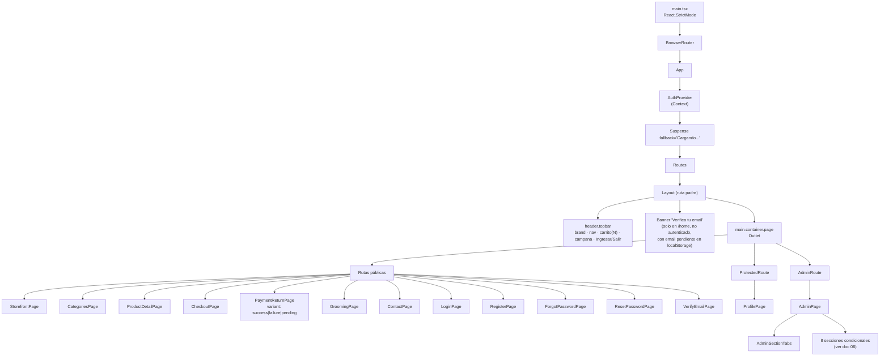
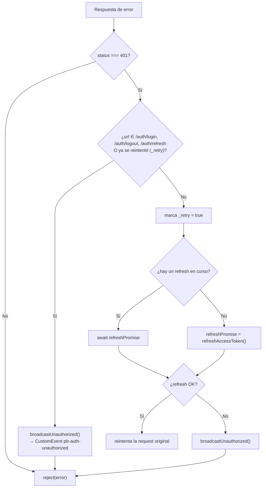

# 05 — Frontend

← [04 Backend](04_Backend.md) | [Índice](README.md) | Siguiente: [06 Panel Admin](06_PanelAdmin.md) →

---

## 1. Resumen de arquitectura

| Aspecto | Decisión |
|---|---|
| Organización | **Feature-sliced**: `src/features/<dominio>/{hooks,services,components,types,utils}` |
| Patrón dominante | **Hook de página**: toda la lógica en `use<Pantalla>Page`, componentes casi puros |
| Estado de servidor | ❌ Sin React Query / SWR — `useState` + `useEffect` propios |
| Estado global | ✅ Un solo Context: `AuthContext`. Nada de Redux/Zustand/Jotai |
| Estado de carrito | `localStorage` + `CustomEvent` (`lib/cart-storage.ts`) |
| Routing | react-router-dom v6, rutas declarativas con `<Outlet/>` |
| Code splitting | ✅ Las 14 páginas son `React.lazy` + `<Suspense>` |
| Estilos | Un único `styles.css` global. Sin CSS Modules, sin Tailwind, sin CSS-in-JS |
| Tests | 51 tests Vitest, **todos sobre hooks**, ninguno sobre componentes |
| Tipos | Escritos a mano en `src/types.ts` + generados en `src/types/api.generated.ts` ⚠️ duplicados |

### Consecuencias de no tener librería de estado de servidor {#estado-servidor}

| Se gana | Se pierde |
|---|---|
| Cero dependencias extra (4 deps de runtime en total) | ❌ **Sin caché**: `GET /auth/me` se dispara en cada montaje de `AuthProvider` |
| Control total del flujo | ❌ **Sin deduplicación**: dos componentes que piden lo mismo hacen dos requests |
| Curva de aprendizaje nula | ❌ **Sin invalidación declarativa**: tras mutar hay que llamar `reload()` a mano |
| Hooks fácilmente testeables | ❌ **Sin reintento ni backoff** en el cliente |
| | ❌ Cada hook reimplementa `loading` / `error` / `reload` |

`lib/useAsyncResource.ts` mitiga lo último parcialmente, pero **solo lo usa el panel admin**; el resto de features
gestiona `loading`/`error` a mano. Ver [14_Dependencias.md](14_Dependencias.md#D-14).

---

## 2. Árbol de componentes



## 3. Mapa de rutas {#guards}

| Ruta | Página | Guard | Notas |
|---|---|---|---|
| `/` | — | — | `<Navigate to="/home" replace/>` |
| `/home` | `StorefrontPage` | 🌐 | Catálogo con búsqueda, filtro por categoría, orden y paginación |
| `/categorias` | `CategoriesPage` | 🌐 | Grilla de categorías → navega a `/home?category_id=N` |
| `/products/:productId` | `ProductDetailPage` | 🌐 | Detalle + selector de variante + agregar al carrito |
| `/checkout` | `CheckoutPage` | 🌐 | Funciona con y sin sesión |
| `/payments/success` | `PaymentReturnPage variant="success"` | 🎫 | Lee `?public_status_token=` |
| `/payments/failure` | `PaymentReturnPage variant="failure"` | 🎫 | Ídem |
| `/payments/pending` | `PaymentReturnPage variant="pending"` | 🎫 | Ídem |
| `/peluqueria` | `GroomingPage` | 🌐 | Formulario de turno (requiere sesión para enviar) |
| `/contacto` | `ContactPage` | 🌐 | Datos estáticos de `features/contact/data.ts` |
| `/login` | `LoginPage` | 🌐 | Redirige a `/admin` o `/profile` según el rol |
| `/register` | `RegisterPage` | 🌐 | — |
| `/forgot-password` | `ForgotPasswordPage` | 🌐 | — |
| `/reset-password` | `ResetPasswordPage` | 🌐 | Lee `?token=` |
| `/verify-email` | `VerifyEmailPage` | 🌐 | Lee `?token=` |
| `/profile` | `ProfilePage` | 🔑 `ProtectedRoute` | Perfil + historial de órdenes y pagos |
| `/admin` | `AdminPage` | 👑 `AdminRoute` | Panel completo |
| `*` | — | — | `<Navigate to="/" replace/>` |

**Guards** (`guards/`):

```tsx
// ProtectedRoute
if (isLoading)        return <p>Cargando sesion...</p>;
if (!isAuthenticated) return <Navigate to="/login" replace
                                 state={sessionExpired ? {reason:"session_expired"} : undefined}/>;
return <Outlet/>;

// AdminRoute: lo anterior + if (!isAdmin) return <Navigate to="/" replace/>;
```

> 📌 El `state.reason` viaja al `LoginPage`, que lo traduce a un mensaje informativo
> (`useLoginPage.ts:21-30`). Hay 4 razones: `registered_account_checkout`, `session_expired`,
> `password_reset_completed`, `registration_completed`. Buen detalle de UX.

> ⚠️ Los guards son **solo de UX**. La autorización real está en el backend (`require_admin`). Aunque alguien
> forzara `isAdmin=true` en el cliente, todas las llamadas a `/admin/*` devolverían 403.

---

## 4. Gestión de estado

### 4.1 `AuthContext` — el único estado global

`features/auth/context/AuthContextProvider.tsx` (117 líneas).

**Valor expuesto:**
```ts
type AuthContextValue = {
  isLoading: boolean;        // bootstrap en curso
  isAuthenticated: boolean;
  isAdmin: boolean;
  sessionExpired: boolean;   // hubo un 401 irrecuperable
  clearSessionExpiredNotice: () => void;
  login: (email, password) => Promise<boolean>;   // devuelve si es admin
  logout: () => Promise<void>;
};
```

**Bootstrap** (`useEffect` con `[]`): llama `getMyProfile()`. Si responde, hay sesión (las cookies HttpOnly
viajaron solas); si falla, no la hay. Usa un flag `mounted` para evitar `setState` tras desmontar. 🟢

**Escucha global de 401:** registra un listener del `CustomEvent` `pb-auth-unauthorized`. Cuando `http.ts` no
puede recuperar la sesión, emite ese evento y el provider limpia el estado y marca `sessionExpired=true`.

**`login`:** llama `loginApi` y luego `getMyProfile`. Si el segundo falla, lanza `AuthFlowError` con código
`login_ok_profile_failed`. Devuelve el flag de admin para que `useLoginPage` decida el destino.

**`logout`:** intenta el logout del servidor; **pase lo que pase**, limpia el estado local
(`AuthContextProvider.tsx:95-99`). 🟢 Correcto: el usuario no debe quedar "logueado" en la UI porque el servidor
no respondió.

| Mejoras | Detalle |
|---|---|
| ⚠️ | `useMemo` con dependencias `[isAuthenticated, isAdmin, isLoading, sessionExpired]` — cualquier cambio recrea el objeto y **re-renderiza todos** los consumidores. Con solo 4 booleanos es aceptable. |
| ⚠️ | No expone el perfil completo: `ProfilePage` vuelve a llamar `getMyProfile()`. Request duplicada evitable. |

### 4.2 Carrito — `lib/cart-storage.ts`

Módulo funcional sobre `localStorage`, clave `pb_cart_items`.

```ts
type CartItem = { product_id, product_name, variant_id, option_label,
                  unit_price, quantity, img_url };
```

| Función | Qué hace |
|---|---|
| `readCart()` | Lee y parsea; **cualquier error devuelve `[]`** (defensivo ante datos corruptos) 🟢 |
| `writeCart(items)` | Persiste y emite `pb-cart-updated` |
| `addToCart(item)` | Suma cantidad si ya existe `(product_id, variant_id)` |
| `updateCartItemQuantity(variantId, qty)` | Fuerza mínimo 1 con `Math.max(1, Math.trunc(...))` |
| `incrementCartItem(variantId, max=10)` | Tope 10 — coincide con el límite del backend (`PublicGuestCheckoutItemRequest.quantity le=10`) 🟢 |
| `decrementCartItem(variantId)` | Mínimo 1 |
| `removeCartItem`, `clearCart`, `cartCount` | — |
| `subscribeToCartUpdates(listener)` | Devuelve la función de desuscripción |

`Layout` se suscribe a `pb-cart-updated` **y** al evento nativo `storage`, así que el contador se sincroniza
también entre pestañas. 🟢

| Mejoras | Detalle |
|---|---|
| ⚠️ | El carrito guarda `unit_price` del momento en que se agregó. Si el precio cambia, el total mostrado en `/checkout` no coincidirá con el que calcule el backend. **El backend siempre repreicia**, así que el importe cobrado es correcto — pero el usuario ve una cifra y paga otra. Ver [18_Roadmap.md](18_Roadmap.md#B-10). |
| ⚠️ | Sin validación de esquema al leer: un `localStorage` manipulado puede inyectar campos raros (mitigado porque el backend solo lee `variant_id` y `quantity`). |
| ⚠️ | Sin expiración: un carrito de hace meses sigue ahí con precios viejos. |

### 4.3 `lib/useAsyncResource.ts`

```ts
useAsyncResource<T>(fetcher, initialValue, { enabled, deps, errorMessage })
  → { data, setData, loading, error, setError, reload }
```

Usa un `useRef` para el `fetcher` (`useAsyncResource.ts:19-20`), de modo que redefinirlo en cada render **no**
dispara refetch. `reload` solo depende de `errorMessage`. 🟢 Solución correcta al problema clásico.

⚠️ El `useEffect` hace spread de `deps` en el array de dependencias
(`useAsyncResource.ts:40`) con un `eslint-disable`. Funciona mientras la longitud de `deps` sea constante entre
renders; si no, React lanza error.

⚠️ Descarta el error real y muestra siempre `errorMessage` — se pierde el `detail` del backend.

### 4.4 Otros hooks de `lib/` {#lib}

| Hook | Qué hace |
|---|---|
| `useClickOutside(ref, isActive, onOutsideClick)` | Cierra dropdowns al hacer clic fuera. Lo usa `Layout` para las notificaciones |
| `useModalA11y(isOpen, onClose)` | Accesibilidad de modales: cierre con `Escape`, focus trap. **Con 5 tests** 🟢 |

---

## 5. Capa de servicios {#capa-de-servicios}

### 5.1 `services/http.ts` — cliente axios

```ts
export const http = axios.create({
  baseURL: import.meta.env.VITE_API_BASE_URL ?? "http://localhost:8000",
  timeout: Number(import.meta.env.VITE_API_TIMEOUT_MS) || 60000,
  withCredentials: true       // ← imprescindible para las cookies HttpOnly
});
```

**Interceptor de respuesta — refresh automático:**



**Puntos destacados:**
- 🟢 **Deduplicación del refresh:** `refreshPromise` como singleton módulo-nivel evita que N requests en paralelo
  disparen N refresh (que además, por la rotación de `token_version`, se invalidarían entre sí).
- 🟢 El flag `_retry` en la config evita bucles infinitos.
- 🟢 **`timeout: 60000`** con comentario explicando el cold start de Render.
- 🟢 `import("./auth-api")` dinámico dentro de `refreshAccessToken` rompe el ciclo `http ↔ auth-api`.
- ⚠️ **No hay interceptor de request** que agregue `Idempotency-Key`: cada llamada la construye a mano.

### 5.2 `services/http-errors.ts` — traducción de errores

318 líneas, el archivo de servicios más grande. Dos funciones:

**`classifyHttpError(error) -> {kind, status, detail, isNetwork}`**
Clasifica en: `network` (códigos `ERR_NETWORK`/`ECONNABORTED`), `unauthorized` (401), `csrf`
(403 con detail exacto `csrf origin check failed`), `forbidden` (403), `validation` (422), `conflict` (409),
`server` (≥500), `unknown`.

**`toUserMessage(error, context) -> string`**
Traduce a español según 9 contextos: `login`, `register`, `forgot-password`, `reset-password`, `email-verify`,
`checkout`, `payment-return`, `profile`, `turns`, `generic`.

`retryPaymentMessage(detail)` (`http-errors.ts:120-146`) mapea **literalmente** los 8 mensajes de
`payment_s.RETRY_*` a texto amigable:

| `detail` del backend | Mensaje al usuario |
|---|---|
| `retry not allowed: order cancelled` | "La orden ya fue cancelada y ya no admite reintentos de pago." |
| `retry not allowed: order cancelled because stock reservation expired` | "La orden ya fue cancelada porque vencio la reserva de stock." |
| `retry not allowed: stock reservation expired` | "La reserva de stock vencio. Ya no podemos reintentar este pago." |
| … (8 en total) | … |

| Mejoras | Detalle |
|---|---|
| 🔴 | **Acoplamiento por strings.** El frontend compara `detail` con literales exactos del backend. Cambiar una coma en `payment_s.py` rompe la traducción **sin que ningún test lo detecte**. Debería usarse un campo `code` estable en la respuesta de error. Ver [18_Roadmap.md](18_Roadmap.md#R-05). |
| ⚠️ | En varios contextos hace fallback a `classified.detail`, que puede ser un mensaje interno en inglés (p. ej. `invalid literal for int()`). Fuga de detalle de implementación al usuario. |
| ⚠️ | La función tiene 170 líneas de `if` anidados; una tabla `Record<ErrorContext, Record<AuthUiErrorKind, string>>` sería más mantenible. |

### 5.3 Los 12 clientes de API

Todos siguen el mismo patrón: una función por endpoint que desenvuelve `response.data.data`.

| Archivo | LOC | Endpoints que cubre | Notas |
|---|---:|---|---|
| `auth-api.ts` | 99 | 10 de `/auth/*` + `/orders` | `getMyOrders({includePayments})` cambia la forma de la respuesta |
| `checkout-api.ts` | 172 | `/checkout/guest`, `/orders/draft/items`, `/orders/{id}/status`, `/orders/{id}/payments` | Incluye la validación de URL de MP |
| `payments-api.ts` | 87 | 5 de pagos públicos y de usuario | `fetchPublicPaymentStatus` ⚠️ ya no se usa |
| `storefront-api.ts` | 27 | 3 públicos | Devuelve el envoltorio completo (necesita `meta.total`) |
| `notifications-api.ts` | 45 | 4 | Normaliza `meta` con defaults |
| `turns-api.ts` | 33 | 3 | — |
| `admin-catalog-api.ts` | 108 | 9 de catálogo | Tipos `AdminProduct`, `AdminVariant`, `AdminCatalog` |
| `admin-orders-api.ts` | 181 | 8 de órdenes/pagos/incidencias | Tipos `AdminOrder`, `AdminPayment`, `AdminPaymentIncident` |
| `admin-sales-api.ts` | 71 | `/users/search`, `/admin/sales` | Unión discriminada `AdminSalesCustomerPayload` 🟢 |
| `admin-discounts-api.ts` | 60 | 4 de descuentos | — |
| `idempotency.ts` | 7 | — | `crypto.randomUUID()` con fallback a `Date.now()+Math.random()` |
| `http.ts` / `http-errors.ts` | 68 / 318 | — | Infraestructura |

### 5.4 Validación de la URL de Mercado Pago (defensa en profundidad)

`checkout-api.ts:79-107` **repite en el cliente** la validación que ya hace el backend:

```ts
const MERCADOPAGO_ALLOWED_CHECKOUT_HOSTS = new Set([
  "www.mercadopago.com", "mercadopago.com",
  "www.mercadopago.com.ar", "mercadopago.com.ar",
  "sandbox.mercadopago.com", "www.sandbox.mercadopago.com"
]);

export function validateMercadoPagoCheckoutUrl(url: string): string {
  const parsed = new URL(url.trim());
  if (parsed.protocol !== "https:") throw new Error("...debe usar HTTPS.");
  const hostname = parsed.hostname.trim().toLowerCase().replace(/\.+$/, "");
  if (!MERCADOPAGO_ALLOWED_CHECKOUT_HOSTS.has(hostname)) throw new Error("...dominio permitido.");
  return parsed.toString();
}
```

> 🔒 **Excelente práctica.** Antes de `window.location.assign()` se valida esquema y host. Aunque un atacante
> lograra inyectar una URL en `provider_payload`, el navegador no redirigiría fuera de Mercado Pago.
> La allowlist es **idéntica** a la del backend (`mercadopago_normalization_s.py:34-41`).
> ⚠️ Duplicada en dos lenguajes sin un mecanismo que las mantenga sincronizadas.

---

## 6. Features

### 6.1 `features/storefront/`

| Hook | Estado que maneja | Endpoints |
|---|---|---|
| `useStorefrontPage` | query, appliedQuery, categorías, productos, sortBy/sortDir, page, pageSize, total, loading, error | `GET /storefront/products`, `GET /storefront/categories` |
| `useCategoriesPage` | lista de categorías | `GET /storefront/categories` |
| `useProductDetailPage` | producto, variante seleccionada, cantidad | `GET /storefront/products/{id}` |

**`useStorefrontPage` — detalles:**
- La categoría seleccionada vive en la **URL** (`useSearchParams`), no en estado local
  (`useStorefrontPage.ts:21`). 🟢 Así el filtro es compartible y sobrevive al refresh.
- Paginación local `page`/`pageSize` traducida a `offset` para el backend.
- `useEffect` de corrección: si `page > totalPages` (porque cambió el filtro), retrocede
  (`useStorefrontPage.ts:81-85`). 🟢
- ⚠️ El `useEffect` de carga depende de 6 valores; cambiar dos a la vez (p. ej. `sortBy` y `page`) dispara
  **dos** requests.
- ⚠️ El error es genérico (`"No se pudo cargar el catalogo."`) y no usa `toUserMessage`.

### 6.2 `features/checkout/`

**`useCheckoutPage(params: {authLoading, isAuthenticated})`** — 145 líneas.

Estado: `items` (desde `readCart()`), datos del invitado (4 campos), `paymentMethod`, `loading`, `error`,
`success`. `total` con `useMemo`.

**`onFinalizeCheckout` paso a paso:**
1. Guarda si hay ítems y no está cargando.
2. Elige la ruta: `submitAuthenticatedCheckoutFromCart` o `submitGuestCheckoutFromCart`.
3. Si el método es `mercadopago`: exige `checkout_url` → `clearCart()` → `redirectToMercadoPago()` → `return`.
4. Si no: `clearCart()` y arma un mensaje de éxito distinto según el método (`cash` menciona el cobro presencial).
5. **Manejo especial del 409:** si es invitado y el `detail` es `registered account requires login`, navega a
   `/login` con `state = {from:"/checkout", checkoutEmail, reason:"registered_account_checkout"}`
   (`useCheckoutPage.ts:104-117`). 🟢 Recuperación de UX bien pensada.

⚠️ `clearCart()` se ejecuta **antes** de redirigir a Mercado Pago. Si el usuario abandona el checkout de MP,
su carrito ya está vacío. Puede volver por `/payments/*` con el token, pero es una decisión discutible.

**Flujo autenticado** (`checkout-api.ts:145-172`): son **3 requests secuenciales** —
`PUT /orders/draft/items` → `PATCH /orders/{id}/status` → `POST /orders/{id}/payments`.
⚠️ Sin idempotencia entre pasos: si falla el tercero, la orden queda `submitted` sin pago (recuperable desde
`/profile`, pero el usuario no lo sabe).

**`usePaymentReturnStatus`** — 165 líneas. Gestiona la pantalla de retorno:
- Lee `?public_status_token=` de la URL.
- `loadSnapshot()` llama `GET /public/orders/by-payment-token`.
- `onContinuePayment()`: usa la `checkout_url` del snapshot o la del reintento activo.
- `onRetryPayment()`: llama `POST /payments/{token}/retry` y redirige.
- **`activeRetryAttemptRef`**: guarda `{idempotencyKey, payment}` en un `useRef` para que, si el usuario pulsa
  "Reintentar" dos veces, se reutilice **la misma clave de idempotencia** y no se cree un segundo pago. 🟢
  Excelente coordinación con la idempotencia del backend.
- Ante error, recarga el snapshot para reflejar el estado real.

### 6.3 `features/auth/`

| Hook | Responsabilidad |
|---|---|
| `useLoginPage(login)` | Recibe `login` del contexto por parámetro (inversión de dependencias → testeable). Traduce `location.state.reason` a mensaje. Redirige a `/admin` o `/profile` |
| `useRegisterPage` | Alta + `savePendingVerificationEmail` |
| `useForgotPasswordPage` | Solicitud de reset |
| `useResetPasswordPage` | Lee `?token=`, confirma, navega a `/login` con `reason:"password_reset_completed"` |
| `useVerifyEmailPage` | Lee `?token=`, confirma o reenvía |

**`verification-storage.ts`**: 3 funciones sobre `localStorage` (`savePendingVerificationEmail`,
`readPendingVerificationEmail`, `clearPendingVerificationEmail`). Alimentan el banner de `Layout`.
⚠️ Guarda el email del usuario en `localStorage` sin expiración.

### 6.4 `features/profile/`

**`useProfilePage`** — 310 líneas, el hook más complejo del frontend (fuera de admin).

Dos secciones: `profile` (edición inline de teléfono y email) e `history` (órdenes + pagos).

**Edición inline:** `editingField: "phone" | "email" | null`. Al guardar el email, si
`meta.verification_email_sent` es `true` y el email realmente cambió, persiste el email pendiente y muestra el
aviso.

**Reintento de Mercado Pago desde el historial** — la parte más elaborada:
1. Si ya hay un intento activo para esa `(orderId, paymentId)` **con** pago, redirige directamente.
2. Si no, **recarga las órdenes** y revalida contra datos frescos:
   - La orden debe seguir `submitted` → si no, `"La orden ya no esta disponible..."`.
   - El pago debe ser reintentable → `mercadopago` con estado `cancelled`/`expired`, **o** `pending` con
     `provider_status === "setup_failed"` (`useProfilePage.ts:195-203`).
3. Llama `retryMyOrderMercadoPago(orderId, idempotencyKey)`, refresca los pagos y redirige.

> 🟢 **Revalidación antes de actuar:** el hook no confía en los datos que ya tiene en pantalla. Evita el error
> clásico de reintentar sobre información obsoleta.
> ⚠️ Duplica la regla `isRetryableMercadoPagoPayment` que el backend ya aplica; si divergen, el usuario ve un
> botón que siempre falla.

### 6.5 `features/turns/`

`useGroomingPage({authLoading, isAuthenticated})` → `POST /turns`.
`types.ts` define `DAYS` y `DOG_SIZES` (`Pequeno`, `Mediano`, `Grande`).
⚠️ El tamaño del perro se recoge en la UI pero **el backend no tiene ese campo**: presumiblemente termina en
`notes`. **Hipótesis:** no verificable sin leer el componente completo; el schema `CreateTurnRequest` solo acepta
`scheduled_at` y `notes`.

### 6.6 `features/contact/`

`data.ts` exporta un objeto `contactInfo` estático. Sin lógica.

### 6.7 `features/admin/`

Documentado por completo en [06_PanelAdmin.md](06_PanelAdmin.md).

---

## 7. Componentes

### `components/Layout.tsx` — 246 líneas

El único componente global. Contiene:

| Zona | Contenido |
|---|---|
| `header.topbar` | Marca "Patitas y Bigotes", nav (Tienda, Carrito con contador, Mi cuenta, campana, Ingresar/Salir) |
| Menú secundario | Tabs Tienda / Peluqueria / Contacto con clase activa según `location.pathname` |
| Banner condicional | "Verifica tu email" — solo en `/home`, sin sesión y con email pendiente en `localStorage` |
| `main` | `<Outlet/>`, con clase `page-admin` extra si la ruta empieza por `/admin` |

**Dropdown de notificaciones:**
- Se cierra con `useClickOutside`.
- Carga el contador al montar y **cada 30 s** mientras `document.visibilityState === "visible"`
  (`Layout.tsx:79-86`). 🟢 Buen detalle: no hace polling en una pestaña de fondo.
- La lista solo se pide al abrir el dropdown.
- Marcar como leída actualiza el estado local **de forma optimista** y decrementa el contador.
- Los errores se tragan en silencio (`// fail silently in topbar`) 🟢 — correcto para un elemento secundario.

| Mejoras | Detalle |
|---|---|
| ⚠️ | 246 líneas mezclando shell, notificaciones, carrito y banner de verificación. Extraer `<NotificationsBell/>` y `<VerifyEmailBanner/>` sería una mejora clara. |
| ⚠️ | Polling de 30 s por usuario autenticado. Con muchos usuarios, carga innecesaria en el free tier. SSE o WebSocket serían mejores; o subir el intervalo. |
| ⚠️ | Estilos inline (`style={{marginTop:16, padding:16}}`) conviviendo con clases CSS. |

### Componentes compartidos del admin — `features/admin/components/shared/`

| Componente | Responsabilidad |
|---|---|
| `AdminActionsMenu` | Menú "⋯" de acciones por fila |
| `AdminExpandButton` | Botón de expandir/colapsar |
| `AdminUserSearchModal` | Modal de búsqueda de usuarios, reutilizado por Ventas y Registrar Pago |
| `ConfirmModal` | Confirmación genérica; usa `useModalA11y` |

---

## 8. Tipos

Hay **dos** fuentes de tipos, y no están conectadas:

| Fuente | Archivo | Líneas | Contenido |
|---|---|---:|---|
| Escritos a mano | `src/types.ts` | 158 | `StorefrontProduct`, `MyOrder`, `MyPayment`, `MyProfile`, `PublicOrderSnapshot`, `NotificationItem`, `ApiEnvelope<T>`, … |
| Generados | `src/types/api.generated.ts` | 3.992 | Derivados de `openapi.json` |
| Por feature | `features/*/types.ts` | 1–25 | `AdminSection`, `PaymentReturnVariant`, `CategoryItem`, `TurnDay`, `DogSize` |
| En servicios | `services/admin-*.ts` | — | `AdminProduct`, `AdminOrder`, `AdminPayment`, `AdminDiscount`, … |

> 🔴 **`api.generated.ts` se genera, se valida en CI… y casi no se importa.** Una búsqueda del import muestra que
> los hooks y servicios usan los tipos manuales. El resultado es un contrato validado que no protege nada, y
> tipos manuales que pueden divergir de la API sin que nada avise.
> Causa raíz: el backend no declara `response_model`, así que los tipos generados de respuesta son inútiles.
> Ver [18_Roadmap.md](18_Roadmap.md#R-06).

---

## 9. Configuración del frontend

| Archivo | Contenido relevante |
|---|---|
| `vite.config.ts` | Plugin de React, `server.port = 5173`. Sin proxy: el frontend siempre habla con `VITE_API_BASE_URL` |
| `vitest.config.ts` | `environment: "jsdom"`, `setupFiles: ["./src/test/setup.ts"]`, `globals: true` |
| `tsconfig.json` | Referencias a `tsconfig.app.json` y `tsconfig.node.json` (project references) |
| `eslint.config.js` | Flat config con `@eslint/js`, `typescript-eslint`, `react-hooks`, `react-refresh` |
| `vercel.json` | `buildCommand: npm run build`, `outputDirectory: dist`, rewrite `/(.*)` → `/index.html` |
| `public/_redirects` | Equivalente para Cloudflare Pages |
| `.nvmrc` | Fija la versión de Node para CI y desarrollo |

**Variables de entorno** (prefijo `VITE_`, expuestas al bundle):

| Variable | Default | Para qué |
|---|---|---|
| `VITE_API_BASE_URL` | `http://localhost:8000` | URL del backend |
| `VITE_API_TIMEOUT_MS` | `60000` | Timeout de axios (60 s por el cold start de Render) |

> 🔒 Ninguna variable `VITE_*` contiene secretos — correcto, porque **todo lo que lleve ese prefijo termina en el
> bundle público**.

---

## 10. Accesibilidad y UX

| Aspecto | Estado |
|---|---|
| `aria-label` en botones de ícono | ✅ Campana de notificaciones (`Layout.tsx:133`) |
| `aria-label` en navegación | ✅ `<nav aria-label="Navegacion principal">` |
| `role="img"` + `aria-hidden` en SVG decorativos | ✅ |
| Focus trap y cierre con `Escape` en modales | ✅ `useModalA11y` (con tests) |
| Fallback de `Suspense` | 🟡 Un `<p className="muted">Cargando...</p>` genérico |
| Error boundary | ❌ **No hay**: un error de render deja la pantalla en blanco |
| Skeletons | ❌ Solo texto "Cargando..." |
| Estado de foco tras navegar | ❌ No se gestiona |

---

## 11. Deudas del frontend

| # | Deuda | Severidad |
|---|---|---|
| 1 | Sin Error Boundary → pantalla blanca ante cualquier error de render | 🔴 |
| 2 | `api.generated.ts` generado y validado pero no usado | 🟠 |
| 3 | Acoplamiento por strings literales de `detail` entre `http-errors.ts` y el backend | 🟠 |
| 4 | Sin caché ni deduplicación de requests | 🟠 |
| 5 | El precio del carrito puede diferir del que cobra el backend | 🟡 |
| 6 | `clearCart()` antes de redirigir a Mercado Pago | 🟡 |
| 7 | `Layout` con 4 responsabilidades | 🟡 |
| 8 | Polling de notificaciones cada 30 s por usuario | 🟡 |
| 9 | Ningún test de componente (solo de hooks) | 🟡 |
| 10 | Reglas de negocio duplicadas en cliente (`isRetryableMercadoPagoPayment`, validación de host de MP) | 🟡 |

---

← [04 Backend](04_Backend.md) | [Índice](README.md) | Siguiente: [06 Panel Admin](06_PanelAdmin.md) →
