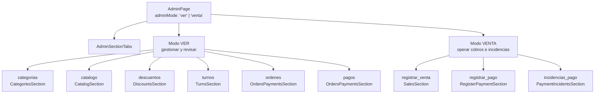
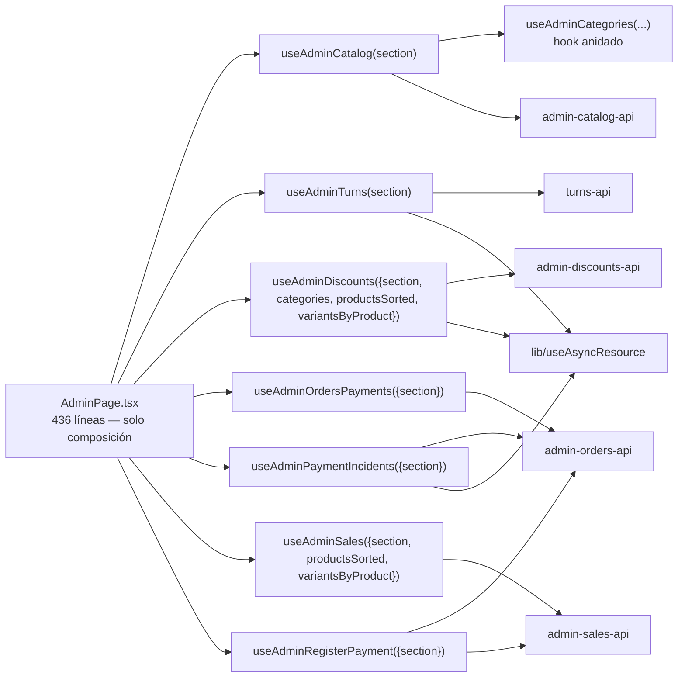
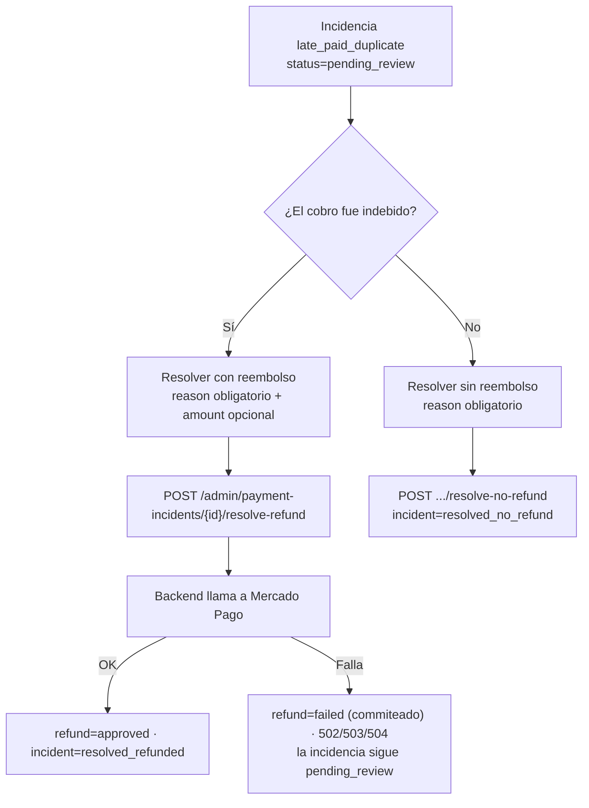
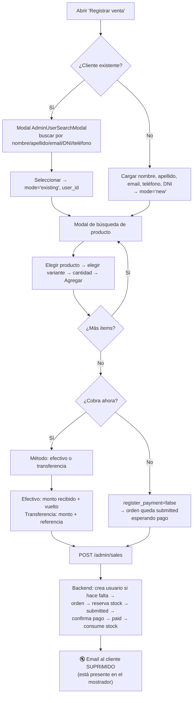

# 06 — Panel Admin

← [05 Frontend](05_Frontend.md) | [Índice](README.md) | Siguiente: [07 API](07_API.md) →

---

## 1. Qué es y cómo se accede

El panel admin es **una sola ruta** (`/admin`) que renderiza `AdminPage.tsx` (436 líneas) detrás del guard
`AdminRoute`. No es una aplicación separada: comparte bundle, `Layout`, cliente HTTP y sesión con la tienda.

**Doble control de acceso:**
1. **Cliente (UX):** `AdminRoute` lee `isAdmin` del `AuthContext` y redirige a `/` si es falso.
2. **Servidor (real):** cada endpoint `/admin/*` exige `Depends(require_admin)`, que **relee `users.is_admin` de
   la base** en cada request. Revocar admin surte efecto inmediato aunque el JWT siga vigente. 🔒

El `Layout` añade la clase CSS `page-admin` al `<main>` cuando la ruta empieza por `/admin`
(`Layout.tsx:241`), lo que le da un ancho y estilo propios.

---

## 2. Estructura: dos modos, nueve secciones



Definido en `features/admin/types.ts`:

```ts
export type AdminMode = "ver" | "venta";
export type AdminSection = "categorias" | "catalogo" | "descuentos" | "turnos"
                         | "ordenes" | "pagos" | "incidencias_pago"
                         | "registrar_venta" | "registrar_pago";

export const ADMIN_VIEW_SECTIONS  = ["categorias","catalogo","descuentos","turnos","ordenes","pagos"];
export const ADMIN_SALES_SECTIONS = ["registrar_venta","registrar_pago","incidencias_pago"];
```

`AdminPage` mantiene **dos** estados de sección (`viewSection` y `salesSection`) y deriva el activo del modo
(`AdminPage.tsx:29-33`). Así, al alternar entre modos se recuerda dónde estabas en cada uno. 🟢

> 📌 **Por qué dos modos:** el subtítulo de la página lo explica —
> *"ver para gestionar y revisar, venta para operar cobros, ventas e incidencias"* (`AdminPage.tsx:67`).
> Separa la tarea administrativa de fondo de la operación de mostrador, que es urgente y con el cliente delante.

---

## 3. Arquitectura interna



**Los 7 hooks se instancian siempre**, pero cada uno recibe `adminSection` y **solo carga datos si su sección
está activa**, mediante `enabled` de `useAsyncResource` o un `useEffect` condicionado. 🟢 Evita 7 ráfagas de
requests al abrir el panel.

**`useAdminCatalog` es la excepción**: se carga para **4 secciones**
(`CATALOG_DEPENDENT_SECTIONS = ["categorias","catalogo","descuentos","registrar_venta"]`,
`useAdminCatalog.ts:16`), porque el catálogo es insumo del selector de productos en descuentos y ventas.
Por eso `useAdminDiscounts` y `useAdminSales` reciben `productsSorted` y `variantsByProduct` como parámetros
en lugar de volver a pedirlos. 🟢 Buena decisión: una sola carga del catálogo.

> ⚠️ **El problema estructural del panel:** `AdminPage` pasa **entre 20 y 60 props** a cada sección
> (`CatalogSection` recibe ~95). Es prop drilling extremo. La causa es que los hooks devuelven objetos planos
> gigantes y el componente los destructura uno por uno.
> **Alternativa:** pasar el objeto del hook completo (`<CatalogSection catalog={catalog}/>`) o usar un Context
> local por sección. Ver [18_Roadmap.md](18_Roadmap.md#R-10).

---

## 4. Las 9 secciones en detalle

### 4.1 `categorias` — `CategoriesSection` (110 líneas)

| | |
|---|---|
| **Hook** | `useAdminCategories` (anidado dentro de `useAdminCatalog`) |
| **Qué muestra** | Lista de categorías con la cantidad de productos de cada una |
| **Acciones** | Crear · Renombrar (edición inline) · Eliminar (solo las vacías) |
| **APIs** | `GET /admin/catalog` · `POST /categories` · `PATCH /categories/{id}` · `DELETE /categories/{id}` |
| **Tablas** | `categories` |

El conteo por categoría se calcula **en el cliente** (`AdminPage.tsx:51-62`) con un `reduce` sobre
`productsSorted`. `deletableCategories` filtra las que tienen 0 productos, anticipando el `RESTRICT` de la FK.

⚠️ Ese cálculo se ejecuta **en cada render** de `AdminPage`, sin `useMemo`.

### 4.2 `catalogo` — `CatalogSection` (821 líneas — el componente más grande del repo)

| | |
|---|---|
| **Hook** | `useAdminCatalog` (504 líneas) |
| **Qué muestra** | Productos agrupados por categoría, expandibles a sus variantes |
| **APIs** | `GET /admin/catalog` · `POST /products` · `PATCH /products/{id}` · `DELETE /products/{id}` · `PATCH /variants/{id}` |
| **Tablas** | `products`, `product_variants`, `categories` |

**Acciones disponibles:**

| Acción | Detalle |
|---|---|
| Crear producto | Nombre, categoría, descripción, imagen |
| Editar producto | Inline: nombre, categoría, descripción, imagen, activo |
| Eliminar producto | Con confirmación de dos pasos (`productPendingDeleteId`) |
| Filtrar por categoría | `catalogCategoryFilter` |
| Ver todos / paginar | `catalogShowAll` |
| Expandir variantes | `expandedProducts` |
| Editar variante | SKU, talle, color, imagen, stock, activo |
| **Editar precio de variante** | Detrás de un flag `enableVariantPriceEdit` **+ modal de confirmación** |
| Agregar stock | Modal con selección de variantes y cantidad |

> 🟢 **El cambio de precio tiene doble barrera:** hay que activar explícitamente `enableVariantPriceEdit` y
> luego confirmar en un modal (`variantPriceConfirmation`, `useAdminCatalog.ts:381-385`). Es la operación con
> mayor impacto económico del panel y está protegida en consecuencia.

**Helpers internos destacados:**
- `normalizeVariantsByProduct` (`useAdminCatalog.ts:19-28`): convierte las claves string del backend a números y
  ordena las variantes por `id`. Necesario porque el backend serializa `variants_by_product` con claves string.
- `deriveProductFromVariants` (`useAdminCatalog.ts:38`): recalcula `stock`, `active` y `min_var_price` del
  producto tras editar una variante, **sin volver a llamar al servidor** — actualización optimista. 🟢
  ⚠️ Reimplementa en TypeScript la lógica de `products_s._product_inventory` y `_compute_min_var_price`.
  Si el backend cambia el criterio, la UI mostrará algo distinto.

| Mejoras | Detalle |
|---|---|
| 🔴 | 821 líneas en un componente. Debería dividirse en `ProductList`, `ProductRow`, `VariantRow`, `AddStockModal`, `CreateProductForm`. |
| 🟠 | El hook devuelve **~70 valores**; el componente los recibe todos como props individuales. |
| ⚠️ | `GET /admin/catalog` trae hasta 200 productos con **todas** sus variantes en una sola respuesta, sin paginación real. Ver [12_Performance.md](12_Performance.md#admin). |

### 4.3 `descuentos` — `DiscountsSection` (336 líneas)

| | |
|---|---|
| **Hook** | `useAdminDiscounts` (241 líneas) |
| **APIs** | `GET /discounts` · `POST /discounts` · `PATCH /discounts/{id}` · `DELETE /discounts/{id}` |
| **Tablas** | `discounts`, `discount_products` |

**Acciones:** crear (nombre, tipo `percent`/`fixed`, valor, alcance, activo), activar/desactivar con toggle,
eliminar con confirmación.

**Selector de productos:** un árbol expandible producto → variantes con checkboxes, mantenido en dos mapas
(`selectedDiscountProductIds`, `selectedDiscountVariantIds`).

> ⚠️ **Discrepancia importante entre UI y modelo de datos.** La UI permite seleccionar **variantes**
> individuales, pero el modelo `Discount` solo soporta scope `product_list` a nivel de **producto**
> (`discount_products` tiene FK a `products`, no a `product_variants`).
> El hook expone `selectedDiscountVariantCount` y `toggleDiscountVariantSelection`, pero
> `_set_discount_product_list` del backend solo guarda `product_ids`.
> **Hipótesis:** la selección de variantes es un afinamiento de UX (seleccionar una variante marca su producto)
> y no tiene efecto diferenciado en el descuento aplicado. No verificable sin leer el cuerpo completo de
> `onCreateDiscount`; conviene confirmarlo antes de prometer "descuento por variante" a negocio.

`newDiscountTarget` en el frontend usa los valores `"all" | "category" | "products"`, mientras el backend espera
`"all" | "category" | "product" | "product_list"` — el hook hace la traducción antes de enviar.

### 4.4 `turnos` — `TurnsSection` (106 líneas)

| | |
|---|---|
| **Hook** | `useAdminTurns` (38 líneas — el más simple) |
| **APIs** | `GET /admin/turns` · `PATCH /admin/turns/{id}/status` |
| **Tablas** | `turns`, `users` |

Lista turnos con datos del cliente (nombre, apellido, teléfono), filtrable por estado. Acciones: confirmar,
cancelar. Solo se puede transicionar desde `pending`.

🟢 Es el hook mejor escrito del panel: usa `useAsyncResource` con `deps: [turnsFilter]`, y `onUpdateTurnStatus`
recarga tras mutar.

### 4.5 `ordenes` y `pagos` — `OrdersPaymentsSection` (237 líneas)

Un solo componente para dos secciones; se diferencia por la prop `adminSection`.

| | |
|---|---|
| **Hook** | `useAdminOrdersPayments` (119 líneas) |
| **APIs** | `GET /admin/orders` · `GET /admin/orders/{id}` · `GET /admin/orders/{id}/payments` · `GET /admin/payments` |
| **Tablas** | `orders`, `order_items`, `payments`, `payment_incidents`, `users` |

**Órdenes:** filtro por estado (`all|submitted|paid|cancelled`), orden por `created_at`/`id` asc/desc,
"ver todas", clic en fila → detalle con ítems y pagos.

**Pagos:** filtro por estado (`all|pending|paid|cancelled|expired`), mismo orden. Cada fila muestra
`order_status`, `user_id` y si tiene incidencia abierta.

🟢 `loadAdminOrder` usa `Promise.all` para pedir orden y pagos en paralelo (`useAdminOrdersPayments.ts:33`).

⚠️ El filtro `"all"` se traduce a **no enviar** el parámetro `status`, lo que en el backend significa "sin filtro"
con `limit` por defecto de **10**. El toggle `ordersShowAll` sube el límite, pero **no hay paginación real**:
`limit` tope 500 y sin `offset`. Ver [12_Performance.md](12_Performance.md#admin).

### 4.6 `incidencias_pago` — `PaymentIncidentsSection` (133 líneas)

| | |
|---|---|
| **Hook** | `useAdminPaymentIncidents` (83 líneas) |
| **APIs** | `GET /admin/payment-incidents?status=pending_review&limit=200` · `POST .../resolve-refund` · `POST .../resolve-no-refund` |
| **Tablas** | `payment_incidents`, `payment_refunds`, `payments`, `orders` |

La pantalla más sensible: es donde se **devuelve dinero real**.

**Flujo del operador:**



🟢 **`reason` es obligatorio en ambos caminos**, validado en el cliente (`useAdminPaymentIncidents.ts:27-31`) y
en el backend (`Field(min_length=1, max_length=500)`). Queda trazabilidad de por qué se devolvió (o no) el dinero,
junto con `resolved_by_user_id` y `resolved_at`.

🟢 `processingIncidentId` deshabilita la fila mientras la operación está en curso → evita doble clic.

⚠️ El hook pide `limit: 200` fijo y solo `pending_review`. **No hay forma de consultar el histórico** de
incidencias resueltas desde el panel, aunque el endpoint lo soporta con `?status=`.

### 4.7 `registrar_venta` — `SalesSection` (388 líneas) {#registrar-venta}

La pantalla de **venta de mostrador**.

| | |
|---|---|
| **Hook** | `useAdminSales` (362 líneas) |
| **APIs** | `GET /users/search` · `POST /admin/sales` (+ catálogo desde `useAdminCatalog`) |
| **Tablas** | `users`, `orders`, `order_items`, `payments`, `stock_reservations`, `product_variants` |

**Flujo del operador:**



**Cálculos del cliente:** `items` guarda `{variant_id, quantity, label, unit_price, line_total}` y `total` es la
suma con `useMemo`.
⚠️ Ese total usa el **precio de lista de la variante**, sin aplicar descuentos. El backend sí los aplica al
crear la orden, así que **el operador puede ver un total y el sistema registrar otro**. Es la misma clase de
problema que en el carrito del cliente, pero aquí frente a la persona que paga.
Ver [18_Roadmap.md](18_Roadmap.md#B-10).

⚠️ El hook **no envía `Idempotency-Key`** (`admin-sales-api.ts:66-69` no lo incluye), aunque el endpoint la
acepta. Un doble clic con red lenta puede crear dos ventas. La UI mitiga con el flag `saving`, pero eso no
sobrevive a un F5.

### 4.8 `registrar_pago` — `RegisterPaymentSection` (268 líneas)

Confirmar el cobro de una orden que ya existe (típicamente una transferencia que se acreditó).

| | |
|---|---|
| **Hook** | `useAdminRegisterPayment` (300 líneas) |
| **APIs** | `GET /users/search` · `GET /admin/payments?status=pending` · `POST /admin/orders/{id}/payments/manual` |
| **Tablas** | `payments`, `orders`, `stock_reservations`, `product_variants` |

**Flujo:** buscar cliente → ver sus pagos pendientes → seleccionar uno → cargar monto (y vuelto si es efectivo) →
confirmar en modal → `POST`.

**Helper notable — `normalizePaymentAmountsForOrder`** (`useAdminRegisterPayment.ts:15-45`):

```ts
const candidates = [
  { paidCents: paidParsed,       changeCents: changeParsed },        // interpretado como centavos
  { paidCents: paidParsed * 100, changeCents: changeParsed * 100 }   // interpretado como pesos
];
for (const candidate of candidates) {
  if (method === "cash"  && candidate.paidCents - candidate.changeCents === total) return candidate;
  if (method !== "cash"  && candidate.paidCents === total)                          return candidate;
}
return null;
```

> ⚠️ **Esto es una heurística de adivinación de unidad.** El operador escribe "15000" y el código prueba si eso
> son 15.000 centavos ($150) o 15.000 pesos (1.500.000 centavos), quedándose con la interpretación que **cuadre
> con el total de la orden**.
> Funciona porque el backend exige coincidencia exacta, así que una interpretación errónea sería rechazada.
> Pero es frágil: si un día el backend admitiera tolerancia, la ambigüedad se volvería un error de cobro.
> **Recomendación:** input con máscara de moneda explícita que elimine la ambigüedad en origen.
> Ver [16_Testing.md](16_Testing.md#T-01).

🟢 `onOpenConfirm` valida antes de abrir el modal, y `onConfirmPayment` deshabilita mientras guarda.

⚠️ La lista de pagos pendientes usa `listAdminPayments` filtrando en el cliente por usuario, en lugar de un
endpoint que filtre por `user_id` en el servidor. Con muchos pagos pendientes, el filtro se queda corto contra
el `limit`.

### 4.9 `AdminSectionTabs` (componente de navegación)

Renderiza los tabs de la lista de secciones del modo activo. `onSelect` sincroniza modo y sección: si la sección
elegida pertenece a `ADMIN_VIEW_SECTIONS`, fuerza `adminMode='ver'`; si no, `'venta'` (`AdminPage.tsx:87-95`).
🟢 Permite navegar entre modos desde los propios tabs.

---

## 5. Matriz sección → API → tablas

| Sección | Endpoints consumidos | Tablas leídas | Tablas escritas |
|---|---|---|---|
| `categorias` | `GET /admin/catalog`, `POST/PATCH/DELETE /categories` | `categories`, `products` | `categories` |
| `catalogo` | `GET /admin/catalog`, `POST/PATCH/DELETE /products`, `PATCH /variants/{id}` | `products`, `product_variants`, `categories` | `products`, `product_variants` |
| `descuentos` | `GET/POST/PATCH/DELETE /discounts` | `discounts`, `discount_products`, `products`, `categories` | `discounts`, `discount_products` |
| `turnos` | `GET /admin/turns`, `PATCH /admin/turns/{id}/status` | `turns`, `users` | `turns` |
| `ordenes` | `GET /admin/orders[/{id}][/payments]` | `orders`, `order_items`, `payments`, `users`, `products`, `product_variants` | — |
| `pagos` | `GET /admin/payments` | `payments`, `orders`, `payment_incidents` | — |
| `incidencias_pago` | `GET /admin/payment-incidents`, `POST .../resolve-{refund,no-refund}` | `payment_incidents`, `payments`, `orders` | `payment_incidents`, `payment_refunds` |
| `registrar_venta` | `GET /users/search`, `POST /admin/sales` | `users`, `products`, `product_variants` | `users`, `orders`, `order_items`, `stock_reservations`, `payments`, `product_variants`, `notifications` |
| `registrar_pago` | `GET /users/search`, `GET /admin/payments`, `POST /admin/orders/{id}/payments/manual` | `users`, `payments`, `orders` | `payments`, `orders`, `stock_reservations`, `product_variants`, `notifications` |

---

## 6. Permisos

**No hay granularidad de permisos.** El sistema tiene exactamente **dos roles**:

| Rol | Cómo se determina | Qué puede hacer |
|---|---|---|
| Usuario | `users.is_admin = false` | Comprar, ver sus órdenes, pedir turnos, gestionar su perfil |
| Administrador | `users.is_admin = true` | **Todo** lo anterior + las 9 secciones del panel |

Consecuencias:
- Quien puede editar el catálogo **también** puede reembolsar dinero y crear otros administradores.
- No hay rol "operador de mostrador" restringido a `registrar_venta`/`registrar_pago`.
- No hay rol de solo lectura para auditoría.

**Salvaguardas existentes:**
- 🔒 `revoke_admin_status` **prohíbe autorevocarse** (`users_s.py:152-153`) — evita quedarse sin ningún admin
  por accidente.
- 🔒 Revocar admin incrementa `token_version` y borra la sesión → el acceso se corta al instante.
- 🔒 Los admins se crean con `email_verified_at = now`, sin flujo de verificación.

⚠️ **No hay endpoint para listar administradores.** Solo `GET /users/search`, que no filtra por `is_admin`.
Para saber quién es admin hay que consultar la base directamente.

Ver [11_Seguridad.md](11_Seguridad.md#roles-y-permisos) y [18_Roadmap.md](18_Roadmap.md#F-04).

---

## 7. Evaluación del panel

| Aspecto | Nota | Comentario |
|---|---|---|
| Cobertura funcional | 🟢 9/10 | Cubre catálogo, precios, órdenes, pagos, incidencias, venta presencial y turnos |
| Separación lógica/vista | 🟢 8/10 | Hooks y componentes bien separados; `AdminPage` es pura composición |
| Reutilización | 🟢 7/10 | `AdminUserSearchModal`, `ConfirmModal`, `AdminActionsMenu` compartidos |
| Carga bajo demanda | 🟢 8/10 | Solo carga la sección activa |
| Tamaño de componentes | 🔴 3/10 | `CatalogSection` 821 líneas; prop drilling de hasta 95 props |
| Manejo de errores | 🟡 6/10 | Mensajes genéricos; `useAsyncResource` descarta el `detail` del backend |
| Paginación | 🔴 4/10 | Todo es `limit` con tope, sin `offset`. No escala |
| Tests | 🔴 2/10 | Solo `useAdminCategories.test.tsx` (10 tests). Nada sobre ventas, pagos ni incidencias |
| Accesibilidad | 🟡 6/10 | `useModalA11y` está bien; faltan `aria-live` para mensajes de estado |
| Seguridad | 🟢 9/10 | Doble validación, `reason` obligatorio en refunds, doble confirmación de precio |

> 🔴 **La deuda más urgente del panel es la falta de tests.** Las secciones que mueven dinero —
> `registrar_venta`, `registrar_pago`, `incidencias_pago` — no tienen ni un test de frontend, y contienen la
> heurística de unidad monetaria descrita en §4.8. Ver [16_Testing.md](16_Testing.md#prioridades).

---

← [05 Frontend](05_Frontend.md) | [Índice](README.md) | Siguiente: [07 API](07_API.md) →
