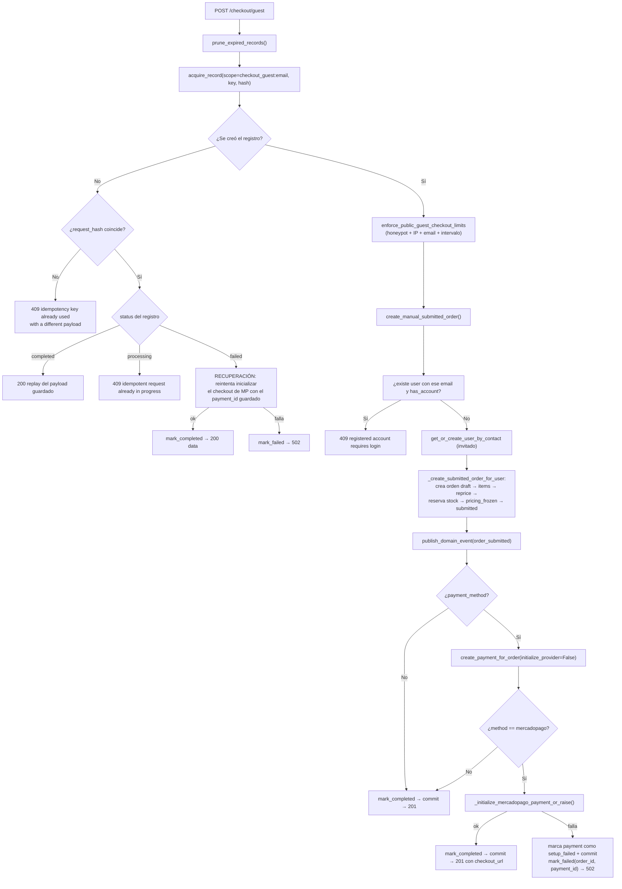
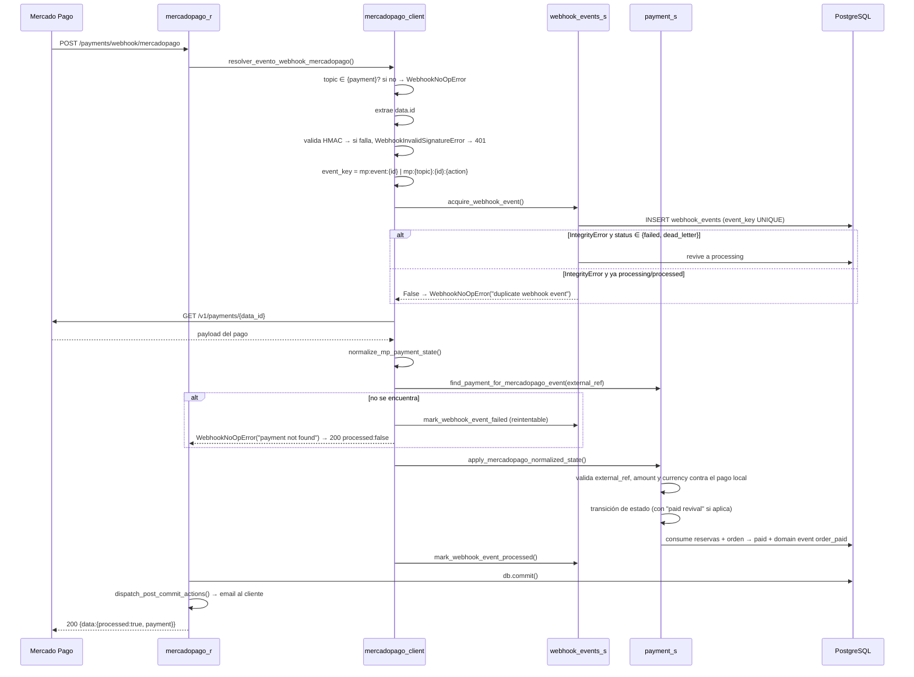

# 07 — API

← [06 Panel Admin](06_PanelAdmin.md) | [Índice](README.md) | Siguiente: [08 Base de Datos](08_BaseDatos.md) →

---

## 1. Convenciones generales

### Envoltorio de respuesta

**Toda** respuesta exitosa devuelve un objeto con clave `data`, y opcionalmente `meta`:

```json
{ "data": { ... }, "meta": { "total": 42, "limit": 24, "offset": 0, "has_more": true } }
```

El frontend desenvuelve esto en la capa `services/*-api.ts` (`response.data.data`), de modo que los hooks nunca
ven el envoltorio.

### Respuesta de error

FastAPI estándar:

```json
{ "detail": "mensaje legible" }
```

Para errores de validación de Pydantic (422), `detail` es un **array** de objetos; el frontend lo aplana en
`http-errors.ts:56-69`.

### Autenticación

| Mecanismo | Detalle |
|---|---|
| Transporte | Cookies **HttpOnly**: `pb_at` (access) y `pb_rt` (refresh) |
| Algoritmo | HS256, emisor `patitasbigotes-api` |
| Vida del access | `ACCESS_TOKEN_EXPIRE_MINUTES` (120 por defecto) |
| Vida del refresh | `REFRESH_TOKEN_EXPIRE_DAYS` (30 por defecto), path acotado a `/auth` |
| Claims del access | `sub`, `type=access`, `is_admin`, `tv` (token_version), `iss`, `iat`, `exp` |
| Renovación | `POST /auth/refresh` — **rotativo**: emite par nuevo e invalida el anterior |
| No hay `Authorization: Bearer` | Salvo en `POST /internal/maintenance/run`, que usa bearer con un token estático |

### Niveles de acceso

| Nivel | Dependencia | Qué comprueba |
|---|---|---|
| 🌐 Público | ninguna | — |
| 🔑 Autenticado | `Depends(get_current_user)` | Cookie válida + `tv` coincide con `users.token_version` |
| 👑 Admin | `Depends(require_admin)` | Lo anterior + `users.is_admin` **releído de la DB**, no del claim |
| 🎫 Token público | parámetro `public_status_token` | Capability token de 32 bytes; no requiere sesión |
| 🤖 Máquina | header `Authorization: Bearer` | `secrets.compare_digest` contra `MAINTENANCE_RUN_TOKEN` |
| ✍️ Firma HMAC | headers `x-signature` + `x-request-id` | HMAC-SHA256 del manifiesto, ventana de 300 s |

> 🔒 `require_admin` **no confía en el claim `is_admin` del JWT**: vuelve a leer el usuario de la base
> (`auth_d.py:75-86`). Así, revocar admin surte efecto inmediato aunque el token siga vigente.

### Middlewares aplicados a toda request

Orden de ejecución (Starlette aplica en orden inverso al registro; `main.py:29-37`):

```
Request  → CSRFMiddleware → CORSMiddleware → SecurityHeadersMiddleware → Router
Response ← CSRFMiddleware ← CORSMiddleware ← SecurityHeadersMiddleware ← Router
```

| Middleware | Qué hace | Exenciones |
|---|---|---|
| `SecurityHeadersMiddleware` | `X-Frame-Options: DENY`, `X-Content-Type-Options: nosniff`, `Referrer-Policy`, CSP `default-src 'self'; frame-ancestors 'none'`, HSTS si las cookies son `Secure` | CSP omitida en `/docs`, `/redoc`, `/openapi.json` |
| `CORSMiddleware` | `allow_origins` desde `CORS_ALLOW_ORIGINS`, `allow_credentials=True`, métodos y headers `*` | — |
| `CSRFMiddleware` | Para `POST/PUT/PATCH/DELETE`: exige `Origin` **o** `Referer` en la allowlist; si no, `403 csrf origin check failed` | `/payments/webhook/mercadopago`, `/internal/maintenance/run` |

### Mapeo de errores

Único punto de traducción: `source/errors.py:raise_http_error_from_exception`. Todos los routers hacen
`except Exception as exc: raise_http_error_from_exception(exc, db=db)`.

| Excepción | HTTP | Cuándo |
|---|---|---|
| `HTTPException` | *(se re-lanza tal cual)* | Ya decidido aguas arriba |
| `LookupError` | **404** | Entidad no encontrada |
| `OrderStatusTransitionError` | **409** | Transición de orden inválida |
| `PaymentRetryConflictError` | **409** | Reintento de pago no permitido |
| `RegisteredAccountCheckoutConflictError` | **409** | Checkout guest con email de cuenta registrada |
| `WebhookReplayConflictError` | **409** | Replay desde un estado no permitido |
| `ValueError` | **400** | Violación de regla de negocio |
| `PaymentProviderValidationError` | **400** | El proveedor rechazó el payload |
| `PaymentCheckoutInitializationError` | **502** | El pago se persistió pero el checkout falló |
| `PaymentProviderAuthError` | **502** | Credenciales del proveedor rechazadas |
| `PaymentProviderTimeoutError` | **504** | Timeout del proveedor |
| `PaymentProviderUnavailableError` | **503** | Proveedor caído o SDK ausente |
| `IntegrityError` | **409** | `database constraint violation` |
| `SQLAlchemyError` | **500** | `database error` |
| *(cualquier otra)* | **500** | `internal server error` |

> ⚠️ **Consecuencia de diseño:** como `ValueError` → 400 de forma global, cualquier `int("abc")` accidental en un
> servicio se convierte en un 400 con un mensaje interno como *"invalid literal for int()"*. Es una fuga de
> detalle de implementación hacia el cliente. Ver [11_Seguridad.md](11_Seguridad.md#exposición-de-detalles).

### Idempotencia

| Endpoint | Header | Scope | Comportamiento |
|---|---|---|---|
| `POST /checkout/guest` | `Idempotency-Key` **obligatorio** | `checkout_guest:{email}` | Replay del `data` si `completed`; **recuperación** si `failed`; 409 si `processing`; 409 si el hash del payload difiere |
| `POST /admin/sales` | `Idempotency-Key` opcional | `admin_sales:{admin_id}` | Replay si `completed`; 409 si `processing` |
| `POST /orders/{id}/payments` | `Idempotency-Key` **obligatorio** | — (vía `payments.idempotency_key`) | Devuelve el pago existente |
| `POST /orders/{id}/payments/retry` | `Idempotency-Key` **obligatorio** | ídem | ídem |
| `POST /payments/{token}/retry` | `Idempotency-Key` **obligatorio** | ídem | ídem |

---

## 2. Catálogo de endpoints (77)

### 2.1 Salud

#### `GET /health` 🌐
- **Archivo:** `main.py:53`
- **Response:** `{"status": "ok"}`
- **Uso:** `healthCheckPath` de Render (`render.yaml:20`).
- ⚠️ Es un health check **superficial**: no verifica la base de datos.

---

### 2.2 Storefront público — `storefront_r.py`

#### `GET /storefront/categories` 🌐
| | |
|---|---|
| **Response** | `{data: [{id, name}], meta: {total}}` |
| **Servicio** | `products_storefront_s::list_storefront_categories` → `products_s::list_categories` |
| **Tablas** | lee `categories` |

#### `GET /storefront/products` 🌐
| | |
|---|---|
| **Query** | `category_id?:int`, `q?:str(min 1)`, `min_price?:int≥0`, `max_price?:int≥0`, `sort_by:price\|name=name`, `sort_order:asc\|desc=desc`, `limit:1..100=24`, `offset:int≥0=0` |
| **Validación previa** | `min_price > max_price` → **400** `min_price must be less than or equal to max_price` |
| **Response** | `{data: StorefrontProduct[], meta: {total, limit, offset, has_more, filters_applied}}` |
| **Servicio** | `products_storefront_s::list_storefront_products` |
| **Tablas** | `products`, `product_variants`, `categories`, `discounts`, `discount_products` |

**Flujo interno destacado** (`products_storefront_s::list_storefront_products`): construye una subquery de agregados
(`MIN(price)`, `SUM(stock)`, `COUNT(id)`) sobre variantes activas, filtra, y luego decide:

- ⚡ Si `sort_by='name'` y no hay filtros de precio → **pagina en SQL** (`OFFSET/LIMIT`).
- ⚡ Si hay `min_price`/`max_price` o `sort_by='price'` → **trae todas las filas** y filtra/ordena/pagina en Python,
  porque el precio final con descuento solo es computable en Python. Comentado explícitamente en el código
  (`products_storefront_s::list_storefront_products`). Ver [12_Performance.md](12_Performance.md#storefront).

#### `GET /storefront/products/{product_id}` 🌐
| | |
|---|---|
| **Response** | `StorefrontProductDetail`: producto + `option_axis` (`size`\|`color`\|`variant`) + `options[]` + `variants[]` (compatibilidad) |
| **Errores** | **404** si no existe **o si no tiene variantes activas** |
| **Servicio** | `products_storefront_s::get_storefront_product_by_id` |

`option_axis` se infiere: si alguna variante activa tiene `size` → `"size"`; si no, si tiene `color` → `"color"`;
si no → `"variant"` (`products_storefront_s::_storefront_option_axis`). Esto le dice al frontend cómo etiquetar el selector.

---

### 2.3 Autenticación — `auth_r.py`

#### `POST /auth/login` 🌐
| | |
|---|---|
| **Body** | `LoginRequest{email:EmailStr, password:str}` — `extra="forbid"` |
| **Response** | `{data:{logged_in:true, access_expires_in_seconds, access_expires_in_minutes}}` + **Set-Cookie** `pb_at`, `pb_rt` |
| **Errores** | **429** rate limit · **403** `email not verified` · **401** `invalid credentials` |
| **Sesión** | `get_db_transactional` |

**Flujo interno:**
1. `enforce_login_rate_limit(email, ip)` — lee `auth_login_throttles` para scopes `email` e `ip`; si alguno tiene
   `blocked_until > now` → `LoginRateLimitExceededError` → 429.
2. `authenticate_user` — busca por email normalizado; valida `has_account`, `email_verified_at is not None`, y
   `verify_password`.
3. `clear_login_failures` — resetea ambos contadores.
4. `issue_token_pair` — firma access + refresh, hace upsert de `user_refresh_sessions`.
5. `set_auth_cookies` — escribe ambas cookies con `HttpOnly`, `Secure` y `SameSite` según config.

🔒 En cualquier fallo se llama `register_login_failure` y **se hace `db.commit()` explícito** antes de lanzar el
error (`auth_r.py:100`, `auth_r.py:112`), para que el contador persista pese al 401.

🔒 El mensaje es idéntico para *usuario inexistente* y *password incorrecta* → no hay enumeración de usuarios.
⚠️ **Pero sí la hay indirectamente** vía el 403 `email not verified`, que solo puede darse si el email existe.

#### `POST /auth/refresh` 🌐 (requiere cookie `pb_rt`)
| | |
|---|---|
| **Response** | `{data:{refreshed:true, access_expires_in_seconds, access_expires_in_minutes}}` + cookies nuevas |
| **Errores** | **401** si falta la cookie · **404** si no hay sesión (`LookupError`) · **400** si el token es inválido o expiró |

**Rotación:** valida `token_hash` **y** `token_jti` contra `user_refresh_sessions`, incrementa
`users.token_version` y emite un par nuevo (`auth_s.py:134-158`). El access token anterior queda muerto al instante.

#### `POST /auth/logout` 🌐 (requiere cookie `pb_rt`)
Valida el refresh, incrementa `token_version`, **borra** la fila de `user_refresh_sessions` y limpia las cookies.

#### `POST /auth/register` 🌐 → **201**
| | |
|---|---|
| **Body** | `RegisterRequest{first_name(1..80), last_name(1..80), email:EmailStr, password(min 8)}` |
| **Response** | `{data:{registered:true}}` |
| **Errores** | **429** anti-abuso · **409** `email already exists` · **400** política de password |

**Política de password** (`auth_security_s.py:32-38`): mínimo 8 caracteres **y** al menos un carácter que no sea
alfanumérico ni espacio.

**Caso especial — "upgrade de invitado"** (`users_s.py:76-88`): si ya existe un `users` con ese email pero
`has_account=false` (un invitado que compró antes), el registro **completa esa fila** en lugar de crear otra,
preservando su historial de órdenes. Muy buena decisión de producto.

#### `POST /auth/email/verify/request` 🌐 · `POST /auth/email/verify/confirm` 🌐
- `request`: aplica anti-abuso, y **solo si** el usuario existe, tiene cuenta y no está verificado, genera token
  y manda email. **Siempre responde `{requested:true}`** → no filtra existencia. 🔒
- `confirm`: `consume_one_time_token(action='email_verify')` → setea `email_verified_at`.
  Errores: **400** `invalid token` / `token already used` / `token expired`.

#### `POST /auth/password/reset/request` 🌐 · `POST /auth/password/reset/confirm` 🌐
- `request`: mismo patrón de respuesta opaca. Solo emite si el usuario existe, tiene cuenta y **está verificado**.
- `confirm`: valida la política **antes** de consumir el token (`auth_r.py:313`), luego
  `set_user_password_and_invalidate_sessions` → cambia el hash, incrementa `token_version` y **borra la sesión de
  refresh**. Todas las sesiones caen.

#### `POST /auth/password/change` 🔑
| | |
|---|---|
| **Body** | `{current_password(min 1), new_password(min 8)}` |
| **Errores** | **400** `current password is invalid` o política incumplida |

Verifica la password actual, valida la nueva y reutiliza `set_user_password_and_invalidate_sessions`
→ **cierra la sesión propia también**. ⚠️ El frontend debe manejar el 401 subsiguiente.

#### `GET /auth/me` 🔑
Devuelve `MyProfile`: `{id, first_name, last_name, email, phone, has_account, is_admin, email_verified,
email_verified_at, created_at}`. Es el endpoint que usa `AuthProvider` para bootstrapear la sesión.

#### `PATCH /auth/me` 🔑
| | |
|---|---|
| **Body** | `UpdateMyProfileRequest{first_name, last_name, phone(6..30), email:EmailStr}` |
| **Response** | `{data: MyProfile, meta:{verification_email_sent: bool}}` |
| **Errores** | **409** `email already exists` |

Si el email cambia: pone `email_verified_at = NULL`, genera token de verificación y manda el correo
(`auth_s.py:299-320`). ⚠️ **El usuario queda sin poder loguearse** hasta reverificar, porque
`authenticate_user` exige `email_verified_at`. La sesión actual sigue viva hasta que expire.

---

### 2.4 Checkout y órdenes — `orders_r.py`

#### `POST /checkout/guest` 🌐 → **201**
El endpoint más complejo del sistema (157 líneas de router).

| | |
|---|---|
| **Header** | `Idempotency-Key` **obligatorio** |
| **Body** | `PublicGuestCheckoutRequest{customer{email,first_name,last_name,phone}, items[1..20]{variant_id, quantity 1..10}, website?(max_length=0), payment_method?}` |
| **Response** | `{data:{customer, order, payment?, meta{user_created}}}` |
| **Errores** | **409** clave reutilizada con otro payload / request en curso / `registered account requires login` · **429** anti-abuso · **400** honeypot o validaciones · **502** checkout de MP no disponible |

**Flujo interno completo:**



🔒 **Honeypot:** el campo `website` tiene `max_length=0`, así que Pydantic rechaza cualquier valor; además
`enforce_public_guest_checkout_limits` vuelve a comprobarlo (`anti_abuse_s.py:149-153`). Doble defensa contra bots.

🔒 **`_sanitize_response_payload`** (`orders_r.py:76-89`) redacta claves que contengan `token`, `secret`, `access`,
`password`, `card`, `cvv` o `number` antes de persistir un payload de error en `idempotency_records`.
⚠️ Solo se aplica en `/admin/sales`, **no** en `/checkout/guest`.

#### `GET /orders/draft` 🔑 · `POST /orders/draft` 🔑 · `PUT /orders/draft/items` 🔑

| Endpoint | Response | Notas |
|---|---|---|
| `GET /orders/draft` | `{data: Order}` o **404** `Draft order not found` | Solo lectura |
| `POST /orders/draft` | `{data: Order, meta:{created}}`; **201** si se creó, **200** si ya existía | `get_or_create_draft_order` |
| `PUT /orders/draft/items` | `{data: Order}` | **Reemplaza** todos los ítems; agrega cantidades del mismo `variant_id` |

`replace_draft_order_items` (`orders_s::replace_draft_order_items`): toma la orden draft con `FOR UPDATE`, valida que todas las
variantes existan y estén activas (**404**/400 con `variant N not found`), borra los ítems anteriores, inserta
los nuevos con precio de lista **sin descuento**, y luego llama `_recalculate_order_total` que aplica el mejor
descuento vigente.

#### `PATCH /orders/{order_id}/status` 🔑
| | |
|---|---|
| **Body** | `UpdateOrderStatusRequest{status: draft\|submitted\|cancelled}` — nótese que **`paid` no es un valor aceptado** |
| **Errores** | **404** orden no encontrada · **409** transición inválida · **400** `cannot leave draft with an empty order`, `insufficient stock for variant N` |

**Flujo `draft → submitted`** (`orders_s::change_order_status`):
1. `_recalculate_order_total(force=True)` — reprecia con los descuentos vigentes **ahora**.
2. `validate_order_pricing_before_submit` — rechaza orden vacía o total negativo.
3. `reserve_stock_for_submitted_order` — reserva stock de cada ítem; si falta, **400** y rollback.
4. Setea `pricing_frozen=True`, `pricing_frozen_at`, `submitted_at`.
5. `publish_domain_event("order_submitted")` → notificación para admin.

**Flujo `submitted → cancelled`:** libera reservas con `reason='order_cancelled'`, setea `cancelled_at`, publica
`order_cancelled`.

> ⚠️ El parámetro `is_admin` permite a un admin cambiar el estado de **cualquier** orden (`orders_s::change_order_status`).
> Pero el router lo toma de `current_user.get("is_admin")`, que viene del **claim del JWT**, no de la DB, porque
> este endpoint usa `get_current_user` y no `require_admin`. Ver [11_Seguridad.md](11_Seguridad.md#is_admin-del-claim).

#### `GET /orders/{order_id}` 🔑 · `GET /orders` 🔑
- Ambos filtran por `user_id` de la sesión. **404** si la orden es de otro usuario (no 403 — evita enumeración 🔒).
- `GET /orders?include_payments=true` devuelve `{orders, payments_by_order_id}` en una sola llamada.

#### `GET /orders/{order_id}/reservations` 🔑
Lista todas las reservas de la orden. ⚠️ Usa `get_db_transactional` porque **expira reservas vencidas antes de
listar** (comentado en `orders_r.py:730-732`).

#### `GET /public/orders/by-payment-token` 🎫 {#public-order-snapshot}
| | |
|---|---|
| **Query** | `public_status_token: str` |
| **Response model** | `dict[str, PublicOrderSnapshotResponse]` — **el único endpoint con `response_model`** |
| **Errores** | **400** token vacío o >255 chars · **404** `payment not found` / `order not found` |

Devuelve el snapshot que consume la pantalla de retorno de pago:

```json
{"data": {
  "order":   {"status","total_amount","currency","items":[{"product_name","variant_label","quantity","line_total"}]},
  "payment": {"method","status","amount","currency","checkout_url"},
  "flags":   {"can_continue_payment","can_retry_payment","is_order_open","is_payment_terminal"},
  "blocking_reason": "order_paid|order_cancelled|payment_pending|payment_not_retryable|stock_reservation_expired|checkout_unavailable|null"
}}
```

**Lógica de los flags** (`orders_public_s::get_public_order_snapshot_by_payment_token`) — esta es la pieza que decide qué botón ve el usuario:

| Flag / campo | Condición |
|---|---|
| `can_continue_payment` | orden `submitted` **y** pago relevante `pending` **y** método `mercadopago` **y** hay `checkout_url` válida |
| `can_retry_payment` | el pago **del token** está `cancelled`/`expired` **y** la orden sigue `submitted` **y** no hay otro pago pendiente continuable |
| `blocking_reason` | se calcula solo si ninguno de los dos anteriores es cierto; distingue `stock_reservation_expired` de `order_cancelled` consultando si existe alguna reserva con `reason='reservation_expired'` |

🔒 `orders_public_s::_extract_public_checkout_url` revalida que la URL sea **HTTPS** y que el host esté en
`MERCADOPAGO_ALLOWED_CHECKOUT_HOSTS` antes de exponerla. Defensa contra un payload envenenado en la base.

---

### 2.5 Pagos — `orders_r.py` + `payments_r.py`

#### `POST /orders/{order_id}/payments` 🔑 → **201**
| | |
|---|---|
| **Header** | `Idempotency-Key` obligatorio |
| **Body** | `CreateOrderPaymentRequest{method: bank_transfer\|mercadopago\|cash, currency?: "ARS", expires_in_minutes: 1..1440 = 60}` |
| **Errores** | **404** orden ajena o inexistente · **400** orden no `submitted`, vacía, sin reservas activas, total ≤ 0, moneda ≠ ARS, clave reusada con otro método/orden · **409** conflicto de constraint · **502/503/504** proveedor |

**Precondiciones que valida `create_payment_for_order`** (`payment_s::create_payment_for_order`), en orden:
1. `method ∈ {bank_transfer, mercadopago, cash}`
2. `expires_in_minutes > 0`
3. `idempotency_key` no vacía
4. `currency` es `ARS` o `None`
5. Si la clave ya existe → devuelve ese pago (validando que sea de la misma orden, método y usuario)
6. Orden con `FOR UPDATE`; debe pertenecer al usuario
7. `status != 'cancelled'` y `status == 'submitted'`
8. La orden tiene ítems
9. **La orden tiene reservas de stock activas** ← si vencieron, no se puede pagar
10. `total_amount > 0`

Luego, si ya hay un pago `pending` compatible del mismo método, lo devuelve (validando importe y moneda
idénticos, `payment_core_s::find_active_pending_payment`).

**Diferencias por método:**
- `cash` → `expires_at = NULL` (no vence).
- `bank_transfer` → `provider_payload` con instrucciones estáticas (alias `patitas.bigotes`, banco demo, referencia
  `ORDER-{n}-PAY-{m}`) — `payment_core_s::build_bank_transfer_payload`.
- `mercadopago` → crea preferencia en el proveedor y guarda `preference_id`, `external_ref`, `checkout_url`.

**Manejo del fallo de proveedor** (`orders_r.py:92-124`): si `initialize_mercadopago_checkout_for_payment` falla,
marca el pago con `provider_status='setup_failed'` y hace **commit de eso** antes de lanzar
`PaymentCheckoutInitializationError` → 502. Así el pago no se pierde y el usuario puede reintentar.

#### `POST /orders/{order_id}/payments/retry` 🔑 → **201** {#retry-order-payment}
Mismo body y header. Precondiciones adicionales (`payment_s::_guard_order_retryable`), con mensajes que el frontend traduce:

| Condición | `detail` |
|---|---|
| Orden cancelada por reserva vencida | `retry not allowed: order cancelled because stock reservation expired` |
| Orden cancelada | `retry not allowed: order cancelled` |
| Orden ya pagada | `retry not allowed: order already paid` |
| Orden no `submitted` | `retry not allowed: order is no longer submitted` |
| Sin reservas activas | `retry not allowed: stock reservation expired` |
| Último intento no está `cancelled`/`expired` ni es un `pending` con `setup_failed` | `retry not allowed: payment state changed` |
| Falla el checkout de MP | **502** `retry failed: mercadopago checkout unavailable` |

Todos estos mensajes tienen traducción a español en `frontend/src/services/http-errors.ts:120-146`.

#### `POST /payments/{public_status_token}/retry` 🎫 → **201**
Igual que el anterior pero **sin autenticación**: el capability token identifica el pago. Fuerza
`method='mercadopago'` y `currency='ARS'`. Es lo que permite al invitado reintentar desde la pantalla de retorno.

#### `GET /orders/{order_id}/payments` 🔑 · `GET /payments/{payment_id}` 🔑
Listados filtrados por propiedad de la orden. **404** si no corresponde al usuario.

#### `GET /payments/public/status` 🎫
| | |
|---|---|
| **Query** | `public_status_token` |
| **Response** | `{data:{order_status, status, updated_at, paid_at}}` |

Versión mínima del snapshot. ⚠️ Existe en el frontend (`fetchPublicPaymentStatus`) pero **ya no se usa**: la
pantalla de retorno migró a `/public/orders/by-payment-token`. Candidato a eliminación.

#### `POST /admin/orders/{order_id}/payments/manual` 👑
| | |
|---|---|
| **Body** | `AdminRegisterPaymentRequest{method: cash\|bank_transfer, paid_amount>0, change_amount?≥0, payment_ref?}` |
| **Response** | `{data:{order, payment}}` |
| **Errores** | **404** orden no encontrada · **400** validaciones de importe · **409** |

**Reglas de importe** (`payment_s::confirm_manual_payment_for_order`):
- `cash`: `paid_amount − change_amount == total_amount` (permite cobrar de más y dar vuelto).
  `change_amount` es **obligatorio**.
- `bank_transfer`: `paid_amount == total_amount` exacto. `change_amount` debe ser `NULL`.
  `payment_ref` es **obligatorio**.

⚠️ Usa `allow_create_if_missing=False`: **exige que ya exista un pago `pending`** de ese método. Si el cliente
eligió Mercado Pago y luego paga por transferencia, este endpoint falla con
`pending payment not found for order and method`.

**Emails:** este endpoint usa el patrón manual (`get_db` + `db.commit()` + `dispatch_post_commit_actions`) para
que el email de "orden pagada" salga **después** del commit (`orders_r.py:575-580`).

#### `POST /admin/sales` 👑 {#admin-sales}
| | |
|---|---|
| **Header** | `Idempotency-Key` opcional |
| **Body** | `CreateAdminSaleRequest{customer{mode: existing\|new, ...}, items[≥1], register_payment: bool, payment?}` |
| **Response** | `{data:{customer, order, payment?, meta{customer_created, payment_registered, order_paid_email_suppressed}}}` |

Crea orden **y** cobro en un solo paso, para venta de mostrador.

**Validaciones de `customer`** (`orders_s::create_admin_sale`):
- `mode='existing'` → requiere `user_id`; **prohíbe** enviar cualquier otro campo del cliente
  (`customer.{field} is not allowed when mode is existing`).
- `mode='new'` → requiere `first_name`, `last_name`, `email` y `phone`; `dni` opcional.

**Supresión de email:** usa `set_skip_order_paid_email(db, True)` alrededor de la confirmación
(`orders_s::create_admin_sale`) porque el cliente está **físicamente presente**; mandarle un email de "tu orden fue
pagada" sería ruido. El flag se restaura en un `finally`. Excelente atención al detalle.

Aquí sí se usa `allow_create_if_missing=True`, porque la orden acaba de nacer y no tiene pago pendiente.

---

### 2.6 Incidencias y reembolsos — `payments_r.py`

#### `GET /admin/payments` 👑 · `GET /admin/payments/bank-transfer/pending` 👑
| | |
|---|---|
| **Query (`/admin/payments`)** | `status?: pending\|paid\|cancelled\|expired`, `limit: 1..500 = 10`, `sort_by: created_at\|id`, `sort_dir: asc\|desc` |
| **Enriquecimiento** | Cada pago suma `order_status`, `user_id`, `has_open_incident`, `incident_status` |

⚡ El enriquecimiento evita N+1: hace **una** query de incidencias abiertas por lote de `payment_ids`
(`payment_admin_queries_s.py:15-29`).

#### `GET /admin/payment-incidents` 👑
`status?` (default `"pending_review"`), `limit: 1..500 = 100`. Cada incidencia incluye subobjetos `payment` y
`order` resumidos.

#### `POST /admin/payment-incidents/{id}/resolve-refund` 👑 → **201** {#resolve-refund}
| | |
|---|---|
| **Body** | `{amount?: int>0, reason: str(1..500)}` — sin `amount` reembolsa el total |
| **Response** | `{data:{incident, refund}}` |
| **Errores** | **404** · **400** `only mercadopago payments can be refunded`, `only paid payments can be refunded`, `refund amount cannot exceed payment amount`, `payment already has an active refund`, `payment incident is already resolved`, `missing mercadopago provider payment id` · **502/503/504** proveedor |

**Flujo** (`refund_s.py:222-378`):
1. Incidencia con `FOR UPDATE`. Si ya está `resolved_refunded`, devuelve el refund existente (**idempotente**).
2. Valida método `mercadopago`, estado `paid`, importe.
3. Verifica que no exista otro refund activo del mismo pago.
4. `INSERT payment_refunds` con `status='requested'` e `idempotency_key` derivada.
5. Extrae `provider_payment_id` de `payment.provider_payload` (busca en `reconciliation.provider_payment_id`,
   luego en `payment_lookup.id`).
6. Llama `create_refund` del SDK. ⚠️ Convierte centavos a decimal: `float(amount)/100.0`.
7. Éxito → `approved` + incidencia `resolved_refunded`.
8. Fallo → `status='failed'`, **`db.commit()` propio** y re-lanza. El commit dentro del `except` está
   comentado en el código (`refund_s.py:352-355`): sin él, el rollback del wrapper transaccional borraría el
   registro del intento fallido.

#### `POST /admin/payment-incidents/{id}/resolve-no-refund` 👑
`{reason: str(1..500)}` → marca `resolved_no_refund` con `resolved_at` y `resolved_by_user_id`.

---

### 2.7 Webhook de Mercado Pago — `mercadopago_r.py`

#### `POST /payments/webhook/mercadopago` ✍️
| | |
|---|---|
| **Headers** | `x-signature: ts=...,v1=...`, `x-request-id` |
| **Body** | `dict` libre (payload de MP) |
| **Exento de CSRF** | Sí (`csrf_d.py:13`) |
| **Response** | `{data:{processed: bool, payment?}}` o `{data:{processed:false, reason}}` |
| **Errores** | **401** `invalid signature` · **503** `mercadopago webhook processing failed` |

**Validación de firma** (`mercadopago_d.py:38-68`):
```
manifest = f"id:{data_id};request-id:{request_id};ts:{ts};"
expected = HMAC-SHA256(secret, manifest).hexdigest()
compare_digest(expected.lower(), v1.lower())
```
Además rechaza `ts` anterior a `now − MERCADOPAGO_WEBHOOK_MAX_AGE_SECONDS` (300 s) o posterior a `now + 60`
(tolerancia de reloj). 🔒 Defensa anti-replay correcta.

**Flujo completo:**



**Distinción clave** (`mercadopago_client.py:410-423`): un `WebhookNoOpError` con mensaje `"payment not found"`
se marca como **failed** (reintentable — puede ser una carrera donde el pago aún no se creó); cualquier otro no-op
(topic no soportado, duplicado) se marca como **processed** para no reintentar eternamente.

⚠️ El endpoint devuelve **503** ante error genérico, lo que hace que Mercado Pago reintente. Combinado con la cola
interna de reintentos, un evento problemático puede procesarse por dos caminos. La idempotencia por `event_key`
lo cubre.

#### `POST /admin/webhooks/mercadopago/replay` 👑
`{event_key: str(1..255)}`. Solo permite replay desde `failed` o `dead_letter`
(**409** `WebhookReplayConflictError` si no). Devuelve `{event_key, previous_status, new_status, processed,
reason, payment}`.

---

### 2.8 Catálogo admin — `products_r.py`

> 👑 **Todos** los endpoints de este router exigen admin, incluidos los `GET`. El catálogo público vive en
> `/storefront/*`.

| Método | Ruta | Body | Notas |
|---|---|---|---|
| `GET` | `/products` | — | Query: `min_price`, `max_price`, `category`, `sort_by`, `sort_order`, `include_variants`, `limit` (tope 1000) |
| `GET` | `/admin/catalog` | — | Devuelve `{categories, products, variants_by_product}` en **una** llamada (`limit` default 200, tope 1000) |
| `GET` | `/products/{id}` | — | 404 si no existe |
| `POST` | `/products` | `CreateProductRequest{name(1..120), description?(≤1000), img_url?(≤2048), category(1..80), active=true}` | ⚠️ `active` se acepta pero **se ignora** en `create_product` |
| `PUT` | `/products/{id}` | `UpdateProductRequest` — todos los campos obligatorios | Reemplazo total |
| `PATCH` | `/products/{id}` | `PatchProductRequest` — todos opcionales | **400** si no se envía ningún campo |
| `DELETE` | `/products/{id}` | — | **Borrado físico** con cascada a variantes |
| `GET/POST/PUT/PATCH/DELETE` | `/categories[/{id}]` | `{name(1..80)}` | **400** `category already exists` si el nombre se repite |
| `GET` | `/variants/{id}` | — | Query `include_inactive` (default `true`) |
| `POST` | `/variants` | `CreateVariantRequest{product_id>0, sku(1..80), size?, color?, img_url?, price>0, stock≥0, active=true}` | **400** `variant sku already exists` |
| `PUT/PATCH` | `/variants/{id}` | ídem | `PATCH` requiere ≥1 campo |
| `DELETE` | `/variants/{id}` | — | Borrado físico |

⚠️ **`update_product` con `active`** propaga el flag a **todas** las variantes del producto
(`products_s::update_product`). Desactivar un producto desactiva todo su surtido; reactivarlo reactiva todo, incluidas
variantes que estaban desactivadas individualmente. Pérdida de información silenciosa.

⚠️ `DELETE /products/{id}` falla con **409** si el producto tiene `order_items` (por `ondelete=RESTRICT`).
El mensaje que llega al usuario es el genérico `database constraint violation`.

---

### 2.9 Descuentos — `discounts_r.py` 👑 {#discounts}

| Método | Ruta | Notas |
|---|---|---|
| `GET` | `/discounts` | Lista todos, con `product_ids` resueltos |
| `POST` | `/discounts` → 201 | `CreateDiscountRequest` |
| `PATCH` | `/discounts/{id}` | Merge sobre el actual; revalida el resultado completo |
| `DELETE` | `/discounts/{id}` | Borrado físico; los `order_items` conservan `discount_amount` |

**Validaciones de `_validate_discount_payload`** (`discount_s.py:206-257`):

| Regla | Error |
|---|---|
| `name` no vacío | `name is required` |
| `type ∈ {percent, fixed}` | `invalid discount type` |
| `scope ∈ {all, category, product, product_list}` | `invalid discount scope` |
| `percent` entre 1 y 100 | `percent discount must be between 1 and 100` |
| `starts_at <= ends_at` | `starts_at must be before or equal to ends_at` |
| `scope=all` → `category_id` y `product_id` nulos | `category_id and product_id must be null for all scope` |
| `scope=category` → `category_id` presente y existente | `category_id is required/does not exist for category scope` |
| `scope=product` → `product_id` presente y existente | ídem |
| `scope=product_list` → `product_ids` no vacío | `product_ids is required for product_list scope` |

Reforzado en la base por el `CHECK ck_discounts_scope_target_consistency` (`models.py:597-608`).

---

### 2.10 Usuarios — `users_r.py` 👑

| Método | Ruta | Notas |
|---|---|---|
| `GET` | `/users/search` | Query: `email`, `dni`, `first_name`, `last_name`, `phone`, `limit` (tope 100). **400** si no se envía ningún filtro |
| `POST` | `/admin/users` → 201 | Crea un admin con `email_verified_at = now` (no necesita verificar). **409** si el email existe |
| `POST` | `/admin/users/{id}/revoke-admin` | **400** `cannot revoke own admin status` · **409** `user is not admin`. Incrementa `token_version` y borra la sesión → el ex-admin pierde acceso al instante 🔒 |
| `POST` | `/users/resolve` | `get_or_create_user_by_contact` — **409** si los datos de contacto no coinciden con un usuario existente de ese email |

Búsqueda: `email` es igualdad exacta (normalizada a minúsculas), `dni` es exacto,
`first_name`/`last_name`/`phone` usan `LIKE %valor%`.

---

### 2.11 Turnos — `turns_r.py`

| Método | Ruta | Auth | Body | Notas |
|---|---|---|---|---|
| `POST` | `/turns` | 🔑 | `{scheduled_at?: datetime, notes?: str(≤1000)}` | **400** `turns are only available from monday to friday`, `turn hour must be between 13:00 and 20:00` |
| `GET` | `/admin/turns` | 👑 | — | `status?`, `limit: 1..200 = 50` |
| `PATCH` | `/admin/turns/{id}/status` | 👑 | `{status: confirmed\|cancelled}` | **400** `turn status cannot be changed from current state` (solo desde `pending`) |

Zona horaria de negocio: `America/Argentina/Buenos_Aires` (`turns_s.py:10`). Un `scheduled_at` naive se interpreta
en esa zona; uno con tz se convierte a ella antes de validar.

---

### 2.12 Notificaciones — `notifications_r.py` 🔑

| Método | Ruta | Notas |
|---|---|---|
| `GET` | `/notifications` | `unread_only`, `limit` (tope 200), `offset`. Devuelve `meta{total, limit, offset, has_more}` |
| `GET` | `/notifications/unread-count` | `{data:{unread_count}}` — el `Layout` lo consulta cada 30 s si la pestaña está visible |
| `POST` | `/notifications/{id}/read` | **404** si no es del usuario ni de su rol |
| `POST` | `/notifications/read-all` | `{data:{updated: n}}` |

**Filtro de visibilidad** (`notifications_s.py:80-84`): `user_id == yo` **OR** (`is_admin` **y**
`role_target == 'admin'`).

---

### 2.13 Reservas de stock — `stock_reservations_r.py` 👑

#### `POST /admin/stock-reservations/expire`
Dispara `expire_active_reservations(now)` **sin límite de lote**. Devuelve `{data:{expired_count}}`.
⚠️ Sin `limit`, sobre un backlog grande puede ser una transacción muy pesada.

---

### 2.14 Mantenimiento — `maintenance_r.py` 🤖

#### `POST /internal/maintenance/run`
| | |
|---|---|
| **Header** | `Authorization: Bearer {MAINTENANCE_RUN_TOKEN}` |
| **Exento de CSRF** | Sí |
| **Response** | `{data:{status: ok\|partial\|busy, jobs:{<nombre>:{ok, result\|error}}}}` |
| **Errores** | **503** `maintenance endpoint not configured` (token no seteado) · **401** `invalid maintenance token` |

Ejecuta **un pase de los 6 jobs**, en este orden (`maintenance_s.py:103-110`), priorizando lo que afecta al
usuario: `reconcile_pending_payments` → `reprocess_failed_webhooks` → `expire_stock_reservations` →
`idempotency_sweeper` → `prune_auth_action_tokens` → `prune_auth_login_throttles`.

🔒 Comparación del token con `secrets.compare_digest` → resistente a timing attacks.
🔒 Si el token no está configurado, el endpoint queda **deshabilitado** (503), no abierto.
⚠️ El lock es `threading.Lock` de proceso (`maintenance_s.py:39`): correcto en Render free (una instancia),
**insuficiente si se escala horizontalmente**.

---

## 3. DTOs de entrada {#dtos}

Todos los schemas usan `model_config = ConfigDict(extra="forbid")`, así que **cualquier campo desconocido
produce un 422**. 🔒 Buena defensa contra mass assignment.

Los de productos añaden `str_strip_whitespace=True` (`schemas/products_s.py:4`).

| Schema | Endpoint | Archivo |
|---|---|---|
| `LoginRequest`, `RegisterRequest`, `EmailRequest`, `TokenRequest`, `PasswordResetConfirmRequest`, `PasswordChangeRequest`, `UpdateMyProfileRequest` | `/auth/*` | `schemas/auth_s.py` |
| `ReplaceDraftItemsRequest`, `UpdateOrderStatusRequest`, `AdminRegisterPaymentRequest`, `PublicGuestCheckoutRequest`, `CreateAdminSaleRequest` | órdenes | `schemas/orders_s.py` |
| `PublicOrderSnapshotResponse` (+4 anidados) | snapshot público | `schemas/orders_s.py` |
| `CreateOrderPaymentRequest`, `AdminWebhookReplayRequest`, `PaymentIncidentResolve*Request` | pagos | `schemas/payments_s.py` |
| `Create/Update/Patch` × `Category/Product/Variant` | catálogo | `schemas/products_s.py` |
| `CreateDiscountRequest`, `UpdateDiscountRequest` | descuentos | `schemas/discounts_s.py` |
| `CreateTurnRequest`, `UpdateTurnStatusRequest` | turnos | `schemas/turns_s.py` |
| `CreateAdminUserRequest`, `ResolveUserRequest` | usuarios | `schemas/users_s.py` |
| `ReservationResponse`, `ExpireReservationsResponse` | reservas | `schemas/stock_reservations_s.py` ⚠️ **definidos pero nunca usados** |

---

## 4. Contrato OpenAPI

```bash
python backend/scripts/export_openapi.py        # → backend/openapi.json
cd frontend && npm run gen:api-types            # → src/types/api.generated.ts
```

En CI (`ci.yml`): el job `contract-schema` exporta el JSON como artifact, `frontend-tests` lo descarga, regenera
los tipos y ejecuta `git diff --exit-code src/types/api.generated.ts`. **Si alguien cambia la API sin regenerar,
el build falla.**

> ⚠️ **Limitación importante:** al no declarar `response_model` en casi ningún endpoint, el OpenAPI describe las
> respuestas como objetos genéricos. `api.generated.ts` tiene 3.992 líneas pero aporta tipado real sobre los
> **requests**, no sobre las **responses**. El frontend por eso mantiene tipos escritos a mano en
> `frontend/src/types.ts`, que pueden derivar sin que nada lo detecte.
> Ver [18_Roadmap.md](18_Roadmap.md#R-06).

---

## 5. Resumen de códigos de estado

| Código | Cuándo lo emite este sistema |
|---|---|
| **200** | Éxito general |
| **201** | `POST /auth/register`, `/checkout/guest`, `/orders/{id}/payments[/retry]`, `/payments/{token}/retry`, `/discounts`, `/admin/users`, `/admin/payment-incidents/{id}/resolve-refund`; `POST /orders/draft` solo si creó |
| **400** | `ValueError` de negocio, `PaymentProviderValidationError`, validaciones manuales del router |
| **401** | Cookie ausente/inválida, `token_version` desactualizado, firma de webhook inválida, token de mantenimiento inválido, credenciales de login |
| **403** | Sin permisos de admin, `email not verified`, `csrf origin check failed` |
| **404** | `LookupError`: recurso inexistente **o ajeno** |
| **409** | Conflictos de estado, idempotencia, unicidad |
| **422** | Validación de Pydantic (tipos, rangos, `extra="forbid"`) |
| **429** | Rate limiting de login o anti-abuso público |
| **500** | Error no clasificado o de base |
| **502** | Fallo al inicializar el checkout, credenciales del proveedor rechazadas |
| **503** | Proveedor no disponible, webhook fallido, endpoint de mantenimiento sin configurar |
| **504** | Timeout del proveedor |

---

← [06 Panel Admin](06_PanelAdmin.md) | [Índice](README.md) | Siguiente: [08 Base de Datos](08_BaseDatos.md) →
