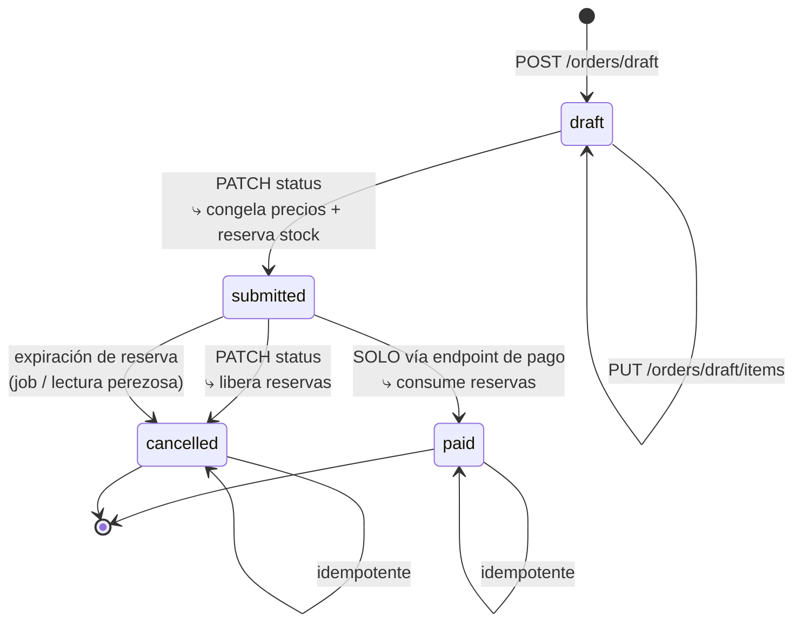
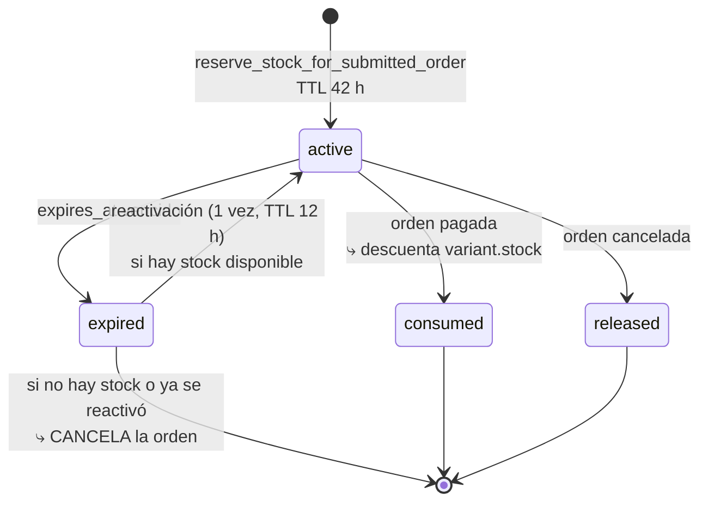
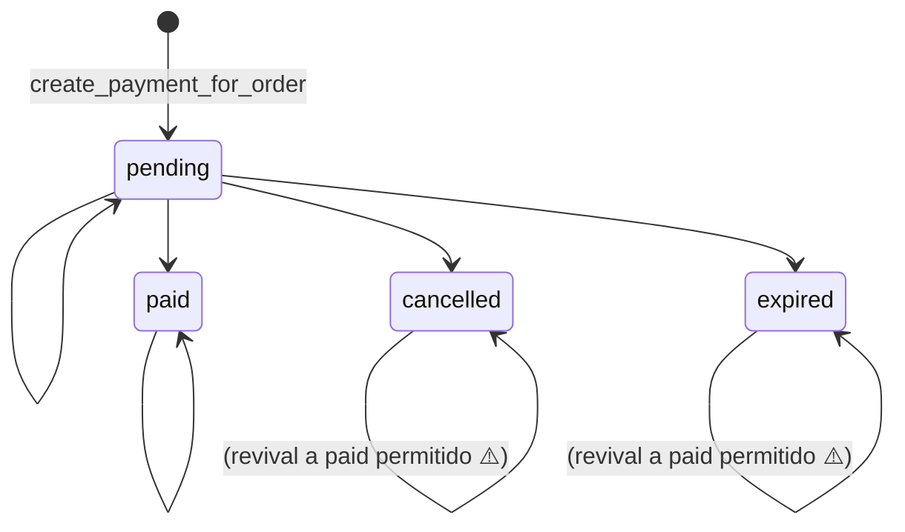

# 08 — Base de Datos

← [07 API](07_API.md) | [Índice](README.md) | Siguiente: [09 Reglas de Negocio](09_ReglasNegocio.md) →

---

## 1. Panorama

- **Motor:** PostgreSQL (Supabase en producción, SQLite en memoria para tests).
- **ORM:** SQLAlchemy 2.0.48 con `declarative_base()` clásico (no `Mapped[]` / `mapped_column`).
- **Fuente de verdad del schema:** `backend/source/db/models.py` (741 líneas, 17 modelos).
- **Migraciones:** Alembic, 3 revisiones encadenadas.
- **Estilo de modelo:** **anémico** — solo columnas, constraints y `relationship()`. Cero lógica de negocio.
- **Convención horaria:** todas las fechas son `DateTime(timezone=True)` con default `utc_now()`
  (`models.py:20`), que devuelve `datetime.now(UTC)`.
- **Convención monetaria:** todos los importes son `Integer` en **centavos**. Nunca `Float` ni `Numeric`.
  Ver [`money_s.py`](04_Backend.md#money_spy).

```python
# models.py:20-25 — helpers compartidos
def utc_now() -> datetime:
    return datetime.now(UTC)

def generate_public_status_token() -> str:
    return secrets.token_urlsafe(32)
```

---

## 2. Diagrama Entidad-Relación

```mermaid
erDiagram
    CATEGORIES  ||--o{ PRODUCTS          : "clasifica"
    CATEGORIES  ||--o{ DISCOUNTS         : "scope=category"
    PRODUCTS    ||--o{ PRODUCT_VARIANTS  : "se vende como"
    PRODUCTS    ||--o{ ORDER_ITEMS       : "aparece en"
    PRODUCTS    ||--o{ DISCOUNT_PRODUCTS : "product_list"
    PRODUCTS    ||--o{ DISCOUNTS         : "scope=product"
    PRODUCT_VARIANTS ||--o{ ORDER_ITEMS       : "es el SKU vendido"
    PRODUCT_VARIANTS ||--o{ STOCK_RESERVATIONS: "se reserva"

    USERS       ||--o{ ORDERS             : "compra"
    USERS       ||--o{ TURNS              : "solicita"
    USERS       ||--o| USER_REFRESH_SESSIONS : "tiene 1 sesión"
    USERS       ||--o{ AUTH_ACTION_TOKENS : "genera"
    USERS       ||--o{ NOTIFICATIONS      : "recibe"
    USERS       ||--o{ PAYMENT_REFUNDS    : "solicita (admin)"
    USERS       ||--o{ PAYMENT_INCIDENTS  : "resuelve (admin)"

    ORDERS      ||--o{ ORDER_ITEMS        : "contiene"
    ORDERS      ||--o{ PAYMENTS           : "se cobra con"
    ORDERS      ||--o{ STOCK_RESERVATIONS : "bloquea stock"
    ORDERS      ||--o{ PAYMENT_INCIDENTS  : "puede generar"
    ORDERS      ||--o{ PAYMENT_REFUNDS    : "puede generar"
    ORDER_ITEMS ||--o{ STOCK_RESERVATIONS : "reserva 1 activa"
    ORDER_ITEMS }o--o| DISCOUNTS          : "aplicó"

    PAYMENTS    ||--o{ PAYMENT_INCIDENTS  : "dispara"
    PAYMENTS    ||--o{ PAYMENT_REFUNDS    : "se reembolsa"
    PAYMENT_INCIDENTS ||--o{ PAYMENT_REFUNDS : "justifica"

    DISCOUNTS   ||--o{ DISCOUNT_PRODUCTS  : "lista"

    CATEGORIES {
        int    id PK
        string name UK "NOT NULL, UNIQUE"
    }

    PRODUCTS {
        int    id PK
        string name        "NOT NULL"
        string description "NULL"
        string img_url     "NULL — URL externa, no hay uploads"
        int    category_id FK "NOT NULL, ondelete RESTRICT"
    }

    PRODUCT_VARIANTS {
        int     id PK
        int     product_id FK "NOT NULL, ondelete CASCADE"
        string  sku UK   "NOT NULL, UNIQUE — identificador comercial"
        string  size     "NULL"
        string  color    "NULL"
        string  img_url  "NULL"
        int     price    "NOT NULL, CHECK >= 0 — centavos"
        int     stock    "NOT NULL, default 0 — stock FÍSICO"
        boolean is_active "NOT NULL, default true"
    }

    USERS {
        int      id PK
        string   first_name "NOT NULL"
        string   last_name  "NOT NULL"
        string   email UK   "NOT NULL, UNIQUE, index"
        string   dni        "NULL, index"
        string   phone      "NULL"
        string   password_hash "NOT NULL — '!' para invitados"
        boolean  has_account   "NOT NULL, default false"
        int      token_version "NOT NULL, default 1"
        boolean  is_admin      "NOT NULL, default false"
        datetime email_verified_at      "NULL"
        datetime email_verification_sent_at "NULL"
        datetime created_at "NOT NULL"
    }

    ORDERS {
        int      id PK
        int      user_id FK "NOT NULL, ondelete RESTRICT, index"
        string   status     "draft|submitted|paid|cancelled"
        string   currency   "default ARS"
        int      subtotal        "CHECK >= 0"
        int      discount_total  "CHECK >= 0"
        int      total_amount    "CHECK >= 0"
        boolean  pricing_frozen  "NOT NULL, default false"
        datetime pricing_frozen_at "NULL"
        datetime submitted_at "NULL"
        datetime paid_at      "NULL"
        datetime cancelled_at "NULL"
        datetime created_at
        datetime updated_at "onupdate"
    }

    ORDER_ITEMS {
        int id PK
        int order_id FK   "NOT NULL, ondelete CASCADE, index"
        int product_id FK "NOT NULL, ondelete RESTRICT, index"
        int variant_id FK "NOT NULL, ondelete RESTRICT, index"
        int quantity        "CHECK > 0"
        int unit_price      "CHECK >= 0 — precio de lista congelado"
        int discount_id FK  "NULL, ondelete SET NULL, index"
        int discount_amount    "CHECK >= 0 — por unidad"
        int final_unit_price   "CHECK >= 0"
        int line_total         "CHECK >= 0"
    }

    PAYMENTS {
        int      id PK
        int      order_id FK "NOT NULL, ondelete CASCADE, index"
        string   method  "bank_transfer|mercadopago|cash"
        string   status  "pending|paid|cancelled|expired"
        int      amount  "CHECK >= 0"
        int      change_amount "NULL, CHECK >= 0 — vuelto en efectivo"
        string   currency "default ARS"
        string   idempotency_key UK "NOT NULL, UNIQUE"
        string   external_ref  "NULL, index — mp-order-N-pay-M"
        string   preference_id "NULL, index"
        string   public_status_token UK "NOT NULL, UNIQUE — 32 bytes urlsafe"
        string   provider_status  "NULL"
        string   provider_payload "NULL — JSON serializado como texto"
        datetime expires_at "NULL — NULL para cash"
        datetime paid_at    "NULL"
        datetime created_at
        datetime updated_at "onupdate"
    }

    STOCK_RESERVATIONS {
        int      id PK
        int      order_id FK      "NOT NULL, ondelete CASCADE, index"
        int      order_item_id FK "NOT NULL, ondelete CASCADE, index"
        int      variant_id FK    "NOT NULL, ondelete RESTRICT, index"
        int      quantity  "CHECK > 0"
        string   status    "active|consumed|released|expired"
        int      reactivation_count "NOT NULL, default 0 — máx 1"
        datetime expires_at "NOT NULL"
        datetime consumed_at "NULL"
        datetime released_at "NULL"
        string   reason     "NULL — order_cancelled|reservation_expired|order_paid"
        datetime created_at
        datetime updated_at "onupdate"
    }

    DISCOUNTS {
        int      id PK
        string   name  "NOT NULL"
        string   type  "percent|fixed"
        int      value "CHECK > 0 — 1..100 si percent, centavos si fixed"
        string   scope "all|category|product|product_list"
        int      category_id FK "NULL, ondelete SET NULL, index"
        int      product_id FK  "NULL, ondelete SET NULL, index"
        boolean  is_active "NOT NULL, default true"
        datetime starts_at "NULL"
        datetime ends_at   "NULL"
        datetime created_at
        datetime updated_at "onupdate"
    }

    DISCOUNT_PRODUCTS {
        int discount_id PK_FK "ondelete CASCADE"
        int product_id  PK_FK "ondelete CASCADE"
    }

    PAYMENT_INCIDENTS {
        int      id PK
        int      order_id FK   "NOT NULL, ondelete CASCADE, index"
        int      payment_id FK "NOT NULL, ondelete CASCADE, index"
        string   type   "late_paid_duplicate"
        string   status "pending_review|resolved_refunded|resolved_no_refund"
        text     reason "NULL"
        datetime created_at
        datetime resolved_at "NULL"
        int      resolved_by_user_id FK "NULL, ondelete SET NULL, index"
    }

    PAYMENT_REFUNDS {
        int      id PK
        int      order_id FK    "NOT NULL, ondelete CASCADE, index"
        int      payment_id FK  "NOT NULL, ondelete CASCADE, index"
        int      incident_id FK "NOT NULL, ondelete CASCADE, index"
        int      amount   "CHECK > 0"
        string   currency "default ARS"
        string   provider "default mercadopago"
        string   provider_refund_id "NULL, index"
        string   status   "requested|approved|failed"
        string   idempotency_key UK "NOT NULL, UNIQUE"
        int      requested_by_user_id FK "NOT NULL, ondelete RESTRICT, index"
        datetime requested_at
        datetime updated_at "onupdate"
        text     provider_payload "NULL"
    }

    WEBHOOK_EVENTS {
        int      id PK
        string   provider "NOT NULL, index"
        string   event_key UK "NOT NULL, UNIQUE, index"
        string   status "processing|processed|failed|dead_letter"
        text     payload "NULL — JSON crudo del proveedor"
        datetime received_at
        datetime processed_at "NULL"
        text     last_error "NULL — truncado a 2000 chars"
        int      attempt_count "CHECK >= 0"
        datetime next_retry_at "NULL"
        datetime dead_letter_at "NULL"
    }

    IDEMPOTENCY_RECORDS {
        int      id PK
        string   scope "NOT NULL, index"
        string   idempotency_key "NOT NULL, index"
        string   request_hash "NOT NULL — SHA-256 del payload canónico"
        text     response_payload "NOT NULL"
        string   status "processing|completed|failed"
        datetime created_at
        datetime expires_at "NOT NULL, index — TTL 24 h"
    }

    USER_REFRESH_SESSIONS {
        int      id PK
        int      user_id FK UK "NOT NULL, UNIQUE, ondelete CASCADE"
        string   token_hash "NOT NULL — SHA-256 del refresh token"
        string   token_jti  "NOT NULL, index"
        string   claim_sub
        string   claim_type
        string   claim_iss
        datetime claim_iat
        datetime claim_exp
        datetime expires_at "NOT NULL, index"
        datetime created_at
        datetime updated_at "onupdate"
    }

    AUTH_ACTION_TOKENS {
        int      id PK
        int      user_id FK "NOT NULL, ondelete CASCADE, index"
        string   action "email_verify|password_reset"
        string   token_hash UK "NOT NULL — SHA-256 del token crudo"
        datetime expires_at "NOT NULL, index"
        datetime used_at "NULL, index"
        string   requested_ip "NULL"
        text     meta "NULL — JSON"
        datetime created_at
    }

    AUTH_LOGIN_THROTTLES {
        int      id PK
        string   scope "NOT NULL, index — email|ip|public_signup_ip|..."
        string   key   "NOT NULL, index"
        int      failed_count "CHECK >= 0"
        datetime window_started_at "NOT NULL"
        datetime blocked_until "NULL, index"
        datetime updated_at
    }

    TURNS {
        int      id PK
        int      user_id FK "NOT NULL, ondelete RESTRICT, index"
        string   status "pending|confirmed|cancelled"
        datetime scheduled_at "NULL"
        string   notes "NULL"
        datetime created_at
        datetime updated_at "onupdate"
    }

    NOTIFICATIONS {
        int      id PK
        int      user_id FK "NULL, ondelete CASCADE, index"
        string   role_target "NULL, index — 'admin' o NULL"
        string   event_type "NOT NULL, index"
        string   title "NOT NULL"
        text     message "NOT NULL"
        int      order_id FK    "NULL, ondelete SET NULL, index"
        int      payment_id FK  "NULL, ondelete SET NULL, index"
        int      incident_id FK "NULL, ondelete SET NULL, index"
        string   dedupe_key UK "NULL, UNIQUE, index"
        boolean  is_read "NOT NULL, default false, index"
        datetime created_at
        datetime read_at "NULL"
    }
```

> El mismo diagrama, aislado: [`diagrams/er-diagram.mmd`](diagrams/er-diagram.mmd).

---

## 3. Las 17 tablas: por qué existen y qué flujo representan

### Bloque Catálogo

#### `categories`
- **Por qué existe:** agrupar productos para navegación y para aplicar descuentos por rubro.
- **Flujo de negocio:** el admin crea categorías → los productos se cuelgan de una → el storefront las lista para
  filtrar → un descuento con `scope='category'` alcanza a todos sus productos.
- **Restricción clave:** `name` es `UNIQUE`. El borrado de una categoría con productos falla por
  `ondelete=RESTRICT` en `products.category_id` (`models.py:48`).
- **⚠️ Nota:** el frontend calcula qué categorías son borrables filtrando las que no tienen productos
  (`useAdminCatalog.ts`, `deletableCategories`), en lugar de dejar que el error del backend hable.

#### `products`
- **Por qué existe:** entidad comercial de cara al cliente (lo que se ve en la grilla).
- **⚠️ Un producto no tiene precio ni stock propios.** Ambos son agregados de sus variantes activas
  (`products_s::_compute_min_var_price`). Esto es correcto pero sorprende: no busques `products.price`.
- **`img_url` es una URL externa**, no un archivo subido. No hay almacenamiento de imágenes en el sistema.

#### `product_variants`
- **Por qué existe:** es la **unidad realmente vendible**. El `sku` es el identificador comercial único.
- **Flujo:** el admin crea un producto → le agrega variantes (talle/color/precio/stock) → el checkout siempre
  referencia `variant_id`, nunca `product_id`.
- **`stock` es el stock FÍSICO**, no el disponible. El disponible se calcula como
  `stock − Σ(reservas activas no vencidas)` (`stock_reservations_s.py:85-95`). Esta distinción es crítica.
- **Constraint:** `CHECK price >= 0`. ⚠️ El schema permite `price = 0` pero el DTO de admin exige `gt=0`
  (`schemas/products_s.py:65`) — inconsistencia menor entre capas.
- **Desactivar un producto = desactivar todas sus variantes** (`products_s::update_product`). No hay flag `active`
  en `products`.

### Bloque Identidad

#### `users`
- **Por qué existe:** una sola tabla para tres clases de persona, distinguidas por flags:

| Tipo | `has_account` | `password_hash` | `is_admin` | Cómo se crea |
|---|---|---|---|---|
| Invitado (guest checkout) | `false` | `"!"` (hash inválido centinela) | `false` | `get_or_create_user_by_contact` (`users_s.py:246`) |
| Cliente registrado | `true` | hash pbkdf2 real | `false` | `create_auth_user` |
| Administrador | `true` | hash pbkdf2 real | `true` | `create_admin_user` (email autoverificado) |

- **`password_hash = "!"`** es un centinela deliberado: `verify_password` siempre falla contra él porque passlib
  lanza `UnknownHashError`, capturada en `auth_security_s.py:27-29`. Un invitado **no puede** loguearse hasta
  registrarse. Comentado en `users_s.py:245`.
- **`token_version`** es el mecanismo de invalidación global de sesiones. Se incrementa en: refresh
  (`auth_s.py:156`), logout (`auth_s.py:185`), cambio/reset de password (`auth_s.py:206`) y revocación de admin
  (`users_s.py:167`). Cada access token lleva el claim `tv`, y `auth_d.py:51` rechaza el token si no coincide.
- **`email_verified_at` es obligatorio para loguearse** (`auth_s.py:85-86`).

#### `user_refresh_sessions`
- **Por qué existe:** permitir revocar un refresh token sin lista negra distribuida.
- **`user_id` es `UNIQUE`** → **una sesión activa por usuario**. Loguearse en un segundo dispositivo pisa la sesión
  del primero (`auth_s.py:49-70`, hace upsert sobre la fila existente).
- Guarda `token_hash` (SHA-256, nunca el token) y `token_jti`; el refresh valida ambos.
- **Rotación:** cada `/auth/refresh` emite un par nuevo, sobrescribe la fila e incrementa `token_version`,
  invalidando el access token anterior.

#### `auth_action_tokens`
- **Por qué existe:** tokens de un solo uso para verificar email y resetear password, sin depender de JWT.
- Guarda solo el **hash** del token (`auth_tokens_s.py:39-43`); el token crudo solo existe en el email.
- **Invalidación automática:** crear un token nuevo marca `used_at` en todos los activos del mismo usuario y acción
  (`auth_tokens_s.py:85`). Pedir un reset dos veces invalida el primer enlace.
- **TTL:** 24 h para `email_verify`, 30 min para `password_reset` (`auth_s.py:24-25`).
- Se poda con el job `prune_auth_action_tokens_job`.

#### `auth_login_throttles`
- **Por qué existe:** rate limiting persistente **sin Redis**. Es la tabla más reutilizada del sistema.
- **`(scope, key)` es UNIQUE.** Un mismo esquema sirve para 15 propósitos distintos según el `scope`:

| `scope` | `key` | Límite | Definido en |
|---|---|---|---|
| `email` / `ip` | email o IP | 6 fallos / 15 min → bloqueo 20 min | `auth_rate_limit_s.py:10-12` |
| `public_signup_ip` | IP | 20 req / 5 min | `anti_abuse_s.py:11-12` |
| `public_signup_email_window` | email | 6 req / 10 min | `anti_abuse_s.py:13-14` |
| `public_signup_email_interval` | email | 1 cada 20 s | `anti_abuse_s.py:15` |
| `public_checkout_*` | ídem | ídem | `anti_abuse_s.py:21-23` |
| `password_reset_request_*` | ídem | ídem | `anti_abuse_s.py:25-27` |
| `email_verify_resend_*` | ídem | ídem | `anti_abuse_s.py:29-31` |

- **⚠️ Reutilizar `failed_count` como contador de requests** en los scopes de anti-abuso es semánticamente
  confuso (`anti_abuse_s.py:114`): ahí no cuenta fallos, cuenta intentos.

### Bloque Órdenes

#### `orders`
- **Por qué existe:** el carrito **es** una orden en estado `draft`. No hay tabla `carts`.
- **Máquina de estados** (`orders_s::ORDER_ALLOWED_TRANSITIONS`):



- **`paid` no es alcanzable por la API de estado.** `_assert_transition_preconditions` lo rechaza explícitamente:
  `raise ValueError("paid status must be set through a payment endpoint")` (`orders_s::_assert_transition_preconditions`). Solo lo setean
  `confirm_manual_payment_for_order` y `apply_mercadopago_normalized_state`.
- **`pricing_frozen`** impide recalcular totales después de `submitted` (`orders_s::_recalculate_order_total`), salvo con `force=True`
  en la propia transición.
- **Triple total:** `subtotal` (precio de lista × cantidad), `discount_total` (descuento × cantidad),
  `total_amount` (suma de `line_total`). Los tres tienen `CHECK >= 0`.

#### `order_items`
- **Por qué existe:** snapshot inmutable de lo comprado. Guarda `unit_price`, `discount_id`, `discount_amount`,
  `final_unit_price` y `line_total` **al momento del submit**, para que un cambio de precio o el borrado de un
  descuento no altere una orden histórica.
- `discount_id` usa `ondelete=SET NULL`: se puede borrar un descuento sin romper órdenes pasadas — el importe
  aplicado queda igualmente registrado en `discount_amount`.
- **⚠️ `discount_amount` es por unidad, no por línea.** `recalculate_order_totals` lo multiplica por la cantidad
  (`discount_s.py:422`). Es fácil equivocarse leyendo el campo aislado.

#### `stock_reservations`
- **Por qué existe:** evitar sobreventa entre el submit y el pago, sin descontar stock físico prematuramente.
- **Ciclo de vida:**



- **Índice parcial `uq_stock_reservation_active_per_item`**: como máximo **una** reserva `active` por
  `order_item_id` (`models.py:544-550`).
- **Constantes** (`stock_reservations_s.py:11-13`): `RESERVATION_TTL_HOURS = 42`,
  `RESERVATION_REACTIVATION_TTL_HOURS = 12`, `MAX_RESERVATION_REACTIVATIONS = 1`.
- **Se expira de forma perezosa**, no solo por job: casi toda operación sobre una orden llama antes a
  `expire_active_reservations_for_order` (aparece 9 veces en el código).

### Bloque Pagos

#### `payments`
- **Por qué existe:** un intento de cobro. Una orden puede acumular varios (reintentos, métodos distintos).
- **Índice parcial `uq_payments_one_pending_per_order_method`**: como máximo **un** pago `pending` por
  `(order_id, method)` (`models.py:290-297`). Esto es lo que hace segura la creación concurrente de pagos.
- **`idempotency_key UNIQUE`** es la defensa de segundo nivel: si dos requests con la misma clave llegan a la vez,
  la segunda recibe `IntegrityError` y `create_payment_for_order` la resuelve devolviendo el pago existente
  (`payment_s::create_payment_for_order`).
- **`public_status_token`** (32 bytes urlsafe, `UNIQUE`) es un **capability token**: quien lo tiene puede consultar
  y reintentar ese pago sin autenticarse. Se inyecta en las `back_urls` de Mercado Pago
  (`mercadopago_normalization_s.py:256-264`) para que el invitado vuelva y pueda reintentar.
- **`provider_payload`** es un blob JSON serializado como `String`. ⚠️ No es `JSONB`, así que **no es consultable**
  por SQL. Acumula tres subobjetos: `checkout`, `last_event`, `payment_lookup`, `reconciliation`,
  `manual_confirmation` y `checkout_setup_error`.
- **`change_amount`** solo se permite en `cash`; para `bank_transfer` debe ser `NULL` (`payment_s::confirm_manual_payment_for_order`).
- **Transiciones válidas** (`payment_core_s::ALLOWED_PAYMENT_TRANSITIONS`):



> ⚠️ **Excepción "paid revival":** si Mercado Pago informa `approved` sobre un pago ya `cancelled` o `expired`,
> `apply_mercadopago_normalized_state` **salta** la validación de transición (`payment_provider_s::apply_mercadopago_normalized_state`) y lo pasa a
> `paid`, generando una `PaymentIncident`. Es correcto (el dinero se cobró de verdad) pero es la regla menos
> obvia del sistema.

#### `payment_incidents`
- **Por qué existe:** cuando el dinero llega y **no debería** (orden ya cancelada, u orden con otro pago ya
  aprobado), hay que avisar a una persona.
- **Único tipo:** `late_paid_duplicate` (`refund_s.py:16`).
- **Índice parcial `uq_payment_incidents_open_per_payment_type`**: una sola incidencia abierta
  (`status='pending_review'`) por `(payment_id, type)`.
- Se resuelve con reembolso (`resolved_refunded`) o justificando por qué no (`resolved_no_refund`).

#### `payment_refunds`
- **Por qué existe:** trazar el reembolso hacia el proveedor, con su propia clave de idempotencia.
- **Índice parcial `uq_payment_refunds_active_per_payment`**: un solo refund `requested`/`approved` por pago.
- `idempotency_key` se deriva de `(incident_id, payment_id, amount)` con SHA-256 (`refund_s.py:186-188`) y se envía
  a Mercado Pago como header `x-idempotency-key`.
- `requested_by_user_id` usa `ondelete=RESTRICT`: **no se puede borrar un admin que pidió un reembolso**. Correcto
  para auditoría.

### Bloque Infraestructura de dominio

#### `webhook_events`
- **Por qué existe:** deduplicar y reintentar eventos del proveedor.
- **`event_key UNIQUE`** es la deduplicación. Se construye como `mp:event:{id}` si el payload trae `id`, o
  `mp:{topic}:{data_id}:{action}` si no (`mercadopago_client.py:67-74`).
- **Backoff exponencial:** `base_delay × 2^(intento−1)`, con techo `max_delay`
  (`reprocess_failed_webhooks_job.py:77-87`). Con los defaults: 30 → 60 → 120 min, tope 720 min.
- **Dead letter** al alcanzar `max_attempts` (4 por defecto).
- Un evento `failed`/`dead_letter` puede volver a `processing` si llega otra notificación equivalente
  (`webhook_events_s.py:89-99`) o si un admin usa `POST /admin/webhooks/mercadopago/replay`.

#### `idempotency_records`
- **Por qué existe:** idempotencia a nivel HTTP, para endpoints públicos donde el usuario puede hacer doble clic.
- **`(scope, idempotency_key)` UNIQUE.** Scopes usados:
  - `checkout_guest:{email}` (`idempotency_s.py:32`)
  - `admin_sales:{admin_user_id}` (`orders_r.py:326`)
- Guarda `request_hash` (SHA-256 del payload canónico con claves ordenadas) para detectar reuso de la misma clave
  con un payload distinto → `409`.
- **Estados:** `processing` → `completed` | `failed`. El sweeper marca como `failed` lo que lleve más de 30 min
  en `processing` (`idempotency_sweeper_job.py:27-44`).
- **TTL 24 h**, podado por el mismo sweeper.

#### `notifications`
- **Por qué existe:** bandeja in-app. Sirve tanto a un usuario concreto (`user_id`) como a un rol
  (`role_target='admin'`).
- **`dedupe_key UNIQUE`** evita duplicados: `admin:order:{id}:paid`, `admin:incident:{id}:possible_refund`, etc.
- Índice compuesto `ix_notifications_user_read_created` para la consulta típica de la bandeja.
- ⚠️ **Todas las notificaciones que se crean hoy son `role_target='admin'` con `user_id=NULL`**
  (`notifications_s.py:53-54`): no existe ningún emisor de notificaciones para clientes, aunque el modelo
  y los endpoints lo soportan.

#### `turns`
- **Por qué existe:** turnos de peluquería, un servicio adyacente al e-commerce.
- Reglas horarias en `turns_s.py:10-12`: lunes a viernes, 13:00–20:00, zona
  `America/Argentina/Buenos_Aires`.
- ⚠️ **No hay control de solapamiento ni de capacidad.** Se pueden pedir N turnos para el mismo minuto.

---

## 4. Índices

### Declarados en modelos

| Índice | Tabla | Tipo | Para qué |
|---|---|---|---|
| `uq_auth_login_throttles_scope_key` | `auth_login_throttles` | UNIQUE | Upsert atómico del throttle |
| `uq_payments_one_pending_per_order_method` | `payments` | **UNIQUE PARCIAL** (`status='pending'`) | Un solo pago pendiente por método |
| `uq_payment_incidents_open_per_payment_type` | `payment_incidents` | **UNIQUE PARCIAL** (`status='pending_review'`) | Una incidencia abierta por tipo |
| `uq_payment_refunds_active_per_payment` | `payment_refunds` | **UNIQUE PARCIAL** (`status IN ('requested','approved')`) | Un refund activo por pago |
| `uq_stock_reservation_active_per_item` | `stock_reservations` | **UNIQUE PARCIAL** (`status='active'`) | Una reserva activa por ítem |
| `ix_stock_reservations_variant_status_expires` | `stock_reservations` | Compuesto | Cálculo de stock disponible |
| `ix_stock_reservations_order_status` | `stock_reservations` | Compuesto | Reservas de una orden |
| `ix_stock_reservations_status_expires` | `stock_reservations` | Compuesto | Barrido de expiración |
| `ix_webhook_events_provider_status_retry` | `webhook_events` | Compuesto | Selección de reintentos |
| `ix_webhook_events_dead_letter_at` | `webhook_events` | Simple | Métricas de dead letter |
| `uq_idempotency_records_scope_key` | `idempotency_records` | UNIQUE | Lookup y `acquire` |
| `ix_idempotency_records_expires_at` | `idempotency_records` | Simple | Poda |
| `ix_notifications_user_read_created` | `notifications` | Compuesto | Bandeja del usuario |
| `uq_auth_action_tokens_token_hash` | `auth_action_tokens` | UNIQUE | Consumo del token |
| `ix_auth_action_tokens_user_action_expires` | `auth_action_tokens` | Compuesto | Invalidación de activos |
| `ix_auth_action_tokens_action_expires` | `auth_action_tokens` | Compuesto | Poda |
| `ix_auth_action_tokens_used_at` | `auth_action_tokens` | Simple | Poda |

> Los índices **parciales** (`postgresql_where` + `sqlite_where`) son el mecanismo central de invariantes
> concurrentes del sistema. Es un patrón avanzado y muy bien aplicado: convierten reglas de negocio en garantías
> del motor, no en chequeos en Python. ⚡ Ver [12_Performance.md](12_Performance.md).

### Añadidos por migración

`20260718_01_add_fk_indexes.py` agrega 6 índices sobre FKs que carecían de uno:
`ix_orders_user_id`, `ix_products_category_id`, `ix_order_items_order_id`, `ix_order_items_product_id`,
`ix_order_items_variant_id`, `ix_order_items_discount_id`.

> ⚠️ **Índices que faltan** (ver [12_Performance.md](12_Performance.md#índices-faltantes)):
> `payments.order_id` combinado con `created_at` (todas las listas ordenan por `created_at DESC, id DESC`),
> y `orders.status` (filtro habitual del panel admin).

---

## 5. Migraciones

| Revisión | Down revision | Qué hace | Idempotente |
|---|---|---|---|
| `20260321_01_baseline_current_schema` | `None` | Crea todo el schema desde `alembic/schema_snapshot.py` | Sí (`create_all`) |
| `20260322_01_add_payment_public_status_token` | `20260321_01` | Agrega `payments.public_status_token` y **rellena las filas existentes** con tokens generados | Sí (inspecciona antes) |
| `20260718_01_add_fk_indexes` | `20260322_01` | 6 índices sobre FKs | Sí (chequea `inspector.get_indexes`) |

**Decisión de diseño destacada:** el baseline no usa `op.create_table(...)` sino que carga
`alembic/schema_snapshot.py` — una **copia congelada** de los modelos — y llama `metadata.create_all()`
(`20260321_01:29`). Esto evita que el baseline se rompa cuando `models.py` evoluciona.

**Configuración de Alembic** (`alembic/env.py`):
- La URL viene de `get_database_url()`, no de `alembic.ini` (que la deja vacía) — un solo lugar para el secreto.
- `compare_type=True` y `compare_server_default=True` en ambos modos, para que el autogenerate detecte cambios
  de tipo.

**Ejecución en producción:** `alembic upgrade head` corre en el `buildCommand` de Render (`render.yaml:18`).
⚠️ Esto implica que **una migración fallida rompe el deploy**, y que Supabase debe estar despausado para desplegar.

---

## 6. Diferencias PostgreSQL vs SQLite (tests)

Los tests usan SQLite en memoria (`tests/http/_base.py:38-48`). Divergencias que hay que tener presentes:

| Aspecto | PostgreSQL | SQLite (tests) | Riesgo |
|---|---|---|---|
| `with_for_update()` | Bloqueo real de fila | **Ignorado silenciosamente** | 🔴 Los tests **no** validan la corrección concurrente |
| Índices parciales | `postgresql_where` | `sqlite_where` (declarados) | 🟢 Cubierto en el modelo |
| `ilike` | Case-insensitive nativo | Case-insensitive solo para ASCII | 🟡 Búsquedas con acentos |
| `SAVEPOINT` (`begin_nested`) | Soportado | Soportado | 🟢 |
| Tipos `DateTime(timezone=True)` | `timestamptz` real | Guarda naive | 🟡 De ahí los `_as_utc()` defensivos |

> 🔴 **La consecuencia más importante:** toda la estrategia de concurrencia del sistema (`SELECT … FOR UPDATE` en
> `orders`, `payments`, `product_variants`, `stock_reservations`) **no está verificada por ningún test**.
> Ver [16_Testing.md](16_Testing.md#huecos-críticos).

---

## 7. Consultas notables

| Consulta | Dónde | Por qué es interesante |
|---|---|---|
| Stock disponible de una variante | `stock_reservations_s.py:85-95` | `SUM(quantity)` de reservas activas no vencidas, con `FOR UPDATE` sobre la variante |
| Precio mínimo por producto | `products_s::_query_admin_products` | Subquery `GROUP BY product_id` con `MIN(price)` sobre variantes activas |
| Agregados de storefront | `products_storefront_s::list_storefront_products` | Subquery con `MIN(price)`, `SUM(stock)` y `COUNT(id)` en una pasada |
| Descuento de stock al pagar | `stock_reservations_s.py:320-332` | `UPDATE … WHERE stock >= qty` y verificación de `rowcount == 1` — **compare-and-swap sin bloqueo** |
| Selección de pagos a reconciliar | `payment_provider_s::list_reconcilable_pending_mercadopago_payments` | Ventana `[now−max_age, now−min_age]` para no pisar pagos recién creados |

---

## 8. Deudas del modelo de datos

| # | Deuda | Impacto | Detalle |
|---|---|---|---|
| 1 | `provider_payload` como `String`/`Text` en vez de `JSONB` | 🟡 Medio | No se puede indexar ni consultar por contenido; obliga a `json.loads` en Python |
| 2 | Sin tabla de auditoría | 🟡 Medio | Solo hay logs de texto; no hay quién-hizo-qué consultable |
| 3 | Estados como `String` libre, no `Enum` de PostgreSQL | 🟡 Medio | Un typo en un `UPDATE` manual pasa desapercibido; las listas válidas viven en constantes Python |
| 4 | Una sola sesión de refresh por usuario | 🟢 Bajo | Decisión de diseño, pero impide multi-dispositivo |
| 5 | `orders.currency` y `payments.currency` existen pero todo se fuerza a `ARS` | 🟢 Bajo | Campos preparados sin uso real (`payment_s::create_payment_for_order`) |
| 6 | `notifications.user_id` nunca se usa | 🟢 Bajo | Funcionalidad modelada pero no implementada |
| 7 | Sin `ON DELETE` para `turns.user_id` distinto de RESTRICT | 🟢 Bajo | Impide borrar usuarios con turnos históricos |

---

← [07 API](07_API.md) | [Índice](README.md) | Siguiente: [09 Reglas de Negocio](09_ReglasNegocio.md) →
