# 10 — Flujos Completos

← [09 Reglas de Negocio](09_ReglasNegocio.md) | [Índice](README.md) | Siguiente: [11 Seguridad](11_Seguridad.md) →

---

Cada flujo se describe con el mismo esquema: **Usuario → Frontend → API → Service → DB → Respuesta**, con
diagrama de secuencia Mermaid y notas de las decisiones no obvias.

---

## 1. Registro

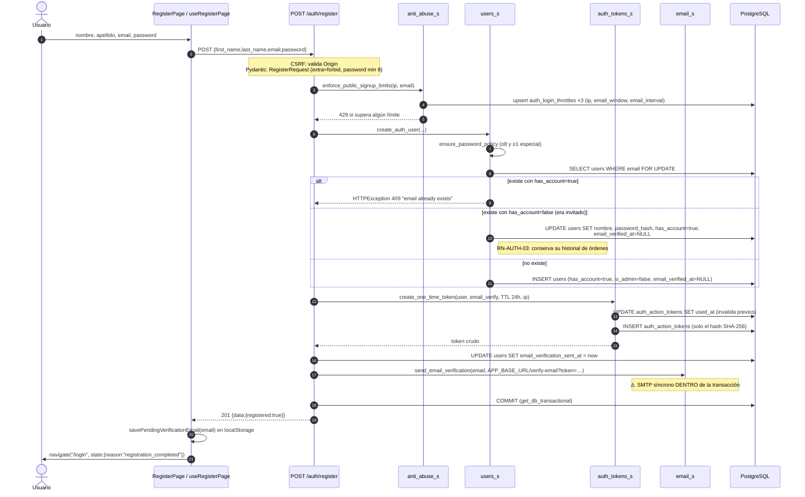

**Tablas escritas:** `users`, `auth_action_tokens`, `auth_login_throttles`

**Puntos a tener en cuenta:**
- ⚠️ El email se envía **dentro** de la transacción. Si el SMTP tarda o falla, la transacción se alarga o revierte
  el alta. Contrasta con el flujo de pago, que usa `post_commit_actions`. Ver
  [18_Roadmap.md](18_Roadmap.md#R-04).
- 🟢 El *upgrade de invitado* es transparente: el cliente que compró sin cuenta y luego se registra encuentra sus
  órdenes anteriores en `/profile`.
- El banner de "Verifica tu email" en `Layout` se alimenta del `localStorage` que escribe este flujo.

---

## 2. Verificación de email

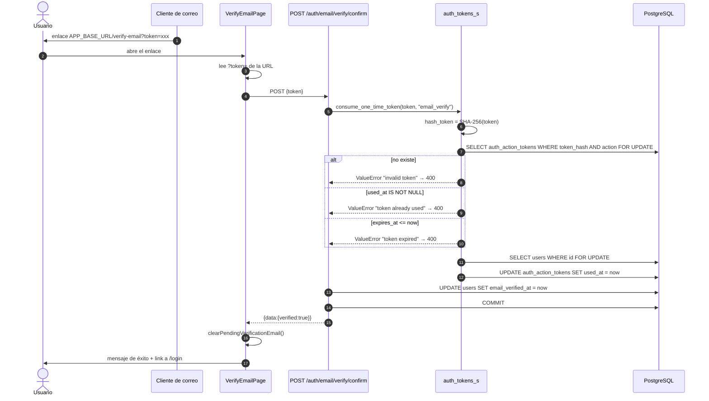

⚠️ Los tres mensajes de error son distintos, lo que revela si el token **existió alguna vez**. Es un filtrado de
información menor (el token tiene 256 bits de entropía), pero un mensaje único sería más prudente.

---

## 3. Login

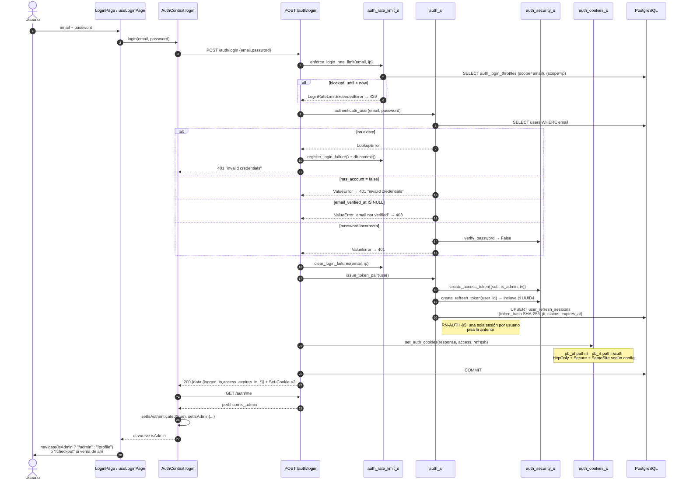

**Tablas escritas:** `user_refresh_sessions`, `auth_login_throttles`, `users` (en fallo, solo throttles)

**Puntos a tener en cuenta:**
- 🔒 Mensaje idéntico para usuario inexistente y password incorrecta.
- ⚠️ Pero el 403 `email not verified` **solo puede ocurrir si el email existe** → enumeración indirecta.
- 🟢 El `db.commit()` explícito en el `except` (`auth_r.py:100`) hace que el contador de fallos sobreviva al 401.
- ⚠️ El login son **dos** requests: `/auth/login` y `/auth/me`. Si el backend devolviera `is_admin` en el login,
  sería una sola.

---

## 4. Renovación de sesión (refresh automático)

```mermaid
sequenceDiagram
    autonumber
    participant C as Componente
    participant AX as axios interceptor
    participant API as Backend
    participant AS as auth_s
    participant DB as PostgreSQL
    participant CTX as AuthContext

    C->>AX: GET /orders (cookie pb_at expirada)
    AX->>API: request
    API-->>AX: 401 (token_version o exp inválidos)
    AX->>AX: ¿url ∈ rutas de auth? ¿ya se reintentó?  → no
    AX->>AX: marca _retry=true; si ya hay refreshPromise, lo espera
    AX->>API: POST /auth/refresh (cookie pb_rt)
    API->>AS: refresh_with_token(refresh_token)
    AS->>AS: decode_refresh_token → sub, jti
    AS->>DB: SELECT user_refresh_sessions WHERE user_id FOR UPDATE
    alt no existe
        AS-->>API: LookupError → 404
    else expires_at <= now
        AS-->>API: ValueError "refresh token expired" → 400
    else token_hash ≠ SHA-256(token) o jti ≠ token_jti
        AS-->>API: ValueError "invalid refresh token" → 400
    end
    AS->>DB: UPDATE users SET token_version = token_version + 1
    Note right of AS: RN-AUTH-06: invalida TODOS los access tokens previos
    AS->>AS: issue_token_pair(user)
    AS->>DB: UPSERT user_refresh_sessions (nuevo hash y jti)
    API-->>AX: 200 + Set-Cookie pb_at, pb_rt nuevas
    AX->>API: reintenta GET /orders con las cookies nuevas
    API-->>C: 200 {data}

    Note over AX,CTX: Si el refresh falla:
    AX->>CTX: window.dispatchEvent("pb-auth-unauthorized")
    CTX->>CTX: isAuthenticated=false, sessionExpired=true
    CTX->>C: ProtectedRoute redirige a /login<br/>con state.reason="session_expired"
```

🟢 **`refreshPromise` como singleton** (`http.ts:28`) evita que N requests simultáneas disparen N refresh. Sin
esa deduplicación, la rotación de `token_version` haría que cada refresh invalidara al anterior y todos fallaran
menos uno.

---

## 5. Navegación del catálogo

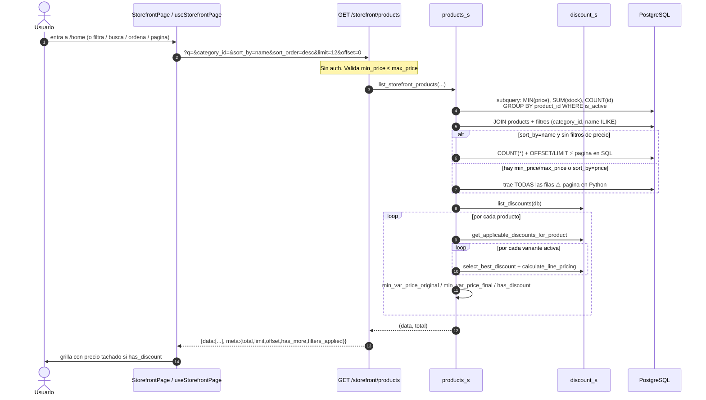

⚡ **El punto crítico de performance del sistema.** El precio final con descuento **no es computable en SQL**
porque la selección del mejor descuento vive en Python. El código lo documenta explícitamente
(`products_s.py:600-604`) y mitiga permitiendo paginación en SQL para el caso común (orden por nombre sin filtro
de precio). Ver [12_Performance.md](12_Performance.md#storefront).

---

## 6. Agregar al carrito

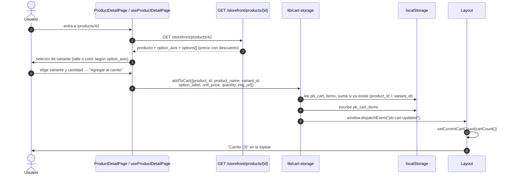

**Nada toca el servidor.** El carrito es puramente cliente hasta el checkout.

⚠️ `unit_price` se congela en `localStorage` al agregar. Si el precio cambia después, el total que ve el usuario
en `/checkout` puede no coincidir con el que calcula el backend. El backend **siempre repreicia**, así que el
importe cobrado es el correcto — pero la discrepancia visual es real.

---

## 7. Checkout de invitado (guest) con Mercado Pago

El flujo más complejo del sistema.

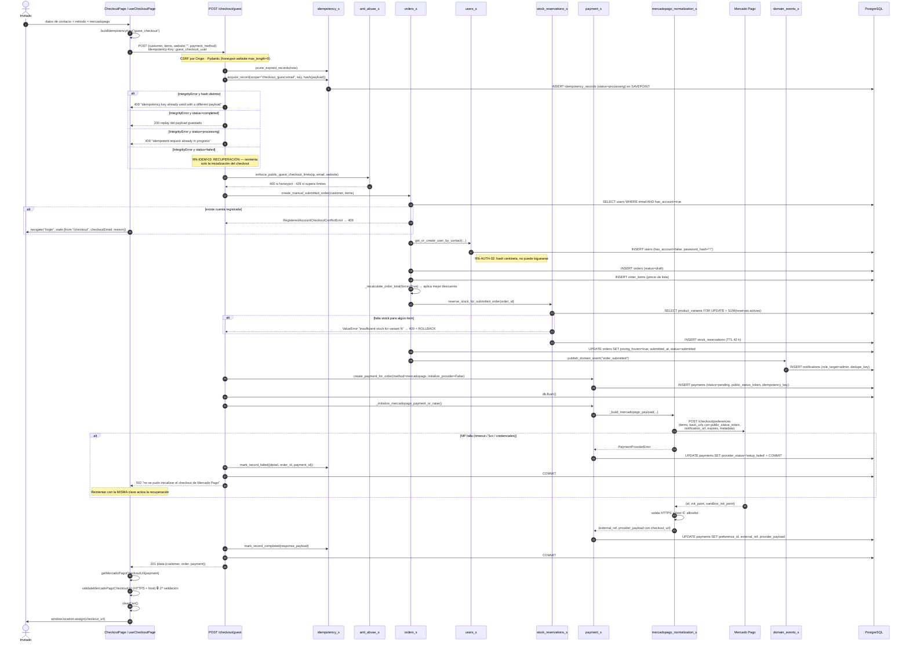

**Tablas escritas:** `idempotency_records`, `auth_login_throttles`, `users`, `orders`, `order_items`,
`stock_reservations`, `payments`, `notifications`

---

## 8. Checkout de usuario autenticado

Más simple, pero **3 requests secuenciales** desde el cliente:

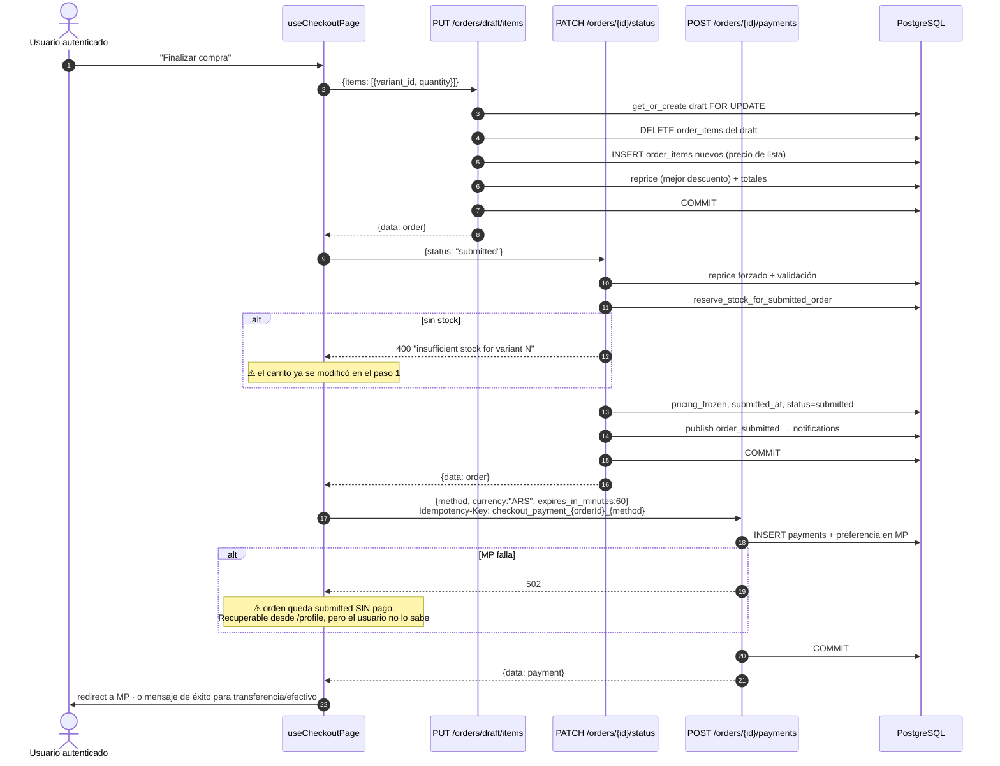

⚠️ **No hay idempotencia entre los tres pasos.** Cualquier fallo intermedio deja un estado parcial. Los tres
pasos deberían fusionarse en un `POST /checkout` autenticado análogo al de invitado. Ver
[18_Roadmap.md](18_Roadmap.md#R-03).

---

## 9. Confirmación del pago por webhook

```mermaid
sequenceDiagram
    autonumber
    participant MP as Mercado Pago
    participant API as POST /payments/webhook/mercadopago
    participant MPD as mercadopago_d
    participant MC as mercadopago_client
    participant WE as webhook_events_s
    participant MPN as mercadopago_normalization_s
    participant PS as payment_s
    participant SR as stock_reservations_s
    participant RF as refund_s
    participant DE as domain_events_s
    participant PC as post_commit_actions_s
    participant DB as PostgreSQL

    MP->>API: POST {type:"payment", data:{id}, action}<br/>x-signature: ts=…,v1=… · x-request-id
    Note over API: 🔓 EXENTO de CSRF (server-to-server)
    API->>MC: resolver_evento_webhook_mercadopago(payload, x_signature, x_request_id)
    MC->>MC: topic ∈ {payment}? si no → WebhookNoOpError
    MC->>MC: _extract_mercadopago_data_id(payload)
    MC->>MPD: is_mercadopago_signature_valid(data_id, request_id, signature)
    MPD->>MPD: manifest = "id:{data_id};request-id:{rid};ts:{ts};"
    MPD->>MPD: HMAC-SHA256 + compare_digest + ventana [now-300s, now+60s]
    alt firma inválida
        MPD-->>API: False → WebhookInvalidSignatureError
        API->>DB: ROLLBACK + clear_post_commit_actions
        API-->>MP: 401 "invalid signature"
    end
    MC->>MC: event_key = mp:event:{id} | mp:{topic}:{data_id}:{action}
    MC->>WE: acquire_webhook_event(provider, event_key, payload)
    WE->>DB: INSERT webhook_events en SAVEPOINT
    alt duplicado en processing/processed
        WE-->>MC: False → WebhookNoOpError("duplicate webhook event")
        API-->>MP: 200 {processed:false, reason}
    else estaba failed/dead_letter
        WE->>DB: revive a processing
    end

    MC->>MP: GET /v1/payments/{data_id}   (3 reintentos, timeout configurable)
    MP-->>MC: payload del pago
    MC->>MPN: normalize_mp_payment_state(mp_payment)
    MPN->>MPN: mapea provider_status → internal_status
    alt estado desconocido
        MPN-->>MC: ValueError → webhook marcado failed (reintentable) 🔒
    end
    MC->>PS: find_payment_for_mercadopago_event(external_ref)
    alt no encontrado
        MC->>WE: mark_webhook_event_failed (reintentable — puede ser una carrera)
        API-->>MP: 200 {processed:false, reason:"payment not found"}
    end

    MC->>PS: apply_mercadopago_normalized_state(payment_id, normalized_state, payload)
    PS->>SR: expire_active_reservations_for_order
    PS->>PS: 🔒 valida external_ref == payment.external_ref
    PS->>PS: 🔒 valida amount y currency
    PS->>PS: transición (con paid revival si el pago estaba cancelled/expired)
    PS->>DB: UPDATE payments SET status, paid_at, provider_payload

    alt internal_status = paid
        alt orden cancelled
            PS->>RF: create_late_paid_incident_if_needed("approved after cancellation")
            RF->>DB: INSERT payment_incidents (pending_review)
            RF->>DE: publish possible_refund_detected → notifications
        else orden paid con otro pago paid
            PS->>RF: create_late_paid_incident_if_needed("already had another paid payment")
        else orden submitted
            PS->>SR: consume_reservations_for_paid_order
            SR->>DB: UPDATE product_variants SET stock = stock - qty<br/>WHERE stock >= qty   ⚡ compare-and-swap
            alt rowcount ≠ 1
                SR-->>PS: ValueError "insufficient stock" → webhook failed, reintenta
            end
            SR->>DB: UPDATE stock_reservations SET status=consumed
            PS->>DB: UPDATE orders SET status=paid, paid_at
            PS->>DE: publish_domain_event("order_paid")
            DE->>DB: INSERT notifications (admin)
            DE->>PC: enqueue_post_commit_order_paid_email(payload)
        end
    end

    MC->>WE: mark_webhook_event_processed
    API->>DB: COMMIT
    API->>PC: dispatch_post_commit_actions(source="mercadopago_webhook")
    PC->>PC: send_order_paid_email  (fallo → solo logger.exception)
    API-->>MP: 200 {data:{processed:true, payment}}
```

**Tablas escritas:** `webhook_events`, `payments`, `orders`, `stock_reservations`, `product_variants`,
`notifications`, y opcionalmente `payment_incidents`

---

## 10. Retorno del usuario desde Mercado Pago

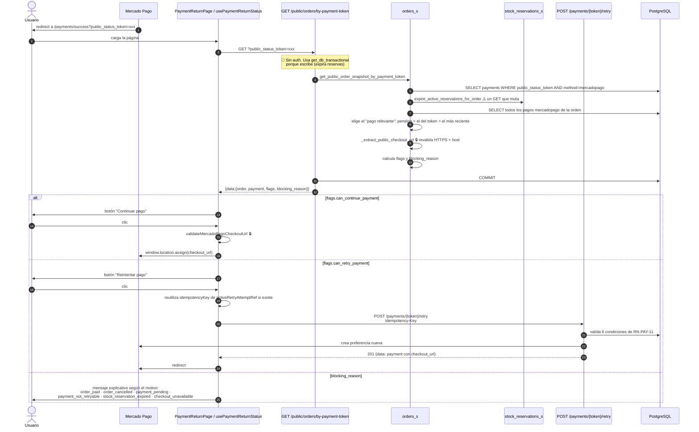

🟢 **`activeRetryAttemptRef`** guarda `{idempotencyKey, payment}` en un `useRef`. Si el usuario pulsa
"Reintentar" dos veces, la segunda reutiliza la misma clave y el backend devuelve el pago ya creado en lugar de
crear otro. Coordinación cliente-servidor bien resuelta.

---

## 11. Reconciliación de pagos pendientes (sin webhook)

Cuando el webhook no llega —típico en desarrollo local sin URL pública, o si Mercado Pago tuvo un problema— este
job cierra el círculo.

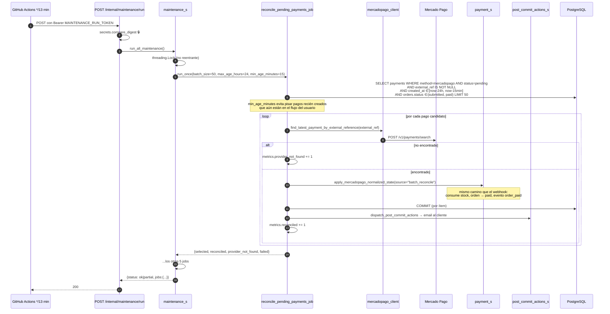

🟢 **Commit por ítem**: un fallo en el pago 7 no revierte los 6 anteriores.
⚠️ **Llamadas HTTP secuenciales**: un lote de 50 son 50 requests en serie. Con timeout de 10 s y 3 reintentos,
el peor caso teórico supera el `--max-time 150` del cron.

---

## 12. Expiración de reserva y cancelación automática

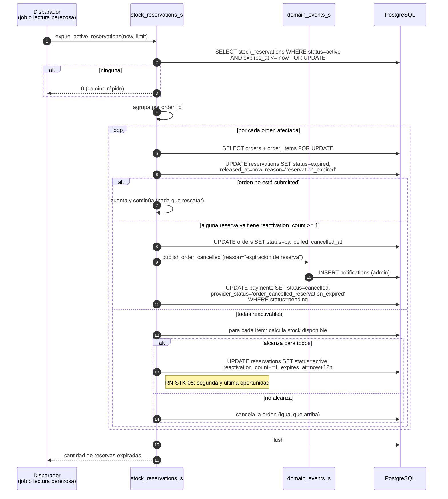

⚠️ Las **reactivadas no se cuentan** en el retorno, así que `expire_stock_reservations_job` puede ver `0` y cortar
el bucle de lotes aunque haya hecho trabajo.

---

## 13. Venta presencial (admin)

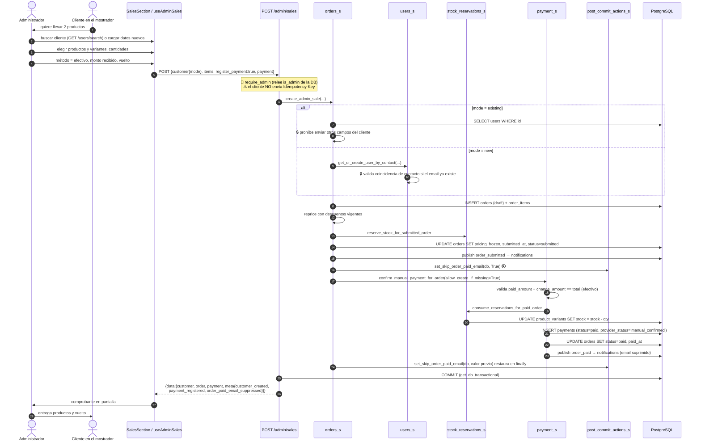

🟢 **Supresión del email** con restauración en `finally`. Detalle de producto bien pensado.
⚠️ **Sin `Idempotency-Key` desde el cliente**, pese a que el endpoint la soporta.

---

## 14. Registro de un pago por transferencia (admin)

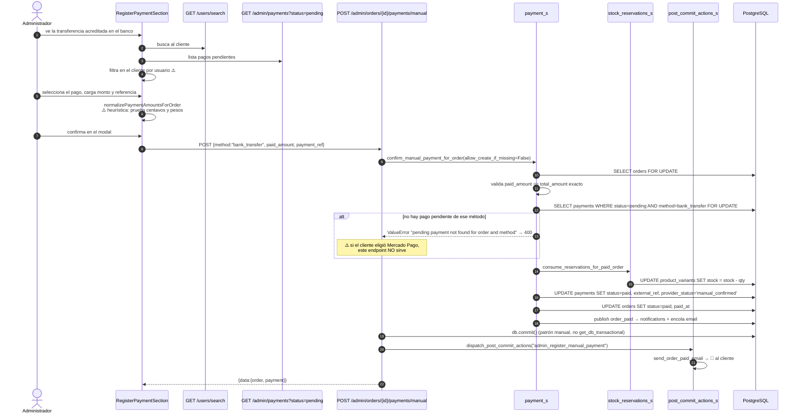

Aquí el email **sí** se envía: el cliente no está presente y necesita el aviso.

---

## 15. Reembolso de un cobro tardío o duplicado

```mermaid
sequenceDiagram
    autonumber
    participant SYS as Webhook / reconciliación
    participant RF as refund_s
    participant DE as domain_events_s
    actor A as Administrador
    participant FE as PaymentIncidentsSection
    participant API as POST /admin/payment-incidents/{id}/resolve-refund
    participant MC as mercadopago_client
    participant MP as Mercado Pago
    participant DB as PostgreSQL

    SYS->>RF: create_late_paid_incident_if_needed(order, payment, reason)
    RF->>DB: SELECT incidencia pending_review existente
    alt ya existe
        RF-->>SYS: la devuelve (idempotente)
    end
    RF->>DB: INSERT payment_incidents (type=late_paid_duplicate, status=pending_review)
    RF->>DE: publish possible_refund_detected
    DE->>DB: INSERT notifications (dedupe_key=admin:incident:{id}:possible_refund)

    A->>FE: ve la campana con el aviso → sección "Incidencias de pago"
    FE->>FE: GET /admin/payment-incidents?status=pending_review&limit=200
    A->>FE: decide reembolsar; escribe el motivo (obligatorio)
    FE->>API: POST {amount?, reason}
    API->>RF: create_mercadopago_refund(...)
    RF->>DB: SELECT payment_incidents FOR UPDATE
    alt ya resuelta con reembolso
        RF-->>API: devuelve el refund existente (idempotente)
    end
    RF->>RF: valida método=mercadopago, estado=paid, amount ≤ payment.amount
    RF->>DB: SELECT refund activo del pago
    alt ya hay uno activo
        RF-->>API: ValueError "payment already has an active refund" → 400
    end
    RF->>DB: INSERT payment_refunds (status=requested,<br/>idempotency_key=sha256(incident:payment:amount))
    RF->>RF: _extract_provider_payment_id(payment.provider_payload)
    alt no encontrado
        RF-->>API: ValueError "missing mercadopago provider payment id" → 400
    end
    RF->>MC: create_refund(payment_id, amount?, idempotency_key)
    MC->>MP: POST /v1/payments/{id}/refunds<br/>x-idempotency-key · amount en decimal
    alt error del proveedor
        MP-->>MC: 4xx/5xx/timeout
        RF->>DB: UPDATE payment_refunds SET status=failed + payload
        RF->>DB: COMMIT   ⚠️ dentro del except, deliberado
        RF-->>API: re-lanza → 502/503/504
        Note over FE: la incidencia sigue pending_review, se puede reintentar
    end
    MP-->>MC: {id, status, ...}
    RF->>DB: UPDATE payment_refunds SET status=approved, provider_refund_id
    RF->>DB: UPDATE payment_incidents SET status=resolved_refunded,<br/>reason, resolved_at, resolved_by_user_id
    API->>DB: COMMIT
    API-->>FE: 201 {data:{incident, refund}}
    FE->>A: confirmación
```

---

## 16. Administración de catálogo

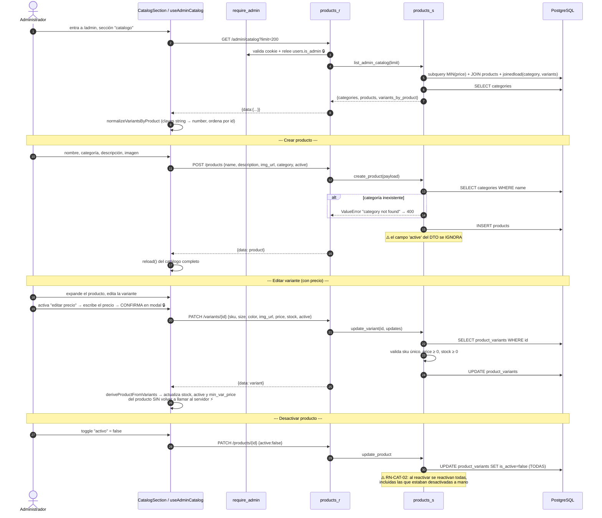

---

## 17. Resumen: qué toca cada flujo

| Flujo | Endpoints | Servicios | Tablas escritas | Externos |
|---|---|---|---|---|
| Registro | 1 | `users_s`, `auth_tokens_s`, `email_s`, `anti_abuse_s` | `users`, `auth_action_tokens`, `auth_login_throttles` | SMTP |
| Verificación | 1 | `auth_tokens_s` | `auth_action_tokens`, `users` | — |
| Login | 2 | `auth_rate_limit_s`, `auth_s`, `auth_security_s`, `auth_cookies_s` | `user_refresh_sessions`, `auth_login_throttles`, `users` | — |
| Refresh | 1 | `auth_s` | `user_refresh_sessions`, `users` | — |
| Catálogo | 2 | `products_s`, `discount_s` | — | — |
| Carrito | 0 | — | — | — |
| Checkout guest | 1 | `idempotency_s`, `anti_abuse_s`, `orders_s`, `users_s`, `stock_reservations_s`, `payment_s`, `mercadopago_*`, `domain_events_s` | 7 tablas | Mercado Pago |
| Checkout auth | 3 | `orders_s`, `stock_reservations_s`, `payment_s`, `discount_s` | 5 tablas | Mercado Pago |
| Webhook | 1 | `mercadopago_client`, `webhook_events_s`, `payment_s`, `stock_reservations_s`, `refund_s`, `domain_events_s`, `post_commit_actions_s` | 7 tablas | Mercado Pago, SMTP |
| Retorno de pago | 1–2 | `orders_s`, `payment_s`, `stock_reservations_s` | `stock_reservations`, `orders`, `payments` | Mercado Pago |
| Reconciliación | 1 | `reconcile_pending_payments_job` + los del webhook | ídem webhook | Mercado Pago, SMTP |
| Expiración | 0 (job) | `stock_reservations_s`, `domain_events_s` | `stock_reservations`, `orders`, `payments`, `notifications` | — |
| Venta admin | 2 | `orders_s`, `users_s`, `stock_reservations_s`, `payment_s`, `post_commit_actions_s` | 7 tablas | — |
| Registro de pago | 3 | `payment_s`, `stock_reservations_s`, `post_commit_actions_s` | 5 tablas | SMTP |
| Reembolso | 2 | `refund_s`, `mercadopago_client`, `domain_events_s` | `payment_incidents`, `payment_refunds`, `notifications` | Mercado Pago |
| Catálogo admin | 5+ | `products_s` | `products`, `product_variants`, `categories` | — |

---

← [09 Reglas de Negocio](09_ReglasNegocio.md) | [Índice](README.md) | Siguiente: [11 Seguridad](11_Seguridad.md) →
