# 11 — Seguridad

← [10 Flujos](10_Flujos.md) | [Índice](README.md) | Siguiente: [12 Performance](12_Performance.md) →

---

## 1. Resumen ejecutivo

**Valoración global: 7,5 / 10.** Es una postura de seguridad **notablemente por encima de la media** para un
proyecto de este tamaño. Las decisiones de fondo (cookies HttpOnly, rotación de refresh, validación HMAC de
webhooks, idempotencia, índices únicos parciales como invariantes) están bien tomadas y bien implementadas.

Los hallazgos abiertos son de severidad media o baja y en su mayoría corresponden a **hardening pendiente**, no a
vulnerabilidades explotables directamente.

| Categoría | Estado |
|---|---|
| Autenticación | 🟢 Sólida |
| Autorización | 🟡 Correcta pero con un punto débil (`is_admin` del claim) |
| CSRF | 🟢 Implementada, con exenciones justificadas |
| XSS | 🟢 Bajo riesgo (React + CSP) |
| SQL Injection | 🟢 Sin superficie (ORM en el 100% de las queries) |
| Rate limiting | 🟢 Multi-dimensional y persistente |
| Idempotencia | 🟢 Dos niveles, bien diseñada |
| Gestión de secretos | 🟢 Correcta; nada commiteado |
| Cabeceras HTTP | 🟢 Completas |
| Validación de entrada | 🟢 `extra="forbid"` en todos los DTOs |
| Logging y auditoría | 🟡 Logs sí, auditoría consultable no |
| Exposición de información | 🟡 Varios puntos de fuga menores |
| Dependencias | 🟡 Pinneadas, pero sin escaneo automático |

---

## 2. Autenticación

### 2.1 Diseño de tokens

| Aspecto | Implementación | Valoración |
|---|---|---|
| Transporte | Cookies `HttpOnly` (`pb_at`, `pb_rt`) | 🟢 JS no puede leer los tokens → XSS no roba sesiones |
| `Secure` | `AUTH_COOKIE_SECURE`, o inferido de `APP_BASE_URL` | 🟢 Default seguro |
| `SameSite` | Configurable; **falla al arrancar** si es `none` sin `Secure` | 🟢 Fail-fast excelente (`db/config.py:124-125`) |
| Path del refresh | `/auth` por defecto | 🟢 Reduce su superficie de exposición |
| Algoritmo | HS256 con `JWT_SECRET` | 🟡 Simétrico; suficiente para un único servicio |
| Claims validados | firma, `iss`, `type`, `sub`, `exp` | 🟢 |
| `aud` | `verify_aud=False` | 🟢 Correcto: no se emite `aud` |
| Vida del access | 120 min por defecto | 🟡 Largo; 15–30 min sería más prudente |
| Vida del refresh | 30 días | 🟡 Largo, mitigado por la rotación |

### 2.2 Rotación de refresh + `token_version` {#rotacion-refresh}

El mecanismo más fuerte del sistema:

```
POST /auth/refresh
  → valida token_hash Y token_jti contra user_refresh_sessions
  → users.token_version += 1        ← invalida TODOS los access tokens previos
  → emite par nuevo, pisa la fila de sesión
```

Cada access token lleva el claim `tv`; `auth_d.get_current_user` lo compara con la base en **cada request**
(`auth_d.py:51`). Consecuencias:

- 🟢 Un access token robado deja de servir en cuanto el usuario legítimo refresca.
- 🟢 Logout, cambio de password, reset y revocación de admin cortan el acceso **al instante**.
- ⚠️ Cuesta una query por request autenticada (ver [12_Performance.md](12_Performance.md#auth)).
- ⚠️ Solo hay **una sesión por usuario** (`user_refresh_sessions.user_id UNIQUE`) → no hay multi-dispositivo.

Los tokens de refresh se guardan **hasheados** (SHA-256), nunca en claro. 🟢

### 2.3 Passwords

| Aspecto | Implementación | Valoración |
|---|---|---|
| Algoritmo | `pbkdf2_sha256` (passlib, rondas por defecto ≈29.000) | 🟠 Aceptable pero **no** es lo recomendado hoy |
| Política | ≥8 caracteres **y** ≥1 no alfanumérico | 🟡 Débil: sin mayúsculas ni dígitos |
| Passwords comunes | Sin verificación | 🟠 `Password!` cumple la política |
| Verificación | Captura `UnknownHashError`, `ValueError`, `TypeError` → `False` | 🟢 Es lo que hace seguro el centinela `"!"` |
| Timing | passlib compara en tiempo constante | 🟢 |

> 🟠 **Recomendación (R-S-02):** migrar a **Argon2id** o **bcrypt (cost ≥12)**. Passlib soporta ambos; el cambio
> es de una línea en `CryptContext(schemes=[...], deprecated="auto")`, y `deprecated="auto"` rehashea al vuelo en
> el siguiente login exitoso, sin migración de datos.

### 2.4 Tokens de un solo uso

🟢 Implementación correcta:
- `secrets.token_urlsafe(32)` = 256 bits de entropía.
- Solo se guarda el **hash SHA-256**; el token crudo únicamente viaja por email.
- Crear uno invalida los activos del mismo `(usuario, acción)`.
- `consume_one_time_token` usa `with_for_update()` sobre token **y** usuario → no hay doble consumo.
- TTL: 24 h verificación, 30 min reset.
- Job de poda periódico.

⚠️ Los mensajes de error son distintos (`invalid token` / `token already used` / `token expired`), lo que revela
si el token existió. Impacto muy bajo dada la entropía.

---

## 3. Autorización

### 3.1 Modelo de roles {#roles-y-permisos}

Solo dos: usuario y admin (`users.is_admin`). Sin permisos granulares — ver
[06_PanelAdmin.md](06_PanelAdmin.md#6-permisos).

### 3.2 `require_admin` relee de la base 🟢

```python
def require_admin(current_user=Depends(get_current_user), db=Depends(get_db)):
    user = db.query(User).filter(User.id == int(user_id)).first()
    if not bool(user.is_admin):
        raise HTTPException(403, "Admin permissions required")
    current_user["is_admin"] = bool(user.is_admin)   # ← sobrescribe el claim
    return current_user
```

No confía en el claim del JWT. Revocar admin surte efecto inmediato.

### 3.3 🟠 Hallazgo: `is_admin` del claim en endpoints no-admin {#is_admin-del-claim}

**Severidad: media. Explotabilidad: baja.**

Los endpoints que usan `get_current_user` (no `require_admin`) leen el flag del **claim del JWT**, que puede
estar desactualizado:

| Endpoint | Uso del flag | Impacto |
|---|---|---|
| `PATCH /orders/{id}/status` | `is_admin=True` omite el filtro `Order.user_id == user_id` (`orders_s.py:594-596`) | 🟠 Un ex-admin podría cambiar el estado de órdenes ajenas |
| `GET /orders/{id}/reservations` | Ídem | 🟡 Lectura de reservas ajenas |
| `GET /notifications` y otros 3 | Incluye las de `role_target='admin'` | 🟡 Lectura de notificaciones administrativas |

**Por qué la explotabilidad es baja:** revocar admin llama `bump_user_token_version` y borra la sesión de refresh
(`users_s.py:167-176`), así que el access token queda inválido en el siguiente request. La ventana es
prácticamente nula.

**Pero** la defensa correcta no debería depender de ese efecto colateral.

> **Recomendación (R-S-01):** crear una dependencia `get_current_user_with_role` que devuelva el `is_admin` real
> de la base, y usarla en esos 6 endpoints. Alternativamente, `require_admin` como dependencia opcional.

### 3.4 IDOR — referencias directas a objetos

🟢 Bien resuelto en general: los endpoints de usuario filtran por `user_id` de la sesión y devuelven **404**
(no 403) cuando el recurso es de otro. Eso evita confirmar la existencia del recurso.

Ejemplos verificados:
- `get_order_for_user` → `WHERE id = :id AND user_id = :uid`
- `get_payment_for_user` → `JOIN orders ON ... WHERE Order.user_id = :uid`
- `create_payment_for_order` → `LookupError` si `order.user_id != user_id` (`payment_s.py:512-513`)

### 3.5 Capability tokens

`public_status_token` (32 bytes) permite, sin sesión:
- `GET /public/orders/by-payment-token` — ver estado y **contenido** de la orden (nombres de producto, cantidades,
  totales).
- `GET /payments/public/status` — estado del pago.
- `POST /payments/{token}/retry` — crear un nuevo intento de pago.

🟢 Alcance acotado: no expone email, teléfono ni dirección del cliente; no permite modificar la orden.
🟢 Entropía suficiente para descartar fuerza bruta.
⚠️ El token viaja en la **query string** de las `back_urls` de Mercado Pago → queda en el historial del navegador
y en los logs de acceso de cualquier proxy intermedio. Es inherente al flujo de retorno, pero conviene conocerlo.

---

## 4. CSRF

### Implementación

`CSRFMiddleware` (`dependencies/csrf_d.py`) exige, para `POST/PUT/PATCH/DELETE`, que `Origin` **o** `Referer`
esté en `CORS_ALLOW_ORIGINS`.

| Aspecto | Valoración |
|---|---|
| Cubre todos los métodos mutantes | 🟢 |
| Normaliza el origen antes de comparar | 🟢 `_normalize_origin` reduce a `esquema://host:puerto` |
| Falla si no hay ni `Origin` ni `Referer` | 🟢 Default seguro |
| Exenciones | 🟢 Solo 2, ambas comentadas y autenticadas por otro medio |
| Tests | 🟢 5 tests en `test_csrf_middleware.py` |
| No usa double-submit token | 🟡 El chequeo de origen es suficiente con `SameSite`, pero un token sería defensa en profundidad |

**Exenciones y su justificación:**

| Ruta | Por qué está exenta | Cómo se autentica |
|---|---|---|
| `/payments/webhook/mercadopago` | Server-to-server; no lleva `Origin` | HMAC-SHA256 con ventana temporal |
| `/internal/maintenance/run` | Cron externo | Bearer token con `compare_digest` |

🟢 Ambas exenciones tienen **su propia** autenticación fuerte. No hay agujero.

---

## 5. XSS

| Vector | Estado |
|---|---|
| Renderizado en React | 🟢 Escapa por defecto |
| `dangerouslySetInnerHTML` | 🟢 **Cero apariciones** en todo el repo |
| `eval` / `new Function` | 🟢 Cero apariciones |
| CSP | 🟢 `default-src 'self'; frame-ancestors 'none'` |
| `X-Content-Type-Options` | 🟢 `nosniff` |
| Datos del usuario en el DOM | 🟢 Siempre como texto, nunca como HTML |
| Redirecciones | 🟢 `window.location.assign` solo tras validar esquema y host |

⚠️ **La CSP se omite en `/docs`, `/redoc` y `/openapi.json`** (`security_headers_d.py:19`) porque Swagger carga
assets de CDN. Combinado con que esas rutas están **públicas en producción**, es un endurecimiento pendiente
(ver §11, R-S-05).

⚠️ La CSP no incluye `script-src`, `style-src` ni `img-src` explícitos. `default-src 'self'` los cubre por
herencia, pero el frontend carga imágenes desde `img_url` **externas**, que quedarían bloqueadas si el navegador
aplicara esta CSP al SPA. **No aplica en la práctica** porque la CSP la emite el backend (Render) y el SPA se
sirve desde Vercel, que no manda esa cabecera. Es una inconsistencia a tener presente si algún día se unifican
los dominios.

---

## 6. Inyección SQL

🟢 **Sin superficie de ataque.** El 100% de las consultas usa el Query API de SQLAlchemy con parámetros
vinculados. Verificado:

- Cero usos de `text()` con interpolación de variables. Los únicos `text()` del repo son literales estáticos en
  los índices parciales (`models.py:295`, `:365`, `:412`, `:548`) — no reciben entrada del usuario.
- `ilike(f"%{normalized_query}%")` (`products_s.py:594`) y `like(f"%{...}%")` (`users_s.py:307-311`) construyen
  el **patrón**, no el SQL. SQLAlchemy lo parametriza.
- ⚠️ Nota menor: los caracteres `%` y `_` en la búsqueda no se escapan, así que un usuario puede usarlos como
  comodines. Es un tema de UX, no de seguridad.
- Los campos de ordenamiento están en **allowlist**: `sort_by ∈ {created_at, id}`, `sort_dir ∈ {asc, desc}`
  (`orders_s.py:510-513`, `payment_admin_queries_s.py:110-113`). 🟢 Sin esto habría inyección por `ORDER BY`.

---

## 7. Rate limiting y anti-abuso

| Superficie | Límite | Dimensiones |
|---|---|---|
| Login | 6 fallos / 15 min → bloqueo 20 min | email **y** IP |
| Signup | 20/5min (IP), 6/10min (email), 1/20s (email) | IP + email × 2 |
| Checkout guest | Ídem | Ídem + honeypot |
| Reset de password | Ídem | Ídem |
| Reenvío de verificación | Ídem | Ídem |

🟢 **Persistente en base**, no en memoria → sobrevive a reinicios y funcionaría con varias instancias.
🟢 **Multi-dimensional**: rotar IPs no evade el límite por email, y viceversa.
🟢 **Honeypot** con doble validación (Pydantic `max_length=0` + chequeo en el servicio).
🟢 Job de poda para no acumular filas.

### ⚠️ Hallazgo: sin rate limiting en endpoints autenticados

**Severidad: media.**

Un usuario autenticado puede llamar sin límite a `POST /orders/{id}/payments/retry`, `PUT /orders/draft/items`,
`GET /admin/*`, etc. Un admin comprometido o un usuario malicioso podría saturar el free tier de Render con un
bucle.

**Mitigación parcial existente:** las reglas de negocio limitan el daño real (no se pueden crear pagos
pendientes duplicados, el reintento tiene 6 precondiciones).

> **Recomendación (R-S-03):** rate limiting genérico por `user_id` en las rutas mutantes, reutilizando
> `auth_login_throttles` con un scope nuevo.

### ⚠️ Hallazgo: la IP depende de `FORWARDED_ALLOW_IPS`

`_extract_client_ip` usa `request.client.host` (`auth_r.py:63-72`), que Uvicorn reescribe desde
`X-Forwarded-For` **solo** si la conexión viene de una IP listada en `FORWARDED_ALLOW_IPS` (default
`127.0.0.1`).

🟢 El código lo documenta en un comentario de 8 líneas.
🔴 **Pero `FORWARDED_ALLOW_IPS` no aparece en `render.yaml` ni en `.env.production.example`.**
Si no está configurada, **todo el rate limiting por IP en producción usa la IP del proxy de Render**, es decir,
una sola IP para todos los usuarios. El límite de 20 requests / 5 min se agotaría globalmente.

> 🔴 **Recomendación (R-S-04) — prioridad alta:** verificar y documentar `FORWARDED_ALLOW_IPS` en producción, o
> leer `X-Forwarded-For` explícitamente con una allowlist de proxies conocida.

---

## 8. Idempotencia

Ver [09_ReglasNegocio.md](09_ReglasNegocio.md#idempotencia) para el detalle funcional.

**Desde la óptica de seguridad:**

| Aspecto | Valoración |
|---|---|
| Scope por email en checkout guest | 🟢 Un cliente no puede leer la respuesta de otro |
| Hash del payload | 🟢 Reusar la clave con otro cuerpo → 409, no replay silencioso |
| Canonicalización determinista | 🟢 `sort_keys=True` |
| Liberación de registros atascados | 🟢 Sweeper a los 30 min |
| ⚠️ Datos personales en `response_payload` | 🟡 Nombre, email y teléfono del cliente quedan en claro 24 h |
| ⚠️ Sanitización asimétrica | 🟠 `_sanitize_response_payload` solo se aplica en `/admin/sales`, **no** en `/checkout/guest` |

> **Recomendación (R-S-06):** aplicar `_sanitize_response_payload` también en `/checkout/guest`, o cifrar el
> `response_payload` en reposo.

---

## 9. Webhooks

🟢 **La validación es correcta y completa:**

```python
manifest = f"id:{data_id};request-id:{request_id};ts:{ts};"
expected = hmac.new(secret, manifest, sha256).hexdigest()
hmac.compare_digest(expected.lower(), v1.lower())
```

| Control | Estado |
|---|---|
| HMAC-SHA256 con secreto compartido | 🟢 |
| Comparación en tiempo constante | 🟢 `compare_digest` |
| Ventana anti-replay | 🟢 `[now − 300s, now + 60s]` |
| Deduplicación | 🟢 `event_key UNIQUE` |
| **Revalidación de negocio** | 🟢 Importe, moneda y `external_reference` contra el pago local |
| Fallo cerrado ante estado desconocido | 🟢 `ValueError` → reintento, no asunción |

> 🟢 **La revalidación de importe y moneda (`payment_s.py:364-371`) es una excelente defensa en profundidad.**
> Incluso con la firma comprometida, no se podría marcar una orden como pagada por un importe distinto.

⚠️ El endpoint responde **503** ante error genérico, lo que hace que Mercado Pago reintente. Combinado con la
cola interna de reintentos, un evento problemático se procesa por dos vías. La deduplicación por `event_key` lo
cubre, pero es una duplicación de esfuerzo.

---

## 10. Secretos y variables de entorno

| Aspecto | Valoración |
|---|---|
| `.env` en `.gitignore` | 🟢 Con excepciones explícitas para `*.example` |
| `.env.example` sin valores reales | 🟢 Solo placeholders (`REEMPLAZAR_CON_...`) |
| `alembic.ini` con `sqlalchemy.url` vacío | 🟢 La URL viene de `db/config.py` |
| `render.yaml` con `sync: false` en todos los secretos | 🟢 Nunca en el repo, se cargan en el dashboard |
| Secretos en el bundle del frontend | 🟢 Solo `VITE_API_BASE_URL` y `VITE_API_TIMEOUT_MS` |
| Fail-fast si falta un secreto | 🟢 `RuntimeError` en el getter |
| ⚠️ Rotación de `JWT_SECRET` | 🟠 Rotarlo invalida **todas** las sesiones de golpe; no hay soporte de múltiples claves |
| ⚠️ `MAINTENANCE_RUN_TOKEN` sin rotación | 🟡 Token estático de larga vida |
| ⚠️ `k8s_idempotency_sweeper_secret.yaml` | 🟡 Plantilla; **verificar** que no contenga valores reales antes de cualquier uso |

**Verificación realizada:** ningún archivo versionado contiene credenciales reales. Los `.example` usan
placeholders y los manifiestos de K8s son plantillas.

---

## 11. Cabeceras HTTP

| Cabecera | Valor | Estado |
|---|---|---|
| `X-Frame-Options` | `DENY` | 🟢 |
| `X-Content-Type-Options` | `nosniff` | 🟢 |
| `Referrer-Policy` | `strict-origin-when-cross-origin` | 🟢 |
| `Content-Security-Policy` | `default-src 'self'; frame-ancestors 'none'` | 🟢 (⚠️ omitida en `/docs`) |
| `Strict-Transport-Security` | `max-age=63072000; includeSubDomains` si `Secure` | 🟢 2 años |
| `Permissions-Policy` | ❌ Ausente | 🟡 |
| `Cross-Origin-Opener-Policy` | ❌ Ausente | 🟡 |
| `Cross-Origin-Resource-Policy` | ❌ Ausente | 🟡 |

**CORS:** `allow_origins` desde env (no `*`), `allow_credentials=True`, `allow_methods=["*"]`,
`allow_headers=["*"]`.
🟡 Los wildcards en métodos y headers son laxos, pero con `allow_origins` acotado el riesgo es bajo.

### ⚠️ Hallazgo: `/docs` y `/openapi.json` públicos en producción {#R-S-05}

**Severidad: baja-media.**

`main.py` no desactiva la documentación interactiva. En producción, cualquiera puede leer el esquema completo de
la API en `https://<api>/docs`: todos los endpoints, todos los DTOs, todos los campos.

No expone secretos ni permite ejecutar nada sin credenciales, pero **facilita el reconocimiento** a un atacante.

> **Recomendación (R-S-05):**
> ```python
> is_prod = get_app_env() == "production"
> app = FastAPI(title="Sales API", version="0.1.0",
>               docs_url=None if is_prod else "/docs",
>               redoc_url=None if is_prod else "/redoc",
>               openapi_url=None if is_prod else "/openapi.json")
> ```
> ⚠️ Ojo: `scripts/export_openapi.py` usa `app.openapi()` directamente, así que CI seguiría funcionando.

---

## 12. Exposición de información {#exposición-de-detalles}

| # | Fuga | Severidad | Detalle |
|---|---|---|---|
| 1 | Mensajes de `ValueError` internos llegan al cliente | 🟡 | `errors.py:44-45` mapea cualquier `ValueError` a 400 con `str(exc)`. Un `int("abc")` accidental produce `invalid literal for int() with base 10: 'abc'` |
| 2 | Enumeración de usuarios vía login | 🟡 | `403 email not verified` solo ocurre si el email existe |
| 3 | Distinción de errores de token | 🟢 Bajo | `invalid` / `already used` / `expired` |
| 4 | `/docs` público | 🟡 | Ver §11 |
| 5 | `logger.exception` de toda excepción | 🟡 | `errors.py:25` loguea stack traces incluso de errores de negocio esperados. Ruido + posible PII en logs |
| 6 | `provider_payload` completo en las respuestas de pago | 🟡 | `_payment_to_dict` devuelve `provider_payload` y `provider_payload_data` al cliente, incluyendo el payload crudo de Mercado Pago |

> **Recomendación (R-S-07):** para el punto 1, distinguir errores de negocio (mensaje seguro) de errores
> inesperados (mensaje genérico + log). Una subclase `BusinessRuleError(ValueError)` cuyo mensaje sí se expone,
> y `ValueError` genérico → "solicitud inválida".

---

## 13. Validación de entrada

🟢 **Excelente.** Todos los DTOs usan `ConfigDict(extra="forbid")`:

| Defensa | Efecto |
|---|---|
| `extra="forbid"` | Mass assignment imposible: un campo desconocido → 422 |
| `Literal[...]` | Enumeraciones cerradas en método de pago, estado, tipo de descuento… |
| `Field(gt=, ge=, le=, min_length=, max_length=)` | Rangos y longitudes acotados |
| `EmailStr` | Validación de formato con `email-validator` |
| `str_strip_whitespace=True` | En los DTOs de catálogo |
| Allowlist de ordenamiento | `sort_by`, `sort_dir` validados en el servicio |
| Topes de `limit` | `max(1, min(limit, 500))` en todas las listas |

⚠️ El **body del webhook es `dict` libre** (`mercadopago_r.py:24`). Es inevitable (el formato lo define el
proveedor y cambia), y está mitigado porque la firma HMAC precede a cualquier procesamiento y
`normalize_mp_payment_state` valida campo por campo.

---

## 14. Uploads

🟢 **No hay superficie:** el sistema no acepta archivos. Las imágenes son URLs externas (`img_url`, máximo 2048
caracteres).

⚠️ **Pero no se valida el esquema de `img_url`.** Un admin podría guardar `javascript:alert(1)` o
`data:text/html,...`. React lo renderizaría en ``, donde `javascript:` **no** se ejecuta en
navegadores modernos, pero es higiene faltante.

> **Recomendación (R-S-08):** validar que `img_url` empiece por `https://` en el DTO.

---

## 15. Dependencias

### Backend (10 de runtime, todas pinneadas exactas 🟢)

| Paquete | Versión | Nota de seguridad |
|---|---|---|
| `fastapi` | 0.135.2 | Reciente |
| `uvicorn` | 0.42.0 | Reciente |
| `sqlalchemy` | 2.0.48 | Reciente |
| `psycopg[binary]` | 3.3.3 | Reciente |
| `pydantic` | 2.12.5 | Reciente |
| `email-validator` | 2.3.0 | — |
| `python-dotenv` | 1.2.2 | — |
| `python-jose[cryptography]` | 3.5.0 | 🟡 Ver abajo |
| `passlib` | 1.7.4 | 🟠 Ver abajo |
| `mercadopago` | 2.3.0 | SDK oficial |

**🟡 `python-jose`:** ha tenido CVEs relevantes en versiones anteriores (confusión de algoritmos, DoS por JWE).
La 3.5.0 es posterior a los parches conocidos, pero el proyecto tiene mantenimiento irregular.
`PyJWT` es la alternativa mejor mantenida y ampliamente recomendada.
> **Recomendación (R-S-09):** evaluar migración a `PyJWT`. El cambio afecta solo a `auth_security_s.py`.

**🟠 `passlib` 1.7.4:** última versión publicada en 2020. El proyecto está prácticamente sin mantenimiento.
Funciona correctamente, pero conviene planificar la migración a `argon2-cffi` directo o a `pwdlib`.

⚠️ **No hay escaneo automático de vulnerabilidades**: el CI no ejecuta `pip-audit`, `safety` ni Dependabot.

### Frontend (4 de runtime 🟢)

`axios` 1.16.0, `react` 18.3.1, `react-dom` 18.3.1, `react-router-dom` 6.30.1.
Superficie mínima. ⚠️ Tampoco hay `npm audit` en CI.

> **Recomendación (R-S-10):** agregar al CI:
> ```yaml
> - run: pip install pip-audit && pip-audit -r backend/requirements.txt
> - run: npm audit --audit-level=high    # en el job de frontend
> ```

---

## 16. Logging y auditoría

### Lo que sí hay 🟢

Logs estructurados por convención `event=nombre clave=valor`:

| Evento | Dónde |
|---|---|
| `auth_login_success`, `auth_logout_success`, `auth_register` | `auth_r.py` |
| `auth_verify_requested`, `auth_verify_confirmed` | `auth_r.py` |
| `auth_reset_requested`, `auth_reset_confirmed`, `auth_password_changed` | `auth_r.py` |
| `auth_profile_updated` | `auth_r.py` |
| `order_status_transition_attempt` / `_rejected` / `_applied` | `orders_s.py` |
| `admin_sale_created` | `orders_s.py` |
| `late_payment_incident_created` | `refund_s.py` |
| `refund_requested` / `_succeeded` / `_failed` | `refund_s.py` |
| `mp_signature_failed`, `mp_webhook_noop`, `mp_webhook_processed`, `mp_webhook_error` | `mercadopago_r.py` |
| `maintenance_run_*`, `maintenance_job_failed` | `maintenance_s.py` |
| Métricas de cada job | `jobs/*.py` |

🟢 Cobertura muy buena de las acciones sensibles. Las transiciones de orden loguean intento, rechazo y aplicación
por separado — excelente para depurar.

### Lo que falta

| Carencia | Severidad |
|---|---|
| No hay tabla de auditoría consultable | 🟠 Los logs de Render free se pierden al reiniciar |
| No hay correlation ID por request | 🟡 Difícil rastrear un flujo completo |
| ⚠️ **Se loguean emails en claro** (`auth_r.py:127`, `:223`, `:254`, `:303`) | 🟡 PII en logs |
| ⚠️ `logger.exception` en toda excepción, incluidas las de negocio | 🟡 Ruido que oculta lo importante |
| No hay alertas | 🟠 Nadie se entera de un pico de `refund_failed` |

> **Recomendación (R-S-11):** añadir una tabla `audit_log` para las acciones de admin (crear/revocar admin,
> reembolsos, cambios de precio, confirmaciones manuales de pago). Es información que hoy solo vive en logs
> efímeros.

---

## 17. Informe de riesgos

| ID | Hallazgo | Severidad | Probabilidad | Impacto | Esfuerzo | Prioridad |
|---|---|---|---|---|---|---|
| <a id="R-S-04"></a>**R-S-04** | `FORWARDED_ALLOW_IPS` no documentada → rate limiting por IP inefectivo en producción | 🔴 Alta | Alta | Alto | 1 h | **P0** |
| <a id="R-S-01"></a>**R-S-01** | `is_admin` del claim en 6 endpoints no-admin | 🟠 Media | Baja | Medio | 3 h | **P1** |
| <a id="R-S-05"></a>**R-S-05** | `/docs` y `/openapi.json` públicos en producción | 🟠 Media | Alta | Bajo | 30 min | **P1** |
| <a id="R-S-02"></a>**R-S-02** | `pbkdf2_sha256` en lugar de Argon2id/bcrypt | 🟠 Media | Baja | Alto | 2 h | **P1** |
| <a id="R-S-10"></a>**R-S-10** | Sin escaneo de vulnerabilidades en CI | 🟠 Media | Alta | Medio | 1 h | **P1** |
| <a id="R-S-03"></a>**R-S-03** | Sin rate limiting en endpoints autenticados | 🟠 Media | Media | Medio | 1 día | **P2** |
| <a id="R-S-07"></a>**R-S-07** | Mensajes de error internos expuestos al cliente | 🟡 Baja | Alta | Bajo | 4 h | **P2** |
| <a id="R-S-06"></a>**R-S-06** | Datos personales sin sanitizar en `idempotency_records` | 🟡 Baja | Media | Medio | 2 h | **P2** |
| <a id="R-S-11"></a>**R-S-11** | Sin tabla de auditoría | 🟡 Baja | — | Medio | 2 días | **P2** |
| <a id="R-S-09"></a>**R-S-09** | `python-jose` con mantenimiento irregular | 🟡 Baja | Baja | Alto | 4 h | **P2** |
| <a id="R-S-12"></a>**R-S-12** | Política de password débil (sin dígitos ni mayúsculas) | 🟡 Baja | Media | Medio | 1 h | **P3** |
| <a id="R-S-08"></a>**R-S-08** | `img_url` sin validación de esquema | 🟢 Info | Baja | Bajo | 30 min | **P3** |
| <a id="R-S-13"></a>**R-S-13** | Emails en claro en los logs | 🟢 Info | Alta | Bajo | 1 h | **P3** |
| <a id="R-S-14"></a>**R-S-14** | Sin `Permissions-Policy`, `COOP`, `CORP` | 🟢 Info | — | Bajo | 30 min | **P3** |
| <a id="R-S-15"></a>**R-S-15** | Lock de mantenimiento solo de proceso | 🟢 Info | Baja | Bajo | 1 día | **P3** |

### Plan de acción sugerido

```mermaid
gantt
    title Remediación de seguridad
    dateFormat X
    axisFormat %s
    section P0 — inmediato
    R-S-04 FORWARDED_ALLOW_IPS        :0, 1
    section P1 — este sprint
    R-S-05 desactivar /docs en prod   :1, 1
    R-S-10 pip-audit + npm audit      :2, 1
    R-S-02 migrar a Argon2id          :3, 2
    R-S-01 is_admin desde la base     :5, 3
    section P2 — próximo sprint
    R-S-07 errores seguros            :8, 4
    R-S-06 sanitizar idempotencia     :12, 2
    R-S-03 rate limit autenticado     :14, 8
    R-S-11 tabla de auditoría         :22, 16
    section P3 — backlog
    R-S-12 política de password       :38, 1
    R-S-08 validar img_url            :39, 1
    R-S-13 logs sin PII               :40, 1
    R-S-14 cabeceras extra            :41, 1
```



---

## 18. Lo que este sistema hace notablemente bien 🟢

Vale la pena destacarlo, porque son decisiones que muchos proyectos de este tamaño no toman:

1. **Cookies HttpOnly en lugar de `localStorage`** para los tokens — anula el robo de sesión por XSS.
2. **Rotación de refresh con `token_version`** — revocación global inmediata sin lista negra.
3. **Fail-fast en `SameSite=None` sin `Secure`** — un bug de configuración que sería invisible en runtime.
4. **Validación HMAC del webhook con ventana temporal** — anti-replay correcto.
5. **Revalidación de importe y moneda en el webhook** — defensa en profundidad sobre la firma.
6. **Índices únicos parciales como invariantes** — reglas de concurrencia garantizadas por el motor.
7. **Idempotencia con hash de payload** — distingue replay legítimo de reuso indebido de clave.
8. **Honeypot con doble validación** — anti-bot sin fricción para el usuario.
9. **Doble validación de la URL de Mercado Pago** — backend y frontend, con la misma allowlist.
10. **`require_admin` relee de la base** — no confía en el claim.
11. **404 en lugar de 403** para recursos ajenos — no confirma existencia.
12. **`extra="forbid"` en todos los DTOs** — mass assignment imposible.
13. **`secrets.compare_digest`** para el token de mantenimiento — resistente a timing.
14. **`seed_demo` bloqueado fuera de `local`/`demo`** — no se puede sembrar datos falsos en producción.
15. **Prohibición de autorevocarse admin** — evita quedarse sin administradores.

---

← [10 Flujos](10_Flujos.md) | [Índice](README.md) | Siguiente: [12 Performance](12_Performance.md) →
