# 12 — Performance

← [11 Seguridad](11_Seguridad.md) | [Índice](README.md) | Siguiente: [13 Calidad de Código](13_CalidadCodigo.md) →

---

## 1. Contexto: sobre qué estamos optimizando

Antes de hablar de performance hay que fijar la escala real:

| Recurso | Plan | Límite relevante |
|---|---|---|
| Backend | Render **free** | 512 MB RAM, 0,1 CPU compartida, **una sola instancia**, duerme a los 15 min |
| Base de datos | Supabase **free** | 500 MB, ~60 conexiones directas, se pausa a los 7 días |
| Frontend | Vercel/Cloudflare | CDN estático, sin límite práctico |

> 📌 **Consecuencia:** el cuello de botella dominante hoy **no es el código**, es el **cold start de 30–60 s** de
> Render. Cualquier optimización de query es marginal frente a eso. Las recomendaciones de este documento
> importan cuando el proyecto salga del free tier.

---

## 2. Consultas N+1

### 2.1 Lo que está bien resuelto 🟢

| Consulta | Técnica | Dónde |
|---|---|---|
| Orden con usuario, ítems, variantes y productos | `joinedload` encadenado | `orders_s._order_query` (`orders_s.py:79-84`) |
| Pagos de N órdenes | Una query con `IN`, agrupada en Python | `payment_s.list_payments_for_orders` (`payment_s.py:1071-1085`) |
| Incidencias abiertas de N pagos | Una query con `IN` por lote | `payment_admin_queries_s._open_incident_status_by_payment_ids` |
| Catálogo admin | `joinedload(category)` + `joinedload(variants)` | `products_s._query_admin_products` (`products_s.py:243-247`) |
| Storefront | `joinedload(category)` + `selectinload(variants)` | `products_s.py:585` |
| Descuentos con sus productos | `joinedload(Discount.product_links)` | `discount_s.list_discounts` (`discount_s.py:83`) |
| Snapshot público | `joinedload` de orden → ítems → producto/variante | `orders_s.py:185-192` |
| Orden + pagos en el panel | `Promise.all` en el cliente | `useAdminOrdersPayments.ts:33` |

> 🟢 **La prevención de N+1 es sistemática, no accidental.** Prácticamente todas las lecturas de colecciones
> usan eager loading explícito.

### 2.2 N+1 residuales

#### ⚡ P-01 — Reprecio de orden: una query extra por recálculo
**Dónde:** `orders_s._recalculate_order_total` (`orders_s.py:339-341`) llama `list_products_by_ids`, que hace
una query adicional aunque los productos ya vengan cargados por `joinedload` en `_order_query`.

**Por qué ocurre:** el motor de precios (`discount_s`) trabaja con dicts puros para ser testeable sin base, así
que hay un round-trip modelo → dict → modelo.

**Impacto:** 1 query extra por cada cambio de estado o edición del carrito. Con `IN (...)`, no es N+1 real.
**Severidad:** 🟢 baja.

#### ⚡ P-02 — `_expire_active_reservations_internal`: queries por orden
**Dónde:** `stock_reservations_s.py:149-219`

Para cada orden afectada ejecuta:
1. `SELECT orders … FOR UPDATE`
2. `SELECT order_items … FOR UPDATE`
3. Por **cada ítem**: `SELECT product_variants … FOR UPDATE` + `SUM(reservas activas)`

Con un lote de 200 reservas repartidas en 100 órdenes de 3 ítems: **~700 consultas** en una sola transacción.

**Mitigación existente:** el job usa `batch_limit` (200 por defecto).
⚠️ **`POST /admin/stock-reservations/expire` llama sin límite** (`stock_reservations_r.py:20`).
**Severidad:** 🟠 media.

> **Recomendación:** calcular el stock disponible de todas las variantes del lote en **una** query agregada, y
> añadir un `limit` al endpoint de admin.

#### ⚡ P-05b — Una query de usuario por cada request autenticada {#auth}
**Dónde:** `dependencies/auth_d.py:50` — `get_current_user` hace `SELECT users WHERE id = :sub` en **cada**
request autenticada, para comparar `users.token_version` con el claim `tv` del JWT.

**Costo:** 1 query por request. Con el patrón habitual de una SPA (varias llamadas por pantalla) se acumula.

**Por qué existe:** es el precio de poder revocar sesiones al instante sin lista negra distribuida. Ver
[11_Seguridad.md](11_Seguridad.md#rotacion-refresh).

**Severidad:** 🟡 media. La query es por clave primaria y muy barata; el problema es el volumen.
**Mitigación posible:** caché de `(user_id → token_version)` con TTL de pocos segundos, aceptando esa ventana de
revocación.

#### ⚡ P-03 — Reconciliación: llamadas HTTP secuenciales
**Dónde:** `reconcile_pending_payments_job.py:76-109`

Un lote de 50 pagos son **50 llamadas HTTP secuenciales** a Mercado Pago. Con timeout de 10 s y hasta 3
reintentos, el peor caso teórico supera el `--max-time 150` del cron de GitHub Actions.

**Severidad:** 🟠 media. **Recomendación:** paralelizar con `ThreadPoolExecutor` (el SDK es síncrono) o reducir
`PAYMENTS_RECONCILE_BATCH_SIZE`.

---

## 3. Consultas pesadas

### ⚡ P-04 — Storefront con filtro de precio o orden por precio {#storefront}
**Dónde:** `products_s.list_storefront_products` (`products_s.py:600-654`)

El código lo documenta explícitamente:

```python
# min_price/max_price and sort_by="price" need the discount-aware final price,
# which is only computable in Python (see _build_storefront_product_pricing) —
# those paths must fetch every matching row before filtering/sorting/paging.
can_paginate_in_sql = min_price is None and max_price is None and sort_by == "name"
```

| Camino | Comportamiento | Costo |
|---|---|---|
| `sort_by='name'` sin filtros de precio | `COUNT(*)` + `OFFSET/LIMIT` en SQL | 🟢 O(página) |
| Con `min_price`/`max_price` o `sort_by='price'` | Trae **todas** las filas, calcula precios en Python, filtra, ordena y pagina | 🔴 O(catálogo total) |

**Complejidad del camino lento:** `O(P × V × D)` donde P = productos, V = variantes por producto, D = descuentos
vigentes. Con 1.000 productos × 3 variantes × 10 descuentos = **30.000 evaluaciones** de descuento por request.

✅ **El default del frontend ya es `sort_by='name'`** (`useStorefrontPage.ts:13` → `useState<"price"|"name">("name")`),
así que al entrar a `/home` se ejecuta el camino rápido. El camino lento queda sólo para cuando el usuario ordena
por precio o aplica filtros de precio.

**Severidad:** 🟠 media. Ya no afecta la vista inicial, pero sigue siendo 🔴 alta a partir de ~500 productos
para quien use esos filtros.

> **Recomendaciones pendientes, por orden de esfuerzo:**
> 1. 🟡 **Materializar el precio final** en una columna o vista, recalculada cuando cambian precios o descuentos.
> 2. 🟡 **Caché en memoria de `list_discounts()`** con TTL corto — los descuentos cambian con muy poca frecuencia.
> 3. 🟠 **Mover el cálculo del mejor descuento a SQL** con `CASE`/`LATERAL`. Correcto pero complejo y duplicaría
>    la lógica de precios en dos lenguajes.
>
> ~~🟢 Cambiar el default del frontend a `sort_by='name'`~~ — **hecho** (ver [P-04a](#12-recomendaciones-priorizadas)).

### ⚡ P-05 — `list_discounts()` se ejecuta por request de storefront
**Dónde:** `products_s.py:612` y `:679`

Carga **todos** los descuentos con sus `product_links` en cada listado y en cada detalle de producto.

**Severidad:** 🟡 media. Es la candidata más obvia a caché: los descuentos cambian rara vez y son pocos.

### ⚡ P-06 — `GET /admin/catalog` sin paginación real {#admin}
**Dónde:** `products_r.py:93-100` → `limit` 200 por defecto, tope 1000

Devuelve productos **con todas sus variantes** en una sola respuesta. Con 1.000 productos × 5 variantes son
5.000 objetos serializados.

**Severidad:** 🟡 media (solo afecta al panel admin).

### ⚡ P-07 — `notifications` hace `count()` + query paginada
**Dónde:** `notifications_s.py:88-94`

Dos consultas por página. Con la campana consultando `unread-count` cada 30 s por usuario autenticado, en el free
tier suma.

**Severidad:** 🟡 media.

---

## 4. Caché

### ❌ No hay ninguna capa de caché

| Nivel | Estado |
|---|---|
| HTTP (`Cache-Control`, `ETag`) | ❌ Ningún endpoint emite cabeceras de caché |
| Aplicación (Redis, memcached) | ❌ No hay |
| In-process (`functools.lru_cache`) | ❌ No hay |
| Cliente (React Query, SWR) | ❌ No hay |
| CDN | 🟢 Solo para los estáticos del frontend (Vercel) |

**Candidatos evidentes:**

| Dato | Volatilidad | Estrategia sugerida |
|---|---|---|
| `GET /storefront/categories` | Muy baja | `Cache-Control: public, max-age=300` |
| `list_discounts()` | Baja | `lru_cache` con TTL o invalidación al mutar descuentos |
| `obtener_config_jwt()` | **Nula** durante la vida del proceso | `lru_cache` — hoy relee las env varias veces por request |
| `GET /storefront/products` | Media | `Cache-Control: public, max-age=60` + `Vary` por query |
| `GET /storefront/products/{id}` | Media | Ídem |

> ⚡ **La ganancia más barata: cachear `obtener_config_jwt()`.** Se llama en `create_access_token`,
> `create_refresh_token`, `decodificar_y_validar_jwt` y en los routers de auth — varias veces por request, y cada
> llamada hace 5 `os.getenv` + validaciones. Un `@lru_cache` de una línea lo elimina.

---

## 5. Pool de conexiones {#pool}

### 🔴 P-08 — Engine sin configuración

```python
# db/session.py:12
engine = create_engine(DATABASE_URL)
```

Se usan los defaults de SQLAlchemy: `pool_size=5`, `max_overflow=10`, `pool_timeout=30`, **`pool_pre_ping=False`**,
**`pool_recycle=-1`**.

| Problema | Consecuencia |
|---|---|
| Sin `pool_pre_ping` | 🔴 Supabase cierra conexiones inactivas. La siguiente request que tome esa conexión falla con `OperationalError`. **Típico tras el despertar de Render.** |
| Sin `pool_recycle` | 🔴 Las conexiones viven indefinidamente hasta que el servidor las corta |
| `pool_size=5` sin justificar | 🟡 Puede quedar corto o largo según el plan de Supabase |

> 🔴 **Recomendación P-08 — prioridad alta:**
> ```python
> engine = create_engine(
>     DATABASE_URL,
>     pool_pre_ping=True,      # verifica la conexión antes de entregarla
>     pool_recycle=1800,       # recicla a los 30 min
>     pool_size=5,
>     max_overflow=10,
> )
> ```
> `pool_pre_ping=True` cuesta un `SELECT 1` por checkout de conexión — insignificante frente a un 500 esporádico
> que aparece justo después de cada cold start.

### ⚠️ P-09 — Los jobs abren su propia sesión

Cada `run_once()` hace `SessionLocal()`. Cuando el ping de mantenimiento ejecuta los 6 jobs, se abren y cierran
6 conexiones secuencialmente. No hay solapamiento, así que no agota el pool, pero se podría reutilizar una sola.

---

## 6. Transacciones y bloqueos

### Uso de `SELECT … FOR UPDATE`

| Recurso bloqueado | Dónde | Duración típica |
|---|---|---|
| `orders` | `change_order_status`, `create_payment_for_order`, `confirm_manual_payment_for_order`, retries | Corta |
| `order_items` | `_lock_order_items_for_order` | Corta |
| `product_variants` | `_available_stock_for_variant`, `add_variant_stock`, `decrement_variant_stock` | Corta |
| `stock_reservations` | Expiración, reserva, consumo, liberación | Media (según el lote) |
| `payments` | `initialize_mercadopago_checkout_for_payment`, `confirm_manual_payment_for_order` | 🔴 **Puede ser larga** |
| `users` | `bump_user_token_version`, `create_auth_user`, `revoke_admin_status` | Corta |
| `user_refresh_sessions` | `refresh_with_token`, `logout_with_refresh_token` | Corta |
| `auth_action_tokens` | `consume_one_time_token` | Corta |
| `auth_login_throttles` | `get_or_create_locked_row` | Corta |
| `payment_incidents` | `create_mercadopago_refund`, `resolve_payment_incident_no_refund` | 🔴 **Larga: incluye llamada a MP** |

### 🔴 P-10 — Llamadas HTTP externas dentro de transacciones con bloqueos

**Casos:**

| Función | Bloqueo activo | Llamada externa | Peor caso |
|---|---|---|---|
| `initialize_mercadopago_checkout_for_payment` | `payments FOR UPDATE` | `POST /checkout/preferences` | 3 reintentos × 10 s = **30 s** |
| `create_mercadopago_refund` | `payment_incidents FOR UPDATE` | `POST /refunds` | **30 s** |
| `create_payment_for_order` con `initialize_provider=True` | `orders FOR UPDATE` | preferencia | **30 s** |

**Mitigación parcial existente:** 🟢 los routers pasan `initialize_provider=False` y llaman al proveedor
**después** del `flush`, precisamente para acortar la ventana. Pero el bloqueo de la transacción sigue vigente
hasta el commit.

**Impacto real:** Mercado Pago responde típicamente en 200–800 ms, así que el caso patológico requiere una
degradación del proveedor. Cuando ocurre, sin embargo, **bloquea a otros clientes** que intenten pagar la misma
orden o tocar el mismo `payment_incident`.

> **Recomendación:** patrón outbox — persistir la intención, commitear, y ejecutar la llamada externa en un
> proceso aparte. Es un cambio arquitectónico grande; para el volumen actual la mitigación existente alcanza.

### 🟢 Aciertos en concurrencia

1. **Compare-and-swap en el descuento de stock** (`stock_reservations_s.py:319-332`):
   `UPDATE … WHERE stock >= qty` + verificación de `rowcount`. Atómico sin depender del bloqueo previo.
2. **`begin_nested()` (SAVEPOINT)** para absorber `IntegrityError` sin invalidar la transacción del caller:
   `create_payment_for_order`, `acquire_record`, `acquire_webhook_event`, `get_or_create_locked_row`.
3. **Índices únicos parciales** que convierten reglas de negocio en garantías del motor.
4. **Orden de bloqueo consistente**: siempre orden → ítems → variantes. Reduce el riesgo de deadlock.

---

## 7. Índices

### Cobertura actual
Ver el detalle completo en [08_BaseDatos.md](08_BaseDatos.md#4-índices).

🟢 17 índices declarados en modelos + 6 añadidos por migración. La cobertura de los patrones de acceso principales
es buena.

### ⚡ Índices faltantes {#índices-faltantes}

| # | Índice sugerido | Por qué | Consulta afectada |
|---|---|---|---|
| I-01 | `(order_id, created_at DESC, id DESC)` en `payments` | **Todas** las listas de pagos ordenan así | `list_payments_for_order`, `list_payments_for_orders`, `list_payments_for_order_admin` |
| I-02 | `orders.status` | Filtro habitual del panel | `list_orders_for_admin` |
| I-03 | `payments.status` | Ídem | `list_payments_for_admin` |
| I-04 | `(method, status, created_at)` en `payments` | Selección de pagos a reconciliar | `list_reconcilable_pending_mercadopago_payments` |
| I-05 | `(user_id, status, created_at DESC)` en `orders` | Historial del cliente | `list_orders_for_user` |
| I-06 | `turns.status` | Filtro del panel | `list_turns_for_admin` |

⚠️ **Índices posiblemente redundantes:** varias columnas tienen `index=True` **y** aparecen en un índice
compuesto que las lidera. Por ejemplo, `stock_reservations.variant_id` tiene índice propio y encabeza
`ix_stock_reservations_variant_status_expires`. El índice simple es redundante y solo añade costo de escritura.

---

## 8. Complejidad algorítmica

| Función | Complejidad | Nota |
|---|---|---|
| `select_best_discount` | O(D) | D = descuentos aplicables. Trivial |
| `get_applicable_discounts_for_product` | O(D) | Se llama por producto |
| `_build_storefront_product_pricing` | O(V × D) | V = variantes activas |
| `list_storefront_products` (camino lento) | **O(P × V × D)** | ⚠️ El punto caliente |
| `reprice_order_items` | O(I × D) | I = ítems de la orden. Acotado |
| `_expire_active_reservations_internal` | O(R + O × I) | R reservas, O órdenes, I ítems |
| `consume_reservations_for_paid_order` | O(R) con 1 UPDATE por reserva | Podría ser un solo UPDATE con CTE |
| `normalizeVariantsByProduct` (frontend) | O(P × V log V) | Ordena las variantes de cada producto |
| `deriveProductFromVariants` (frontend) | O(V) | Trivial |

---

## 9. Frontend

### 9.1 Lo que está bien 🟢

| Optimización | Dónde |
|---|---|
| Code splitting de las 14 páginas | `App.tsx:8-31` — `React.lazy` + `Suspense` |
| `useMemo` en cálculos derivados | `totalPages`, `pageInfo`, `total` del carrito, `selectedProductVariants` |
| `useCallback` para funciones pasadas a efectos | `Layout.loadUnreadCount`, `loadNotifications` |
| `useRef` para el fetcher | `useAsyncResource.ts:19-20` — evita refetch al redefinir la función |
| Carga condicional por sección en el panel | `enabled: adminSection === "..."` |
| Actualización optimista tras editar variante | `deriveProductFromVariants` — evita recargar el catálogo |
| Polling pausado si la pestaña no está visible | `Layout.tsx:82` |
| Solo 4 dependencias de runtime | `package.json` — bundle mínimo |

### 9.2 Problemas

#### ⚡ F-01 — Sin caché ni deduplicación de requests
`GET /auth/me` se llama al montar `AuthProvider` **y** al montar `ProfilePage`. Sin caché, son dos requests para
el mismo dato. Multiplicado por cada navegación.

**Recomendación:** exponer el perfil desde `AuthContext`, o adoptar React Query / SWR.
**Severidad:** 🟡 media.

#### ⚡ F-02 — Re-render global al cambiar cualquier flag de auth
`AuthContextProvider` recrea el objeto de contexto cuando cambia cualquiera de sus 4 booleanos, re-renderizando
todos los consumidores.

**Severidad:** 🟢 baja — son solo 4 booleanos y pocos consumidores.

#### ⚡ F-03 — Prop drilling masivo en el panel admin
`CatalogSection` recibe ~95 props. Cualquier cambio de estado en `useAdminCatalog` re-renderiza el componente
completo (821 líneas de JSX).

**Recomendación:** pasar el objeto del hook completo, o Context local por sección + `React.memo` en las filas.
**Severidad:** 🟡 media.

#### ⚡ F-04 — Doble request en el storefront
El `useEffect` de carga depende de 6 valores (`useStorefrontPage.ts:48`). Cambiar dos a la vez (p. ej. filtrar
por categoría resetea `page` a 1) dispara **dos** requests.

**Recomendación:** agrupar los filtros en un solo objeto de estado.
**Severidad:** 🟡 media.

#### ⚡ F-05 — Polling de notificaciones
Cada 30 s por usuario autenticado con la pestaña visible. Con 100 usuarios concurrentes son 200 requests/minuto
sobre una instancia free.

**Recomendación:** subir a 2–5 minutos, o SSE.
**Severidad:** 🟡 media.

#### ⚡ F-06 — Sin lista virtualizada
El panel admin renderiza hasta 200 productos con todas sus variantes expandibles sin virtualización.
**Severidad:** 🟢 baja con el volumen actual.

#### ⚡ F-07 — Sin optimización de imágenes
`img_url` apunta a URLs externas sin `loading="lazy"` ni `srcset` verificados, y sin control de tamaño.
**Severidad:** 🟡 media para el rendimiento percibido.

---

## 10. El cold start de Render 🔴

**Es el factor dominante de la experiencia de usuario en producción.**

```mermaid
gantt
    title Primera request tras 15 min de inactividad
    dateFormat X
    axisFormat %Ss
    section Sin ping
    Render despierta el contenedor    :0, 25
    Python arranca e importa          :25, 8
    Supabase acepta la conexión       :33, 3
    Query real                        :36, 1
    section Con ping cada 13 min
    Query real                        :0, 1
```



**Mitigaciones ya implementadas:** 🟢
1. `timeout: 60000` en axios, con comentario explicativo (`http.ts:4-7`).
2. **Ping cada 13 minutos** desde GitHub Actions — por debajo de la ventana de 15 min de Render.
3. El mismo ping mantiene despierta la base de Supabase.
4. `--max-time 150` en el `curl` del cron, generoso para absorber el arranque.

⚠️ GitHub Actions **puede retrasar** los cron bajo carga. El propio workflow lo asume: *"GitHub may delay
scheduled runs under load; that is acceptable for maintenance"* (`maintenance.yml:17-18`). Un retraso de más de
2 minutos deja dormir el servicio.

---

## 11. Medición: qué falta

❌ **No hay ninguna instrumentación de performance:**

| Herramienta | Estado |
|---|---|
| APM (New Relic, Datadog, Sentry Performance) | ❌ |
| Métricas Prometheus / OpenTelemetry | ❌ |
| Slow query log | ❌ |
| Tiempo de respuesta en los logs | ❌ (solo los jobs miden `duration_ms`) |
| Web Vitals en el frontend | ❌ |
| Presupuesto de tamaño de bundle | ❌ |

🟢 **Lo único que sí se mide:** `expire_stock_reservations_job` registra `duration_ms`
(`expire_stock_reservations_job.py:57`), y todos los jobs emiten métricas de conteo.

> **Recomendación:** un middleware que loguee `event=http_request method=… path=… status=… duration_ms=…` sería
> la instrumentación mínima con mejor relación costo/beneficio. 20 líneas de código.

---

## 12. Recomendaciones priorizadas

| ID | Recomendación | Ganancia | Esfuerzo | Prioridad |
|---|---|---|---|---|
| <a id="P-08"></a>**P-08** | `pool_pre_ping=True` + `pool_recycle=1800` | Elimina errores de conexión tras el idle | 15 min | **P0** |
| <a id="P-04a"></a>**P-04a** | ✅ ~~Cambiar el default del storefront a `sort_by='name'`~~ **hecho** | Activa la paginación en SQL en la vista inicial | 5 min | — |
| <a id="P-11"></a>**P-11** | `@lru_cache` en `obtener_config_jwt()` | Varias llamadas menos por request | 10 min | **P0** |
| <a id="P-12"></a>**P-12** | Middleware de logging con `duration_ms` | Habilita medir | 30 min | **P1** |
| **I-01..I-06** | Índices faltantes | Mejora de listados | 1 h | **P1** |
| <a id="P-05"></a>**P-05** | Caché de `list_discounts()` | Menos carga en storefront | 2 h | **P1** |
| <a id="F-01"></a>**F-01** | Exponer el perfil desde `AuthContext` | Una request menos por navegación | 1 h | **P1** |
| <a id="P-02"></a>**P-02** | `limit` en `POST /admin/stock-reservations/expire` | Evita transacciones enormes | 30 min | **P1** |
| <a id="P-13"></a>**P-13** | `Cache-Control` en endpoints de storefront | Alivia el free tier | 1 h | **P1** |
| <a id="F-05"></a>**F-05** | Subir el polling de notificaciones a 2–5 min | Menos carga | 5 min | **P1** |
| <a id="P-03"></a>**P-03** | Paralelizar la reconciliación | Cabe en la ventana del cron | 4 h | **P2** |
| <a id="F-03"></a>**F-03** | Reducir el prop drilling del panel | Menos re-renders | 2 días | **P2** |
| <a id="F-04"></a>**F-04** | Agrupar filtros del storefront | Una request menos por filtrado | 2 h | **P2** |
| <a id="P-06"></a>**P-06** | Paginación real en `/admin/catalog` | Escala del panel | 1 día | **P2** |
| <a id="P-04b"></a>**P-04b** | Materializar el precio final con descuento | Elimina el camino O(P×V×D) | 3 días | **P3** |
| <a id="P-10"></a>**P-10** | Patrón outbox para llamadas externas | Elimina bloqueos largos | 1 semana | **P3** |
| <a id="F-06"></a>**F-06** | Virtualización de listas del panel | Escala de UI | 1 día | **P3** |

---

## 13. Escalabilidad: dónde se rompe

| Dimensión | Límite estimado | Qué falla primero |
|---|---|---|
| Productos en catálogo | ~500 | `list_storefront_products` con `sort_by='price'` o filtros de precio → O(P×V×D) |
| Órdenes totales | ~50.000 | `list_orders_for_admin` sin índice en `status`; sin paginación |
| Usuarios concurrentes | ~20 | Pool de 5+10 conexiones, 0,1 CPU de Render free |
| Pagos pendientes | ~500 | Un lote de reconciliación de 50 con llamadas secuenciales no alcanza |
| Reservas activas | ~2.000 | `_expire_active_reservations_internal` con lotes grandes |
| Webhooks/segundo | ~5 | Procesamiento síncrono con llamada a MP dentro |
| Notificaciones por admin | ~10.000 | `count()` + paginación sin índice de cobertura |

> 📌 **Hipótesis:** estos límites son estimaciones basadas en la estructura del código y los planes de
> infraestructura, **no** en pruebas de carga. No se ejecutó ningún benchmark. Antes de tomar decisiones de
> capacidad conviene medir.

---

← [11 Seguridad](11_Seguridad.md) | [Índice](README.md) | Siguiente: [13 Calidad de Código](13_CalidadCodigo.md) →
