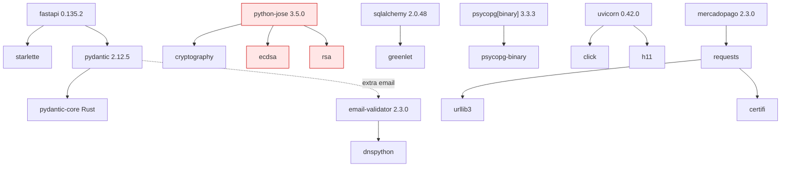

# 14 — Dependencias

← [13 Calidad de Código](13_CalidadCodigo.md) | [Índice](README.md) | Siguiente: [15 Configuración](15_Configuracion.md) →

---

## 1. Resumen

**14 dependencias de runtime en total** (10 backend + 4 frontend). Es un número deliberadamente bajo y una de las
mejores decisiones del proyecto: menos superficie de ataque, menos actualizaciones que gestionar, menos
comportamiento mágico.

🟢 **Todas las versiones del backend están pinneadas de forma exacta** (`==`), lo que hace los builds
reproducibles.
🟡 El frontend usa rangos `^`, así que un `npm install` puede traer minors distintos; `package-lock.json` lo
mitiga.

---

## 2. Backend — runtime (`requirements.txt`)

| Paquete | Versión | Para qué se usa aquí | ¿Necesaria? | Alternativas |
|---|---|---|---|---|
| **fastapi** | 0.135.2 | Framework HTTP: routing, DI, validación, OpenAPI | ✅ Núcleo | Litestar (más rápido, menos ecosistema), Flask + extensiones (más trabajo) |
| **uvicorn** | 0.42.0 | Servidor ASGI | ✅ Núcleo | Hypercorn, Granian, Daphne |
| **sqlalchemy** | 2.0.48 | ORM y Query API | ✅ Núcleo | SQLModel (envuelve a SQLAlchemy), Tortoise (async), Peewee (más simple) |
| **psycopg[binary]** | 3.3.3 | Driver de PostgreSQL | ✅ Núcleo | `asyncpg` (async), `psycopg2` (v2, legacy) |
| **pydantic** | 2.12.5 | Validación de DTOs, `TypedDict` | ✅ Núcleo, viene con FastAPI | — |
| **email-validator** | 2.3.0 | Habilita `EmailStr` de Pydantic | ✅ Sí | Regex propia (peor: validar emails bien es difícil) |
| **python-dotenv** | 1.2.2 | Cargar `backend/.env` en desarrollo | 🟡 Solo en local | `pydantic-settings` cubre esto y más |
| **python-jose[cryptography]** | 3.5.0 | Firmar y validar JWT (HS256) | 🟠 Sustituible | **PyJWT** — mejor mantenido y más usado |
| **passlib** | 1.7.4 | Hash de password (`pbkdf2_sha256`) | 🟠 Sustituible | **argon2-cffi**, **pwdlib**, `bcrypt` directo |
| **mercadopago** | 2.3.0 | SDK oficial de la pasarela | ✅ Sí | HTTP directo con `httpx` (más control, más trabajo) |

### Análisis por dependencia

#### 🟠 `python-jose` — reemplazar por PyJWT
**Uso real:** solo `jwt.encode` y `jwt.decode` en `auth_security_s.py` (2 funciones).
**Problema:** el proyecto tiene mantenimiento irregular y ha acumulado CVEs históricos (confusión de algoritmos,
DoS por JWE). La 3.5.0 es posterior a los parches conocidos, pero la trayectoria preocupa.
**Costo de migrar:** bajo. `PyJWT` tiene una API casi idéntica; el cambio afecta a un solo archivo.
Además elimina la dependencia transitiva de `cryptography` si se usa solo HS256.

```python
# Antes (python-jose)
from jose import ExpiredSignatureError, JWTError, jwt
# Después (PyJWT)
import jwt
from jwt import ExpiredSignatureError, InvalidTokenError as JWTError
```

#### 🟠 `passlib` — evaluar reemplazo
**Uso real:** `CryptContext(schemes=["pbkdf2_sha256"], deprecated="auto")` y sus métodos `hash`/`verify`.
**Problema:** última versión publicada en 2020. El proyecto está efectivamente sin mantenimiento.
**Recomendación inmediata (sin cambiar de librería):** cambiar el esquema a Argon2id o bcrypt.
`deprecated="auto"` **rehashea al vuelo** en el siguiente login exitoso, así que no hace falta migrar datos:

```python
pwd_context = CryptContext(schemes=["argon2", "pbkdf2_sha256"], deprecated="auto")
# requiere: pip install argon2-cffi
```

**Recomendación a medio plazo:** `pwdlib`, sucesor moderno con la misma idea de contextos.

#### 🟡 `python-dotenv` — subsumible por `pydantic-settings`
**Uso real:** una línea, `load_dotenv(ENV_PATH)` en `db/config.py:10`.
**Alternativa:** `pydantic-settings` (paquete hermano de Pydantic, ya presente como ecosistema) leería el `.env`
**y** daría tipado, defaults declarativos y validación en un objeto `Settings` único, reemplazando las 25
funciones `get_*()` de `db/config.py`. Ver [15_Configuracion.md](15_Configuracion.md#recomendacion-settings).

#### ✅ `mercadopago` — justificada
El SDK aporta la estructura de request/response y el manejo de `RequestOptions` con `x-idempotency-key`.
Reimplementarlo con `httpx` daría más control sobre timeouts y reintentos (hoy el SDK obliga a un bucle manual
en `mercadopago_client.py`), pero el costo de mantenimiento no lo justifica al volumen actual.

---

## 3. Backend — desarrollo (`requirements-dev.txt`)

```
-r requirements.txt
alembic==1.18.4
pytest==9.0.2
ruff==0.15.22
```

| Paquete | Para qué | Nota |
|---|---|---|
| **alembic** | Migraciones | ⚠️ **Está en dev pero se usa en producción**: `render.yaml:18` ejecuta `alembic upgrade head` en el `buildCommand`, y ese build instala solo `requirements.txt`. **Hipótesis:** funciona porque Render instala primero y Alembic viene como dependencia transitiva de… nada. Conviene verificarlo: si el build de Render falla con `alembic: command not found`, esta es la causa |
| **pytest** | Tests | 🟢 Los tests usan `unittest.TestCase` ejecutado por pytest |
| **ruff** | Lint | 🟢 Corre en CI (`ci.yml:17`) |

> 🔴 **Hallazgo a verificar (D-01):** `alembic` está en `requirements-dev.txt`, pero `render.yaml` hace
> `pip install -r requirements.txt && alembic upgrade head`. Salvo que Render cachee un entorno previo, el
> comando `alembic` no debería existir. **Recomendación:** mover `alembic` a `requirements.txt`, o cambiar el
> `buildCommand` a `pip install -r requirements.txt -r requirements-dev.txt && alembic upgrade head`.

## 4. Backend — sweeper (`requirements-sweeper.txt`)

```
sqlalchemy==2.0.48
psycopg[binary]==3.3.3
python-dotenv==1.2.2
```

🟢 **Excelente práctica:** el contenedor del sweeper de idempotencia solo necesita hablar con la base, así que
instala 3 paquetes en vez de 10. El `Dockerfile.sweeper` lo comenta explícitamente. Imagen más pequeña, menos
superficie de ataque.

⚠️ El `Dockerfile.sweeper` usa `python:3.11-slim` mientras el resto del proyecto declara Python 3.12
(`ci.yml:15`, `render.yaml:25`). Inconsistencia menor.

---

## 5. Frontend — runtime (`package.json`)

| Paquete | Versión | Para qué | ¿Necesaria? | Alternativas |
|---|---|---|---|---|
| **react** | ^18.3.1 | Librería UI | ✅ Núcleo | Vue, Svelte, Solid |
| **react-dom** | ^18.3.1 | Renderizador web | ✅ Núcleo | — |
| **react-router-dom** | ^6.30.1 | Routing SPA | ✅ Sí | TanStack Router (tipado), Wouter (1,5 kB) |
| **axios** | ^1.16.0 | Cliente HTTP | 🟡 Sustituible | `fetch` nativo + wrapper propio |

### ¿Hace falta axios?

**Lo que se usa realmente** (`services/http.ts`):
1. `axios.create({baseURL, timeout, withCredentials})`
2. Interceptor de respuesta para el refresh automático
3. Serialización JSON automática
4. `error.response.status` y `error.response.data`

Con `fetch` nativo habría que implementar: instancia con base URL, **timeout** (`AbortController`),
interceptores (un wrapper), serialización, y normalización de errores (fetch no rechaza en 4xx/5xx).

Serían ~80 líneas. **Se ahorrarían ~15 kB gzip.**

> 📌 **Veredicto:** axios está justificado. El interceptor de refresh es la pieza central de la autenticación
> y `fetch` no lo da. Migrar sería trabajo con poco retorno.

⚠️ **Pero el manejo de errores está acoplado a la forma de axios**: `http-errors.ts` inspecciona
`error.response.data.detail` y `error.code === "ERR_NETWORK"`. Cambiar de cliente exigiría reescribir esas 318
líneas.

---

## 6. Frontend — desarrollo

| Paquete | Versión | Para qué | Nota |
|---|---|---|---|
| **vite** | ^7.3.6 | Dev server + bundler | 🟢 Estándar actual |
| **@vitejs/plugin-react** | ^5.2.0 | Fast Refresh, JSX | 🟢 |
| **typescript** | ^5.7.3 | Compilador y type checking | 🟢 `strict: true` |
| **vitest** | ^4.1.10 | Test runner | 🟢 Comparte config con Vite |
| **jsdom** | ^29.1.1 | DOM para tests | 🟢 |
| **@testing-library/react** | ^16.3.2 | Utilidades de test | 🟢 |
| **@testing-library/jest-dom** | ^6.9.1 | Matchers de DOM | 🟢 |
| **eslint** | ^9.39.5 | Linter (flat config) | 🟢 |
| **@eslint/js** | ^9.39.5 | Reglas base | 🟢 |
| **typescript-eslint** | ^8.65.0 | Reglas de TS | 🟢 |
| **eslint-plugin-react-hooks** | ^5.2.0 | Reglas de hooks | 🟢 **Crítico** en un proyecto tan basado en hooks |
| **eslint-plugin-react-refresh** | ^0.4.26 | Compatibilidad con Fast Refresh | 🟢 |
| **globals** | ^15.15.0 | Globales del navegador para ESLint | 🟢 |
| **openapi-typescript** | ^7.13.0 | Genera `api.generated.ts` | 🟠 **Se genera y no se usa** |
| **@types/react**, **@types/react-dom** | ^18.3.x | Tipos | 🟢 |

### 🟠 `openapi-typescript` — herramienta correcta, uso incompleto

Está bien elegida y bien integrada en CI (falla si hay drift). El problema es que **el output no se importa**:
el backend no declara `response_model`, así que los tipos generados de respuesta no aportan nada, y el frontend
mantiene tipos escritos a mano en `src/types.ts`.

**No es culpa de la dependencia**, sino de la falta de `response_model` en el backend. Ver
[18_Roadmap.md](18_Roadmap.md#R-06).

---

## 7. Dependencias ausentes que aportarían

### Backend

| Paquete | Para qué | Prioridad |
|---|---|---|
| `pydantic-settings` | Reemplazar `db/config.py` por un `Settings` tipado; elimina `python-dotenv` | 🟠 Alta |
| `pip-audit` (dev) | Escaneo de CVEs en CI | 🔴 Alta |
| `pytest-cov` (dev) | Medición de cobertura | 🟠 Alta |
| `argon2-cffi` | Hash de password moderno vía passlib | 🟠 Alta |
| `httpx` | Cliente HTTP con timeout y reintentos decentes; el SDK de MP obliga a un bucle manual | 🟡 Media |
| `structlog` o `python-json-logger` | Logs estructurados en JSON, parseables | 🟡 Media |
| `mypy` (dev) | Type checking estático | 🟡 Media |
| ~~`tenacity`~~ | ✅ Adoptado (`9.1.4`) — reintentos declarativos en `mercadopago_client` | — |
| `sentry-sdk` | Captura de errores en producción | 🟡 Media |
| `slowapi` | Rate limiting a nivel de endpoint | 🟢 Baja (ya hay uno propio) |

### Frontend

| Paquete | Para qué | Prioridad |
|---|---|---|
| `prettier` | Formateo consistente | 🟠 Alta |
| `@tanstack/react-query` | Caché, deduplicación e invalidación | 🟡 Media (cambio grande) |
| `zod` | Validar respuestas de la API en runtime | 🟡 Media |
| `react-error-boundary` | Evitar la pantalla blanca | 🟠 Alta |
| `@vitest/coverage-v8` | Cobertura | 🟠 Alta |
| `@tanstack/react-virtual` | Virtualizar listas del panel | 🟢 Baja |

---

## 8. Mapa de dependencias transitivas clave



**Notas:**
- ⚠️ `python-jose` arrastra `ecdsa` y `rsa`, dos paquetes con historial de CVEs, **aunque el proyecto solo usa
  HS256** (simétrico, no necesita criptografía asimétrica). Migrar a PyJWT eliminaría ambos.
- ⚠️ El SDK de Mercado Pago arrastra `requests`, que no se usa en ningún otro lugar del proyecto (todo lo demás
  es `httpx` implícito de FastAPI o el propio SDK).
- 🟢 `psycopg[binary]` trae los binarios precompilados: sin toolchain de C en el build. Correcto para Render.
- 🟢 `pydantic-core` está escrito en Rust: validación rápida sin costo de mantenimiento.

---

## 9. Política de versiones

| Aspecto | Backend | Frontend |
|---|---|---|
| Estrategia de pin | 🟢 Exacta (`==`) | 🟡 Rangos (`^`) + lockfile |
| Lockfile | ❌ No hay (`requirements.txt` **es** el pin) | 🟢 `package-lock.json` commiteado |
| Actualización | ❌ Manual, sin Dependabot ni Renovate | ❌ Ídem |
| Auditoría | ❌ Sin `pip-audit` en CI | ❌ Sin `npm audit` en CI |
| Versión de runtime fijada | 🟢 `PYTHON_VERSION=3.12.7` en `render.yaml`, `python-version: "3.12"` en CI | 🟢 `.nvmrc` + `engines.node >= 20` |

> **Recomendaciones:**
> 1. Activar **Dependabot** o **Renovate** con agrupación de minors.
> 2. Añadir `pip-audit` y `npm audit --audit-level=high` al CI.
> 3. Considerar `pip-tools` o `uv` para tener un lockfile real con hashes en el backend.

---

## 10. Análisis de tamaño

### Bundle del frontend (estimado)

| Paquete | Tamaño gzip aprox. |
|---|---|
| react + react-dom | ~45 kB |
| react-router-dom | ~13 kB |
| axios | ~15 kB |
| Código de la aplicación | ~60 kB |
| **Total estimado** | **~133 kB** |

🟢 Muy razonable para una SPA con panel de administración completo. El code splitting por página reduce aún más
la carga inicial: la home solo trae `StorefrontPage`, no `AdminPage` (que es la más pesada).

> 📌 **Hipótesis:** los tamaños son estimaciones basadas en los tamaños publicados de cada paquete. **No se
> ejecutó ningún análisis de bundle** (`rollup-plugin-visualizer`, `vite-bundle-visualizer`).

### Imagen del backend

`python:3.12` + 11 paquetes ≈ 150–200 MB (`tenacity` es Python puro, sin transitivas: ~28 KB).
`Dockerfile.sweeper`: `python:3.11-slim` + 3 paquetes ≈ 60–80 MB. 🟢 Buena optimización.

---

## 11. Licencias

| Paquete | Licencia | Compatible con uso comercial |
|---|---|---|
| fastapi, uvicorn, pydantic, sqlalchemy, psycopg | MIT / BSD | ✅ |
| python-dotenv, email-validator | BSD / CC0 | ✅ |
| python-jose | MIT | ✅ |
| passlib | BSD | ✅ |
| mercadopago | MIT | ✅ |
| tenacity | Apache-2.0 | ✅ |
| react, react-dom, react-router-dom, axios | MIT | ✅ |
| vite, vitest, typescript, eslint | MIT / Apache-2.0 | ✅ |

🟢 **Sin licencias copyleft fuertes (GPL/AGPL).** No hay restricciones para uso comercial ni obligación de
publicar el código derivado.

⚠️ No hay `LICENSE` en la raíz del repositorio. Si el proyecto va a compartirse o publicarse, conviene añadir
una explícita.

---

## 12. Recomendaciones priorizadas

| ID | Recomendación | Beneficio | Esfuerzo | Prioridad |
|---|---|---|---|---|
| <a id="D-01"></a>**D-01** | Verificar/corregir `alembic` en `requirements.txt` | Evita que falle el deploy | 15 min | **P0** |
| <a id="D-02"></a>**D-02** | `pip-audit` + `npm audit` en CI | Detección de CVEs | 1 h | **P1** |
| <a id="D-03"></a>**D-03** | `deprecated="auto"` con Argon2id en passlib | Hash moderno sin migración de datos | 2 h | **P1** |
| <a id="D-04"></a>**D-04** | `react-error-boundary` en el frontend | Evita la pantalla blanca | 2 h | **P1** |
| <a id="D-05"></a>**D-05** | Prettier + `ruff format` | Consistencia de estilo | 2 h | **P1** |
| <a id="D-06"></a>**D-06** | Dependabot o Renovate | Actualizaciones gestionadas | 30 min | **P1** |
| <a id="D-07"></a>**D-07** | `pytest-cov` + `@vitest/coverage-v8` | Medición de cobertura | 2 h | **P1** |
| <a id="D-08"></a>**D-08** | Migrar `python-jose` → `PyJWT` | Menos riesgo, menos transitivas | 4 h | **P2** |
| <a id="D-09"></a>**D-09** | `pydantic-settings` en lugar de `db/config.py` | Config tipada; elimina `python-dotenv` | 1 día | **P2** |
| <a id="D-10"></a>**D-10** | `sentry-sdk` | Errores visibles en producción | 4 h | **P2** |
| <a id="D-11"></a>**D-11** | ✅ ~~`tenacity` en `mercadopago_client`~~ — **hecho** (`tenacity==9.1.4`) | −163/+125 líneas; queda deuda en los tests, ver nota | 4 h + ~2 h | — |
| <a id="D-12"></a>**D-12** | Alinear `Dockerfile.sweeper` a Python 3.12 | Consistencia | 15 min | **P3** |
| <a id="D-13"></a>**D-13** | Añadir `LICENSE` | Claridad legal | 15 min | **P3** |
| <a id="D-14"></a>**D-14** | Evaluar React Query | Caché y deduplicación | 1 semana | **P3** |

> ⚠️ **Deuda residual de D-11 / [R-07](18_Roadmap.md#R-07) — los tests.**
> `test_payment_errors_mapping.py` desactiva el backoff parcheando `mercadopago_client.time.sleep`. tenacity
> resuelve su callable `sleep` al construir el decorador, así que ese parche quedaría muerto; el módulo mantiene
> a propósito un `_retry_sleep` que difiere el lookup de `time.sleep` para que la costura siga funcionando.
>
> Si alguien borra ese wrapper la suite **no falla, se vuelve lenta** (~2,6 s de sueño real). Pendiente: mover
> la espera al test con `_request.retry_with(wait=wait_none())`. ~2 h.

---

← [13 Calidad de Código](13_CalidadCodigo.md) | [Índice](README.md) | Siguiente: [15 Configuración](15_Configuracion.md) →
