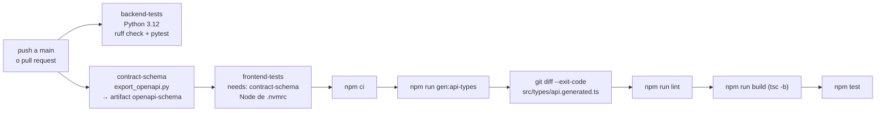

# 15 — Configuración

← [14 Dependencias](14_Dependencias.md) | [Índice](README.md) | Siguiente: [16 Testing](16_Testing.md) →

---

## 1. Docker

### Estado: 🟡 mínimo y parcialmente huérfano

| Archivo | Estado | Comentario |
|---|---|---|
| `backend/Dockerfile.sweeper` | ⚠️ **No usado en la arquitectura actual** | Imagen para el CronJob de Kubernetes |
| `docker-compose.yml` | ❌ **No existe** | No hay entorno de desarrollo containerizado |
| `Dockerfile` del backend | ❌ **No existe** | Render usa su buildpack nativo de Python |
| `Dockerfile` del frontend | ❌ **No existe** | Vercel usa su buildpack nativo de Node |

### `backend/Dockerfile.sweeper`

```dockerfile
FROM python:3.11-slim
WORKDIR /app
ENV PYTHONUNBUFFERED=1
COPY requirements-sweeper.txt /app/requirements-sweeper.txt
RUN pip install --no-cache-dir -r /app/requirements-sweeper.txt
COPY source /app/source
COPY alembic.ini /app/alembic.ini
ENTRYPOINT ["python", "-u", "source/jobs/idempotency_sweeper_job.py"]
```

| Aspecto | Valoración |
|---|---|
| Imagen base `slim` | 🟢 |
| Solo 3 dependencias, no las 10 | 🟢 Comentado en el archivo: *"it's a DB-only CronJob, not a web service"* |
| `--no-cache-dir` | 🟢 |
| `PYTHONUNBUFFERED=1` | 🟢 Logs inmediatos |
| Copia selectiva (`source/` + `alembic.ini`) | 🟢 |
| ⚠️ Python **3.11** mientras el resto usa 3.12 | 🟡 Inconsistencia |
| ⚠️ Corre como **root** | 🟠 Falta `USER nonroot` |
| ⚠️ Sin multi-stage ni `.dockerignore` | 🟡 |
| ⚠️ Sin `HEALTHCHECK` | 🟢 Bajo: es un job, no un servicio |

### Manifiestos de Kubernetes (referencia)

`backend/k8s_idempotency_sweeper_{cronjob,sa,secret,externalsecret}.yaml` describen el sweeper como un CronJob
con ServiceAccount y gestión de secretos por External Secrets Operator.

> ⚠️ **No se usan.** El `README.md:15` lo dice explícitamente: *"quedan como referencia para un despliegue basado
> en Kubernetes; no se usan en la arquitectura Vercel + Render + Supabase, donde el barrido de idempotencia corre
> como uno más de los jobs disparados por el ping de mantenimiento."*
>
> **Recomendación:** moverlos a `docs/reference/k8s/` o `deploy/k8s/` para que quede claro que no forman parte
> del despliegue vigente.

> 💡 **Un `docker-compose.yml` sería la mayor ganancia de onboarding.** Hoy levantar el proyecto en local exige
> **Windows con PowerShell** (los scripts son `.ps1`) más PostgreSQL instalado a mano. Un compose con
> `postgres` + `backend` + `frontend` haría el proyecto multiplataforma en un solo comando.

---

## 2. Variables de entorno — backend

### 2.1 Configuración compartida (mismo valor en cualquier equipo)

| Variable | Default | Validación | Para qué |
|---|---|---|---|
| `APP_ENV` | `local` | — | `local`/`demo` habilitan `seed_demo`; `staging`/`production` lo bloquean |
| `JWT_ALGORITHM` | `HS256` | Obligatoria (no vacía) | Algoritmo de firma |
| `JWT_ISSUER` | `patitasbigotes-api` | Obligatoria | Claim `iss`, validado al decodificar |
| `ACCESS_TOKEN_EXPIRE_MINUTES` | — | **Obligatoria**, > 0 | Vida del access token |
| `REFRESH_TOKEN_EXPIRE_DAYS` | `30` | > 0 | Vida del refresh token |
| `APP_BASE_URL` | `http://localhost:5173` | — | URL del **frontend**; base de los links de email |
| `CORS_ALLOW_ORIGINS` | `http://localhost:5173,http://127.0.0.1:5173` | — | Allowlist exacta, separada por comas |

### 2.2 Cookies de autenticación

| Variable | Default | Validación | Nota |
|---|---|---|---|
| `AUTH_COOKIE_ACCESS_NAME` | `pb_at` | — | |
| `AUTH_COOKIE_REFRESH_NAME` | `pb_rt` | — | |
| `AUTH_COOKIE_SAMESITE` | `lax` | `lax`\|`strict`\|`none`; **`none` exige `Secure`** | 🔒 Fail-fast |
| `AUTH_COOKIE_SECURE` | *(inferido de `APP_BASE_URL`)* | Acepta `1/true/yes/on` y `0/false/no/off` | 🟢 Default seguro |
| `AUTH_COOKIE_DOMAIN` | *(vacío = host-only)* | — | Vacío en producción cross-origin |
| `AUTH_COOKIE_PATH_ACCESS` | `/` | — | |
| `AUTH_COOKIE_PATH_REFRESH` | `/auth` | — | 🟢 Reduce la exposición del refresh |

### 2.3 Secretos y entorno

| Variable | Obligatoria | Validación | Consecuencia si falta |
|---|---|---|---|
| `DATABASE_URL` | ✅ | No vacía | `RuntimeError` al importar `db/session.py` |
| `JWT_SECRET` | ✅ | No vacía | `RuntimeError` en la primera operación de token |
| `MAINTENANCE_RUN_TOKEN` | ✅ en prod | No vacía | El endpoint responde **503** (queda deshabilitado, no abierto) 🔒 |
| `MERCADOPAGO_ACCESS_TOKEN` | ✅ para pagar | No vacía | `RuntimeError` al crear una preferencia |
| `MERCADOPAGO_WEBHOOK_SECRET` | ✅ para webhooks | No vacía | `RuntimeError` al validar la firma |
| `SMTP_HOST` | ✅ en prod | No vacía | **La app no arranca** (`validate_smtp_config`) |
| `SMTP_USERNAME` | ✅ en prod | No vacía | **La app no arranca** |
| `SMTP_PASSWORD` | ✅ en prod | No vacía | **La app no arranca** |
| `MAIL_FROM` | ✅ en prod | No vacía | **La app no arranca** |

### 2.4 Mercado Pago

| Variable | Default | Validación |
|---|---|---|
| `MERCADOPAGO_ENV` | `sandbox` | Debe ser `sandbox` o `production` |
| `MERCADOPAGO_TIMEOUT_SECONDS` | `10` | > 0 |
| `MERCADOPAGO_SUCCESS_URL` | `http://localhost:8000/payments/success` | — |
| `MERCADOPAGO_FAILURE_URL` | `http://localhost:8000/payments/failure` | — |
| `MERCADOPAGO_PENDING_URL` | `http://localhost:8000/payments/pending` | — |
| `MERCADOPAGO_NOTIFICATION_URL` | `http://localhost:8000/payments/webhook/mercadopago` | — |
| `MERCADOPAGO_WEBHOOK_MAX_AGE_SECONDS` | `300` | > 0 |

> ⚠️ **Trampa:** los defaults de `SUCCESS/FAILURE/PENDING_URL` en `db/config.py` apuntan al **puerto 8000**
> (backend), pero el `.env.example` los define en el **5173** (frontend), que es lo correcto. Si alguien borra
> esas variables del `.env`, Mercado Pago redirigirá al backend, que no tiene esas rutas → 404 para el cliente.

### 2.5 SMTP

| Variable | Default | Nota |
|---|---|---|
| `SMTP_HOST` | — | `smtp.gmail.com` en producción |
| `SMTP_PORT` | `587` | > 0. STARTTLS |
| `SMTP_USERNAME` / `SMTP_PASSWORD` | vacíos | Si `USERNAME` está vacío, no se hace `login()` |
| `SMTP_USE_TLS` | `true` | `starttls()` |
| `MAIL_FROM` | — | **Debe ser la misma dirección que `SMTP_USERNAME`** con Gmail |

> 🔊 **Ruidoso al arrancar, silencioso en runtime.** Los emails se despachan después del commit y se tragan sus
> excepciones a propósito: un Gmail caído a las 3 AM no puede voltear una venta. El costo de esa decisión es que en
> runtime **una credencial revocada no da ningún síntoma** — la tienda funciona perfecto y nadie recibe nada, con
> una línea de log que nadie mira.
>
> Por eso `validate_smtp_config()` corre al importar `main.py`: si `APP_ENV` **no** es `local` ni `demo` y falta
> alguna de `SMTP_HOST`, `SMTP_USERNAME`, `SMTP_PASSWORD` o `MAIL_FROM`, **la app no levanta** y el mensaje nombra
> todas las que faltan de una vez. En `local`/`demo` arranca igual y loguea un `WARNING`. Un `APP_ENV` con typo cae
> del lado estricto a propósito.
>
> Un deploy sin credenciales muere en el boot de Render, donde se ve en rojo al instante. Es el único momento en
> que este problema es visible.

### 2.6 Parámetros operativos de los jobs

| Grupo | Variables | Defaults |
|---|---|---|
| Reprocesar webhooks | `WEBHOOK_REPROCESS_{INTERVAL_MINUTES, BATCH_SIZE, MAX_ATTEMPTS, BASE_DELAY_MINUTES, MAX_DELAY_MINUTES}` | 30, 25, 4, 30, 720 |
| Reconciliar pagos | `PAYMENTS_RECONCILE_{INTERVAL_MINUTES, BATCH_SIZE, MAX_AGE_HOURS, MIN_AGE_MINUTES}` | 180, 50, 24, 15 |
| Podar tokens de acción | `AUTH_ACTION_TOKENS_PRUNE_{INTERVAL_MINUTES, OLDER_THAN_DAYS, BATCH_SIZE}` | 1440, 7, 500 |
| Podar throttles | `AUTH_LOGIN_THROTTLES_PRUNE_{INTERVAL_MINUTES, OLDER_THAN_DAYS, BATCH_SIZE}` | 1440, 14, 1000 |
| Expirar reservas | `STOCK_RESERVATIONS_JOB_{INTERVAL_MINUTES, BATCH_LIMIT, MAX_BATCHES}` | 60, 200, 20 |
| Sweeper de idempotencia | `IDEMPOTENCY_{SWEEPER_INTERVAL_MINUTES, PROCESSING_TIMEOUT_MINUTES, SWEEPER_LIMIT}` | 60, 30, 200 |

> ⚠️ Las variables del sweeper de idempotencia **no aparecen en `.env.example`** — se leen con `os.getenv` y
> default en `idempotency_sweeper_job.py:71-73` y `maintenance_s.py:58-65`. Conviene documentarlas.

### 2.7 🔴 Variable crítica **no documentada**: `FORWARDED_ALLOW_IPS`

No aparece en ningún `.env.example`, ni en `render.yaml`, ni en `DEPLOYMENT.md`. **Pero es imprescindible en
producción.**

Uvicorn solo reescribe `request.client.host` desde `X-Forwarded-For` si la conexión viene de una IP listada en
`FORWARDED_ALLOW_IPS` (default: `127.0.0.1`). El código lo documenta en `auth_r.py:64-69`, pero la variable
nunca se configura.

**Consecuencia:** todo el rate limiting por IP en producción usa la IP del proxy de Render → una sola IP para
todos los usuarios → el límite de 20 requests / 5 min se agota globalmente.

> 🔴 Ver [11_Seguridad.md](11_Seguridad.md#R-S-04). **Prioridad P0.**

---

## 3. Variables de entorno — frontend

| Variable | Default | Dónde se usa |
|---|---|---|
| `VITE_API_BASE_URL` | `http://localhost:8000` | `services/http.ts:3` |
| `VITE_API_TIMEOUT_MS` | `60000` | `services/http.ts:7` |

> ⚠️ **Vite "hornea" estas variables en el build.** No se leen en runtime. Cambiar `VITE_API_BASE_URL` exige
> **rebuild y redeploy** del frontend. El `.env.production.example` lo advierte explícitamente.

🔒 Ninguna contiene secretos — correcto, porque todo lo que lleva el prefijo `VITE_` termina en el bundle
público y es visible para cualquiera.

---

## 4. Scripts

### 4.1 Backend — PowerShell (Windows)

| Script | Qué hace | Parámetros |
|---|---|---|
| `bootstrap.ps1` | Crea la venv, instala dependencias, aplica migraciones | `-SeedDemo`, `-EnableJobs` |
| `start-backend.ps1` | `uvicorn main:app` en el puerto 8000 | — |
| `start-frontend.ps1` | `vite` en el puerto 5173 | — |
| `start-app.ps1` | Lanza backend y frontend en ventanas separadas | — |
| `seed-demo.ps1` | Ejecuta `seed_demo` | — |
| `jobs.ps1` | Gestiona las tareas programadas de Windows | `status`\|`enable`\|`disable`\|`reinstall`\|`uninstall` |
| `install-jobs.ps1` | Registra las tareas en Task Scheduler | — |
| `run-job.ps1` | Ejecuta un job puntual | — |
| `start-webhook-reprocess-job.ps1` | Lanza el job de reprocesamiento en primer plano | — |

**Jobs registrados en Task Scheduler** (`jobs.ps1:15-21`):

| Tarea | Frecuencia |
|---|---|
| `PatitasBigotes_WebhookReprocess` | Cada 10 minutos |
| `PatitasBigotes_PaymentsReconcile` | Cada 4 horas |
| `PatitasBigotes_ExpireStockReservations` | Cada 15 minutos |
| `PatitasBigotes_PruneAuthActionTokens` | Diario |
| `PatitasBigotes_PruneAuthLoginThrottles` | Diario |

> ⚠️ **Solo son 5 de los 6 jobs**: el sweeper de idempotencia **no** se registra en local. En producción sí
> corre, porque `maintenance_s.JOBS` lo incluye. Inconsistencia entre entornos.

> ⚠️ El `README.md:45` advierte que conviene **desinstalar** los jobs cuando se deja de usar la app, porque
> quedan como tareas programadas de Windows ejecutándose en segundo plano indefinidamente.

> 🔴 **`.ps1` significa que el proyecto solo se levanta cómodamente en Windows.** No hay equivalentes `.sh` ni
> un `Makefile`. Ver recomendación C-01 en §9.

### 4.2 Backend — Python

`scripts/export_openapi.py` — exporta el esquema OpenAPI **sin servidor ni base de datos**. Setea env dummy
(`DATABASE_URL=sqlite://`, `JWT_SECRET=openapi-export`) antes de importar `main`, porque `db/session.py`
evalúa `DATABASE_URL` al importarse. 🟢 Solución limpia.

### 4.3 Frontend — npm

| Script | Comando | Nota |
|---|---|---|
| `dev` | `vite` | Puerto 5173 |
| `build` | `tsc -b && vite build` | 🟢 **Type check antes de compilar** — el build falla ante error de tipos |
| `preview` | `vite preview` | Sirve el build local |
| `test` | `vitest run` | Sin watch (para CI) |
| `lint` | `eslint .` | — |
| `gen:api-types` | `openapi-typescript ../backend/openapi.json -o ./src/types/api.generated.ts` | Requiere `openapi.json` previo |

---

## 5. Configuración de herramientas

### `backend/ruff.toml`

```toml
line-length = 120
target-version = "py312"
extend-exclude = [".venv"]

[lint]
extend-select = ["W"]

[lint.per-file-ignores]
"tests/**" = ["E402"]     # los tests bootstrapean sys.path antes de importar source.*
"alembic/**" = ["E402"]   # env.py y schema_snapshot siguen el orden de import estándar de migraciones
```

🟢 El archivo incluye 5 líneas de comentario justificando por qué el alcance se mantiene cerca del default
curado de Ruff. Decisión consciente, no descuido.
🟡 Faltan reglas de alto valor: `B` (bugbear), `S` (bandit), `I` (orden de imports), `C90` (complejidad).

### `frontend/eslint.config.js`

Flat config con `js.configs.recommended`, `typescript-eslint`, `react-hooks` y `react-refresh`.

🟢 Ignora `dist` y `src/types/api.generated.ts` con el comentario *"Build output and the generated OpenAPI types
are not hand-authored"*.
🟢 Override para archivos de test que relaja `no-non-null-assertion`, también comentado.
🟡 No incluye `eslint-plugin-jsx-a11y` (accesibilidad) ni `eslint-plugin-import`.

### `frontend/tsconfig.app.json`

```json
{ "target": "ES2020", "lib": ["ES2020","DOM","DOM.Iterable"], "module": "ESNext",
  "moduleResolution": "Bundler", "isolatedModules": true, "noEmit": true,
  "jsx": "react-jsx", "strict": true, "skipLibCheck": true,
  "tsBuildInfoFile": "./tmp/tsbuildinfo/tsconfig.app.tsbuildinfo" }
```

🟢 `strict: true`.
🟢 `tsBuildInfoFile` dirigido a `tmp/` — coherente con la convención de temporales del proyecto.
🟡 Faltan flags de rigor adicional: `noUncheckedIndexedAccess`, `noUnusedLocals`, `noUnusedParameters`,
`exactOptionalPropertyTypes`.
🟡 No hay `paths` configurados → todos los imports son relativos (`../../../services/...`), lo que produce rutas
largas y frágiles. Un alias `@/` mejoraría la legibilidad.

### `frontend/vite.config.ts` y `vitest.config.ts`

Mínimos y correctos. ⚠️ **Vite no define proxy** hacia el backend: el frontend siempre habla con
`VITE_API_BASE_URL`, incluso en desarrollo. Es coherente con producción (cross-origin real), pero significa que
el desarrollo también ejercita CORS y CSRF — lo cual es **bueno**: los bugs de configuración se ven en local.

### ❌ Sin formateador

No hay Prettier ni `ruff format`. El estilo se mantiene por convención. Es la carencia de tooling más evidente.

---

## 6. Configuración de producción

### `render.yaml` (Blueprint del backend)

```yaml
services:
  - type: web
    name: patitasbigotes-api
    runtime: python
    plan: free
    rootDir: backend
    buildCommand: "pip install -r requirements.txt && alembic upgrade head"
    startCommand: "uvicorn main:app --host 0.0.0.0 --port $PORT"
    healthCheckPath: /health
    envVars:
      - key: APP_ENV
        value: production
      - key: PYTHON_VERSION
        value: "3.12.7"
      - key: DATABASE_URL
        sync: false        # ← y 12 secretos más con sync:false
```

| Aspecto | Valoración |
|---|---|
| `sync: false` en todos los secretos | 🟢 Nunca en el repo; se cargan en el dashboard |
| `healthCheckPath` | 🟢 Configurado |
| `PYTHON_VERSION` fijada | 🟢 Reproducible |
| Comentarios explicando el free tier | 🟢 12 líneas de contexto |
| ⚠️ `alembic` no está en `requirements.txt` | 🔴 Ver [14_Dependencias.md](14_Dependencias.md#D-01) |
| ⚠️ Migraciones en el `buildCommand` | 🟠 Un fallo de migración rompe el deploy; exige Supabase despausado |
| ⚠️ Sin `FORWARDED_ALLOW_IPS` | 🔴 Ver §2.7 |
| ⚠️ Sin `numInstances` ni autoscaling | 🟢 Correcto en free tier |

### `frontend/vercel.json`

```json
{ "buildCommand": "npm run build", "outputDirectory": "dist",
  "rewrites": [{ "source": "/(.*)", "destination": "/index.html" }] }
```

🟢 El rewrite es imprescindible para una SPA con rutas del lado del cliente.
🟢 `public/_redirects` da el equivalente para Cloudflare Pages.

### CI — `.github/workflows/ci.yml`



| Aspecto | Valoración |
|---|---|
| 3 jobs, 2 en paralelo | 🟢 |
| Verificación de drift del contrato | 🟢 ⭐ El paso más valioso: cambiar la API sin regenerar tipos rompe el build |
| Node desde `.nvmrc` | 🟢 |
| `npm ci` en vez de `npm install` | 🟢 Reproducible |
| ⚠️ Sin caché de pip ni de npm | 🟡 CI más lento de lo necesario |
| ⚠️ Sin medición de cobertura | 🟠 |
| ⚠️ Sin escaneo de vulnerabilidades | 🟠 |
| ⚠️ Sin tests contra PostgreSQL real | 🟠 Los tests usan SQLite; `FOR UPDATE` no se ejerce |
| ⚠️ Sin deploy automático desde CI | 🟢 Render y Vercel escuchan el repo directamente |

### Cron — `.github/workflows/maintenance.yml`

```yaml
on:
  schedule:
    - cron: "*/13 * * * *"
  workflow_dispatch: {}
```

🟢 Cada 13 minutos (por debajo de la ventana de 15 de Render).
🟢 Valida que los secrets existan antes de intentar el `curl`.
🟢 `--max-time 150` generoso para absorber el cold start.
🟢 Comentario de 10 líneas explicando el triple propósito.
⚠️ `workflow_dispatch` permite dispararlo a mano — útil.
⚠️ **Si el workflow falla, nadie se entera**: no hay notificación configurada.

### Backup — `.github/workflows/db-backup.yml`

🟢 Instala `postgresql-client-17` desde el repo PGDG para que la versión de `pg_dump` sea ≥ la del servidor.
Detalle bien resuelto y comentado.
🟢 Formato `custom` (`--format=custom`) → permite restauración selectiva con `pg_restore`.
🟢 `--no-owner --no-privileges` → el dump es restaurable en otro proyecto.
🟢 El propio workflow reconoce sus límites: *"best-effort free backup, not a managed DR solution"*.
🔴 **Artifacts con retención de 30 días.** No hay copia offsite ni de largo plazo.
🔴 **Nunca se ha probado una restauración** (no hay evidencia en el repo).

---

## 7. `.gitignore`

🟢 Bien construido y **comentado**:

```gitignore
.env
.env.*
!.env.example
!.env.*.example
backend/.env
backend/.env.*
!backend/.env.example
!backend/.env.*.example

# NOTE: src/types/api.generated.ts is committed (not ignored) so the frontend
# builds hermetically on Vercel/Cloudflare, which have no Python to regenerate
# it from the backend. CI regenerates it and fails on drift (see ci.yml).

backend/openapi.json          # generado, no versionado
frontend/tmp/logs/*           # convención tmp con .gitkeep
backend/tmp/{logs,tests,migrations}/*
```

🟢 El patrón `ignorar todo + reincorporar los `.example`` está bien hecho.
🟢 La nota sobre `api.generated.ts` explica una decisión que de otro modo parecería un error.

---

## 8. Configuración de entorno de desarrollo

### `.claude/launch.json`

```json
{ "configurations": [
  { "name": "frontend", "runtimeExecutable": "npm",
    "runtimeArgs": ["--prefix","A:\\PatitasBigotes\\frontend","run","dev"], "port": 5173 },
  { "name": "backend", "runtimeExecutable": "A:\\PatitasBigotes\\.venv\\Scripts\\python.exe",
    "runtimeArgs": ["-m","uvicorn","main:app","--reload","--port","8000",
                    "--app-dir","A:\\PatitasBigotes\\backend"], "port": 8000 }
]}
```

⚠️ **Rutas absolutas hardcodeadas a `A:\PatitasBigotes`.** Solo funciona en esa máquina.
⚠️ No hay `.vscode/launch.json` ni `.idea/` equivalentes para IDEs estándar.

### Convención `tmp/`

`backend/tmp/{logs,tests,migrations}/` y `frontend/tmp/{logs,tsbuildinfo}/` con `.gitkeep`.
🟢 Convención explícita para artefactos temporales, con el contenido ignorado pero la estructura versionada.

---

## 9. Recomendaciones {#recomendacion-settings}

| ID | Recomendación | Beneficio | Esfuerzo | Prioridad |
|---|---|---|---|---|
| <a id="C-00"></a>**C-00** | Documentar y setear `FORWARDED_ALLOW_IPS` | Arregla el rate limiting en producción | 1 h | **P0** |
| <a id="C-01"></a>**C-01** | `docker-compose.yml` (postgres + backend + frontend) | Onboarding multiplataforma en un comando | 1 día | **P1** |
| <a id="C-02"></a>**C-02** | Mover `alembic` a `requirements.txt` | Evita que falle el deploy | 15 min | **P1** |
| <a id="C-03"></a>**C-03** | Prettier + `ruff format` | Consistencia de estilo | 2 h | **P1** |
| <a id="C-04"></a>**C-04** | Caché de pip y npm en CI | CI más rápido | 30 min | **P1** |
| <a id="C-05"></a>**C-05** | Documentar las variables del sweeper en `.env.example` | Completitud | 15 min | **P1** |
| <a id="C-06"></a>**C-06** | Registrar el sweeper también en `jobs.ps1` | Paridad local/producción | 30 min | **P1** |
| <a id="C-07"></a>**C-07** | `pydantic-settings` en vez de las 25 funciones `get_*()` | Config tipada y validada de una vez | 1 día | **P2** |
| <a id="C-08"></a>**C-08** | Alias `@/` en `tsconfig` | Imports legibles | 1 h | **P2** |
| <a id="C-09"></a>**C-09** | Alinear los defaults de `MERCADOPAGO_*_URL` al puerto 5173 | Evita 404 si falta la variable | 15 min | **P2** |
| <a id="C-10"></a>**C-10** | Mover los manifiestos K8s a `deploy/k8s/` | Claridad sobre qué está vigente | 15 min | **P2** |
| <a id="C-11"></a>**C-11** | Sacar las migraciones del `buildCommand` de Render | Un fallo de migración no rompe el deploy | 4 h | **P2** |
| <a id="C-12"></a>**C-12** | Flags estrictos extra en `tsconfig` | Más errores en compilación | 4 h | **P3** |
| <a id="C-13"></a>**C-13** | Alinear `Dockerfile.sweeper` a Python 3.12 y `USER nonroot` | Consistencia y seguridad | 30 min | **P3** |
| <a id="C-14"></a>**C-14** | Notificación si falla el cron de mantenimiento | Detectar el silencio | 1 h | **P3** |
| <a id="C-15"></a>**C-15** | `.vscode/launch.json` con rutas relativas | Onboarding en IDE | 30 min | **P3** |

---

## 10. Checklist de configuración para producción

Extraído de `DEPLOYMENT.md`, `render.yaml` y los `.env.production.example`:

### Supabase
- [ ] Proyecto creado
- [ ] `DATABASE_URL` con `sslmode=require`
- [ ] Proyecto **despausado** antes de cada deploy (el `buildCommand` corre Alembic)

### Render (backend)
- [ ] `APP_ENV=production`
- [ ] `DATABASE_URL`
- [ ] `JWT_SECRET` largo y aleatorio
- [ ] `ACCESS_TOKEN_EXPIRE_MINUTES`
- [ ] `AUTH_COOKIE_SAMESITE=none` **y** `AUTH_COOKIE_SECURE=true`
- [ ] `APP_BASE_URL` = URL del frontend
- [ ] `CORS_ALLOW_ORIGINS` = URL exacta del frontend, sin wildcards
- [ ] `MERCADOPAGO_ACCESS_TOKEN` de producción
- [ ] `MERCADOPAGO_ENV=production`
- [ ] `MERCADOPAGO_SUCCESS/FAILURE/PENDING_URL` → **frontend**
- [ ] `MERCADOPAGO_NOTIFICATION_URL` → **backend** `/payments/webhook/mercadopago`
- [ ] `MERCADOPAGO_WEBHOOK_SECRET`
- [ ] `MAINTENANCE_RUN_TOKEN`
- [ ] 🔴 **SMTP obligatorio**: `SMTP_HOST`, `SMTP_USERNAME`, `SMTP_PASSWORD`, `MAIL_FROM` — sin esto **la app no
      arranca**. El `SMTP_PASSWORD` es un app password de Google y se carga a mano en el dashboard
      (`sync: false` en `render.yaml`). Ver [DEPLOYMENT.md](../DEPLOYMENT.md)
- [ ] 🔴 **`FORWARDED_ALLOW_IPS`** con el rango del proxy de Render

### Vercel / Cloudflare (frontend)
- [ ] Root directory `frontend`
- [ ] `VITE_API_BASE_URL` = URL del backend
- [ ] `VITE_API_TIMEOUT_MS=60000`
- [ ] Rebuild tras cualquier cambio de estas variables

### Mercado Pago
- [ ] Webhook configurado apuntando a `MERCADOPAGO_NOTIFICATION_URL`
- [ ] Secreto del webhook coincidente con `MERCADOPAGO_WEBHOOK_SECRET`

### GitHub (secrets del repositorio)
- [ ] `PROD_API_BASE_URL`
- [ ] `MAINTENANCE_RUN_TOKEN` (mismo valor que en Render)
- [ ] `SUPABASE_DATABASE_URL`

### Verificación posterior
- [ ] `GET /health` responde `{"status":"ok"}`
- [ ] Login funciona (cookies aceptadas cross-origin)
- [ ] El cron de mantenimiento aparece en verde en Actions
- [ ] El backup diario genera artifact
- [ ] Un pago de prueba llega a `paid` por webhook
- [ ] 🔴 **Probar una restauración del backup** — hoy nunca se hizo

---

← [14 Dependencias](14_Dependencias.md) | [Índice](README.md) | Siguiente: [16 Testing](16_Testing.md) →
