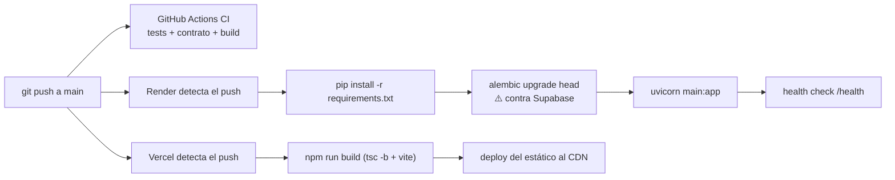
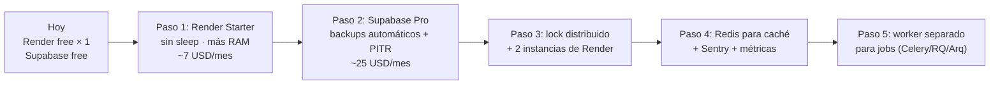

# 17 — Production Readiness

← [16 Testing](16_Testing.md) | [Índice](README.md) | Siguiente: [18 Roadmap](18_Roadmap.md) →

---

## 1. Scorecard

| Dimensión | Score | Estado |
|---|---:|---|
| Deploy y build | **8** | 🟢 Blueprint declarativo, CI que valida el contrato |
| Health checks | **4** | 🟠 Existe, pero es superficial |
| Observabilidad — logs | **6** | 🟡 Buenos logs, efímeros y sin agregación |
| Observabilidad — métricas | **1** | 🔴 Inexistentes |
| Observabilidad — tracing | **0** | 🔴 Inexistente |
| Alertas | **0** | 🔴 Inexistentes |
| Backups | **5** | 🟡 Existen, nunca probados, retención 30 días |
| Recuperación ante desastre | **2** | 🔴 Sin runbook, sin RTO/RPO |
| Escalabilidad | **3** | 🔴 Free tier, una instancia, lock de proceso |
| Alta disponibilidad | **1** | 🔴 SPOF en cada capa |
| Rollback | **6** | 🟡 De código sí, de base no |
| Gestión de secretos | **8** | 🟢 Correcta |
| Resiliencia ante fallos | **8** | 🟢 ⭐ Lo mejor del sistema |
| Runbooks | **4** | 🟡 Solo uno, del sweeper |
| **GLOBAL** | **4,0 / 10** | 🟡 **Apto para demo y piloto; no para producción con volumen real** |

> 📌 **Matiz importante:** el score bajo refleja la **infraestructura**, no el **código**. La lógica de negocio
> tiene una resiliencia notable (reintentos, dead letter, reconciliación, idempotencia). Lo que falta es todo lo
> que rodea al código: observabilidad, alertas, redundancia y procedimientos.

---

## 2. Deploy

### Pipeline actual



| Aspecto | Estado |
|---|---|
| Deploy automático desde `main` | 🟢 |
| Blueprint declarativo (`render.yaml`) | 🟢 |
| Health check configurado | 🟢 |
| Versión de runtime fijada | 🟢 |
| ⚠️ **CI y deploy son independientes** | 🔴 Render y Vercel despliegan **aunque el CI falle** |
| ⚠️ Migraciones en el `buildCommand` | 🟠 Un fallo de migración rompe el deploy completo |
| ⚠️ Sin entorno de staging | 🟠 Se despliega directo a producción |
| ⚠️ Sin blue-green ni canary | 🟠 Free tier no lo permite |
| ⚠️ `alembic` no está en `requirements.txt` | 🔴 Ver [14_Dependencias.md](14_Dependencias.md#D-01) |

> 🔴 **El riesgo más grave del pipeline:** un push que rompe los tests **igualmente se despliega**. Render y
> Vercel escuchan el repositorio, no el resultado del CI.
> **Recomendación:** activar "Deploy only on CI success" en Render/Vercel, o mover el deploy a un job del propio
> workflow con `needs: [backend-tests, frontend-tests]`.

### Rollback

| Escenario | Procedimiento | Estado |
|---|---|---|
| Código del backend | Render → "Rollback to previous deploy" | 🟢 Un clic |
| Código del frontend | Vercel → promover un deployment anterior | 🟢 Un clic |
| **Migración de base** | `alembic downgrade -1` **manual**, desde una consola | 🟠 No automatizado |
| Migración **sin** `downgrade` implementado | ❌ No hay vuelta atrás | 🔴 |

⚠️ **El rollback de código sin rollback de base es peligroso.** Si el deploy N aplicó una migración y se revierte
al N−1, el código viejo corre contra un esquema nuevo. Puede funcionar (si la migración es aditiva) o romperse
(si eliminó o renombró algo).

> **Recomendación:** adoptar **migraciones expand/contract**: nunca eliminar ni renombrar en el mismo deploy que
> introduce el cambio; separar en dos releases. Y verificar que todas las migraciones tengan `downgrade`.

---

## 3. Health checks

### Estado actual

```python
@app.get("/health")
def health_check():
    return {"status": "ok"}
```

🔴 **Solo verifica que el proceso responde.** No comprueba:
- Conectividad con PostgreSQL
- Que las migraciones estén al día
- Que las variables críticas estén configuradas
- Que Mercado Pago sea alcanzable

**Consecuencia:** Render puede reportar el servicio como sano con la base caída. Los usuarios verían 500 mientras
el panel dice "healthy".

> **Recomendación — dos endpoints:**
> ```python
> @app.get("/health")           # liveness: ¿el proceso vive?
> def health(): return {"status": "ok"}
>
> @app.get("/health/ready")     # readiness: ¿puede atender?
> def ready(db: Session = Depends(get_db)):
>     try:
>         db.execute(text("SELECT 1"))
>     except Exception:
>         raise HTTPException(503, "database unavailable")
>     return {"status": "ok", "db": "ok"}
> ```
> `healthCheckPath` de Render debería apuntar a `/health/ready`.

---

## 4. Observabilidad

### 4.1 Logs 🟡

**Lo que hay:** logging estructurado por convención `event=nombre clave=valor`, con buena cobertura de las
acciones sensibles (ver la tabla en [11_Seguridad.md](11_Seguridad.md#16-logging-y-auditoría)).

**Lo que falta:**

| Carencia | Impacto |
|---|---|
| 🔴 Sin agregación | Los logs de Render free viven en la consola web y **se pierden al reiniciar** |
| 🔴 Sin retención | No se puede investigar un incidente de hace 3 días |
| 🟠 Sin `correlation_id` | Imposible seguir una request a través de servicio → job → webhook |
| 🟠 Sin formato JSON | Los logs son texto plano; no se pueden consultar estructuradamente |
| 🟠 Sin nivel configurable | No hay `LOG_LEVEL` en las env |
| 🟠 Sin `duration_ms` por request | No se puede detectar degradación |
| 🟡 PII en logs | Emails en claro en 4 puntos de `auth_r.py` |
| 🟡 `logger.exception` de toda excepción | Ruido que oculta los errores reales |

> **Recomendación mínima (alto retorno, bajo esfuerzo):**
> ```python
> @app.middleware("http")
> async def log_requests(request, call_next):
>     rid = request.headers.get("x-request-id") or str(uuid.uuid4())
>     start = time.monotonic()
>     response = await call_next(request)
>     logger.info("event=http_request request_id=%s method=%s path=%s status=%s duration_ms=%d",
>                 rid, request.method, request.url.path, response.status_code,
>                 int((time.monotonic() - start) * 1000))
>     response.headers["x-request-id"] = rid
>     return response
> ```
> Con eso se obtiene correlación, latencia y tasa de error de una sola vez.

### 4.2 Métricas 🔴

**Inexistentes.** No hay Prometheus, StatsD, OpenTelemetry ni contadores propios expuestos.

🟢 **Lo único que existe:** los jobs emiten métricas de conteo en sus logs
(`selected`, `reconciled`, `failed`, `dead_lettered`, `pruned`, …) y `expire_stock_reservations_job` mide
`duration_ms`. Es información valiosa que **hoy no se agrega ni se grafica**.

**Métricas que deberían existir:**

| Categoría | Métricas |
|---|---|
| Negocio | Órdenes/hora por estado · Tasa de conversión checkout → paid · Ticket promedio · Reservas expiradas/hora · Incidencias abiertas |
| Pagos | Pagos creados/pagados/cancelados · Latencia de Mercado Pago · Tasa de error del proveedor · Webhooks procesados/fallidos/dead-letter |
| Sistema | RPS · Latencia p50/p95/p99 · Tasa de 5xx · Conexiones del pool · Tiempo de query |
| Jobs | Duración de cada job · Ítems procesados · Fallos |

### 4.3 Tracing 🔴

**Inexistente.** Sin OpenTelemetry ni equivalente. Con un monolito el impacto es menor, pero un flujo como
`checkout → MP → webhook → job de reconciliación` es genuinamente distribuido y hoy no se puede seguir.

### 4.4 Error tracking 🔴

**Inexistente.** Sin Sentry ni Rollbar. Un error en producción solo se descubre si alguien mira los logs de
Render o si un usuario se queja.

> **Recomendación:** Sentry tiene plan gratuito generoso y se integra con FastAPI y React en ~10 líneas. Es la
> mejora de observabilidad con mejor relación costo/beneficio.

### 4.5 Alertas 🔴

**Inexistentes.** Nadie recibe notificación si:
- El backend devuelve 5xx sistemáticamente
- El cron de mantenimiento falla (¡y con él dejan de correr los 6 jobs!)
- Se acumulan webhooks en dead letter
- Un reembolso falla
- El backup diario no genera artifact
- La base se acerca al límite de 500 MB de Supabase

> 🔴 **La más crítica: si `maintenance.yml` deja de correr, el sistema pierde silenciosamente la reconciliación
> de pagos, el reprocesamiento de webhooks y la expiración de reservas.** Habría pagos que nunca se confirman y
> stock reservado eternamente, sin que nadie se entere.
>
> **Mitigación mínima:** añadir al workflow un paso `if: failure()` que notifique (email, Slack, o incluso
> abrir un issue con `gh issue create`).

---

## 5. Backups y recuperación

### Lo que hay

`.github/workflows/db-backup.yml`:
- `pg_dump --format=custom --no-owner --no-privileges` diario a las 04:00 UTC
- Almacenado como **artifact de GitHub Actions**, retención 30 días
- 🟢 Instala `postgresql-client-17` desde PGDG para que la versión del cliente sea ≥ la del servidor
- 🟢 El propio workflow reconoce sus límites en un comentario

### Lo que falta

| Aspecto | Estado | Riesgo |
|---|---|---|
| Retención | 30 días | 🟠 Sin copia de largo plazo |
| Ubicación | Artifacts de GitHub | 🟠 Sin copia offsite en un proveedor distinto |
| Cifrado en reposo | El que da GitHub | 🟡 Sin cifrado propio |
| **Prueba de restauración** | ❌ **Nunca se hizo** | 🔴 **Un backup no probado no es un backup** |
| PITR (point-in-time recovery) | ❌ No hay | 🔴 Se pierde hasta 24 h de datos |
| RPO definido | ❌ | 🔴 De facto: **24 horas** |
| RTO definido | ❌ | 🔴 De facto: **desconocido** |
| Runbook de restauración | ❌ | 🔴 |

> 🔴 **Acción P0:** ejecutar **una restauración de prueba** contra un proyecto Supabase desechable y documentar
> el procedimiento y el tiempo que toma. Sin eso, el plan de recuperación es una suposición.

**Procedimiento de restauración (a validar):**
```bash
# 1. Descargar el artifact desde la ejecución del workflow
# 2. Crear un proyecto Supabase nuevo (o vaciar el existente)
pg_restore --no-owner --no-privileges --clean --if-exists \
           -d "$NUEVA_DATABASE_URL" patitas_backup_YYYYMMDDTHHMMSSZ.dump
# 3. Verificar: SELECT count(*) FROM orders; SELECT version_num FROM alembic_version;
# 4. Actualizar DATABASE_URL en Render y redesplegar
```

---

## 6. Escalabilidad

### Límites duros actuales

| Recurso | Límite | Qué pasa al superarlo |
|---|---|---|
| Instancias de Render | **1** (free) | No hay forma de repartir carga |
| RAM | 512 MB | OOM kill |
| CPU | 0,1 compartida | Latencia creciente |
| Pool de conexiones | 5 + 10 overflow | `TimeoutError` al pedir conexión |
| Base Supabase | 500 MB | Escrituras rechazadas |
| Sleep de Render | 15 min sin tráfico | Cold start de 30–60 s |

### Bloqueadores para escalar horizontalmente

| # | Bloqueador | Dónde | Solución |
|---|---|---|---|
| 1 | 🔴 **Lock de mantenimiento en memoria** | `maintenance_s.py:39` — `threading.Lock()` | Lock distribuido (advisory lock de PostgreSQL, o Redis) |
| 2 | 🟠 **`refreshPromise` singleton por cliente** | `http.ts:28` | No es un problema real: es por navegador |
| 3 | 🟠 **Jobs sin coordinación entre instancias** | `jobs/*.py` | Dos instancias podrían correr el mismo job |
| 4 | 🟡 Sin caché compartida | — | Al no haber caché, no hay problema de invalidación distribuida |
| 5 | 🟡 Estado en `db.info` (post-commit actions) | `post_commit_actions_s` | Es por sesión; funciona con N instancias |

> 🟢 **Buena noticia:** el bloqueador real es **uno solo** (el lock de mantenimiento). El resto de la aplicación
> es *stateless*: la sesión vive en cookies + base, el rate limiting está en base, la idempotencia está en base.
> Un `pg_advisory_lock` resolvería el problema en pocas líneas:
> ```python
> db.execute(text("SELECT pg_try_advisory_lock(:key)"), {"key": 20260721})
> ```

### Camino de crecimiento sugerido



---

## 7. Alta disponibilidad

| Componente | Redundancia | SPOF |
|---|---|---|
| Frontend | 🟢 CDN global (Vercel/Cloudflare) | No |
| Backend | 🔴 **Una instancia** | **Sí** |
| Base de datos | 🔴 Instancia única de Supabase free | **Sí** |
| Mercado Pago | 🟡 Externo, sin control | Sí, pero con degradación elegante |
| SMTP | 🟡 Externo | Sí, pero no bloqueante 🟢 |
| Cron de mantenimiento | 🔴 GitHub Actions, sin respaldo | **Sí** |

**Disponibilidad estimada:** 🟡 ~95–98% considerando el sleep del free tier, los cold starts y las ventanas de
mantenimiento de Render y Supabase. **Hipótesis:** no hay medición real de uptime.

---

## 8. Resiliencia ante fallos 🟢 ⭐

**Esta es la mayor fortaleza del sistema en producción.** El código está diseñado asumiendo que las cosas fallan.

| Fallo | Cómo se maneja | Calidad |
|---|---|---|
| **Mercado Pago no responde al crear preferencia** | El pago se persiste con `provider_status='setup_failed'`; el cliente ve 502; el reintento con la misma clave **recupera** solo el paso que falló | 🟢 ⭐ Excelente |
| **El webhook no llega** | El job de reconciliación consulta el estado real cada 13 min | 🟢 ⭐ |
| **El webhook llega dos veces** | Deduplicación por `event_key UNIQUE` | 🟢 |
| **El webhook falla al procesar** | Cola con backoff exponencial (30→60→120 min) y dead letter al 4.º intento | 🟢 |
| **Un evento queda en dead letter** | Endpoint de replay manual para el admin | 🟢 |
| **El SMTP falla** | El envío es post-commit y el error solo se loguea; **el pago no se revierte** | 🟢 ⭐ |
| **El cliente hace doble clic** | Idempotencia en dos niveles | 🟢 ⭐ |
| **La reserva de stock vence** | Reactivación única de 12 h; si no hay stock, cancela la orden y avisa | 🟢 |
| **Un registro de idempotencia queda atascado** | El sweeper lo libera a los 30 min | 🟢 |
| **Un job falla** | El fallo se aísla; los otros 5 siguen (`maintenance_s.py:130-132`) | 🟢 |
| **Un ítem del lote falla** | Commit por ítem: los anteriores se conservan | 🟢 |
| **El cobro llega tarde** | Se registra `PaymentIncident` para revisión humana | 🟢 ⭐ |
| **Un reembolso falla** | Se persiste el estado `failed` con commit propio para que no se pierda | 🟢 |
| **La sesión expira a mitad de uso** | Refresh automático transparente con deduplicación | 🟢 ⭐ |
| **Render está dormido** | Timeout de 60 s en el cliente + ping cada 13 min | 🟢 |
| **El proveedor devuelve un estado desconocido** | `ValueError` → el webhook se marca fallido y reintenta, **no asume nada** | 🟢 ⭐ |

> 📌 **El patrón subyacente:** *fallar de forma segura y recuperable*. Ningún fallo deja el sistema en un estado
> inconsistente sin una vía de recuperación. Es un nivel de cuidado poco habitual.

### Lo que **no** está cubierto

| Fallo | Estado |
|---|---|
| Base de datos caída | 🔴 Todo devuelve 500; sin degradación elegante ni página de mantenimiento |
| Circuit breaker ante Mercado Pago caído | 🔴 Se sigue reintentando indefinidamente, gastando el timeout de cada request |
| Sobrecarga del servicio | 🔴 Sin bulkhead ni cola de admisión |
| Fallo del cron de mantenimiento | 🔴 Silencioso |

---

## 9. Runbooks

### Lo que hay

`backend/IDEMPOTENCY_SWEEPER_RUNBOOK.md` — 🟢 único runbook del proyecto.

### Lo que falta

| Runbook | Prioridad |
|---|---|
| Restaurar la base desde un backup | 🔴 P0 |
| Qué hacer si el cron de mantenimiento está caído | 🔴 P0 |
| Investigar y resolver un pago atascado en `pending` | 🟠 P1 |
| Vaciar la cola de dead letter de webhooks | 🟠 P1 |
| Resolver una incidencia de pago con reembolso manual | 🟠 P1 |
| Rollback de una migración | 🟠 P1 |
| Rotar `JWT_SECRET` (y qué implica) | 🟡 P2 |
| Rotar `MAINTENANCE_RUN_TOKEN` | 🟡 P2 |
| Recuperar tras el pausado de Supabase (7 días) | 🟡 P2 |
| Escalar cuando el free tier no alcance | 🟡 P2 |

---

## 10. Costos

### Hoy: **0 USD/mes** 🟢

| Servicio | Plan | Costo |
|---|---|---|
| Render | Free | 0 |
| Supabase | Free | 0 |
| Vercel | Hobby | 0 |
| GitHub Actions | Free (repo público) | 0 |
| Mercado Pago | Comisión por transacción | Variable |

⚠️ **GitHub Actions en repositorio privado:** el cron cada 13 min son ~3.320 ejecuciones/mes. Aunque cada una
dure ~10 s, el redondeo a minuto de GitHub las cobra como **1 minuto cada una** → ~3.320 minutos/mes, contra
un límite gratuito de 2.000 en cuentas Free.
**Hipótesis:** el repositorio parece público (los workflows corren sin restricción aparente), pero si se hiciera
privado el cron **superaría la cuota gratuita**. Conviene verificarlo.

### Camino a producción real

| Mejora | Servicio | Costo/mes |
|---|---|---|
| Sin sleep + más recursos | Render Starter | ~7 USD |
| Backups automáticos + PITR | Supabase Pro | ~25 USD |
| Error tracking | Sentry Developer | 0 (hasta 5k eventos) |
| Uptime monitoring | UptimeRobot / BetterStack | 0 |
| Agregación de logs | Better Stack / Axiom | 0–10 USD |
| Caché | Upstash Redis | 0–10 USD |
| **Total mínimo viable** | | **~32 USD/mes** |

> 📌 Por ~32 USD/mes se resolverían: cold start, backups reales con PITR, visibilidad de errores y monitoreo de
> disponibilidad. Es la inversión de mayor impacto sobre el score de este documento.

---

## 11. Checklist de production readiness

### 🔴 Bloqueantes para producción con volumen real

- [x] ~~Setear `FORWARDED_ALLOW_IPS` — el rate limiting por IP hoy no funciona~~ — resuelto vía
  `--forwarded-allow-ips '*'` en el `startCommand` de `render.yaml`. Ver §11.1.
- [ ] **Cargar las 21 variables `sync: false` del Blueprint** — ver §11.2. Todas las que importan tienen ahora
  validación al arranque: si falta alguna, el deploy muere en rojo en vez de arrancar roto
- [ ] Verificar que `alembic` esté disponible en el build de Render
- [x] ~~`pool_pre_ping=True` en el engine~~ — resuelto junto con `pool_recycle=300` (`db/session.py`)
- [ ] Alerta si falla el cron de mantenimiento
- [ ] **Probar una restauración de backup**
- [ ] Health check que verifique la base
- [ ] Error tracking (Sentry)
- [ ] Desacoplar deploy de CI (no desplegar si el CI falla)

### 🟠 Importantes

- [ ] Middleware de logging con `duration_ms` y `request_id`
- [ ] Agregación de logs con retención
- [ ] Uptime monitoring externo
- [ ] Lock distribuido para el mantenimiento
- [ ] Backup offsite con retención larga
- [ ] Runbooks de los 5 escenarios más probables
- [ ] Entorno de staging
- [ ] Métricas básicas (RPS, latencia, error rate)
- [ ] Cobertura de tests medida en CI
- [ ] Job de CI con PostgreSQL real

### 🟡 Deseables

- [ ] Tracing distribuido
- [ ] Dashboard de métricas de negocio
- [ ] Circuit breaker ante Mercado Pago
- [ ] Página de mantenimiento
- [ ] Caché (Redis)
- [ ] Worker separado para jobs
- [ ] Tests de carga
- [ ] Migraciones expand/contract documentadas

### 11.1 Resuelto: IP real detrás del proxy de Render

**El problema.** Los rate limits de login y de checkout derivan la IP de `request.client.host`
(`auth_r.py:63-72` y `orders_r.py:69-75`). Uvicorn solo reescribe ese valor desde `X-Forwarded-For`
cuando la conexión entrante viene de una IP listada en `FORWARDED_ALLOW_IPS`, cuyo default es
`127.0.0.1`. En Render la conexión llega desde el proxy interno, así que el header se descartaba y
**todo el tráfico compartía una única IP**: la del proxy. Con `MAX_FAILED_ATTEMPTS = 6` y
`BLOCK_MINUTES = 20` (`auth_rate_limit_s.py:10-12`), 6 logins fallidos de cualquier origen bloqueaban
el login a todos los usuarios legítimos durante 20 minutos. El eje `email` del rate limit nunca
estuvo afectado; el roto era solo el eje `ip`.

**La solución aplicada.** El `startCommand` de `render.yaml` pasa a:

```
uvicorn main:app --host 0.0.0.0 --port $PORT --forwarded-allow-ips '*'
```

No se agregó la variable de entorno `FORWARDED_ALLOW_IPS`: el flag de CLI cumple la misma función y
queda versionado en el repo en lugar de vivir en el dashboard.

**Por qué `'*'` y no un CIDR.** Render no publica un rango estable para su edge, así que una
allowlist estrecha no es mantenible ahí. El comodín es aceptable **únicamente** porque el contenedor
no es alcanzable de forma directa: todo el ingreso pasa por el proxy de Render. Esa premisa es la
que sostiene la seguridad de este cambio.

> ⚠️ **Si esa premisa deja de valer** —el servicio se expone en otro host, se pone otro proxy
> adelante, o se migra fuera de Render— `'*'` pasa a significar que cualquier cliente puede falsear
> su IP con un header y evadir los rate limits por completo. En ese caso hay que leer
> `X-Forwarded-For` explícitamente en los dos helpers y tomar el **último** hop, que es el que el
> proxy controla y el cliente no puede inyectar.

**Pendiente operativo.** Las filas `scope="ip"` ya existentes en `auth_login_throttles` quedaron
acumuladas bajo la IP del proxy. Conviene purgarlas junto con el deploy para no arrastrar bloqueos
espurios sobre lo que ahora es una IP real de cliente.

### 11.2 Variables de entorno a cargar a mano antes del deploy

`render.yaml` declara 30 variables: **9 con valor** y **21 con `sync: false`**. Estas últimas el Blueprint las
pide al crear el servicio, y quedan vacías si alguien las saltea. Esta sección es la lista de qué pasa si falta cada una,
ordenada por **cuándo se entera uno**.

#### ✅ Resuelto: `ACCESS_TOKEN_EXPIRE_MINUTES`

Faltaba en `render.yaml` y no tiene default: `obtener_config_jwt()` tira `RuntimeError` si está vacía, pero
recién al emitir un token. La app arrancaba perfecto —health check verde, catálogo visible— y **el login
respondía 500**. Como el Blueprint sólo pide las `sync: false`, nadie la iba a extrañar hasta que un usuario
intentara entrar.

Ahora está declarada **con valor** (`120`), no en el dashboard. No es un secreto, así que no había razón para
dejarla dependiendo de que alguien se acordara. Si aparece un impulso de "limpiarla" de `render.yaml` por
redundante, el comentario en el archivo explica por qué está ahí.

#### 🟠 Rompen el arranque — se ven en rojo en el deploy

Fallan al importar `main.py`, así que el deploy muere y Render lo muestra al instante. Molestas pero honestas.

| Variable(s) | Validación |
|---|---|
| `DATABASE_URL` | `RuntimeError` al importar `db/session.py` |
| `BANK_TRANSFER_ALIAS` · `_CBU` · `_BANK_NAME` · `_HOLDER` · `_CUIT` · `WHATSAPP_NUMBER` | `validate_bank_transfer_config()` — reporta **todas** las faltantes juntas |
| `SMTP_PASSWORD` | `validate_smtp_config()`. Las otras tres obligatorias (`SMTP_HOST`, `SMTP_USERNAME`, `MAIL_FROM`) ya tienen valor en `render.yaml`; ésta va `sync: false` porque es un secreto |
| `APP_BASE_URL` · `CORS_ALLOW_ORIGINS` | `validate_public_urls_config()` — ver el ✅ de abajo |

#### 🟡 Fallan en runtime, no en el boot

| Variable(s) | Qué pasa si falta |
|---|---|
| `JWT_SECRET` | `RuntimeError` en el primer login |
| `AUTH_COOKIE_SAMESITE` · `AUTH_COOKIE_SECURE` | Con `none` sin `Secure` → `RuntimeError` al setear la cookie. Cross-origin necesita **ambas** (`none` + `true`) |
| `MAINTENANCE_RUN_TOKEN` | `/internal/maintenance/run` responde **503** — queda deshabilitado, no abierto 🔒 |

#### ✅ Resuelto: `APP_BASE_URL` y `CORS_ALLOW_ORIGINS`

Eran el peor caso de toda la lista, porque **no fallaban en ningún lado**. Tienen default apuntando a
`localhost`, así que sin cargarlas no había `RuntimeError`, ni log, ni ningún síntoma del lado del servidor:

| Variable | Default | Síntoma real |
|---|---|---|
| `APP_BASE_URL` | `http://localhost:5173` | Los links de verificación de email y de reset **apuntan a localhost**. Llegan al inbox del cliente y no funcionan para nadie |
| `CORS_ALLOW_ORIGINS` | `http://localhost:5173,...` | El frontend real recibe error de CORS en cada request |

`validate_public_urls_config()` ahora las mueve al grupo 🟠: fuera de `local`/`demo`, si el **valor efectivo**
apunta a `localhost`, `127.0.0.1`, `0.0.0.0` o `::1`, la app no levanta. Mirar el valor efectivo y no "si está
seteada" cubre por igual la variable ausente —que cae al default— y la cargada mal, que son el mismo bug visto
desde dos lados.

Compara por **hostname**, no por substring: un dominio real como `localhost-tools.com` no se confunde. Y acepta
la URL sin esquema (`localhost:5173`), que es como uno la escribe de apuro.

> 📌 **El patrón, ahora explícito.** Un default nunca es "sin configurar": es "configurado para otra cosa". Un
> default cómodo para desarrollo es exactamente lo que vuelve peligrosa a una variable en producción, porque
> reemplaza el error ruidoso por un producto que funciona mal en silencio. Cualquier variable nueva con default
> de desarrollo debería entrar acá.

#### ⚪ No hacen falta mientras MercadoPago siga en pausa

`MERCADOPAGO_ACCESS_TOKEN`, `_ENV`, `_SUCCESS_URL`, `_FAILURE_URL`, `_PENDING_URL`, `_NOTIFICATION_URL`,
`_WEBHOOK_SECRET`. Con `MERCADOPAGO_ENABLED=false` el backend rechaza iniciar pagos con ese método y ninguna
de estas se lee. Al reactivarlo hay que completarlas todas **y** poner `VITE_MERCADOPAGO_ENABLED=true` en el
frontend — son dos switches distintos.

---

## 12. Veredicto

| Pregunta | Respuesta |
|---|---|
| ¿Sirve como **demo técnica**? | ✅ **Sí, sobradamente.** Es el propósito declarado en `README.md:3` |
| ¿Sirve para un **piloto** con clientes reales de bajo volumen? | ✅ **Sí**, resolviendo los 8 bloqueantes 🔴 |
| ¿Sirve para **producción** con volumen sostenido? | ❌ **No todavía.** Faltan observabilidad, alertas, HA y backups probados |
| ¿La **lógica de negocio** está lista para producción? | ✅ **Sí.** Es la parte más madura del proyecto |
| ¿Cuánto falta para producción real? | ~**2 sprints** de trabajo de infraestructura + ~32 USD/mes |

> 📌 **La conclusión más útil:** este proyecto tiene el problema **inverso** al habitual. Normalmente uno
> encuentra buena infraestructura sobre lógica de negocio frágil. Acá la lógica de negocio —idempotencia,
> reservas de stock, reconciliación de pagos, incidencias, reintentos— está pensada con cuidado real, y lo que
> falta es la capa operativa que la rodea. Esa capa es, además, la más barata de agregar.

---

← [16 Testing](16_Testing.md) | [Índice](README.md) | Siguiente: [18 Roadmap](18_Roadmap.md) →
