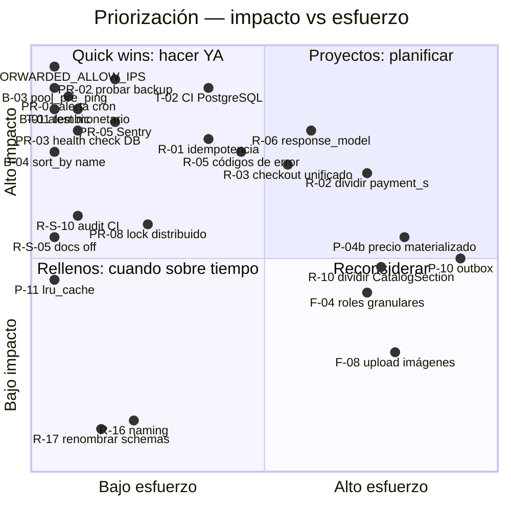

# 18 — Roadmap

← [17 Production Readiness](17_ProductionReadiness.md) | [Índice](README.md) | Siguiente: [19 Glosario](19_Glosario.md) →

---

## Cómo leer este documento

- **Prioridad:** P0 (inmediato) · P1 (este sprint) · P2 (próximo sprint) · P3 (backlog)
- **Impacto:** 🔴 alto · 🟠 medio · 🟡 bajo
- **Costo:** estimación en días-persona
- Cada ítem enlaza al documento donde está el análisis completo

---

## 1. Errores críticos y bugs confirmados

Elementos donde el comportamiento actual **es incorrecto o probablemente lo sea**.

| ID | Problema | Evidencia | Impacto | Costo | Prioridad |
|---|---|---|---|---|---|
| **B-01** | `alembic` no está en `requirements.txt` pero `render.yaml` lo ejecuta en el `buildCommand` | `render.yaml:18` vs `requirements.txt` | 🔴 El deploy podría fallar | 0,1 d | **P0** |
| **B-02** | `FORWARDED_ALLOW_IPS` no configurada → el rate limiting por IP usa la IP del proxy de Render para todos | `auth_r.py:64-69` + ausencia en `render.yaml` y `.env.production.example` | 🔴 Anti-abuso inefectivo en producción | 0,2 d | **P0** |
| **B-03** | Engine sin `pool_pre_ping` → `OperationalError` en la primera request tras el idle | `db/session.py:12` | 🔴 500 esporádicos tras cada cold start | 0,1 d | **P0** |
| **B-04** | ✅ ~~El default de `sort_by` del storefront es `price`, que activa el camino sin paginación en SQL~~ — **resuelto**: el default es `name` | `useStorefrontPage.ts:13` + `products_s.py:604` | 🟠 O(catálogo) en la vista más visitada | 0,1 d | — |
| **B-05** | Defaults de `MERCADOPAGO_SUCCESS/FAILURE/PENDING_URL` apuntan al puerto 8000 (backend) en vez del 5173 (frontend) | `db/config.py:53-71` vs `.env.example:47-49` | 🟠 404 al volver de MP si falta la variable | 0,1 d | **P1** |
| **B-06** | `create_product` acepta el campo `active` del DTO y lo ignora | `schemas/products_s.py:37` vs `products_s.py:390-419` | 🟡 El admin cree que crea un producto inactivo y no es así | 0,2 d | **P1** |
| **B-07** | `update_product(active=...)` propaga a **todas** las variantes; reactivar pierde el estado individual | `products_s.py:374-381` | 🟠 Pérdida silenciosa de configuración de surtido | 0,5 d | **P1** |
| **B-08** | `POST /admin/orders/{id}/payments/manual` exige un pago pendiente **del mismo método** | `payment_s.py:989-990` | 🟠 No se puede registrar una transferencia si el cliente eligió Mercado Pago | 0,5 d | **P1** |
| **B-09** | `useAdminSales` no envía `Idempotency-Key` aunque el endpoint la soporta | `admin-sales-api.ts:66-69` | 🟠 Doble clic puede crear dos ventas | 0,2 d | **P1** |
| **B-10** | El total mostrado en el carrito y en la venta admin usa precio de lista sin descuento | `cart-storage.ts` (guarda `unit_price`), `useAdminSales` | 🟠 El operador/cliente ve un total y el sistema registra otro | 1 d | **P1** |
| **B-11** | `_expire_active_reservations_internal` reasigna `order_id`, que también es parámetro | `stock_reservations_s.py:149` | 🟡 Bomba de tiempo para futuros refactors | 0,2 d | **P2** |
| **B-12** | `expire_active_reservations` no cuenta las reactivadas → el job puede cortar el bucle antes de tiempo | `stock_reservations_s.py:158,180,219` | 🟡 Trabajo pendiente entre ejecuciones | 0,3 d | **P2** |
| **B-13** | El sweeper de idempotencia **no** se registra en `jobs.ps1` (local) pero sí corre en producción | `jobs.ps1:15-21` vs `maintenance_s.py:103-110` | 🟡 Comportamiento distinto entre entornos | 0,2 d | **P2** |
| **B-14** | Render y Vercel despliegan aunque el CI falle | Pipelines independientes | 🔴 Se puede desplegar código roto | 0,3 d | **P1** |

---

## 2. Seguridad

Detalle completo en [11_Seguridad.md](11_Seguridad.md#17-informe-de-riesgos).

| ID | Acción | Impacto | Costo | Prioridad |
|---|---|---|---|---|
| **R-S-04** | Configurar y documentar `FORWARDED_ALLOW_IPS` *(= B-02)* | 🔴 | 0,2 d | **P0** |
| **R-S-05** | Desactivar `/docs`, `/redoc` y `/openapi.json` en producción | 🟠 | 0,1 d | **P1** |
| **R-S-10** | `pip-audit` + `npm audit` en CI | 🟠 | 0,2 d | **P1** |
| **R-S-02** | Migrar el hash de password a Argon2id con `deprecated="auto"` | 🟠 | 0,3 d | **P1** |
| **R-S-01** | Leer `is_admin` de la base en los 6 endpoints no-admin | 🟠 | 0,5 d | **P1** |
| **R-S-07** | Distinguir errores de negocio de errores internos en las respuestas | 🟡 | 0,5 d | **P2** |
| **R-S-06** | Sanitizar el `response_payload` también en `/checkout/guest` | 🟡 | 0,3 d | **P2** |
| **R-S-03** | Rate limiting en endpoints autenticados | 🟠 | 1 d | **P2** |
| **R-S-11** | Tabla `audit_log` para acciones de admin | 🟠 | 2 d | **P2** |
| **R-S-09** | Migrar `python-jose` → `PyJWT` | 🟡 | 0,5 d | **P2** |
| **R-S-12** | Endurecer la política de password | 🟡 | 0,2 d | **P3** |
| **R-S-08** | Validar que `img_url` sea `https://` | 🟢 | 0,1 d | **P3** |
| **R-S-13** | Quitar los emails en claro de los logs | 🟢 | 0,2 d | **P3** |
| **R-S-14** | `Permissions-Policy`, `COOP`, `CORP` | 🟢 | 0,1 d | **P3** |

---

## 3. Refactors

| ID | Refactor | Por qué | Impacto | Costo | Prioridad |
|---|---|---|---|---|---|
| **R-01** | **Extraer la idempotencia HTTP a un decorador/dependencia reutilizable** | Hoy son ~60 líneas repetidas inline en 2 endpoints, con 4 caminos distintos | 🔴 | 1 d | **P1** |
| **R-02** | **Dividir `payment_s.py` (1135 líneas)** en `payment_creation_s`, `payment_transitions_s`, `payment_manual_s` | Terminar la refactorización que el propio docstring reconoce a medias | 🔴 | 3 d | **P1** |
| **R-03** | **Fusionar el checkout autenticado en un solo endpoint** `POST /checkout` | Hoy son 3 requests sin idempotencia entre ellas; un fallo intermedio deja estado parcial | 🔴 | 2 d | **P1** |
| **R-04** | **Enviar los emails de auth con `post_commit_actions`** | `register` y `update_user_profile` mandan SMTP dentro de la transacción | 🟠 | 0,5 d | **P1** |
| **R-05** | **Códigos de error estables en la respuesta** en lugar de comparar `detail` literal | `http-errors.ts` compara strings exactos con `payment_s.py`; un cambio de coma rompe la UI sin test que lo detecte | 🔴 | 2 d | **P1** |
| **R-06** | **Declarar `response_model` en los endpoints** | `api.generated.ts` (3.992 líneas) se genera, se valida en CI y **no se usa**, porque el OpenAPI describe las respuestas como objetos genéricos | 🔴 | 3 d | **P1** |
| **R-07** | **Factorizar el bucle de reintentos de `mercadopago_client`** | ~180 líneas duplicadas 4 veces; con `tenacity` serían decoradores | 🟠 | 0,5 d | **P2** |
| **R-08** | ✅ ~~**Unificar `create_retry_payment_for_order` y `..._for_payment_token`**~~ — **hecho**: guard chain compartido (`_guard_order_retryable`, `_guard_retryable_latest_attempt`) | Quedan ~20 líneas de esqueleto paralelo, irreducibles (identidad por sesión vs. token) | 🟠 | 0,5 d | — |
| **R-09** | **Eliminar `HTTPException` de los servicios** | `users_s` (5 sitios) y `auth_s` (1) rompen la separación de capas e impiden reutilizarlos desde jobs | 🟠 | 0,5 d | **P2** |
| **R-10** | **Dividir `CatalogSection.tsx` (821 líneas) y reducir el prop drilling** | ~95 props; imposible de testear; cualquier cambio re-renderiza todo | 🟠 | 3 d | **P2** |
| **R-11** | **Unificar la estrategia transaccional** | 3 patrones conviviendo en `orders_r.py` | 🟠 | 2 d | **P2** |
| **R-12** | **Descomponer `get_public_order_snapshot_by_payment_token`** (140 líneas) | Mezcla expiración de reservas, selección de pago, validación de URL y cálculo de flags | 🟠 | 1 d | **P2** |
| **R-13** | **Reemplazar los estados `str` por `Enum` de PostgreSQL** | Elimina typos silenciosos y da autocompletado | 🟠 | 1 d | **P3** |
| **R-14** | **Registro de handlers en `domain_events_s`** en lugar de `if/elif` | Abierto a extensión | 🟡 | 0,5 d | **P3** |
| **R-15** | **Consolidar los 5 serializadores de producto** | `products_s.py:52-160` | 🟡 | 1 d | **P3** |
| **R-16** | **Unificar el naming español/inglés** | `calcular_amount`, `firmar_jwt`, `obtener_config_jwt`… | 🟡 | 0,5 d | **P3** |
| **R-17** | **Renombrar `schemas/*_s.py` → `schemas/*_dto.py`** | Elimina la ambigüedad con `services/*_s.py` | 🟡 | 0,3 d | **P3** |
| **R-18** | **Eliminar el código muerto** (≈10 elementos identificados) | Ver [13_CalidadCodigo.md](13_CalidadCodigo.md#yagni) | 🟡 | 0,5 d | **P3** |

---

## 4. Performance

Detalle en [12_Performance.md](12_Performance.md#12-recomendaciones-priorizadas).

| ID | Optimización | Ganancia | Costo | Prioridad |
|---|---|---|---|---|
| **P-08** | `pool_pre_ping=True` + `pool_recycle=1800` *(= B-03)* | Elimina errores de conexión | 0,1 d | **P0** |
| **P-04a** | ✅ ~~Default `sort_by='name'` en el storefront~~ *(= B-04)* — **hecho** | Activa la paginación en SQL | 0,1 d | — |
| **P-11** | `@lru_cache` en `obtener_config_jwt()` | Varias llamadas menos por request | 0,1 d | **P0** |
| **P-12** | Middleware de logging con `duration_ms` | Habilita medir | 0,2 d | **P1** |
| **I-01..06** | 6 índices faltantes | Listados más rápidos | 0,2 d | **P1** |
| **P-05** | Caché de `list_discounts()` | Menos carga en storefront | 0,3 d | **P1** |
| **P-02** | `limit` en `POST /admin/stock-reservations/expire` | Evita transacciones enormes | 0,1 d | **P1** |
| **P-13** | `Cache-Control` en storefront | Alivia el free tier | 0,2 d | **P1** |
| **F-01** | Exponer el perfil desde `AuthContext` | Una request menos por navegación | 0,2 d | **P1** |
| **F-05** | Subir el polling de notificaciones a 2–5 min | Menos carga | 0,1 d | **P1** |
| **P-03** | Paralelizar la reconciliación de pagos | Cabe en la ventana del cron | 0,5 d | **P2** |
| **F-04** | Agrupar los filtros del storefront en un objeto | Una request menos por filtrado | 0,3 d | **P2** |
| **P-06** | Paginación real en `/admin/catalog` | Escala del panel | 1 d | **P2** |
| **P-04b** | Materializar el precio final con descuento | Elimina O(P×V×D) | 3 d | **P3** |
| **P-10** | Patrón outbox para llamadas externas | Elimina bloqueos largos | 5 d | **P3** |

---

## 5. Testing

Detalle en [16_Testing.md](16_Testing.md#6-prioridades).

| ID | Test | Riesgo que cubre | Costo | Prioridad |
|---|---|---|---|---|
| **T-01** | `normalizePaymentAmountsForOrder` | 🔴 Cobro con unidad mal interpretada | 0,2 d | **P0** |
| **T-02** | Job de CI con PostgreSQL real | 🔴 Toda la concurrencia sin verificar | 1 d | **P0** |
| **T-03** | Concurrencia: dos pagos simultáneos | 🔴 Doble cobro | 0,5 d | **P0** |
| **T-04** | Concurrencia: dos compras de la última unidad | 🔴 Sobreventa | 0,5 d | **P0** |
| **T-05** | `useAdminSales.onSubmit` | 🔴 Venta presencial mal registrada | 1 d | **P1** |
| **T-06** | `useAdminPaymentIncidents.resolveWithRefund` | 🔴 Reembolso incorrecto | 0,5 d | **P1** |
| **T-07** | Cobertura en CI con umbral | 🟠 Visibilidad | 0,2 d | **P1** |
| **T-08** | Matriz de flags del snapshot público | 🟠 Botón equivocado en la UI | 1 d | **P1** |
| **T-09** | `create_mercadopago_refund` camino de fallo | 🟠 | 0,5 d | **P1** |
| **T-10** | Reintentos de `mercadopago_client` | 🟠 | 1 d | **P2** |
| **T-13** | E2E con Playwright del checkout | 🟠 | 3 d | **P2** |

---

## 6. Production readiness

Detalle en [17_ProductionReadiness.md](17_ProductionReadiness.md#11-checklist-de-production-readiness).

| ID | Acción | Impacto | Costo | Prioridad |
|---|---|---|---|---|
| **PR-01** | Alerta si falla el cron de mantenimiento | 🔴 Hoy los 6 jobs pueden dejar de correr en silencio | 0,2 d | **P0** |
| **PR-02** | **Probar una restauración de backup** y documentarla | 🔴 Un backup no probado no es un backup | 0,5 d | **P0** |
| **PR-03** | Health check que verifique la base (`/health/ready`) | 🔴 Render reporta sano con la DB caída | 0,3 d | **P0** |
| **PR-04** | Desacoplar deploy de CI *(= B-14)* | 🔴 | 0,3 d | **P1** |
| **PR-05** | Sentry en backend y frontend | 🔴 Errores invisibles hoy | 0,5 d | **P1** |
| **PR-06** | Agregación de logs con retención | 🟠 | 0,5 d | **P1** |
| **PR-07** | Uptime monitoring externo | 🟠 | 0,2 d | **P1** |
| **PR-08** | Lock distribuido (`pg_advisory_lock`) para mantenimiento | 🟠 Único bloqueador real para escalar | 0,5 d | **P2** |
| **PR-09** | Backup offsite con retención larga | 🟠 | 0,5 d | **P2** |
| **PR-10** | Runbooks de los 5 escenarios más probables | 🟠 | 2 d | **P2** |
| **PR-11** | Entorno de staging | 🟠 | 1 d | **P2** |
| **PR-12** | Métricas básicas (RPS, latencia, error rate) | 🟠 | 2 d | **P2** |
| **PR-13** | Circuit breaker ante Mercado Pago | 🟡 | 1 d | **P3** |
| **PR-14** | Tracing distribuido (OpenTelemetry) | 🟡 | 3 d | **P3** |

---

## 7. Mejoras funcionales

Funcionalidad que hoy no existe y que el negocio probablemente necesite.

| ID | Mejora | Justificación | Costo | Prioridad |
|---|---|---|---|---|
| **F-01** | **Notificaciones para clientes** | El modelo `Notification` tiene `user_id` pero **nadie crea notificaciones de cliente**; solo hay para admin | 1 d | **P2** |
| **F-02** | **Historial de incidencias resueltas en el panel** | Hoy solo se ven las `pending_review`; el endpoint ya soporta filtrar por estado | 0,5 d | **P2** |
| **F-03** | **Listar administradores** | No hay endpoint que devuelva quiénes son admin; hay que consultar la base | 0,3 d | **P2** |
| **F-04** | **Roles granulares** (operador de mostrador, solo lectura) | Hoy quien edita el catálogo también puede reembolsar y crear admins | 3 d | **P2** |
| **F-05** | **Control de capacidad en turnos** | Se pueden crear N turnos para el mismo minuto | 1 d | **P2** |
| **F-06** | **Multi-dispositivo** (varias sesiones por usuario) | `user_refresh_sessions.user_id UNIQUE` fuerza una sola sesión | 1 d | **P3** |
| **F-07** | **Soft delete de productos** | Hoy `DELETE` es físico y falla si el producto tiene ventas | 1 d | **P3** |
| **F-08** | **Upload de imágenes** | Hoy solo URLs externas | 3 d | **P3** |
| **F-09** | **Emails HTML con plantillas** | Hoy son texto plano concatenado | 1 d | **P3** |
| **F-10** | **Descuentos por variante** | La UI del panel deja seleccionar variantes pero el modelo solo soporta producto | 2 d | **P3** |
| **F-11** | **Búsqueda avanzada de órdenes** en el panel | Hoy solo filtro por estado y orden | 1 d | **P3** |
| **F-12** | **Exportación a CSV/Excel** de órdenes y ventas | Necesidad habitual de administración | 1 d | **P3** |

---

## 8. Plan por sprints

### Sprint 0 — "Estabilizar producción" (~3 días)

Todos los P0. Es el mínimo antes de poner usuarios reales.

```mermaid
gantt
    title Sprint 0 — P0
    dateFormat X
    axisFormat %s
    section Bloqueantes
    B-01 alembic en requirements       :0, 1
    B-02 FORWARDED_ALLOW_IPS           :0, 1
    B-03 pool_pre_ping                 :1, 1
    B-04 sort_by default name          :1, 1
    P-11 lru_cache config JWT          :1, 1
    section Operación
    PR-01 alerta del cron              :2, 1
    PR-03 health check con DB          :2, 1
    PR-02 probar restauración          :2, 2
    section Tests críticos
    T-01 heurística monetaria          :3, 1
```

> **Estado:** B-04 / P-04a ya está hecho — el default del storefront es `sort_by='name'` y la carga inicial
> usa la paginación en SQL. El resto de los P0 sigue pendiente.

| Resultado esperado |
|---|
| Rate limiting funcionando en producción · Sin 500 tras el cold start · Storefront paginando en SQL · Alerta si el mantenimiento se cae · Health check real · Backup verificado |

### Sprint 1 — "Seguridad y contrato" (~10 días)

| Bloque | Ítems |
|---|---|
| Seguridad | R-S-05, R-S-10, R-S-02, R-S-01 |
| Contrato | R-06 (`response_model`), R-05 (códigos de error) |
| Deploy | B-14 / PR-04, PR-05 (Sentry) |
| Bugs | B-05, B-06, B-08, B-09 |
| Tests | T-02, T-03, T-04, T-07 |

### Sprint 2 — "Refactor del núcleo" (~10 días)

| Bloque | Ítems |
|---|---|
| Refactors | R-01 (idempotencia), R-02 (dividir `payment_s`), R-03 (checkout unificado), R-04 (emails post-commit) |
| Performance | P-12, I-01..06, P-05, P-13, F-01 |
| Tests | T-05, T-06, T-08, T-09 |
| Bugs | B-07, B-10 |

### Sprint 3 — "Escalar y observar" (~10 días)

| Bloque | Ítems |
|---|---|
| Operación | PR-06, PR-07, PR-08, PR-09, PR-10, PR-11, PR-12 |
| Refactors | R-07, R-08, R-09, R-11 |
| Frontend | R-10 (dividir `CatalogSection`) |
| Funcional | F-01 (notificaciones a clientes), F-02, F-03 |

---

## 9. Matriz impacto / esfuerzo

---

## 10. Estimación agregada

| Categoría | Ítems | Días-persona |
|---|---:|---:|
| Errores críticos y bugs | 14 | ~4 |
| Seguridad | 14 | ~7 |
| Refactors | 18 | ~23 |
| Performance | 15 | ~11 |
| Testing | 11 | ~10 |
| Production readiness | 14 | ~13 |
| Mejoras funcionales | 12 | ~16 |
| **TOTAL** | **98** | **~84 días-persona** |

**Por prioridad:**

| Prioridad | Ítems | Días | Interpretación |
|---|---:|---:|---|
| **P0** | 9 | ~3 | 🔴 **Bloqueante.** Sin esto no se debería poner usuarios reales |
| **P1** | 30 | ~19 | 🟠 Primer sprint completo |
| **P2** | 33 | ~30 | 🟡 Consolidación |
| **P3** | 26 | ~32 | 🟢 Evolución |

> 📌 **La lectura más importante:** los 9 ítems P0 suman **~3 días** y resuelven los problemas de mayor riesgo
> del sistema. Es una relación costo/beneficio excepcional: tres días de trabajo separan este proyecto de estar
> operativamente sano.

---

## 11. Riesgos de no actuar

| Si no se hace | Qué pasa | Probabilidad |
|---|---|---|
| B-02 (`FORWARDED_ALLOW_IPS`) | Un solo bot agota el límite de todos los usuarios legítimos | Alta |
| B-03 (`pool_pre_ping`) | 500 esporádicos tras cada cold start, sin explicación aparente | **Muy alta** |
| PR-01 (alerta del cron) | El mantenimiento se cae y **nadie se entera**: pagos sin confirmar, stock reservado eternamente | Media |
| PR-02 (probar backup) | Se descubre que el backup no restaura **justo cuando hace falta** | Baja, impacto catastrófico |
| T-02..T-04 (concurrencia) | Sobreventa o doble cobro bajo tráfico simultáneo | Media |
| R-05 (códigos de error) | Un cambio de texto en el backend rompe silenciosamente los mensajes del frontend | Alta |
| R-06 (`response_model`) | Los tipos del frontend divergen del backend sin que nada avise | Alta |
| B-10 (precio del carrito) | El cliente reclama que pagó distinto de lo que vio | Media |
| PR-05 (Sentry) | Los errores de producción solo se conocen cuando un usuario se queja | **Muy alta** |

---

← [17 Production Readiness](17_ProductionReadiness.md) | [Índice](README.md) | Siguiente: [19 Glosario](19_Glosario.md) →
