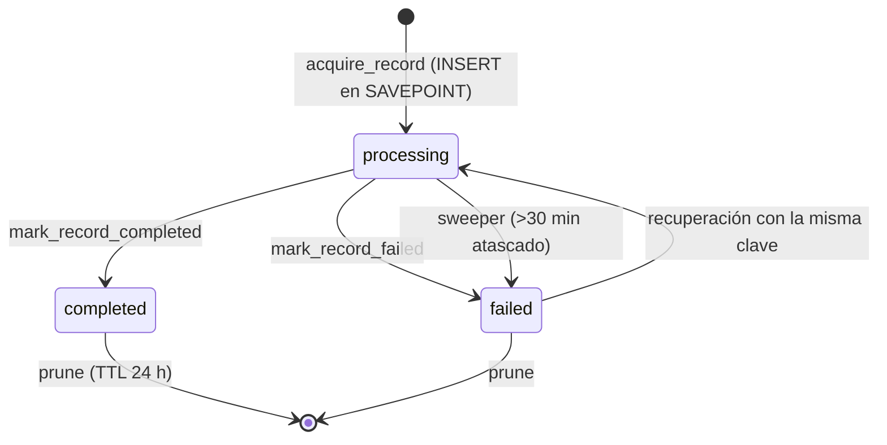
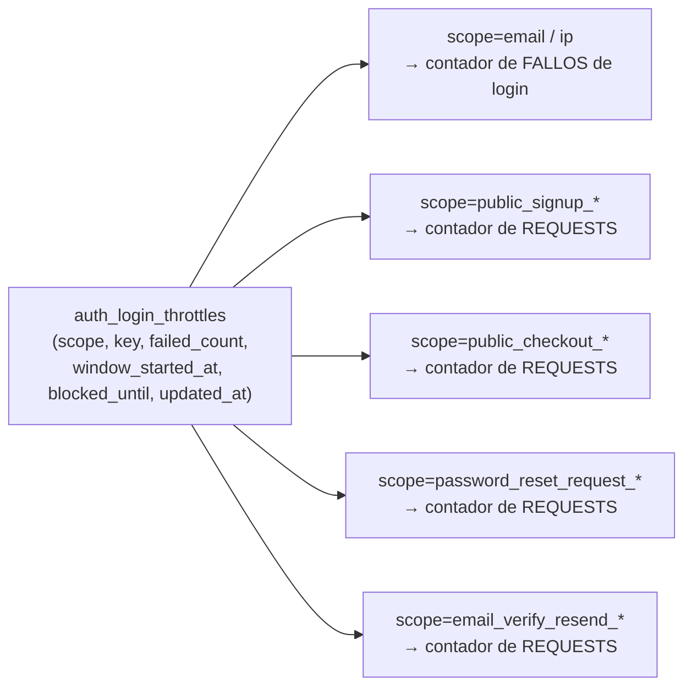
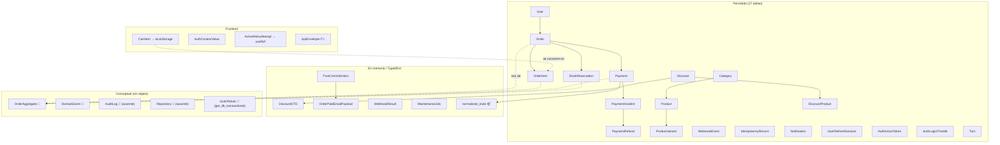

# 20 — Diccionario de Objetos

← [19 Glosario](19_Glosario.md) | [Índice](README.md) | Siguiente: [21 Mapa de Dependencias](21_MapaDependencias.md) →

---

Este documento describe **los objetos que el sistema manipula**, incluyendo los que no son tablas: agregados
conceptuales, DTOs, estructuras en memoria y patrones. Para cada uno se indica si existe como clase real, como
`dict`/`TypedDict`, o solo como concepto implícito.

**Leyenda de forma:**
- 🏛️ **Clase real** (modelo SQLAlchemy, dataclass, TypedDict)
- 📦 **Dict sin tipo** — existe en runtime pero no tiene definición formal
- 💭 **Concepto implícito** — el patrón está presente pero sin objeto que lo represente

---

## 1. Entidades persistidas (17)

Documentadas en detalle en [08_BaseDatos.md](08_BaseDatos.md). Resumen de su rol conceptual:

| Objeto | Forma | Rol conceptual |
|---|---|---|
| `Category` | 🏛️ | Agrupador de catálogo y destino de descuentos |
| `Product` | 🏛️ | Entidad comercial de cara al cliente (sin precio ni stock propios) |
| `ProductVariant` | 🏛️ | **Unidad vendible real** — el SKU |
| `User` | 🏛️ | Persona: invitado, cliente registrado o administrador |
| `Order` | 🏛️ | Raíz del agregado de compra |
| `OrderItem` | 🏛️ | Snapshot inmutable de una línea comprada |
| `Payment` | 🏛️ | Intento de cobro |
| `PaymentIncident` | 🏛️ | Anomalía de cobro que requiere decisión humana |
| `PaymentRefund` | 🏛️ | Devolución de dinero vía proveedor |
| `StockReservation` | 🏛️ | Bloqueo temporal de inventario |
| `Discount` | 🏛️ | Regla de precio |
| `DiscountProduct` | 🏛️ | Tabla puente para `scope='product_list'` |
| `Notification` | 🏛️ | Aviso in-app |
| `WebhookEvent` | 🏛️ | Registro de deduplicación y reintento de eventos externos |
| `IdempotencyRecord` | 🏛️ | Registro de operación idempotente |
| `UserRefreshSession` | 🏛️ | Sesión activa (una por usuario) |
| `AuthActionToken` | 🏛️ | Token de un solo uso |
| `AuthLoginThrottle` | 🏛️ | Contador de rate limiting |
| `Turn` | 🏛️ | Cita de peluquería |

---

## 2. Agregados de dominio

### 💭 `OrderAggregate`

**No existe como clase.** Es el concepto más importante del sistema y solo vive implícito.

**Composición conceptual:**
```
Order (raíz)
├── OrderItem[]              cascade="all, delete-orphan"
├── Payment[]                cascade="all, delete-orphan"
├── StockReservation[]       cascade="all, delete-orphan"
├── PaymentIncident[]        cascade="all, delete-orphan"
├── PaymentRefund[]          cascade="all, delete-orphan"
└── User (referencia)        ondelete="RESTRICT"
```

**Invariantes del agregado** (hoy dispersas entre servicios y constraints):

| Invariante | Dónde se hace cumplir |
|---|---|
| `total_amount == Σ(item.line_total)` | `discount_s.recalculate_order_totals` |
| Una orden `submitted` tiene reservas activas para todos sus ítems | `stock_reservations_s.reserve_stock_for_submitted_order` |
| `paid` solo se alcanza desde `submitted` con un pago confirmado | `payment_s` (2 caminos) |
| Un solo pago `pending` por método | Índice parcial `uq_payments_one_pending_per_order_method` |
| Los ítems solo se editan en `draft` | `orders_s.replace_draft_order_items` |
| `pricing_frozen` impide recalcular | `orders_s._recalculate_order_total` |

> ⚠️ **La consecuencia de no tener el agregado como objeto:** las invariantes están repartidas entre
> `orders_s`, `payment_s`, `stock_reservations_s`, `discount_s` y constraints de base. No hay un solo lugar donde
> leerlas ni un punto único que las garantice al mutar.
>
> **Si el proyecto crece**, encapsularlas en un `OrderAggregate` con métodos `submit()`, `cancel()`,
> `apply_payment()` sería el refactor de mayor impacto estructural.

### 💭 `Cart` (Carrito)

**No existe como entidad.** Tiene **dos encarnaciones distintas** según el tipo de usuario:

| Usuario | Dónde vive | Forma | Tipo |
|---|---|---|---|
| Autenticado | Base de datos | `Order` con `status='draft'` | 🏛️ `Order` |
| Invitado | `localStorage` del navegador | Array JSON bajo `pb_cart_items` | 🏛️ `CartItem[]` (tipo TS) |

```ts
// frontend/src/lib/cart-storage.ts:1-9
export type CartItem = {
  product_id: number;
  product_name: string;      // desnormalizado para no pedir el producto de nuevo
  variant_id: number;
  option_label: string;      // "M / Azul"
  unit_price: number;        // ⚠️ congelado al agregar — puede quedar desactualizado
  quantity: number;
  img_url: string | null;
};
```

> ⚠️ **Asimetría relevante:** el carrito del invitado no sobrevive a un cambio de dispositivo, y su
> `unit_price` puede diferir del precio actual. El backend **siempre repreicia**, así que el importe cobrado es
> correcto, pero el usuario puede ver una cifra y pagar otra.

### 💭 `InventoryReservation`

**Sí existe** como entidad (`StockReservation`), pero el **agregado** de reservas de una orden no.
Toda la lógica de "reservar todo o nada", "reactivar si se puede", "cancelar la orden si no" vive en funciones
sueltas de `stock_reservations_s`.

**Máquina de estados** (ver [08_BaseDatos.md](08_BaseDatos.md#stock_reservations)):
```
active → consumed | released | expired
expired → active (una vez, TTL 12 h) | fin (cancela la orden)
```

### 💭 `PaymentAttempt`

**No existe con ese nombre**, pero es exactamente lo que representa `Payment`: **un intento** de cobro, no el
cobro en sí. Una orden acumula varios `Payment` a lo largo de su vida (uno cancelado, uno expirado, uno pagado).

> 📌 El nombre `Payment` induce a error: sugiere "el pago de la orden" cuando en realidad es "un intento de
> cobro". `PaymentAttempt` sería más preciso.

---

## 3. DTOs de entrada (32 clases Pydantic) 🏛️

Todos en `backend/source/schemas/`, todos con `ConfigDict(extra="forbid")`.

| Grupo | Clases |
|---|---|
| **Auth** (7) | `LoginRequest`, `RegisterRequest`, `EmailRequest`, `TokenRequest`, `PasswordResetConfirmRequest`, `PasswordChangeRequest`, `UpdateMyProfileRequest` |
| **Órdenes** (5 + 5 anidadas) | `ReplaceDraftItemsRequest`, `UpdateOrderStatusRequest`, `AdminRegisterPaymentRequest`, `PublicGuestCheckoutRequest`, `CreateAdminSaleRequest` + `ManualOrderCustomerRequest`, `ManualOrderItemRequest`, `PublicGuestCheckoutItemRequest`, `AdminSalesCustomerRequest`, `AdminSalesPaymentRequest` |
| **Pagos** (4) | `CreateOrderPaymentRequest`, `AdminWebhookReplayRequest`, `PaymentIncidentResolveRefundRequest`, `PaymentIncidentResolveNoRefundRequest` |
| **Catálogo** (9) | `Create/Update/Patch` × `Category`/`Product`/`Variant` |
| **Descuentos** (2) | `CreateDiscountRequest`, `UpdateDiscountRequest` |
| **Turnos** (2) | `CreateTurnRequest`, `UpdateTurnStatusRequest` |
| **Usuarios** (2) | `CreateAdminUserRequest`, `ResolveUserRequest` |

## 4. DTOs de salida

### 🏛️ `PublicOrderSnapshotResponse` — el único con `response_model`

```python
class PublicOrderSnapshotResponse(BaseModel):
    order: PublicOrderSnapshotOrderResponse       # status, total_amount, currency, items[]
    payment: PublicOrderSnapshotPaymentResponse   # method, status, amount, currency, checkout_url
    flags: PublicOrderSnapshotFlagsResponse       # 4 booleanos que deciden qué botón ve el cliente
    blocking_reason: Literal[...] | None          # 6 valores posibles
```

### 📦 Todos los demás — dicts sin tipar

El resto de los endpoints devuelve `{"data": <dict construido a mano>}`. Los constructores son funciones
`_x_to_dict`:

| Función | Módulo | Produce |
|---|---|---|
| `_order_to_dict` | `orders_s` | Orden con cliente, ítems y totales |
| `payment_to_dict` | `payment_core_s` | Pago con `provider_payload` y `provider_payload_data` (promovido a público en el refactor) |
| `_reservation_to_dict` | `stock_reservations_s` | Reserva |
| `_discount_to_dict` | `discount_s` | Descuento con `product_ids` resueltos |
| `_product_to_dict` | `products_s` | Producto admin con stock y `min_var_price` |
| `_variant_to_dict` | `products_s` | Variante admin |
| `_product_to_storefront_dict` | `products_storefront_s` | Producto público con precios con descuento |
| `_variant_to_storefront_dict` | `products_storefront_s` | Variante pública (compatibilidad) |
| `_variant_to_storefront_option` | `products_storefront_s` | Opción del selector |
| `_category_to_dict` | `products_s` | Categoría |
| `_incident_to_dict` | `refund_s` | Incidencia |
| `_refund_to_dict` | `refund_s` | Reembolso |
| `_serialize_notification` | `notifications_s` | Notificación |
| `_turn_to_dict` / `_turn_to_admin_dict` | `turns_s` | Turno (dos vistas) |
| `serialize_user_basic` | `users_s` | Usuario básico |
| `serialize_admin_user` | `users_s` | Usuario para el panel |
| `serialize_my_profile` | `auth_s` | Perfil propio |

> 🔴 **Esta es la causa raíz de que `api.generated.ts` no sirva.** Al no declarar `response_model`, el OpenAPI
> describe todas las respuestas como objetos genéricos, así que los tipos generados no aportan información sobre
> las respuestas y el frontend mantiene los suyos escritos a mano.
> Ver [18_Roadmap.md](18_Roadmap.md#R-06).

---

## 5. Objetos de infraestructura de dominio

### 🏛️ `DiscountDTO` — `TypedDict`

```python
# discount_s.py:17-28
class DiscountDTO(TypedDict):
    id: int
    name: str
    type: str                 # "percent" | "fixed"
    value: int                # 1..100 si percent; centavos si fixed
    scope: str                # "all" | "category" | "product" | "product_list"
    category_id: int | None
    product_id: int | None
    is_active: bool
    starts_at: datetime | None
    ends_at: datetime | None
    product_ids: list[int]    # resuelto desde discount_products
```

**Por qué existe:** el motor de precios (`discount_s`) trabaja con **dicts puros**, no con modelos SQLAlchemy.
Eso lo hace testeable sin base de datos y reutilizable desde `products_s` y `orders_s`.
🟢 Buena decisión de diseño.

### 🏛️ `PostCommitAction` — `TypedDict` {#postcommitaction}

```python
# post_commit_actions_s.py:17-19
class PostCommitAction(TypedDict):
    kind: str                    # "order_paid_email"
    payload: dict[str, Any]
```

**Dónde vive:** en `db.info["post_commit_actions"]`, un diccionario libre que SQLAlchemy asocia a cada `Session`.
**Ciclo de vida:**
```
enqueue → (transacción) → COMMIT → dispatch → ejecutar → clear
                       ↘ ROLLBACK → clear (sin ejecutar)
```
🟢 ⭐ El patrón más elegante del repositorio.

### 🏛️ `OrderPaidEmailPayload` / `OrderPaidEmailLineItem` — `TypedDict`

```python
# email_s.py:17-31
class OrderPaidEmailLineItem(TypedDict):
    product_name: str | None
    variant_label: str
    quantity: int
    line_total: int

class OrderPaidEmailPayload(TypedDict):
    to_email: str
    order_id: int
    order_status: str
    payment_id: int
    total_amount: int
    currency: str
    items: list[OrderPaidEmailLineItem]
```

🟢 El payload del email se construye **dentro** de la transacción (cuando los objetos ORM aún están cargados) y
se envía después. Evita el clásico `DetachedInstanceError`.

### 🏛️ `WebhookResult` — `dataclass(frozen=True)`

```python
# mercadopago_client.py:38-42
@dataclass(frozen=True)
class WebhookResult:
    processed: bool
    reason: str | None = None
    payment: dict | None = None
```

### 🏛️ `MaintenanceJob` — `dataclass(frozen=True)`

```python
# maintenance_s.py:42-45
@dataclass(frozen=True)
class MaintenanceJob:
    name: str
    run: Callable[[], object]
```

Permite que `run_all_maintenance` itere una lista uniforme y aísle el fallo de cada job.

---

## 6. Patrones estructurales

### 💭 `Repository`

**No existe.** Los servicios usan `db.query(Model)` directamente.

| Consecuencia | Detalle |
|---|---|
| ➖ | No se puede testear un servicio sin base de datos → los tests usan SQLite |
| ➖ | Cambiar de ORM implicaría tocar los 27 servicios |
| ➕ | Cero indirección: se lee la query donde se usa |
| ➕ | Sin 27 clases que solo delegarían |

> **Lo más cercano a un repositorio:** las funciones `_x_query(db)` en `orders_s` (`_order_query`,
> `_order_lock_query`) y `_query_admin_products` en `products_s`, que encapsulan la construcción de la query
> con su eager loading.

### 💭 `UnitOfWork`

**Existe implícito** en `get_db_transactional`:

```python
def get_db_transactional() -> Generator[Session, None, None]:
    db = SessionLocal()
    try:
        yield db
        db.commit()          # ← commit al salir
    except Exception:
        db.rollback()        # ← rollback ante cualquier error
        raise
    finally:
        db.close()
```

⚠️ **Pero no es la única estrategia:** conviven `get_db` (sin commit) y el patrón manual
(`get_db` + `db.commit()` + `dispatch_post_commit_actions`). Ver
[02_Arquitectura.md](02_Arquitectura.md#3-gestión-de-transacciones).

### 💭 `Mapper`

**No existe como clase.** El mapeo modelo → dict lo hacen las 17 funciones `_x_to_dict` listadas en §4.

### 💭 `DomainEvent` {#domainevent}

**Existe como concepto, no como objeto.** `publish_domain_event(event_type, payload, db)` recibe un `str` y un
`dict`; no hay una clase `DomainEvent` ni un event store.

**Los 4 eventos y sus payloads (📦 dicts sin tipo):**

| Evento | Payload | Efectos |
|---|---|---|
| `order_submitted` | `{order_id, user_id}` | Notificación admin |
| `order_paid` | `{order_id, user_id, payment_id, payment_method, order_status, total_amount, currency, items[]}` | Notificación admin + email al cliente (post-commit) |
| `order_cancelled` | `{order_id, user_id, reason}` | Notificación admin |
| `possible_refund_detected` | `{order_id, payment_id, incident_id}` | Notificación admin |

> ⚠️ **Los eventos no se persisten.** No hay forma de reconstruir la historia ni de reprocesar un evento.
> El nombre "domain event" es aspiracional: en la práctica es un dispatcher síncrono con `if/elif`.

### 💭 `AuditLog`

**No existe.** Lo más cercano son los logs de texto con convención `event=...`, que en Render free **se pierden
al reiniciar**.

**Lo que sí queda registrado en base, de forma dispersa:**

| Dato de auditoría | Dónde |
|---|---|
| Quién resolvió una incidencia y cuándo | `payment_incidents.resolved_by_user_id`, `resolved_at` |
| Quién pidió un reembolso y por qué | `payment_refunds.requested_by_user_id`, `requested_at`, `provider_payload.requested_reason` |
| Desde qué IP se pidió un token de acción | `auth_action_tokens.requested_ip` |
| Cuándo se confirmó un pago manual y con qué datos | `payments.provider_payload.manual_confirmation` |
| Marcas temporales de la orden | `orders.submitted_at`, `paid_at`, `cancelled_at` |

> **Recomendación (R-S-11):** una tabla `audit_log` para las acciones de admin (crear/revocar admin, cambios de
> precio, reembolsos, confirmaciones manuales). Ver [11_Seguridad.md](11_Seguridad.md).

### 🏛️ `IdempotencyRecord`

Ver §1 y [09_ReglasNegocio.md](09_ReglasNegocio.md#idempotencia). El objeto **sí** existe como tabla.

**Ciclo de vida:**


### 🏛️ `AuthLoginThrottle` como objeto multipropósito

Es la tabla más reutilizada: **una estructura, 15 usos** distinguidos por `scope`.



⚠️ La columna `failed_count` significa cosas distintas según el scope (fallos vs. intentos). Funciona, pero es
semánticamente confuso.

---

## 7. Objetos del frontend

### 🏛️ `AuthContextValue`
```ts
{ isLoading, isAuthenticated, isAdmin, sessionExpired,
  clearSessionExpiredNotice, login(email,password)→Promise<boolean>, logout()→Promise<void> }
```
El único estado global de la aplicación.

### 🏛️ `CartItem`
Ver §2. Objeto de `localStorage`.

### 🏛️ `ActiveRetryAttempt`

Aparece **dos veces** con formas ligeramente distintas:

```ts
// usePaymentReturnStatus.ts:13-16 — contexto de token público
type ActiveRetryAttempt = { idempotencyKey: string; payment: MyPayment | null };

// useProfilePage.ts:13-18 — contexto autenticado
type ActiveRetryAttempt = { orderId: number; sourcePaymentId: number;
                            idempotencyKey: string; payment: MyPayment | null };
```

**Para qué:** guardar en un `useRef` la clave de idempotencia y el pago del intento en curso, de modo que un
segundo clic en "Reintentar" reutilice la misma clave y el backend devuelva el pago ya creado en lugar de crear
otro. 🟢 ⭐ Coordinación cliente-servidor bien resuelta.

### 🏛️ `ApiEnvelope<T>`
```ts
type ApiEnvelope<T> = { data: T; meta?: Record<string, unknown> };
```
Modela el envoltorio uniforme de la API. ⚠️ `meta` es `unknown`, así que cada consumidor castea a mano.

### 🏛️ Tipos de dominio del frontend (`src/types.ts`)

`StorefrontProduct`, `StorefrontOption`, `StorefrontProductDetail`, `NotificationItem`, `LoginResponse`,
`MyProfile`, `MyOrder`, `MyOrderItem`, `MyPayment`, `PublicOrderSnapshot` (+4 anidados),
`PublicOrderBlockingReason`.

### 🏛️ Tipos del panel admin (`src/services/admin-*.ts`)

`AdminProduct`, `AdminCategory`, `AdminVariant`, `AdminCatalog`, `AdminOrder`, `AdminOrderItem`, `AdminPayment`,
`AdminPaymentIncident`, `AdminDiscount`, `AdminSearchUser`, `AdminTurn`, `AdminSalesCustomerPayload` (unión
discriminada 🟢), `AdminSalesPaymentPayload`, `CreateAdminSalePayload`, `CreateAdminSaleResponse`,
`ManualOrderItem`.

### 🏛️ `SaleDraftItem` (`useAdminSales.ts:7-13`)
```ts
type SaleDraftItem = { variant_id, quantity, label, unit_price, line_total };
```
Línea en construcción de una venta de mostrador, antes de enviarla.
⚠️ `unit_price` es el precio de lista **sin descuento** — ver [06_PanelAdmin.md](06_PanelAdmin.md#registrar-venta).

---

## 8. Objetos externos

### 📦 Preferencia de Mercado Pago (request)

```python
{
  "external_reference": "mp-order-42-pay-77",
  "items": [{"id": "77", "title": "Order #42", "quantity": 1,
             "currency_id": "ARS", "unit_price": 12990.0}],   # ⚠️ decimal, no centavos
  "back_urls": {"success": "...?public_status_token=xxx",
                "failure": "...", "pending": "..."},
  "notification_url": "https://<backend>/payments/webhook/mercadopago",
  "expires": True,
  "date_of_expiration": "2026-07-21T18:00:00Z",
  "metadata": {"order_id": 42, "payment_id": 77, "external_ref": "...",
               "public_status_token": "...", "currency": "ARS", "amount": 1299000}
}
```
📍 `mercadopago_normalization_s._build_mercadopago_payload`

### 📦 Estado normalizado del pago (`normalized_state`)

Traducción del payload de Mercado Pago al lenguaje del dominio:

```python
{
  "provider_payment_id": "12345678",
  "provider_status": "approved",
  "provider_status_detail": "accredited",
  "internal_status": "paid",              # ← mapeado desde provider_status
  "external_reference": "mp-order-42-pay-77",
  "amount": 1299000,                      # ← en CENTAVOS
  "currency": "ARS",
  "date_created": "...", "date_approved": "...", "date_last_updated": "...",
  "payment_method_id": "visa", "payment_type_id": "credit_card",
  "payer_id": "...", "payer_email": "...",
  "metadata": {...}, "additional_info": {...}, "transaction_details": {...},
  "raw": {...}                            # ← payload completo del proveedor
}
```
📍 `mercadopago_normalization_s.normalize_mp_payment_state`

### 📦 `provider_payload` de un pago

Blob JSON guardado como `String` en `payments.provider_payload`. Acumula hasta **6 subobjetos** a lo largo de la
vida del pago:

| Clave | Cuándo se escribe | Contenido |
|---|---|---|
| `checkout` | Al crear la preferencia | `provider`, `environment`, `external_ref`, `public_status_token`, `provider_idempotency_key`, `preference_id`, `checkout_url`, `init_point`, `sandbox_init_point`, `amount`, `currency` |
| `instructions` | Pago por transferencia | `alias`, `bank_name`, `reference`, `amount`, `currency` |
| `last_event` | Cada webhook recibido | Payload crudo de la notificación |
| `payment_lookup` | Cada consulta al proveedor | `normalized_state.raw` |
| `reconciliation` | Cada aplicación de estado | `provider_payment_id`, `external_reference`, `provider_status`, `internal_status`, `amount_consistent`, `currency_consistent`, `date_last_updated` |
| `manual_confirmation` | Confirmación manual | `payment_ref`, `method`, `amount_paid`, `change_amount`, `confirmed_at` |
| `checkout_setup_error` | Fallo al crear la preferencia | `detail`, `failed_at` |

> ⚠️ Es `String`/`Text`, no `JSONB`: **no se puede consultar por SQL**. Toda inspección requiere `json.loads` en
> Python. Ver [08_BaseDatos.md](08_BaseDatos.md#8-deudas-del-modelo-de-datos).
> ⚠️ Se devuelve **completo** al cliente en `payment_core_s::payment_to_dict`.

### 📦 Payload del webhook de Mercado Pago

```json
{ "id": 123456789, "type": "payment", "action": "payment.updated",
  "data": { "id": "98765432" }, "date_created": "...", "live_mode": true }
```
Headers: `x-signature: ts=1721577600,v1=<hmac>` · `x-request-id: <uuid>`

---

## 9. Objetos ausentes que aportarían

| Objeto | Qué resolvería | Prioridad |
|---|---|---|
| `Money` (value object) | Hoy los importes son `int` sueltos; un tipo con moneda impediría sumar ARS con USD y documentaría que son centavos | 🟡 |
| `OrderStatus` / `PaymentStatus` (Enum) | Elimina typos silenciosos y da autocompletado | 🟠 |
| `OrderAggregate` | Un solo lugar para las invariantes de la orden | 🟠 |
| `DomainEvent` (clase + event store) | Trazabilidad y reprocesamiento de eventos | 🟠 |
| `AuditLog` | Auditoría consultable de acciones de admin | 🟠 |
| `PaymentProvider` (interfaz) | Permitiría agregar otra pasarela sin tocar `refund_s` ni `payment_s` | 🟡 |
| `Repository` por agregado | Testear servicios sin base de datos | 🟡 |
| `Result`/`Either` | Reglas de negocio como valores de retorno, no como excepciones | 🟢 |
| DTOs de respuesta tipados | Haría útil `api.generated.ts` | 🔴 |

---

## 10. Mapa conceptual



---

← [19 Glosario](19_Glosario.md) | [Índice](README.md) | Siguiente: [21 Mapa de Dependencias](21_MapaDependencias.md) →
