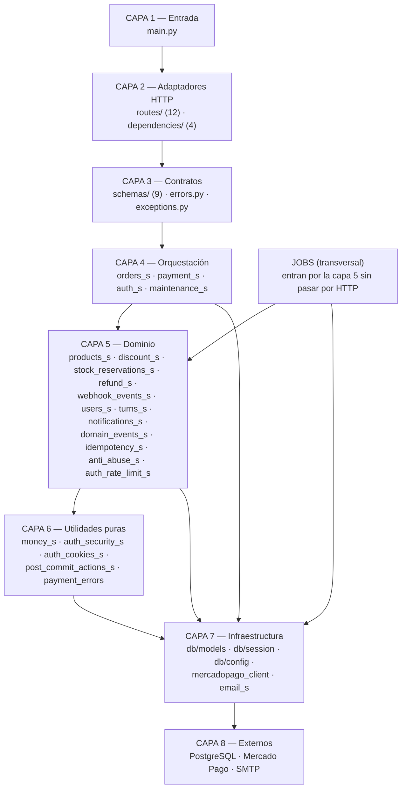
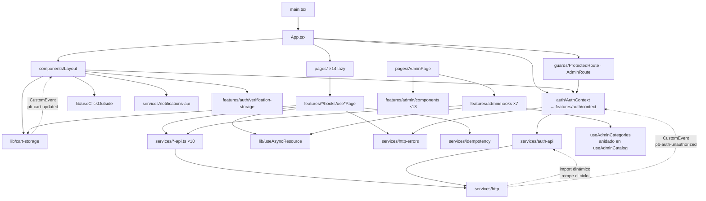

# 21 — Mapa de Dependencias entre Módulos

← [20 Diccionario de Objetos](20_DiccionarioObjetos.md) | [Índice](README.md) | Siguiente: [22 Índice de Lectura](22_IndiceLectura.md) →

---

> **Metodología:** el grafo se extrajo analizando estáticamente todos los `from source.* import` e
> `import source.*` de `backend/source/`, distinguiendo los que están a nivel de módulo (columna 0) de los que
> están dentro de una función (indentados). El análisis del frontend se hizo sobre los imports relativos.

---

## 1. Resultado de la detección de ciclos

### ✅ **No hay ciclos a nivel de módulo**

El análisis estático sobre el grafo de imports de nivel de módulo devuelve **cero ciclos**.

### 🟢 Cuatro imports diferidos que rompen ciclos deliberadamente

| Origen | Destino | Dónde | Qué ciclo evita |
|---|---|---|---|
| `mercadopago_client` | `mercadopago_normalization_s` | `mercadopago_client.py:336` | `mercadopago_normalization_s` lo importa a nivel de módulo |
| `mercadopago_client` | `payment_s` | `mercadopago_client.py:337` | `payment_s → mercadopago_normalization_s → mercadopago_client` |
| `mercadopago_client` | `webhook_events_s` | `mercadopago_client.py:389` | `webhook_events_s → mercadopago_client` |
| `webhook_events_s` | `mercadopago_client` | `webhook_events_s.py:308` | El sentido inverso del anterior |

**El código lo documenta:**
```python
# mercadopago_client.py:334-335
# Local imports avoid a module cycle: mercadopago_normalization_s imports this
# client module at module level (for create_checkout_preference).
```

### 🟢 Una duplicación deliberada para evitar un ciclo

```python
# mercadopago_normalization_s.py:44-47
def _normalize_optional_str(value: str | None) -> str | None:
    # Intentionally duplicated from payment_s._normalize_optional_str: payment_s
    # imports from this module (for checkout payload building), so importing back
    # from payment_s here would create a circular import. It's a trivial pure helper.
```

> 📌 **Valoración:** los ciclos están **identificados, rotos y documentados**. Es un manejo maduro de un problema
> real. La contrapartida es que un import diferido dentro de una función **oculta la dependencia** a las
> herramientas de análisis y a quien lee el archivo de arriba abajo.

---

## 2. Grafo completo del backend

```mermaid
flowchart TD
    subgraph ENTRY["Entrada"]
        MAIN[main.py]
    end

    subgraph ROUTES["Routers (12)"]
        R_ORD[orders_r]
        R_AUTH[auth_r]
        R_PROD[products_r]
        R_PAY[payments_r]
        R_MP[mercadopago_r]
        R_STORE[storefront_r]
        R_NOTIF[notifications_r]
        R_USERS[users_r]
        R_DISC[discounts_r]
        R_TURNS[turns_r]
        R_MAINT[maintenance_r]
        R_STOCK[stock_reservations_r]
    end

    subgraph DEPS["Dependencias"]
        D_AUTH[auth_d]
        D_CSRF[csrf_d]
        D_SEC[security_headers_d]
        D_MP[mercadopago_d]
    end

    subgraph SVC["Servicios de dominio"]
        S_ORD[orders_s]
        S_PAY[payment_s]
        S_PROD[products_s]
        S_DISC[discount_s]
        S_STOCK[stock_reservations_s]
        S_REF[refund_s]
        S_WH[webhook_events_s]
        S_MPC[mercadopago_client]
        S_MPN[mercadopago_normalization_s]
        S_PAQ[payment_admin_queries_s]
        S_AUTH[auth_s]
        S_ASEC[auth_security_s]
        S_ATOK[auth_tokens_s]
        S_ACOOK[auth_cookies_s]
        S_ARL[auth_rate_limit_s]
        S_ABUSE[anti_abuse_s]
        S_USERS[users_s]
        S_NOTIF[notifications_s]
        S_DE[domain_events_s]
        S_PCA[post_commit_actions_s]
        S_MAIL[email_s]
        S_IDEM[idempotency_s]
        S_MONEY[money_s]
        S_TURNS[turns_s]
        S_MAINT[maintenance_s]
        S_PERR[payment_errors]
    end

    subgraph CORE["Núcleo"]
        MODELS[db.models]
        SESSION[db.session]
        CONFIG[db.config]
        ERRORS[errors]
        EXC[exceptions]
        SCHEMAS[schemas]
    end

    subgraph JOBS["Jobs (6)"]
        J_REC[reconcile_pending_payments]
        J_WH[reprocess_failed_webhooks]
        J_STOCK[expire_stock_reservations]
        J_IDEM[idempotency_sweeper]
        J_TOK[prune_auth_action_tokens]
        J_THR[prune_auth_login_throttles]
    end

    MAIN --> R_ORD & R_AUTH & R_PROD & R_PAY & R_MP & R_STORE & R_NOTIF & R_USERS & R_DISC & R_TURNS & R_MAINT & R_STOCK
    MAIN --> D_CSRF & D_SEC & CONFIG

    R_ORD --> S_ORD & S_PAY & S_PAQ & S_IDEM & S_ABUSE & S_PCA & S_PERR & D_AUTH & SCHEMAS & ERRORS & SESSION
    R_AUTH --> S_AUTH & S_ASEC & S_ATOK & S_ACOOK & S_ARL & S_ABUSE & S_MAIL & S_USERS & D_AUTH & SCHEMAS & ERRORS & SESSION & CONFIG
    R_PAY --> S_PAY & S_PAQ & S_REF & D_AUTH & SCHEMAS & ERRORS & SESSION
    R_MP --> S_MPC & S_WH & S_PCA & D_AUTH & SCHEMAS & ERRORS & SESSION
    R_PROD --> S_PROD & D_AUTH & SCHEMAS & ERRORS & SESSION
    R_STORE --> S_PROD & ERRORS & SESSION
    R_NOTIF --> S_NOTIF & D_AUTH & ERRORS & SESSION
    R_USERS --> S_USERS & D_AUTH & SCHEMAS & ERRORS & SESSION
    R_DISC --> S_DISC & D_AUTH & SCHEMAS & ERRORS & SESSION
    R_TURNS --> S_TURNS & D_AUTH & SCHEMAS & ERRORS & SESSION
    R_MAINT --> S_MAINT & CONFIG
    R_STOCK --> S_STOCK & D_AUTH & ERRORS & SESSION

    S_ORD --> S_DISC & S_PAY & S_PROD & S_STOCK & S_DE & S_PCA & S_USERS & S_MPN & MODELS & EXC
    S_PAY --> S_REF & S_DE & S_MPN & S_STOCK & MODELS & EXC
    S_PROD --> S_DISC & MODELS & SESSION
    S_DISC --> S_MONEY & MODELS
    S_STOCK --> S_DE & MODELS
    S_REF --> S_MPC & S_DE & MODELS
    S_WH --> S_PAY & MODELS & EXC
    S_MPN --> S_MPC & S_MONEY & CONFIG
    S_MPC --> D_MP & CONFIG & S_PERR
    S_PAQ --> S_PAY & S_REF & MODELS
    S_AUTH --> S_ASEC & S_ATOK & S_MAIL & MODELS & CONFIG
    S_USERS --> S_ASEC & SCHEMAS & MODELS
    S_ARL --> S_ABUSE & MODELS
    S_DE --> S_NOTIF & S_PCA & MODELS
    S_PCA --> S_MAIL
    S_MAIL --> CONFIG
    S_ACOOK --> CONFIG
    S_ATOK --> MODELS
    S_ABUSE --> MODELS
    S_NOTIF --> MODELS
    S_IDEM --> MODELS
    S_TURNS --> MODELS
    S_MAINT --> J_REC & J_WH & J_STOCK & J_IDEM & J_TOK & J_THR

    D_AUTH --> S_ASEC & S_ACOOK & MODELS & SESSION
    D_CSRF --> CONFIG
    D_SEC --> CONFIG
    D_MP --> CONFIG
    ERRORS --> EXC & S_PERR
    SESSION --> CONFIG

    J_REC --> S_MPC & S_MPN & S_PAY & S_PCA & SESSION
    J_WH --> S_MPC & S_WH & S_PCA & SESSION
    J_STOCK --> S_STOCK & SESSION
    J_IDEM --> S_IDEM & MODELS & SESSION
    J_TOK --> S_ATOK & SESSION
    J_THR --> S_ARL & SESSION

    S_MPC -.->|"import diferido"| S_MPN
    S_MPC -.->|"import diferido"| S_PAY
    S_MPC -.->|"import diferido"| S_WH
    S_WH -.->|"import diferido"| S_MPC
```



---

## 3. Métricas de acoplamiento

### Fan-out — módulos que dependen de más cosas

| Módulo | Fan-out | Valoración |
|---|---:|---|
| `routes/auth_r` | 13 | 🟡 Alto, pero es un router: orquestar es su trabajo |
| `routes/orders_r` | 11 | 🟠 Alto para un router; señal de que hace demasiado |
| `services/orders_s` | **10** | 🔴 **El servicio con más dependencias del sistema** |
| `schemas/__init__` | 8 | 🟢 Barrel de reexport, esperado |
| `routes/payments_r` | 7 | 🟢 |
| `routes/mercadopago_r` | 7 | 🟢 |
| `services/payment_s` | 6 | 🟠 |
| `services/auth_s` | 5 | 🟢 |
| `routes/products_r` | 5 | 🟢 |
| `jobs/reconcile_pending_payments_job` | 5 | 🟢 |

> 🔴 **`orders_s` con fan-out 10** confirma lo que ya señalaba [13_CalidadCodigo.md](13_CalidadCodigo.md):
> es un servicio que hace demasiadas cosas. Depende de precios, pagos, catálogo, stock, eventos, acciones
> post-commit, usuarios, normalización de MP, modelos y excepciones.

### Fan-in — módulos de los que depende más gente

| Módulo | Fan-in | Valoración |
|---|---:|---|
| `db/models` | **20** | 🟢 Esperado: es el modelo de datos |
| `db/session` | **20** | 🟢 Esperado |
| `db/config` | 12 | 🟢 Esperado |
| `errors` | 11 | 🟢 Punto único de traducción de errores |
| `dependencies/auth_d` | 10 | 🟢 |
| `schemas` | 9 | 🟢 |
| `services/payment_s` | **6** | 🟠 Un servicio de dominio con fan-in 6 es un cuello: cambiarlo afecta a 6 módulos |
| `services/post_commit_actions_s` | 6 | 🟢 Módulo pequeño y estable |
| `services/mercadopago_client` | 5 | 🟢 |
| `services/auth_security_s` | 5 | 🟢 |
| `services/discount_s` | 4 | 🟢 |
| `services/domain_events_s` | 4 | 🟢 |
| `services/stock_reservations_s` | 4 | 🟢 |

### Inestabilidad (métrica de Martin)

`I = fan-out / (fan-in + fan-out)` — 0 = máximamente estable, 1 = máximamente inestable.

| Módulo | Fan-in | Fan-out | I | Interpretación |
|---|---:|---:|---:|---|
| `db/models` | 20 | 0 | **0,00** | 🟢 Perfectamente estable — correcto para el modelo de datos |
| `db/config` | 12 | 0 | **0,00** | 🟢 Perfectamente estable |
| `payment_errors` | 3 | 0 | **0,00** | 🟢 |
| `money_s` | 2 | 0 | **0,00** | 🟢 ⭐ Núcleo puro sin dependencias |
| `exceptions` | 4 | 0 | **0,00** | 🟢 |
| `db/session` | 20 | 1 | **0,05** | 🟢 |
| `auth_security_s` | 5 | 0 | **0,00** | 🟢 |
| `discount_s` | 4 | 2 | **0,33** | 🟢 Buen balance |
| `stock_reservations_s` | 4 | 2 | **0,33** | 🟢 |
| `payment_s` | 6 | 6 | **0,50** | 🟠 Zona de dolor: mucha gente depende de él **y** él depende de mucha gente |
| `products_s` | 3 | 3 | **0,50** | 🟠 |
| `domain_events_s` | 4 | 3 | **0,43** | 🟢 |
| `orders_s` | 1 | 10 | **0,91** | 🟢 Muy inestable, pero **correcto**: es un orquestador, casi nadie depende de él |
| Routers | 0–1 | 5–13 | **~1,00** | 🟢 Correcto: la capa más externa debe ser la más inestable |

> 📌 **Interpretación:** el perfil de estabilidad es **sano**. Los módulos estables (`models`, `config`,
> `money_s`, `payment_errors`) son justamente los que no deberían cambiar. Los inestables son los routers, que
> es donde se espera el cambio.
>
> ⚠️ **La única anomalía real es `payment_s` con I = 0,50.** Está en la "zona de dolor" de Martin: cambiarlo
> afecta a 6 módulos, y 6 módulos pueden forzarlo a cambiar. Es un argumento más para el refactor R-02.

---

## 4. Vista por capas



### ✅ Violaciones de capas detectadas

| # | Violación | Dónde | Severidad |
|---|---|---|---|
| V-01 | Servicios lanzan `HTTPException` (capa 4/5 → capa 2) | `users_s.py` (5 sitios), `auth_s.py:306` | 🟠 |
| V-02 | `users_s` importa `source.schemas` (capa 5 → capa 3) | `users_s.py:11-14` | 🟡 |
| V-03 | 🔀 `mercadopago_normalization_s` importado solo para una constante — **se movió** con el snapshot público: hoy lo importa `orders_public_s`, no `orders_s` | `orders_public_s` | 🟡 |
| V-04 | 🔀 El scope de sesión que abría sesión propia **se movió** de `products_s` a `db.session.read_session_scope` (refactor de servicios) | `db/session.py` | 🟠 |
| V-05 | ✅ ~~`webhook_events_s` y `payment_admin_queries_s` importan **privados** de `payment_s`~~ — **resuelto**: ahora consumen API pública de `payment_core_s` | `webhook_events_s`, `payment_admin_queries_s` | ✅ |
| V-06 | `mercadopago_d` está en `dependencies/` pero no es una dependencia de FastAPI | `dependencies/mercadopago_d.py` | 🟡 |

**Detalle de V-03:** `MERCADOPAGO_ALLOWED_CHECKOUT_HOSTS` (constante de `mercadopago_normalization_s`) ahora lo
importa `orders_public_s`, que es donde vive la lógica de snapshot público que la usa. La dependencia sintáctica
sigue ahí, pero ya no la carga `orders_s`. **Solución pendiente:** mover la allowlist a un módulo de constantes
compartido.

**Detalle de V-04:** `db.session.read_session_scope(db=None)` permite **crear una sesión propia** si no se le
pasa una. Ninguna llamada actual lo hace, pero la puerta sigue abierta a lecturas fuera de la transacción del
request. El refactor lo movió de `products_s` a la capa de sesión, pero no cerró la puerta (fuera de alcance).

---

## 5. Grafo del frontend



### Ciclo del frontend, roto con `import()` dinámico

```
services/http.ts  →  services/auth-api.ts  →  services/http.ts
```

**Cómo se rompe** (`http.ts:30-33`):
```ts
async function refreshAccessToken(): Promise<void> {
  const { refreshSession } = await import("./auth-api");   // ← import dinámico
  await refreshSession();
}
```

🟢 Solución correcta. El mismo mecanismo que en el backend: diferir el import hasta el momento de uso.

### Comunicación desacoplada por `CustomEvent`

Además de los imports, hay dos canales de comunicación **sin dependencia de código**:

| Evento | Emisor | Consumidor | Por qué |
|---|---|---|---|
| `pb-auth-unauthorized` | `services/http.ts:36` | `AuthContextProvider.tsx:54` | Evita que `http.ts` importe el contexto de React |
| `pb-cart-updated` | `lib/cart-storage.ts:15` | `Layout.tsx:33` | Evita prop drilling del contador de carrito |

🟢 Es un patrón *publish/subscribe* usando la infraestructura del navegador. Mantiene `http.ts` y `cart-storage`
como módulos puros, sin dependencia de React.

### Acoplamiento entre features

| Origen | Destino | Justificado |
|---|---|---|
| `features/profile` → `features/auth/verification-storage` | ✅ Sí — el perfil puede cambiar el email y disparar verificación |
| `features/checkout` → `services/checkout-api` + `payments-api` | ✅ Sí |
| `features/admin/hooks/useAdminSales` → `services/admin-catalog-api` (tipos) | ✅ Sí — necesita los tipos de producto |
| `features/admin/hooks/useAdminDiscounts` ← `useAdminCatalog` (por parámetro) | 🟢 ⭐ **Bien resuelto**: recibe `categories`, `productsSorted` y `variantsByProduct` como props en lugar de volver a pedirlos |
| `components/Layout` → `features/auth/verification-storage` | 🟡 Un componente global dependiendo de una feature |

---

## 6. Módulos por rol

| Rol | Módulos | Característica |
|---|---|---|
| **Núcleo estable** (I ≈ 0) | `db/models`, `db/config`, `money_s`, `payment_errors`, `exceptions`, `auth_security_s` | Muchos dependen de ellos, ellos de nadie. **No deberían cambiar seguido** |
| **Orquestadores** (I ≈ 0,9) | `orders_s`, routers, jobs | Dependen de muchos, nadie de ellos. **Cambian seguido, y está bien** |
| **Zona de dolor** (I ≈ 0,5) | `payment_s`, `products_s` | Alto fan-in **y** alto fan-out. **Candidatos prioritarios a dividir** |
| **Hojas** | `turns_s`, `notifications_s`, `idempotency_s`, `anti_abuse_s` | Solo dependen de `models`. Fáciles de testear y cambiar |
| **Frontera de infraestructura** | `mercadopago_client`, `email_s`, `db/session` | Únicos puntos de contacto con el exterior |

---

## 7. Impacto del cambio

Qué se rompe si tocás cada módulo:

| Si cambiás… | Impacto directo | Impacto transitivo | Riesgo |
|---|---|---|---|
| `db/models` | 20 módulos | Todo el backend | 🔴 **Máximo** — requiere migración y revisión completa |
| `db/session` | 20 módulos | Todo el backend | 🔴 Máximo |
| `db/config` | 12 módulos | Alto | 🟠 |
| `payment_s` | 6 módulos | `orders_s`, `webhook_events_s`, `payment_admin_queries_s`, `mercadopago_client`, 2 routers, 1 job | 🔴 **Alto** |
| `errors.py` | 11 routers | Todas las respuestas de error de la API | 🟠 |
| `auth_d.py` | 10 routers | Toda la autenticación | 🟠 |
| `stock_reservations_s` | 4 módulos | `orders_s`, `payment_s`, 1 router, 1 job | 🟠 |
| `discount_s` | 4 módulos | `orders_s`, `products_s`, 1 router, seed | 🟠 |
| `domain_events_s` | 4 módulos | Notificaciones y emails | 🟡 |
| `orders_s` | 1 router | Bajo | 🟢 |
| `turns_s`, `notifications_s`, `idempotency_s` | 1–2 módulos | Bajo | 🟢 |
| `money_s` | 2 módulos | **Pero afecta a todos los precios del sistema** | 🔴 **Alto pese al bajo fan-in** |

> 📌 **`money_s` es el caso más engañoso:** solo dos módulos lo importan, pero un bug ahí afecta a **cada
> importe** del sistema. El fan-in no mide el impacto funcional.

---

## 8. Recomendaciones

| ID | Recomendación | Justificación |
|---|---|---|
| **M-01** | ✅ ~~Dividir `payment_s` (R-02)~~ — **hecho** por el refactor de servicios: `payment_s` se partió en `payment_core_s` (kernel) y `payment_provider_s` (MercadoPago) |
| **M-02** | ✅ ~~Reducir el fan-out de `orders_s`~~ — **hecho en parte**: el snapshot público salió a `orders_public_s`. Las ventas admin quedan en `orders_s` (una vista, no dos — ver ADR 0001) |
| **M-03** | Eliminar `HTTPException` de los servicios (V-01) | Restaura la separación de capas y permite reutilizarlos desde jobs |
| **M-04** | Mover `MERCADOPAGO_ALLOWED_CHECKOUT_HOSTS` a un módulo de constantes | Reduce la dependencia V-03 (ya no la carga `orders_s`, pero sí `orders_public_s`) |
| **M-05** | ✅ ~~Promover a públicas las funciones compartidas de `payment_s`~~ — **hecho**: `payment_to_dict`, `serialize_provider_payload` y `deserialize_provider_payload` son API pública de `payment_core_s` (V-05 resuelto) |
| **M-06** | Eliminar el parámetro `db=None` de `read_session_scope` (V-04) | Fuerza que toda lectura ocurra en la transacción del request |
| **M-07** | Mover `mercadopago_d` a `services/` (V-06) | No es una dependencia de FastAPI |
| **M-08** | Añadir un chequeo de ciclos al CI | Herramientas: `pydeps --show-cycles`, `import-linter`. Congelaría el estado actual (cero ciclos) |
| **M-09** | Definir contratos de capa con `import-linter` | Prohibiría explícitamente que `services/` importe de `routes/` o de `fastapi` |

**Ejemplo de configuración de `import-linter`:**
```ini
# setup.cfg o .importlinter
[importlinter]
root_package = source

[importlinter:contract:layers]
name = Arquitectura en capas
type = layers
layers =
    source.routes
    source.services
    source.db

[importlinter:contract:no-fastapi-in-services]
name = Los servicios no deben conocer FastAPI
type = forbidden
source_modules = source.services
forbidden_modules = fastapi
```

> Ese segundo contrato **fallaría hoy** por V-01 (`users_s` y `auth_s` importan `HTTPException`), lo que lo
> convierte en una buena forma de forzar el refactor M-03 y evitar que se repita.

---

← [20 Diccionario de Objetos](20_DiccionarioObjetos.md) | [Índice](README.md) | Siguiente: [22 Índice de Lectura](22_IndiceLectura.md) →
