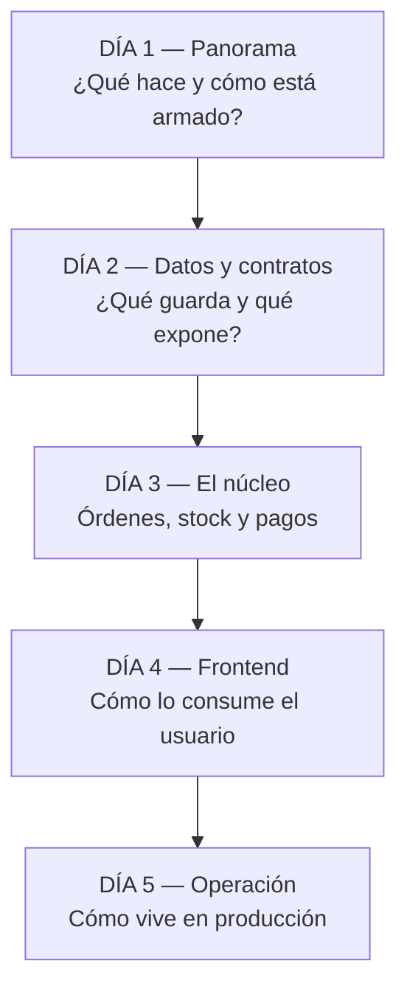

# 22 — Índice de Lectura

← [21 Mapa de Dependencias](21_MapaDependencias.md) | [Índice](README.md)

---

## 1. Ruta recomendada para alguien nuevo

Diseñada para llegar a **productivo en 5 días**, entendiendo el sistema de fuera hacia dentro y siguiendo el
flujo del dinero.



---

### 📅 Día 1 — Panorama (≈4 h)

| # | Qué leer | Tiempo | Por qué |
|---|---|---|---|
| 1 | [`docs/01_Resumen.md`](01_Resumen.md) | 20 min | El problema, el stack, los módulos |
| 2 | `README.md` (raíz) | 15 min | Cómo levantarlo en local |
| 3 | **Levantar el proyecto** (`bootstrap.ps1 -SeedDemo`, `start-app.ps1`) | 45 min | Nada sustituye ver la app andando |
| 4 | **Usar la app**: navegar el catálogo, hacer un checkout guest, entrar como `admin@demo.com` | 45 min | Construye el modelo mental de negocio |
| 5 | [`docs/02_Arquitectura.md`](02_Arquitectura.md) | 40 min | Capas, transacciones, flujo de una request |
| 6 | [`docs/03_ArbolProyecto.md`](03_ArbolProyecto.md) | 20 min | Dónde está cada cosa |
| 7 | [`docs/19_Glosario.md`](19_Glosario.md) — **hojear** | 20 min | Vocabulario del dominio; volvés cuando lo necesites |
| 8 | `backend/main.py` (57 líneas) | 10 min | El punto de composición |
| 9 | `backend/source/db/config.py` (185 líneas) | 20 min | Toda la configuración, y sus validaciones |

> ✅ **Al terminar el día 1 deberías poder responder:** ¿qué vende esta tienda? ¿cuáles son los tres estados por
> los que pasa una compra? ¿dónde vive la lógica de negocio? ¿qué middlewares se ejecutan en cada request?

---

### 📅 Día 2 — Datos y contratos (≈5 h)

| # | Qué leer | Tiempo | Por qué |
|---|---|---|---|
| 1 | [`docs/08_BaseDatos.md`](08_BaseDatos.md) | 60 min | Las 17 tablas y **por qué** existen |
| 2 | `backend/source/db/models.py` (741 líneas) | 45 min | Ahora se lee solo: la doc ya explicó el porqué |
| 3 | `backend/source/db/session.py` (38 líneas) | 10 min | ⚠️ **Crítico**: las dos estrategias transaccionales |
| 4 | [`docs/07_API.md`](07_API.md) | 60 min | Los 77 endpoints |
| 5 | `backend/source/schemas/` (9 archivos, ~500 líneas) | 30 min | Los contratos de entrada |
| 6 | `backend/source/errors.py` + `exceptions.py` (81 líneas) | 15 min | Cómo se traduce un error de dominio a HTTP |
| 7 | `backend/source/dependencies/` (4 archivos, 234 líneas) | 30 min | Auth, CSRF, headers, firma de webhook |
| 8 | **Abrir `/docs` en el navegador** y probar 3 endpoints | 30 min | Toca la API de verdad |

> ✅ **Al terminar el día 2:** entendés qué se persiste, cómo se valida la entrada, cómo se autentica una request
> y cómo se convierte una excepción en un status HTTP.

---

### 📅 Día 3 — El núcleo del negocio (≈6 h) ⭐

**El día más importante.** Es donde vive el valor y el riesgo del sistema.

| # | Qué leer | Tiempo | Por qué |
|---|---|---|---|
| 1 | [`docs/09_ReglasNegocio.md`](09_ReglasNegocio.md) | 60 min | ⭐ **El documento más valioso.** Todas las reglas con su justificación |
| 2 | [`docs/10_Flujos.md`](10_Flujos.md) — flujos 7, 9 y 12 | 40 min | Checkout guest, webhook y expiración de reservas |
| 3 | `services/money_s.py` (86 líneas) | 15 min | Empezá por lo más simple: la aritmética monetaria |
| 4 | `services/discount_s.py` (446 líneas) | 45 min | El motor de precios. Funciones puras, fáciles de seguir |
| 5 | `services/stock_reservations_s.py` (393 líneas) | 50 min | ⚠️ El subsistema con más lógica implícita |
| 6 | `services/orders_s.py` (950 líneas) | 60 min | La máquina de estados y el ciclo del carrito |
| 7 | `services/payment_s.py` (1135 líneas) | 75 min | ⚠️ El más complejo. Apoyate en [`04_Backend.md §2.1`](04_Backend.md#21-payment_spy) |
| 8 | `services/idempotency_s.py` (186 líneas) | 20 min | Corto y fundamental |
| 9 | `tests/test_order_status_state_machine.py` y `test_money_amounts.py` | 25 min | Los tests documentan las reglas |

> ✅ **Al terminar el día 3:** podés explicar qué pasa desde que alguien hace clic en "Comprar" hasta que el
> stock baja, incluyendo qué ocurre si Mercado Pago no responde, si el webhook llega dos veces, o si la reserva
> vence.

---

### 📅 Día 4 — Frontend (≈5 h)

| # | Qué leer | Tiempo | Por qué |
|---|---|---|---|
| 1 | [`docs/05_Frontend.md`](05_Frontend.md) | 45 min | Arquitectura, estado, servicios |
| 2 | `frontend/src/main.tsx` + `App.tsx` (79 líneas) | 15 min | Routing y composición |
| 3 | `frontend/src/services/http.ts` (68 líneas) | 25 min | ⭐ El interceptor de refresh: la pieza más ingeniosa del frontend |
| 4 | `frontend/src/features/auth/context/AuthContextProvider.tsx` (117 líneas) | 25 min | El único estado global |
| 5 | `frontend/src/lib/cart-storage.ts` (94 líneas) | 20 min | El carrito del invitado |
| 6 | `frontend/src/features/checkout/hooks/useCheckoutPage.ts` (145 líneas) | 30 min | El flujo de compra desde el cliente |
| 7 | `frontend/src/features/checkout/hooks/usePaymentReturnStatus.ts` (165 líneas) | 30 min | El retorno de Mercado Pago y el reintento |
| 8 | [`docs/06_PanelAdmin.md`](06_PanelAdmin.md) | 45 min | Las 9 secciones del panel |
| 9 | `frontend/src/pages/AdminPage.tsx` (436 líneas) — **hojear** | 20 min | Ver el prop drilling con tus propios ojos |
| 10 | `frontend/src/services/http-errors.ts` (318 líneas) — **hojear** | 20 min | Cómo se traducen los errores del backend |

> ✅ **Al terminar el día 4:** entendés cómo el frontend mantiene la sesión, cómo se recupera de un 401, cómo
> funciona el carrito y cómo está organizado el panel de administración.

---

### 📅 Día 5 — Operación y calidad (≈4 h)

| # | Qué leer | Tiempo | Por qué |
|---|---|---|---|
| 1 | [`docs/15_Configuracion.md`](15_Configuracion.md) | 30 min | Todas las variables y scripts |
| 2 | `DEPLOYMENT.md` + `render.yaml` + `.github/workflows/` | 30 min | Cómo se despliega y qué corre solo |
| 3 | `services/maintenance_s.py` (139 líneas) | 20 min | ⭐ Docstring que explica el modelo de ping externo |
| 4 | `jobs/reconcile_pending_payments_job.py` (178 líneas) | 25 min | La anatomía de un job; los otros 5 son iguales |
| 5 | [`docs/16_Testing.md`](16_Testing.md) | 30 min | Estrategia y huecos |
| 6 | `tests/http/_base.py` (184 líneas) | 20 min | Cómo se testea la API |
| 7 | [`docs/11_Seguridad.md`](11_Seguridad.md) | 40 min | Postura de seguridad y riesgos abiertos |
| 8 | [`docs/18_Roadmap.md`](18_Roadmap.md) | 25 min | Qué hay que hacer y en qué orden |

> ✅ **Al terminar el día 5:** sabés cómo se despliega, qué corre automáticamente, cómo se testea, dónde están
> los riesgos y cuál es la próxima tarea prioritaria.

---

## 2. Rutas por objetivo

### 🎯 "Vengo a arreglar un bug de pagos"

```
09_ReglasNegocio.md §5 (Pagos)  →  10_Flujos.md §7,8,9,11  →
04_Backend.md §2.1 (payment_s)  →  payment_s.py  →
tests/http/test_payments_fundamentals.py  →  logs con event=mp_webhook_*
```

### 🎯 "Vengo a agregar un endpoint"

```
07_API.md (convenciones)  →  02_Arquitectura.md §3 (¿qué sesión uso?)  →
un router similar como plantilla  →  schemas/ (crear el DTO)  →
services/ (la lógica)  →  errors.py (¿mi excepción está mapeada?)  →
tests/http/ (test de integración)  →  regenerar api.generated.ts
```

### 🎯 "Vengo a tocar el precio o los descuentos"

```
09_ReglasNegocio.md §2 (Descuentos)  →  money_s.py  →  discount_s.py  →
products_s.py (_build_storefront_product_pricing)  →
tests/test_money_amounts.py + test_discounts_category_scope.py  →
12_Performance.md §3 (el camino O(P×V×D))
```

### 🎯 "Vengo a trabajar en el panel admin"

```
06_PanelAdmin.md  →  features/admin/types.ts  →  AdminPage.tsx  →
el hook de la sección  →  el componente de la sección  →
services/admin-*.ts  →  07_API.md (los endpoints /admin/*)
```

### 🎯 "Vengo a desplegar por primera vez"

```
DEPLOYMENT_WALKTHROUGH.md  →  DEPLOYMENT.md  →
15_Configuracion.md §10 (checklist)  →  render.yaml  →
.env.production.example (ambos)  →  17_ProductionReadiness.md §11
```

### 🎯 "Vengo a hacer una auditoría de seguridad"

```
11_Seguridad.md completo  →  dependencies/ (4 archivos)  →
auth_security_s.py + auth_s.py + auth_tokens_s.py  →
anti_abuse_s.py + auth_rate_limit_s.py  →  mercadopago_d.py  →
tests/test_security.py + test_csrf_middleware.py
```

### 🎯 "Vengo a mejorar el rendimiento"

```
12_Performance.md  →  db/session.py (el pool)  →
products_s.list_storefront_products  →  08_BaseDatos.md §4 (índices)  →
stock_reservations_s._expire_active_reservations_internal
```

### 🎯 "Vengo a entender por qué un pago quedó colgado"

```
19_Glosario.md (paid revival, reconciliación, dead letter)  →
10_Flujos.md §9 (webhook) y §11 (reconciliación)  →
webhook_events_s.py  →  reprocess_failed_webhooks_job.py  →
consultar: SELECT * FROM webhook_events WHERE status IN ('failed','dead_letter')
```

---

## 3. Orden de lectura del código, sin la documentación

Si preferís ir directo al código, este es el orden que minimiza el "no entiendo qué hace esto":

### Backend — de lo simple a lo complejo

```
 1. main.py                              57    Composición
 2. db/session.py                        38    ⚠️ Transacciones
 3. db/config.py                        185    Configuración
 4. exceptions.py + errors.py             81    Errores
 5. services/payment_errors.py            25    Errores del proveedor
 6. services/money_s.py                   86    ⭐ Aritmética monetaria
 7. services/auth_cookies_s.py            78    Cookies
 8. services/post_commit_actions_s.py     61    ⭐ Acciones diferidas
 9. dependencies/security_headers_d.py    27    Headers
10. dependencies/csrf_d.py                50    CSRF
11. dependencies/mercadopago_d.py         68    Firma HMAC
12. dependencies/auth_d.py                89    ⚠️ Autenticación
13. services/auth_security_s.py          195    JWT y passwords
14. services/auth_tokens_s.py            181    Tokens de un solo uso
15. services/idempotency_s.py            186    ⭐ Idempotencia
16. services/notifications_s.py          177    Notificaciones
17. services/domain_events_s.py          151    Eventos
18. services/turns_s.py                  140    Turnos (dominio simple)
19. services/anti_abuse_s.py             282    Rate limiting
20. services/auth_rate_limit_s.py        128    Throttle de login
21. services/auth_s.py                   330    Casos de uso de identidad
22. services/users_s.py                  314    Usuarios
23. db/models.py                         741    ⭐ Modelo de datos
24. services/discount_s.py               446    ⭐ Motor de precios
25. services/products_s.py               946    Catálogo y storefront
26. services/stock_reservations_s.py     393    ⭐⚠️ Reservas
27. services/mercadopago_client.py       439    Frontera con el proveedor
28. services/mercadopago_normalization_s 301    Traducción
29. services/webhook_events_s.py         386    Bookkeeping de webhooks
30. services/refund_s.py                 378    Incidencias y reembolsos
31. services/payment_s.py               1135    ⭐⚠️ El núcleo
32. services/orders_s.py                 950    ⭐⚠️ Órdenes
33. services/payment_admin_queries_s.py  135    Consultas de admin
34. services/maintenance_s.py            139    Orquestador de jobs
35. jobs/ (los 6)                        ~1060  Procesos batch
36. routes/ (los 12, del más chico al más grande)  ~2200
37. seed_demo.py                         259    Datos de demo
```

### Frontend

```
 1. main.tsx                                 13
 2. App.tsx                                  69    Routing
 3. guards/ (2)                              ~30
 4. services/idempotency.ts                   7
 5. lib/cart-storage.ts                      94    ⭐ Carrito
 6. lib/useAsyncResource.ts                  43    Hook de fetching
 7. lib/useClickOutside.ts + useModalA11y.ts ~70
 8. services/http.ts                         68    ⭐⚠️ Interceptor de refresh
 9. types.ts                                158    Tipos de dominio
10. features/auth/context/AuthContextProvider 117   ⭐ Estado global
11. services/auth-api.ts                     99
12. services/storefront-api.ts               27
13. features/storefront/hooks/ (3)          ~200
14. services/checkout-api.ts                172    ⚠️ Validación de URL de MP
15. services/payments-api.ts                 87
16. features/checkout/hooks/ (2)            ~310   ⭐
17. features/auth/hooks/ (5)                ~300
18. features/profile/hooks/useProfilePage   310    ⚠️ El más complejo fuera de admin
19. components/Layout.tsx                   246
20. services/http-errors.ts                 318    ⚠️ Acoplado por strings
21. services/admin-*.ts (4)                 ~420
22. features/admin/types.ts                  25
23. features/admin/hooks/ (8)              ~1750   ⚠️
24. features/admin/components/ (13)        ~2550   ⚠️ CatalogSection: 821
25. pages/ (14)                            ~1400
```

---

## 4. Los 10 archivos que hay que conocer sí o sí

Si solo tuvieras tiempo para diez:

| # | Archivo | LOC | Por qué es imprescindible |
|---|---|---:|---|
| 1 | `db/models.py` | 741 | Todo el modelo de datos |
| 2 | `services/payment_s.py` | 1135 | El dinero pasa por acá |
| 3 | `services/orders_s.py` | 950 | La máquina de estados de la compra |
| 4 | `services/stock_reservations_s.py` | 393 | El inventario y su expiración |
| 5 | `services/discount_s.py` | 446 | Cómo se calcula lo que se cobra |
| 6 | `routes/orders_r.py` | 746 | Checkout, pagos y ventas admin |
| 7 | `db/session.py` | 38 | ⚠️ Diminuto y decisivo: las transacciones |
| 8 | `dependencies/auth_d.py` | 89 | Quién sos en cada request |
| 9 | `frontend/src/services/http.ts` | 68 | Cómo el cliente mantiene la sesión |
| 10 | `services/maintenance_s.py` | 139 | Qué corre solo en producción |

---

## 5. Trampas para quien recién llega

| # | Trampa | Qué esperarías | Qué pasa en realidad |
|---|---|---|---|
| 1 | **El carrito es una orden** | Una tabla `carts` | Es un `Order` con `status='draft'` |
| 2 | **Un producto no tiene precio** | `products.price` | Es el mínimo de sus variantes activas |
| 3 | **Los importes son enteros** | Decimales o floats | **Centavos** en `Integer`. `12990` = $129,90 |
| 4 | **`paid` no se setea por la API de estado** | `PATCH status {status:"paid"}` | Solo lo setean los caminos de pago |
| 5 | **Hay GETs que escriben** | Los GET son de solo lectura | Dos endpoints expiran reservas antes de leer |
| 6 | **Un pago cancelado puede volver a `paid`** | Los estados terminales son terminales | *Paid revival*: si MP dice que se cobró, se cobró |
| 7 | **`_x` privado se importa desde otros módulos** | El guion bajo significa privado | `_payment_to_dict` se usa en 2 módulos más |
| 8 | **`_s` significa dos cosas** | Un sufijo, un significado | `schemas/orders_s.py` ≠ `services/orders_s.py` |
| 9 | **Nombres en español e inglés mezclados** | Un idioma | `calcular_amount`, `firmar_jwt` conviven con `hash_password` |
| 10 | **Tres estrategias transaccionales** | Una convención | `get_db`, `get_db_transactional` y commit manual |
| 11 | **`api.generated.ts` no se usa** | Los tipos generados tipan el frontend | Se genera, se valida en CI y casi no se importa |
| 12 | **El frontend compara mensajes de error literales** | Códigos de error | Compara `detail` con strings exactos del backend |
| 13 | **`discount_amount` es por unidad** | Por línea | Se multiplica por `quantity` al totalizar |
| 14 | **Los "domain events" no se persisten** | Un event store | Es un `if/elif` síncrono |
| 15 | **Los manifiestos K8s no se usan** | Son el despliegue | Quedaron como referencia |
| 16 | **`with_for_update()` no hace nada en los tests** | Los tests verifican la concurrencia | SQLite lo ignora en silencio |

---

## 6. Cómo verificar que entendiste

Ejercicios en dificultad creciente. Si podés resolverlos, entendiste el sistema.

### Nivel 1 — Comprensión
1. ¿Cuántas veces se puede reactivar una reserva de stock vencida y por cuánto tiempo?
2. ¿Qué pasa si dos descuentos aplican al mismo producto?
3. ¿Por qué un invitado tiene `password_hash = "!"`?
4. ¿Qué hace `token_version` y por qué cuesta una query por request?

### Nivel 2 — Trazado
5. Seguí una request de `POST /checkout/guest` desde el router hasta el `INSERT` de `stock_reservations`.
6. ¿Qué pasa si Mercado Pago aprueba un pago de una orden que ya fue cancelada? Nombrá las tres tablas que se
   escriben.
7. Un cliente reporta que pagó y su orden sigue en `submitted`. ¿Dónde mirás, en qué orden?

### Nivel 3 — Modificación
8. Agregá un método de pago `qr`. ¿Qué archivos tocás? (pista: son al menos 5)
9. Agregá el campo `sku_proveedor` a `ProductVariant`, visible en el panel admin. ¿Qué pasos seguís?
10. Cambiá el TTL de reserva de 42 a 24 horas. ¿Qué tests deberían fallar? ¿Cuáles no fallarían y deberían?

### Nivel 4 — Diseño
11. El negocio quiere descuentos **acumulables**. ¿Qué cambiás y qué riesgos introducís?
12. Hay que soportar dos sesiones simultáneas por usuario. ¿Qué implica en `user_refresh_sessions` y en el
    mecanismo de `token_version`?
13. El catálogo va a crecer a 5.000 productos. ¿Qué se rompe primero y cómo lo arreglás?
14. Hay que escalar a 3 instancias de backend. ¿Cuál es el único bloqueador real y cómo lo resolvés?

*(Las respuestas están repartidas por estos documentos; los ejercicios están pensados para forzar la búsqueda.)*

---

## 7. Exportar a PDF {#exportar-a-pdf}

Esta documentación está en Markdown con diagramas Mermaid, que se renderizan nativamente en GitHub, GitLab y
VS Code (extensión *Markdown Preview Mermaid Support*).

**Para generar PDFs:**

**Opción A — Navegador (sin instalar nada):**
1. Abrir el `.md` en GitHub o en la vista previa de VS Code.
2. Imprimir → Guardar como PDF.

**Opción B — `md-to-pdf` (renderiza Mermaid automáticamente):**
```bash
npm install -g md-to-pdf     # descarga Chromium (~150 MB)
cd docs
for f in *.md; do md-to-pdf "$f"; done
```

**Opción C — Pandoc + mermaid-filter:**
```bash
npm install -g mermaid-filter
pandoc 01_Resumen.md -F mermaid-filter -o 01_Resumen.pdf --toc
```

---

## 8. Mantener esta documentación viva

| Si cambiás… | Actualizá |
|---|---|
| `db/models.py` o una migración | [08_BaseDatos.md](08_BaseDatos.md) (tablas + ER) |
| Un endpoint | [07_API.md](07_API.md) |
| Una regla de negocio | [09_ReglasNegocio.md](09_ReglasNegocio.md) + [10_Flujos.md](10_Flujos.md) |
| Un servicio | [04_Backend.md](04_Backend.md) |
| El frontend | [05_Frontend.md](05_Frontend.md) o [06_PanelAdmin.md](06_PanelAdmin.md) |
| Una dependencia | [14_Dependencias.md](14_Dependencias.md) |
| Una variable de entorno | [15_Configuracion.md](15_Configuracion.md) + los `.env.example` |
| Resolvés un ítem del roadmap | [18_Roadmap.md](18_Roadmap.md) |

> 💡 **Sugerencia:** agregar al CI un chequeo que falle si `db/models.py` cambia sin que cambie
> `docs/08_BaseDatos.md` en el mismo PR. Es tosco, pero funciona como recordatorio.

---

## 9. Resumen de los 22 documentos

| Doc | Niveles | Páginas aprox. | Lectura |
|---|---|---:|---|
| [01 Resumen](01_Resumen.md) | 1 | 8 | Todos, primero |
| [02 Arquitectura](02_Arquitectura.md) | 2 | 12 | Todos |
| [03 Árbol](03_ArbolProyecto.md) | 3 | 10 | Onboarding |
| [04 Backend](04_Backend.md) | 4, 5, 6 | 40 | Backend, referencia |
| [05 Frontend](05_Frontend.md) | 9 | 18 | Frontend |
| [06 Panel Admin](06_PanelAdmin.md) | 10 | 14 | Frontend, producto |
| [07 API](07_API.md) | 8 | 30 | Todos, referencia |
| [08 Base de Datos](08_BaseDatos.md) | 7 | 24 | Backend |
| [09 Reglas de Negocio](09_ReglasNegocio.md) | 11 | 22 | ⭐ Todos |
| [10 Flujos](10_Flujos.md) | 12 | 22 | Todos |
| [11 Seguridad](11_Seguridad.md) | 13 | 20 | Seguridad, backend |
| [12 Performance](12_Performance.md) | 14 | 16 | Backend, frontend |
| [13 Calidad](13_CalidadCodigo.md) | 15 | 18 | Tech leads |
| [14 Dependencias](14_Dependencias.md) | 16 | 12 | Todos |
| [15 Configuración](15_Configuracion.md) | 17 | 16 | DevOps |
| [16 Testing](16_Testing.md) | 18 | 14 | QA, dev |
| [17 Production Readiness](17_ProductionReadiness.md) | 19 | 16 | DevOps, SRE |
| [18 Roadmap](18_Roadmap.md) | 20 | 14 | Tech leads |
| [19 Glosario](19_Glosario.md) | 21 | 14 | Todos, referencia |
| [20 Diccionario de Objetos](20_DiccionarioObjetos.md) | 22 | 14 | Backend |
| [21 Mapa de Dependencias](21_MapaDependencias.md) | 23 | 12 | Arquitectura |
| [22 Índice de Lectura](22_IndiceLectura.md) | 24 | 10 | Onboarding |
| **TOTAL** | **24 niveles** | **~376** | |

---

← [21 Mapa de Dependencias](21_MapaDependencias.md) | [Índice](README.md)
