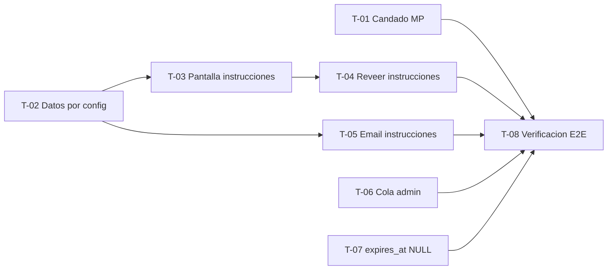

# Transferencia bancaria — método de pago online activo

← [Índice](README.md) | MercadoPago (en pausa): **[mercadopago.md](mercadopago.md)** | Relacionados: [10 Flujos](10_Flujos.md) · [09 Reglas de Negocio](09_ReglasNegocio.md)

> 🎫 **¿Venís a implementar?** Andá directo a **[§5 Tickets (por prioridad)](#5-tickets-por-prioridad)**.

---

## 0. Qué es y por qué

Tras pausar MercadoPago (ver [mercadopago.md](mercadopago.md)), la **transferencia bancaria con verificación manual del admin** es el **único método de pago online** del lanzamiento. Los pagos presenciales en el local y los pagos manuales que registra el admin se mantienen aparte.

La gran ventaja: **casi todo ya está construido y probado.** La transferencia es un método de pago de primera clase del sistema (`ALLOWED_PAYMENT_METHODS`, `payment_s.py:48`), no una feature nueva. Lo que falta es *cerrar detalles*, no *construir el mecanismo*.

---

## 1. Conceptos: los tres relojes

El punto que más confusión genera. Hay **tres plazos distintos** en juego, y mezclarlos lleva a promesas inconsistentes (ver también [19_Glosario.md → *Relojes del pago (los tres)*](19_Glosario.md#relojes-del-pago-los-tres)):

| Reloj | Valor | Qué gobierna |
|---|---|---|
| **Vencimiento del pago** (`payments.expires_at`) | 60 min | **Casi vestigial para transferencia.** Nada transiciona el pago a `expired`, y la confirmación del admin **no filtra por vencimiento** (`payment_s.py:505`). Su único efecto: impedir *reusar* ese pago pendiente en un nuevo checkout. **No cancela la orden.** |
| **Ventana de reserva de stock** (`RESERVATION_TTL_HOURS`) | **42 h** (+12 h de reactivación única) | **El reloj real.** Al vencer sin pago, cancela la orden **y** sus pagos pendientes (`stock_reservations_s.py:157-219`). Es lo que efectivamente "cancela si no pagás". |
| **Ventana prometida al cliente** | **24 h** (copy, no código) | Lo que se le comunica al cliente. **Regla de consistencia:** debe ser **≤ 42 h** (la reserva garantizada), o cancelarías antes de lo prometido. |

**Decisión tomada:** se le promete al cliente **"tenés 24 hs para transferir"**. 24 h < 42 h garantizadas → nunca se cancela antes de lo prometido, y queda margen para verificar. **No se toca ninguna constante** de reserva de stock (que afecta a todo el sistema, no solo a transferencia).

> 📌 Consecuencia clave: **la cancelación automática que se quería ("si no paga en X, se cancela") ya existe** — la hace la expiración de la reserva de stock vía `expire_stock_reservations_job`. No hay que construir un job nuevo de "timeout de pago".

---

## 2. El flujo completo

1. **El cliente elige "transferencia bancaria"** en el checkout. Todo sigue igual que hoy: se crea la orden `submitted`, se reserva el stock (42 h), se crea el `Payment` `bank_transfer` en `pending`.
2. **Se le muestran los datos de transferencia** — alias, CBU, banco, titular, CUIT/CUIL, monto y la **referencia** de la orden (`ORDER-{order_id}-PAY-{payment_id}`).
3. **Se le pide enviar el comprobante por WhatsApp**, con un enlace `wa.me/<número>` **pre-cargado con la referencia** de la orden (para que el admin cruce mensaje ↔ orden sin ambigüedad).
4. **Mensaje de plazo:** "tenés 24 hs para transferir, sino la orden se cancela".
5. **El cliente transfiere y manda el comprobante por WhatsApp** (canal fuera de la app; no hay subida de archivos).
6. **El admin verifica** el dinero en su cuenta bancaria y el comprobante, y **confirma el pago en el panel** (`confirm_manual_payment_for_order`, `payment_s.py:427`), pasando la orden a `paid`.
7. **Si nadie paga**, a las ~42 h la reserva de stock vence y **cancela la orden y el pago pendiente** automáticamente.

> 🔒 El modelo de seguridad es **verificación humana**: el admin confirma solo cuando ve el dinero acreditado. No se confía en que el cliente "diga" que pagó. Para volumen bajo es simple y robusto.

---

## 3. Lo que ya existe ✅

| Pieza | Dónde |
|---|---|
| `bank_transfer` como método de pago de primera clase | `ALLOWED_PAYMENT_METHODS`, `payment_s.py` |
| Instrucciones de transferencia completas, desde configuración (T-02) | `build_bank_transfer_payload`, `bank_transfer_s.py` |
| MercadoPago bloqueado en el servidor (T-01) | `assert_payment_method_enabled`, `payment_core_s.py` |
| Pantalla de instrucciones al terminar el checkout (T-03) | `BankTransferInstructions.tsx` · frontend |
| Re-visita de las instrucciones: *Mi cuenta* y enlace público del invitado (T-04) | `get_public_bank_transfer_status`, `bank_transfer_s.py` · endpoint `GET /payments/public/bank-transfer` |
| Email con las instrucciones al confirmar la compra (T-05) | `send_bank_transfer_instructions_email`, `email_s.py` · encolado post-commit desde `payment_s.py` |
| Creación del pago `pending` al confirmar la compra | `payment_s.py:196` |
| Cola de transferencias pendientes para el admin, con pantalla (T-06) | `list_pending_bank_transfer_payments_for_admin`, `payment_admin_queries_s.py` · `BankTransfersSection.tsx` · frontend |
| Confirmación manual del admin con la referencia del comprobante | `confirm_manual_payment_for_order`, `payment_s.py:427` · endpoint `orders_r.py:561` |
| Verificación de que el monto coincide con el total de la orden | `payment_s.py:492` |
| **Cancelación automática** de orden + pago si no se paga a tiempo (vía reserva de stock) | `stock_reservations_s.py:157-219` · `expire_stock_reservations_job` |

---

## 4. Lo que falta (próxima implementación)

Ninguno de estos es "construir el mecanismo"; son detalles de cierre. Esta tabla es el **análisis**; el plan de ejecución son los **[tickets del §5](#5-tickets-por-prioridad)** — la última columna cruza una cosa con la otra.

| # | Falta | Detalle | Ticket | Estado |
|---|---|---|---|---|
| 1 | **Pausar MercadoPago** | Flag `MERCADOPAGO_ENABLED=false` (candado backend) + ocultar la opción en el frontend. Ver [mercadopago.md §1](mercadopago.md) | T-01 | ✅ hecho |
| 2 | **Datos bancarios reales por config** | Variables de entorno `BANK_TRANSFER_ALIAS`, `_CBU`, `_BANK_NAME`, `_HOLDER`, `_CUIT` y `WHATSAPP_NUMBER`, con getters en `db/config.py` | T-02 | ✅ hecho |
| 3 | **Extender el payload de instrucciones** | Titular, CUIT/CUIL y número/enlace de WhatsApp además de lo que ya traía | T-02 | ✅ hecho |
| 4 | **Pantalla de instrucciones en el frontend** | Mostrar los datos + enlace `wa.me` pre-cargado con la referencia + el mensaje "tenés 24 hs para transferir" | T-03 | ✅ hecho |
| 5 | **Copy del plazo** | Texto "24 hs" coherente con la regla del §1 (≤ 42 h) | T-03 | ✅ hecho |

> ✅ **Los cinco huecos del análisis original están cerrados**, y también los tres que aparecieron después (T-04, T-05, T-06). Para el 100% queda la limpieza (T-07) y la verificación en producción (T-08).

> 🔎 **Ampliación.** Al revisar el código para armar los tickets del §5 aparecieron **tres huecos más** que no estaban en esta tabla y que sí hacen falta para cerrar el flujo al 100%: (a) el cliente que cierra la pestaña **pierde los datos** — no hay dónde volver a verlos; (b) **no existe email de instrucciones** al confirmar la compra (solo existe el de orden pagada); (c) la **cola de transferencias pendientes tiene endpoint pero ninguna pantalla la consume** — el panel admin no la muestra. Son T-04, T-05 y T-06.

### Caso borde a contemplar: el cliente paga *después* de la cancelación

Si el cliente transfiere pasadas las ~42 h, cuando la orden ya se canceló, el dinero llega pero **no hay orden abierta que confirmar**. Como no hay webhook (a diferencia de MP), esto **no se detecta automáticamente**: el admin ve una transferencia en su cuenta sin orden pendiente que la explique. Es una **resolución manual** (devolver el dinero, o reponer stock y reactivar la venta como venta de mostrador). Para volumen bajo es aceptable; conviene tenerlo presente en el mensaje al cliente ("transferí dentro de las 24 hs") para minimizarlo.

### Consideración opcional (no decidida)

El `expires_at` de 60 min en el pago `bank_transfer` es vestigial (§1). Se podría, por prolijidad, setearlo en `NULL` como en `cash` (`payment_s.py:149`), ya que el reloj real es la reserva. No es necesario para el flujo; es una limpieza opcional → **T-07** (P2).

---

## 5. Tickets (por prioridad)

Cada ticket es un **corte vertical**: atraviesa todas las capas que necesita (configuración, servicio, API, UI, tests) y queda **demostrable por sí solo**. *Bloqueado por* indica qué tiene que estar terminado antes de empezarlo; un ticket sin bloqueos arranca ya.

| # | Ticket | Prioridad | Bloqueado por | Estado |
|---|---|---|---|---|
| T-01 | Candado de MercadoPago (`MERCADOPAGO_ENABLED=false`) | **P0** | — | ✅ hecho |
| T-02 | Datos bancarios reales y WhatsApp por configuración | **P0** | — | ✅ hecho |
| T-03 | Pantalla de instrucciones de transferencia en el checkout | **P0** | T-02 | ✅ hecho |
| T-04 | Reveer las instrucciones después de cerrar la pantalla | P1 | T-03 | ✅ hecho |
| T-05 | Email con las instrucciones al confirmar la compra | P1 | T-02 | ✅ hecho |
| T-06 | Cola de transferencias pendientes en el panel admin | P1 | — | ✅ hecho |
| T-07 | `expires_at = NULL` para `bank_transfer` (limpieza) | P2 | — | ← siguiente |
| T-08 | Verificación de punta a punta con dinero real | P2 | T-01 … T-07 | pendiente |



> 📌 **Frontera de arranque:** T-01, T-02, T-06 y T-07 no dependen de nada y pueden tomarse en paralelo. T-02 es el que más desbloquea.

---

### P0 — sin esto no se puede cobrar

#### T-01 · Candado de MercadoPago (`MERCADOPAGO_ENABLED=false`) — ✅ hecho

**Qué entrega:** el cliente deja de ver MercadoPago en el checkout y, aunque llame a la API a mano, el backend **rechaza** iniciar un pago `mercadopago`. La transferencia queda como único método online. Ver [mercadopago.md §1](mercadopago.md).

**Bloqueado por:** nada — se puede empezar ya.

- [x] Existe un flag de entorno que habilita/deshabilita MercadoPago, con getter en la configuración y **default seguro** (deshabilitado).
- [x] Con el flag apagado, iniciar un pago `mercadopago` falla con un error de negocio claro (no un 500) y **no crea** ni el pago ni la preferencia.
- [x] Con el flag encendido, el comportamiento actual de MP no cambia y su suite sigue verde (nada se borra: la pausa es reversible).
- [x] El checkout del frontend no ofrece MercadoPago; si queda un solo método, el selector no se muestra como una lista de una sola opción.
- [x] El webhook y los jobs de MP siguen vivos y quedan inertes (no-op), sin errores en logs.
- [x] La plantilla de entorno de producción documenta el flag.
- [x] Tests: rechazo con el flag apagado + camino feliz de transferencia intacto.

> 🔒 **Dos candados, no uno.** El rechazo vive en el kernel de pago (`assert_payment_method_enabled`) y se invoca en los **dos** puntos que pueden arrancar un pago con el proveedor: la creación (que cubre checkout y ambos reintentos) y la inicialización del checkout (que cubre reanudar un pago creado *antes* de la pausa). El flag del frontend (`VITE_MERCADOPAGO_ENABLED`) es solo lo que ve el cliente.

#### T-02 · Datos bancarios reales y WhatsApp por configuración — ✅ hecho

**Qué entrega:** las instrucciones de transferencia que devuelve la API dejan de traer placeholders de demo y pasan a traer los datos reales del comercio — alias, CBU, banco, titular, CUIT/CUIL — más el número de WhatsApp y la referencia de la orden.

**Bloqueado por:** nada — se puede empezar ya.

- [x] Los datos bancarios y el WhatsApp salen de variables de entorno con getters en la configuración; **no queda ningún valor de demo hardcodeado**.
- [x] El payload de instrucciones incluye alias, CBU, banco, titular, CUIT/CUIL, WhatsApp, referencia (`ORDER-{order_id}-PAY-{payment_id}`), monto y moneda.
- [x] Arrancar sin las variables seteadas falla **explícita y temprano**, en vez de mostrarle datos falsos o vacíos a un cliente que va a mandar dinero.
- [x] La plantilla de entorno de producción y la guía de deploy listan las variables nuevas.
- [x] Tests: un pago `bank_transfer` recién creado expone el payload completo con los valores de configuración.

> 🧱 **Prefactor incluido.** Las instrucciones salieron del kernel (`payment_core_s`) a un módulo propio, **`bank_transfer_s`**, porque no son algo que compartan todos los caminos de pago: son específicas de un método. Ahí viven la referencia, el enlace de WhatsApp y el payload — que T-03, T-04 y T-05 tienen que decir **igual**, así que la copia se arma en un solo lugar.
>
> El backend **no arranca** sin los datos bancarios (`validate_bank_transfer_config` en el arranque) y reporta las seis variables faltantes de una sola vez: sin ellos el comercio no puede cobrar, así que romper el deploy es mejor que mostrarle una cuenta vacía a alguien que va a transferir plata.

#### T-03 · Pantalla de instrucciones de transferencia en el checkout — ✅ hecho

**Qué entrega:** al confirmar la compra eligiendo transferencia, el cliente ve una pantalla con los datos para transferir, el monto exacto y la referencia, puede copiar alias y CBU de un click, tiene un enlace de WhatsApp precargado con esa referencia para mandar el comprobante, y lee el plazo de 24 hs. Hoy solo ve un texto genérico de "compra enviada".

**Bloqueado por:** T-02.

- [x] Tras el checkout con transferencia se muestra la pantalla de instrucciones en lugar del mensaje de éxito genérico actual.
- [x] Alias y CBU se copian con un click, con confirmación visible de que se copiaron.
- [x] El enlace `wa.me` abre WhatsApp con un mensaje precargado que incluye la referencia de la orden y pide el comprobante.
- [x] El copy dice explícitamente **"tenés 24 hs para transferir, sino la orden se cancela"** — coherente con la regla del §1 (≤ 42 h de reserva garantizada).
- [x] Funciona igual para cliente registrado y para invitado.
- [x] Tests de frontend del render de las instrucciones y del armado del enlace de WhatsApp.

> 💸 **El monto se muestra con centavos.** Al verificar esta pantalla apareció que el frontend **redondeaba todos los precios** (`$ 259,90` → `$ 260`). Se corrigió de raíz, no solo acá: ver el §6. El cliente **tipea este número en el homebanking**, así que un peso de más rompe la coincidencia con el total de la orden.
>
> 🔌 **La pantalla no se dibuja con datos incompletos.** Si al payload le falta cualquier campo (alias, CBU, referencia, enlace de WhatsApp o monto), el checkout cae al mensaje de confirmación simple en vez de mostrar una pantalla a medias: alguien que lee un CBU en blanco al lado de un monto igual puede mandar la plata al vacío.
>
> 📋 **El copiado avisa cuando falla.** La API del portapapeles rechaza en contextos inseguros y con permisos denegados; quedarse callado haría que el cliente pegue en el homebanking lo que tenía antes creyendo que copió. Ante el rechazo, el campo muestra *"No se pudo copiar, copialo a mano"*.

---

### P1 — cierran el flujo de punta a punta

#### T-04 · Reveer las instrucciones después de cerrar la pantalla — ✅ hecho

**Qué entrega:** el cliente que cerró la pestaña puede volver a los datos de transferencia y a la referencia — el registrado desde *Mi cuenta*, el invitado desde el estado público del pago. Hoy, si cierra, los pierde.

**Bloqueado por:** T-03.

- [x] En el historial de compras, un pago `bank_transfer` en `pending` de una orden `submitted` muestra (o permite abrir) las mismas instrucciones que el checkout.
- [x] El invitado llega a sus instrucciones **sin loguearse**, por el enlace de estado público del pago.
- [x] Un pago ya confirmado o una orden cancelada no muestran instrucciones: muestran su estado.
- [x] Se reusa el mismo componente de T-03 — una sola fuente de verdad del copy y de los datos.

> 🔗 **Al invitado hay que darle el enlace, sino no existe.** Los endpoints públicos que ya había (`/payments/public/status` y el snapshot por token) filtran por `method == "mercadopago"`, así que **no servían** para transferencia. Se agregó `GET /payments/public/bank-transfer`, y la pantalla del checkout ahora ofrece el enlace `\<tienda\>/transferencia?token=…` para copiar: sin eso, un invitado —que no tiene cuenta a la que volver— no tiene forma de llegar. El email de T-05 va a llevar el mismo enlace.
>
> ⏰ **La consulta pública barre la reserva antes de responder.** Si no, la pantalla le diría "andá a transferir" a alguien cuya orden el próximo job está por cancelar: plata que llega sin nada con qué cruzarla. Ojo con el matiz que apareció al escribir los tests: la **primera** expiración no cancela, *reactiva* la reserva 12 h más (`MAX_RESERVATION_REACTIVATIONS = 1`), así que ahí las instrucciones **siguen siendo válidas** y se muestran. Recién con la extensión agotada la orden se cancela y la pantalla pasa a mostrar el estado.
>
> 🔒 **Las instrucciones solo salen mientras la transferencia sigue teniendo sentido** (`can_pay`): orden `submitted` y pago `pending`. Repetir el alias de un pago ya confirmado sería invitar a una segunda transferencia que nadie puede cruzar con nada.

#### T-05 · Email con las instrucciones al confirmar la compra — ✅ hecho

**Qué entrega:** apenas confirma la compra, el cliente recibe por email los datos de transferencia, el monto, la referencia y el plazo, así no depende de mantener la pestaña abierta. Hoy el único email del ciclo de pago es el de **orden pagada**, que llega recién cuando el admin confirma.

**Bloqueado por:** T-02.

- [x] Al crear un pago `bank_transfer` en `pending` se le envía al comprador (registrado o invitado) un email con datos bancarios, monto, referencia, plazo de 24 hs, el enlace de WhatsApp y el **enlace de re-visita** de T-04 (`/transferencia?token=…`).
- [x] El envío es **post-commit** y un fallo de email no rompe el checkout ni deja la orden inconsistente.
- [x] No se envía para `cash` ni para `mercadopago`.
- [x] No se duplica si el checkout se reintenta con la misma clave de idempotencia.
- [x] Tests del disparo del email y de la no-duplicación.

> 🚰 **Las rutas de checkout no vaciaban la cola.** `dispatch_post_commit_actions` solo se invocaba desde el webhook de MP, el registro manual del admin y los jobs — **ningún camino de checkout lo llamaba**. Un email encolado ahí se habría perdido en silencio. Ahora despachan el checkout de invitado, el de cuenta y los dos reintentos, con `clear_post_commit_actions` en los caminos de error para no arrastrar acciones de una request abortada.
>
> 🔁 **La no-duplicación sale gratis del lugar donde se encola.** El email se encola en el mismo bloque que arma el payload de instrucciones, y a ese bloque solo se llega cuando el pago se creó de verdad: un replay idempotente retorna antes. Un **reintento** sí encola de nuevo, y corresponde — es un pago nuevo con una referencia nueva, y la vieja ya no sirve.
>
> 📭 **Un servidor de correo caído no deshace una compra.** El envío ocurre después del commit y su excepción se traga con log, igual que el email de orden pagada. Si el comprador no tiene email cargado, se saltea con log en vez de romper: la compra vale más que el aviso.

##### Verificado contra un SMTP real

Levanté un servidor SMTP de captura y corrí un checkout real contra la base local. El mail que llegó:

```
Subject: Datos para transferir - orden #19

Monto exacto: ARS 519,80          <- 2 x $ 259,90, con centavos
Alias: alias.de.prueba
CBU: 0000000000000000000000
Referencia: ORDER-19-PAY-18

Tenes 24 hs para transferir, sino la orden se cancela.

https://wa.me/5493511234567?text=...Referencia%3A%20ORDER-19-PAY-18
https://patitasbigotes.test/transferencia?token=XjDIDFwn35TYtLB_...
```

El token del enlace se comparó contra el de la base: coincide.

#### T-06 · Cola de transferencias pendientes en el panel admin — ✅ hecho

**Qué entrega:** el admin abre el panel y ve en un solo lugar todas las transferencias pendientes con referencia, monto, cliente y antigüedad, y confirma el pago desde ahí. Antes el endpoint de la cola **existía pero ninguna pantalla lo consumía**: el admin tenía que confirmar a ciegas desde el registro manual de pagos.

**Bloqueado por:** nada — el endpoint ya está.

- [x] El panel muestra la cola de pagos `bank_transfer` en `pending` ordenada por antigüedad, con referencia, monto, cliente y **cuándo vence la reserva de stock** (para priorizar las que están por caerse).
- [x] Desde cada fila el admin confirma el pago indicando la referencia del comprobante, y la orden pasa a `paid` sin salir de la pantalla.
- [x] Confirmada la transferencia, la fila desaparece de la cola.
- [x] Un monto que no coincide con el total de la orden se rechaza con un mensaje entendible (la verificación ya existe en el backend).
- [x] La pantalla es solo para admin.
- [x] Tests de la pantalla y del camino de confirmación.

> 🔎 El endpoint estaba pero devolvía el pago pelado: se le agregaron `reference`, `customer`, `order_total` y `reservation_expires_at`, y se invirtió el orden (la más vieja primero). La pantalla es `BankTransfersSection.tsx`, pestaña *Venta → Transferencias*; confirma contra el endpoint manual que ya existía.

---

### P2 — prolijidad y cierre

#### T-07 · `expires_at = NULL` para `bank_transfer`

**Qué entrega:** el pago por transferencia deja de arrastrar un vencimiento de 60 min que no gobierna nada (§1), igual que ya hace `cash`. El único reloj que queda en juego es la reserva de stock, que es el que realmente cancela.

**Bloqueado por:** nada.

- [ ] Un pago `bank_transfer` nuevo se crea sin `expires_at`.
- [ ] Reusar un pago pendiente en un checkout posterior sigue funcionando: la búsqueda de pago pendiente activo ya trata `NULL` como vigente, así que el pago queda reusable hasta que la reserva lo cancele.
- [ ] La confirmación manual del admin sigue funcionando sobre pagos viejos que sí tienen `expires_at` cargado.
- [ ] Queda registrado en el [glosario](19_Glosario.md#relojes-del-pago-los-tres) que el reloj vestigial desapareció para transferencia.

#### T-08 · Verificación de punta a punta con dinero real

**Qué entrega:** la confirmación de que el flujo entero funciona en producción — una compra real, transferida de verdad, confirmada por el admin, con el cliente notificado.

**Bloqueado por:** T-01 … T-07.

- [ ] Las variables bancarias, el WhatsApp y el flag de MercadoPago están seteados en producción con valores reales.
- [ ] Una compra de prueba muestra los datos correctos, el enlace de WhatsApp llega al número real y el email de instrucciones se recibe.
- [ ] El admin ve esa transferencia en la cola y la confirma: la orden queda `paid` y el cliente recibe el email de orden pagada.
- [ ] Una orden que no se paga se cancela sola al vencer la reserva y **libera el stock**.
- [ ] MercadoPago no es alcanzable ni desde la UI ni llamando la API directamente.

---

## 6. Fuera de plan: el frontend redondeaba todos los precios ✅ resuelto

Verificando la pantalla de T-03 apareció que mostraba **$ 260** para una orden de **$ 259,90**. La causa no era de transferencia: **todo el frontend redondeaba**, y no era un caso de borde — **7 de las 8 variantes** del catálogo terminan en `,90`, y las 12 órdenes de la base tienen total con centavos.

**Dónde estaba.** Cuatro copias independientes del mismo formateador con `maximumFractionDigits: 0` (storefront, checkout, admin, y una quinta inline en la vuelta de pago), más `ProfilePage` con un `toLocaleString` pelado que mostraba `$ 259,9`. **El backend siempre estuvo bien**: todo es entero de centavos y `money_s` solo redondea al convertir un porcentaje, que es el único lugar donde existe una fracción de centavo. Era un bug puramente de presentación.

**Lo que rompía de verdad.** El registro manual de pagos del admin: veía *"Monto pendiente: $ 260"*, tipeaba `260`, y recibía *"Monto pagado invalido"* — sin que el mensaje dijera cuál era el número correcto. **El admin no podía confirmar un pago copiando lo que la app le mostraba.** Esto ya estaba roto antes de estos tickets y habría golpeado de lleno a T-06.

**Cómo quedó.** Un único formateador en `lib/money.ts`, con 2 decimales siempre, del que dependen las tres features. Se borraron las cuatro copias. La regla: *un importe mostrado es un número sobre el que alguien actúa —el precio que decide pagar, el monto que transfiere, la cifra que el admin tipea— así que acá nada se redondea.*

| | antes | ahora |
|---|---|---|
| Catálogo | `$ 100` | `$ 99,90` |
| Con descuento | `$ 130` `$ 110` | `$ 129,90` `$ 110,41` |
| Historial de compras | `$ 259,9` | `$ 259,90` |
| Cola del admin | `$ 260` → no se podía confirmar | `$ 259,90` → se tipea y anda |

Queda un test de regresión sobre el invariante que se había roto: **lo que la pantalla muestra tiene que ser tipeable de vuelta** (`useAdminRegisterPayment.test.ts`).

> 📌 Pendiente menor, no bloqueante: en la cola de T-06 el mensaje ya nombra el monto esperado; en *Registrar pago* sigue diciendo *"Monto pagado invalido"* sin decir cuál era el correcto. Con el redondeo corregido ya no es una trampa, pero el mensaje sigue siendo pobre.

---

## 7. Referencias

- **[mercadopago.md](mercadopago.md)** — la integración pausada y su spec de reactivación.
- [10_Flujos.md](10_Flujos.md) — flujos de checkout y del ciclo de reserva de stock.
- [09_ReglasNegocio.md](09_ReglasNegocio.md) — estados de orden y de pago.
- [19_Glosario.md](19_Glosario.md#relojes-del-pago-los-tres) — *Relojes del pago (los tres)*, `bank_transfer`, *Reserva de stock*.
